# 信号与系统

---

## 一、基本概念

### 1. 主要内容

时域、频域、复频域

### 2. 信号分类

*   **连续信号**
    *   非奇异 $\Rightarrow$ 信号与其各阶导数连续。
    *   奇异 $\Rightarrow$ 信号或某阶导数不连续。
*   **离散信号**
*   **周期信号 & 非周期信号**
*   **能量有限信号 & 功率有限信号**

**连续信号的能量定义：**
$$E_a = \int_{-\infty}^{\infty} |f_a(t)|^2 dt \quad , \quad |f_a(t)|^2 = f_a(t) \cdot f_a^*(t)$$
**离散信号的能量定义：**
$$E_d = \sum_{n=-\infty}^{\infty} |f_d(n)|^2 \quad , \quad |f_d(n)|^2 = f_d(n) \cdot f_d^*(n)$$
**功率：**
$$P_a = \lim_{T \to \infty} \frac{1}{2T} E_a \quad , \quad P_d = \lim_{N \to \infty} \frac{1}{2N+1} \sum_{n=-N}^{N} |f_d(n)|^2$$

### 3. 典型信号

#### 3.1 典型连续非奇异信号

**I. 三角信号：**
$$f(t) = M \cos(\omega t + \varphi)$$
*   $M$：信号幅值
*   $\omega$：角频率
*   $\varphi$：初始相位
*   默认：$\varphi$ 是余弦形式下的初相。

**II. 指数信号：**
$$f(t) = A e^{at}$$
*   $A$：$t=0$ 时的信号幅值
*   $a$：衰减系数

**III. 复指数信号：**
$$f(t) = A e^{at}$$
1)  当 $A, a \in \mathbb{R}$ 时，$f(t)$ 是指数信号；
2)  当 $A \in \mathbb{R}, a \in \mathbb{C}$ 时，设 $a = \sigma + j\omega$
    $$f(t) = A e^{(\sigma + j\omega)t} = A e^{\sigma t} (\cos\omega t + j\sin\omega t)$$
    实部和虚部都是指数包络的三角函数。
3)  当 $A, a \in \mathbb{C}$ 时，设
    $$A = R + jI = |A|e^{j\varphi}$$
    $$a = \sigma + j\omega$$
    $$f(t) = |A|e^{\sigma t}\cos(\omega t + \varphi) + j|A|e^{\sigma t}\sin(\omega t + \varphi)$$
    $A$ 的模和辐角分别影响指数包络 $e^{\sigma t}$ 中三角函数的幅值和初相。

**IV. 三角函数的复指数表示：**
$$f(t) = M \cos(\omega t + \varphi) = \frac{M}{2} \left[ e^{j(\omega t + \varphi)} + e^{-j(\omega t + \varphi)} \right] = A_1 e^{j\omega t} + A_2 e^{-j\omega t}$$
$$A_1 = \frac{1}{2} M e^{j\varphi} \quad , \quad A_2 = \frac{1}{2} M e^{-j\varphi}$$
*   相当于将余弦（实函数）在复平面上下半平面分解为两个按实轴对称的两个相量。

**V. 抽样信号：**
$$Sa(t) = \frac{\sin t}{t}$$
性质：
*   $t = 0$ 时，$\lim_{t \to 0} Sa(t) = 1$
*   $\int_{-\infty}^{+\infty} Sa(t) dt = \pi$

#### 3.2 典型奇异信号

**I. 单位阶跃信号：**
$$u(t-t_0) = \begin{cases} 1 , & t > t_0 \\ 0 , & t < t_0 \end{cases}$$

**II. 单位冲激信号：**
$$\delta(t-t_0) = \begin{cases} \infty , & t = t_0 \\ 0 , & t \neq t_0 \end{cases} \quad \text{且} \int_{-\infty}^{+\infty} \delta(t-t_0)dt = 1$$
冲激可以由抽样构造：$\delta(t) = \lim_{k \to \infty} \left[ \frac{k}{\pi} Sa(kt) \right]$

性质：
1)  与单位阶跃的关系：
    $$\delta(t) = \frac{du(t)}{dt} \quad , \quad u(t) = \int_{-\infty}^{t} \delta(\tau)d\tau$$
2)  抽样特征：
    $$f(t)\delta(t) = f(0)\delta(t)$$
    $$f(t)\delta(t-t_0) = f(t_0)\delta(t-t_0)$$
    $$\int_{-\infty}^{+\infty} f(t)\delta(t)dt = f(0)$$
    $$\int_{-\infty}^{+\infty} f(t)\delta(t-t_0)dt = f(t_0)$$
3)  奇偶特性：$\delta(-t) = \delta(t)$
4)  尺度特性：$\delta(at) = \frac{1}{|a|} \delta(t)$

**III. 单位冲激偶信号：**
定义：$\delta'(t) = \frac{d\delta(t)}{dt}$

性质：
1)  $\int_{-\infty}^{+\infty} \delta'(t)f(t)dt = -f'(0)$
    证明：$\lim_{\varepsilon \to 0} \frac{1}{2\varepsilon}[f(-\varepsilon) - f(\varepsilon)] = -f'(0)$
    $\Rightarrow \int_{-\infty}^{+\infty} \delta^{(k)}(t)f(t)dt = (-1)^k f^{(k)}(0)$
    $\int_{-\infty}^{+\infty} \delta'(t-t_0)f(t)dt = -f'(t_0)$
2)  $\int_{-\infty}^{+\infty} \delta'(t)dt = 0 \quad , \quad \int_{-\infty}^{t} \delta'(\tau)d\tau = \delta(t)$
3)  $\delta'(-t) = -\delta'(t)$ 奇函数
4)  $f(t)\delta'(t) = f(0)\delta'(t) - f'(0)\delta(t)$ （$\delta'(t)$ 无抽样特性！）

#### 3.3 典型离散信号

**I. 单位样值信号：**
$$\delta_d(n) = \begin{cases} 1 & n = 0 \\ 0 & n \neq 0 \end{cases}$$

**II. 单位阶跃序列：**
$$u_d(n) = \begin{cases} 1 & n \ge 0 \\ 0 & n < 0 \end{cases}$$

**III. 三角序列：**
$$f_d(n) = M \cos(\theta n + \phi)$$
*   $M$：幅值
*   $\theta$：离散角频率
*   $\phi$：初相

来自于对 $f_a(t)$ 的抽样：
$$f_d(n) = M \cos(\theta n + \phi)$$
$$f_a(n) = M \cos(\omega n T_s + \phi)$$
$T_s$ 为抽样周期，$\theta = \omega T_s$。

注意：虽然 $f_a(t)$ 是周期函数，但是抽样后 $f_d(n)$ 不一定是周期信号！$f_d(n)$ 周期性取决于 $T_s$ 和 $T$ 的关系。

若 $T_s/T$ 为有理数，$f_d(n)$ 为周期序列。

$T_s/T = K_2/K_1$，$K_2/K_1$ 既约，则 $f_d(n)$ 周期为 $K_1$。

### 4. 信号的移位、反褶与尺度变化

**移位：**

对于 $f(t-t_0)$：
*   $t_0 > 0$ 延时
*   $t_0 < 0$ 超前

**反褶：**

$$f(t) \sim f(-t)$$
信号相对 $y$ 轴对称变化。

**尺度变化：**

对于 $f(at)$：
*   $|a| > 1$，压缩 $|a|$ 倍
*   $|a| < 1$，扩展 $|a|$ 倍

### 5. 信号相加和相乘

$$f(t) = f_1(t) + f_2(t)$$
$$f(t) = f_1(t) \cdot f_2(t)$$
若 $f_1(t)$、$f_2(t)$ 周期为 $T_1$、$T_2$：

若存在非零正整数 $k_1, k_2$，使 $k_1 T_1 = k_2 T_2$，则 $f(t)$ 为周期信号。

否则，若 $T_1/T_2$ 是无理数，$f(t)$ 不再是周期信号。

### 6. 信号的周期延拓

$$f(t) = \sum_{k=-\infty}^{\infty} g(t + kT) \begin{cases} \text{有混叠延拓} \\ \text{无混叠延拓} \end{cases}$$

### 7. 信号的抽样

### 8. 信号的分解

**1) 直流、交流分量：**
$$f(t) = D + f_{ac}(t)$$
其中 $D$ 是直流分量，为信号的平均值：
$$D = \lim_{T \to \infty} \frac{1}{2T} \int_{-T}^{T} f(t)dt$$
分解后：$P_{f(t)} = P_D + P_{AC}$

**2) 偶奇分量：**
$$f(t) = f_e(t) + f_o(t)$$
且有：
$$f_e(t) = [f(t) + f(-t)]/2$$
$$f_o(t) = [f(t) - f(-t)]/2$$
分解后：$P_{f(t)} = P_e + P_o$

**3) 实虚分量：**
$$f(t) = f_R(t) + j f_I(t)$$
且有：
$$f_R(t) = \operatorname{Re}[f(t)] = [f(t) + f^*(t)]/2$$
$$f_I(t) = \operatorname{Im}[f(t)] = [f(t) - f^*(t)]/2j$$
分解后：$P_{f(t)} = P_R + P_I$

### 9. 系统的分类

**1) 连续时间 & 离散时间**

**2) 动态系统 & 即时系统**
*   即时：系统输出只与同时刻输入有关 (eg: 电阻)
*   动态：系统输出不仅与同时刻输入有关，还取决于系统过去的状态 (eg: 电感、电容)

**3) 线性系统 & 非线性系统**
线性系统需同时满足叠加性和均匀性。

即：
$x_1(t) \to y_1(t)$
$x_2(t) \to y_2(t)$
$\Rightarrow x_1(t) + x_2(t) \to y_1(t) + y_2(t)$

且：
$x(t) \to y(t) \Rightarrow A x(t) \to A y(t)$

扩展意义上的线性系统：动态系统都不是严格线性系统。

扩展：
*   零状态响应和激励成线性关系
*   零输入响应和初状态成线性关系

**4) 时不变 & 时变**

变 vs. 不变：系统参数是否随时间变化。

对于时不变系统：

$e(t) \to r(t)$
延时 $\tau$，$e(t-\tau) \to r(t-\tau)$

**5) 因果 & 非因果**

响应是否和未来的激励有关。

**例题：** 系统响应 $r(t) = r^2(t_0) + 3t^2e(t)$

判断系统类型。（激励 $e(t)$，初状态 $r(t_0)$）

$r^2(t_0)$：零输入响应
‘
$3t^2e(t)$：零状态响应

$r^2(t_0)$ 与 $r(t_0)$ 不成线性 $\to$ 非线性系统

$e(t-\tau) \to 3t^2e(t-\tau)$

$r(t-\tau) \to 3(t-\tau)^2e(t-\tau)$

$3t^2e(t)$ 时变 $\to$ 时变系统

显然是因果系统。

---

## 二、线性时不变连续时间系统的时域分析

### 1. 解的构成

设一个线性时不变连续时间系统，输入为 $e(t)$，输出为 $r(t)$，$r(t)$ 与 $e(t)$ 关系如下：
$$\frac{d^n r(t)}{dt^n} + a_{n-1}\frac{d^{n-1}r(t)}{dt^{n-1}} + \dots + a_1\frac{dr(t)}{dt} + a_0r(t) = b_m\frac{d^m e(t)}{dt^m} + b_{m-1}\frac{d^{m-1}e(t)}{dt^{m-1}} + \dots + b_1\frac{de(t)}{dt} + b_0e(t)$$
这是一个 $n$ 阶常系数微分方程，求解该方程需要 $n$ 个初始条件。

当 $e(t) = 0$ 时，得齐次微分方程：
$$\frac{d^n r(t)}{dt^n} + a_{n-1}\frac{d^{n-1}r(t)}{dt^{n-1}} + \dots + a_1\frac{dr(t)}{dt} + a_0r(t) = 0$$
对应的特征方程有 $n$ 个特征根，满足：
$$\lambda^n + a_{n-1}\lambda^{n-1} + \dots + a_1\lambda + a_0 = 0$$
解又可以分为齐次解和特解。

**线性时不变系统解的构成：**
*   **系统全响应**
    *   **零输入响应** $\Rightarrow$ 齐次解 $\Rightarrow$ 自由响应（与 $\lambda_i$ 相关的项）
    *   **零状态响应**
        *   $\Rightarrow$ 齐次解 $\Rightarrow$ 自由响应（与 $\lambda_i$ 相关的项）
        *   $\Rightarrow$ 特解 $\Rightarrow$ 强迫响应（与 $\lambda_i$ 无关的项）
*   或分为：
    *   **暂态响应**：系统响应中，$t \to \infty$ 时趋零的分量
    *   **稳态响应**：系统响应中，$t \to \infty$ 时保留的分量

**自由响应**：系统固有特征决定的响应。
**强迫响应**：系统激励强制产生的响应。

**齐次解：**
$$\lambda^n + a_{n-1}\lambda^{n-1} + \dots + a_1\lambda + a_0 = 0$$
激励取 0 时的解。

| $\lambda$ 的形式 | 齐次解形式 |
| :--- | :--- |
| $\lambda$ 为单实根 | $A e^{\lambda t}$ |
| $\lambda$ 为 $k$ 重实根 | $A_1 e^{\lambda t} + A_2 t e^{\lambda t} + \dots + A_k t^{k-1} e^{\lambda t}$ |
| $\lambda_{1,2}$ 为共轭复根，$\lambda_{1,2} = \sigma \pm j\omega$ | $A e^{(\sigma+j\omega)t} + B e^{(\sigma-j\omega)t}$   或 $C e^{\sigma t}\cos\omega t + D e^{\sigma t}\sin\omega t$ |
| $\lambda_{1,2}$ 为 $k$ 阶共轭复根，$\lambda_{1,2} = \sigma \pm j\omega$ | $(C_1 e^{\sigma t} + C_2 t e^{\sigma t} + \dots + C_k t^{k-1} e^{\sigma t})\cos\omega t$   $+ (D_1 e^{\sigma t} + D_2 t e^{\sigma t} + \dots + D_k t^{k-1} e^{\sigma t})\sin\omega t$ |

齐次解给出的是一个函数族，要确定唯一解需要系统初始条件或边界条件。

**特解：**
特解形式由激励函数的形式确定。

| 激励函数 $e(t)$ | 特解形式 |
| :--- | :--- |
| $E$ (常数) | $A$ |
| $t^m$ | $A_m t^m + A_{m-1} t^{m-1} + \dots + A_0$ |
| $e^{pt}$ (非 $\lambda$) | $A e^{pt}$ |
| $e^{pt}$ ($k$ 阶 $\lambda$) | $A_0 e^{pt} + A_1 t e^{pt} + \dots + A_k t^k e^{pt}$ |
| $\cos\omega t / \sin\omega t$ ($j\omega$ 非 $\lambda$) | $A \cos\omega t + B \sin\omega t$ |
| $\cos\omega t / \sin\omega t$ ($j\omega$ 为 $k$ 阶 $\lambda$) | $(A_0 + \dots + A_k t^k)\cos\omega t + (B_0 + \dots + B_k t^k)\sin\omega t$ |
| $e^{\sigma t}\cos\omega t / e^{\sigma t}\sin\omega t$ ($\sigma+j\omega$ 非 $\lambda$) | $A e^{\sigma t}\cos\omega t + B e^{\sigma t}\sin\omega t$ |
| $e^{\sigma t}\cos\omega t / e^{\sigma t}\sin\omega t$ ($\sigma+j\omega$ 为 $k$ 阶 $\lambda$) | $(A_0 + \dots + A_k t^k) e^{\sigma t}\cos\omega t + (B_0 + \dots + B_k t^k) e^{\sigma t}\sin\omega t$ |

### 2. 初始状态跳变

$n$ 阶系统需要 $n$ 个初始条件：

$r(t_0), r'(t_0), \dots, r^{(n-1)}(t_0)$

只要有一个奇异存在跳变，即为初始状态跳变。

**对于线性时不变系统，系统微分方程两边的奇异项必须平衡。**

判断是否跳变：

把激励信号 $e(t)u(t-t_0)$ 代入系统微分方程：

若方程右边出现冲激函数 $\delta(t-t_0)$ 或 $\delta^{(k)}(t-t_0)$，则一定有初始状态跳变；反之则无。

三种方法处理跳变：

① 求 $0^+$ 时刻状态；

② 利用平衡法求 $0^+$；

③ 平衡法求零状态。

**解：** 列系统微分方程

电路方程：

$R_1 i(t) + v_c(t) = e(t)$

$v_c(t) = L \frac{d}{dt} i_L(t) + R_2 i_L(t)$

$i(t) = C \frac{d}{dt} v_c(t) + i_L(t)$

消去 $i_L(t)$ 和 $v_c(t)$，得：

$\frac{d^2}{dt^2} i(t) + (\frac{1}{R_1 C} + \frac{R_2}{L})\frac{d}{dt} i(t) + (\frac{1}{LC} + \frac{R_2}{R_1 LC})i(t) = \frac{1}{R_1}\frac{d^2}{dt^2} e(t) + \frac{R_2}{R_1 L}\frac{d}{dt} e(t) + \frac{1}{R_1 LC}e(t)$

代入电路参数：
$$\frac{d^2}{dt^2} i(t) + 7 \frac{d}{dt} i(t) + 10 i(t) = \frac{d^2}{dt^2} e(t) + 6 \frac{d}{dt} e(t) + 4 e(t)$$

特征方程：$\lambda^2 + 7\lambda + 10 = 0$

$\lambda_1 = -2 \quad , \quad \lambda_2 = -5$

**法1：由电路条件确定初始状态**

$0^-$ 状态是开关 S 处于 1 位置的稳态解

$i(0^-) = i_L(0^-) = 0.8A$

$v_c(0^-) = R_2 i_L(0^-) = 1.2V$

$i'(0^-) = 0 \text{ A/s}$

$0^+$ 状态是开关 S 合到 2 位置的瞬态：

$v_c(0^+) = v_c(0^-) = 1.2V$

$i_L(0^+) = i_L(0^-) = 0.8A$ （元件限制）

$i(0^+) = \frac{1}{R_1}[e(0^+) - v_c(0^+)] = 2.8A$

$i'(0^+) = \frac{1}{R_1} \frac{d}{dt} [e(t) - v_c(t)]_{t=0^+}$

$Q = CU, \quad \frac{du}{dt} = \frac{1}{C} \frac{dQ}{dt} = \frac{1}{C} i$

则 $i'(0^+) = \frac{1}{R_1} \left\{ e'(0^+) - \frac{1}{C}[i(0^+) - i_L(0^+)] \right\} = -2 \text{ A/s}$

$\therefore$ 初始状态发生跳变。

方程求解：由 $e(t) = 4$，代入系统方程：
$$\frac{d^2}{dt^2} i(t) + 7 \frac{d}{dt} i(t) + 10 i(t) = 16$$
由 $i(0^+) = 2.8A$，$i'(0^+) = -2 \text{ A/s}$

$\therefore i(t) = \frac{4}{3} e^{-2t} - \frac{2}{15} e^{-5t} + \frac{8}{5} \quad , \quad t > 0$

**法2：利用奇异函数平衡法求 $0^+$ 状态：**

$0^- \to 0^+$，$e(0^-)=2V \to e(0^+)=4V$

$\therefore$ 有 $e(t) = 2 + 2u(t) = 2 + 2u(t)$

则 $\frac{d}{dt}e(t) = 2\delta(t) \quad , \quad \frac{d^2}{dt^2}e(t) = 2\delta'(t)$

代入系统方程：
$$\frac{d^2}{dt^2} i(t) + 7 \frac{d}{dt} i(t) + 10 i(t) = 2\delta'(t) + 12\delta(t) + 8u(t) + 8$$
右侧有 $\delta(t), \delta'(t)$，必有跳变。

设跳变值：

**核心原理：$i(t)$ 和其一、二阶导数要凑出奇异的部分，有 $\delta'(t), \delta(t), u(t)$。为了不超出这个范围，**

$r(t) = A_0 u(t)$

$r'(t) = A\delta(t) + B_0 u(t)$

$r''(t) = A\delta'(t) + B\delta(t) + C_0 u(t)$

（比如 $r(t)=\delta(t)$，那么 $r''(t)=\delta''(t)$，不平衡）

本质上就是待定系数法！

设跳变值：$i(t)\big|_{t=0} = A \Delta u(t)$

$\frac{di(t)}{dt}\big|_{t=0} = A\delta(t) + B \Delta u(t)$

$\frac{d^2i(t)}{dt^2}\big|_{t=0} = A\delta'(t) + B\delta(t) + C \Delta u(t)$

代回系统方程，$\delta'(t), \delta(t), \Delta u(t)$ 系数匹配。

$A, B, C$ 三个未知数，三个方程。

解得：$A = 2, B = -2, C = 2$

可得 $0^+$ 状态 $= i(0^+) = i(0^-) + A = 2.8A$

$i'(0^+) = i'(0^-) + B = -2 \text{ A/s}$

**法3：利用奇异函数平衡法求零状态响应**

系统激励分解为常数和阶跃：

$e_1(t) = 2 \quad , \quad e_2(t) = 2u(t)$

对于 $e_1(t) = 2$，得到系统响应：$i_1(t) = 0.8A$

对于 $e_2(t) = 2u(t)$，求零状态响应：

代入得：
$$\frac{d^2}{dt^2} i(t) + 7 \frac{d}{dt} i(t) + 10 i(t) = 2\delta'(t) + 12\delta(t) + 8u(t)$$
根据激励、特征根和零状态，解的形式为：

$i_2(t) = (A e^{-2t} + B e^{-5t} + C)u(t)$

代入系统微分方程，三个未知数三个奇异项，求得：

$i_2(t) = (\frac{4}{3} e^{-2t} - \frac{2}{15} e^{-5t} + \frac{4}{5})u(t)$

$i(t) = i_1(t) + i_2(t)$，非奇异与奇异项求和。

### 3. 系统的单位冲激响应

激励信号为单位冲激函数的系统的零状态响应，用 $h(t)$ 表示，有： 
$$\frac{d^n h(t)}{dt^n} + a_{n-1}\frac{d^{n-1}h(t)}{dt^{n-1}} + \dots + a_1\frac{dh(t)}{dt} + a_0 h(t) = b_m\frac{d^m \delta(t)}{dt^m} + b_{m-1}\frac{d^{m-1}\delta(t)}{dt^{m-1}} + \dots + b_1 \delta'(t) + b_0 \delta(t)$$

*   当 $n = m$ 时，$h(t) = A\delta(t) + (\text{齐次解})u(t)$
*   当 $n < m$ 时，$h(t) = A_{m-n}\delta^{(m-n)}(t) + \dots + A_0\delta(t) + (\text{齐次解})u(t)$
*   当 $n > m$ 时，$h(t) = (\text{齐次解})u(t)$

**eg：** 求下列系统微分方程的单位冲激响应：
$$\frac{d}{dt} r(t) + 2r(t) = \frac{d^2}{dt^2} e(t) + 3\frac{d}{dt} e(t) + 3e(t)$$
特征方程：$\lambda + 2 = 0 \quad , \quad \lambda = -2$，齐次解 $B e^{-2t}$

设 $h(t) = A_1 \delta'(t) + A_2 \delta(t) + B e^{-2t} u(t)$

代入，由系数平衡，解出：$A_1 = A_2 = B = 1$

**详细解法：**

直接待定系数求导很复杂，特别是 (齐次解)$\times u(t)$ 求导。

$\Rightarrow$ **算子思想：**
$$\frac{d}{dt} g(t) + 2g(t) = \delta(t)$$
$$g(t) = B' e^{-2t} u(t)$$
有：$(B' e^{-2t})\big|_{t=0} = 1$

则 $B' = 1$ (注意一定先代入 $t=0$，否则 $\delta(t)$ 不抽样易出错！)

又实际右侧是 $\delta''(t) + 3\delta'(t) + 3\delta(t)$

则由线性时不变：
$$h(t) = (\frac{d^2}{dt^2} + 3\frac{d}{dt} + 3) g(t)$$
$$= 3 e^{-2t} u(t) + 3\left[-2 e^{-2t} u(t) + \delta(t)\right] + 4 e^{-2t} u(t) - 2 e^{-2t} \delta(t) + \delta'(t)$$
$$= \delta'(t) + \delta(t) + e^{-2t} u(t)$$

### 4. 卷积求零状态响应

**信号的脉冲分量分解**

在任意时间 $n\Delta\tau$ 处，脉冲幅值为 $f(n\Delta\tau)$

此时矩形脉冲可以表示为：
$$f(n\Delta\tau) [u(t - n\Delta\tau) - u(t - n\Delta\tau - \Delta\tau)]$$
因此有：
$$f(t) \approx \sum_{n=-\infty}^{\infty} f(n\Delta\tau) [u(t - n\Delta\tau) - u(t - n\Delta\tau - \Delta\tau)]$$
$\Delta\tau \to 0$ 时，
$$u(t - n\Delta\tau) - u(t - n\Delta\tau - \Delta\tau) \approx f(n\Delta\tau) \Delta\tau \delta(t - n\Delta\tau)$$
因此：
$$f(t) = \lim_{\Delta\tau \to 0} \sum_{n=-\infty}^{\infty} f(n\Delta\tau) \Delta\tau \delta(t - n\Delta\tau) = \int_{-\infty}^{+\infty} f(\tau)\delta(t-\tau)d\tau$$
基于信号的脉冲分解，得到卷积的概念。

**卷积的概念：**

已知一个线性时不变系统的单位冲激响应 $h(t)$，对于任意激励 $e(t)$，求系统的零状态响应 $r(t)$。

基于脉冲分解：$e(t) = \int_{-\infty}^{+\infty} e(\tau)\delta(t-\tau)d\tau$

在 $t = \tau$ 处的冲激分量为 $[e(\tau)d\tau]\delta(t-\tau)$

由时不变：$\delta(t-\tau) \to h(t-\tau)$

由线性：$[e(\tau)d\tau]\delta(t-\tau) \to [e(\tau)d\tau]h(t-\tau)$

且：$e(t) = \int_{-\infty}^{+\infty} e(\tau)\delta(t-\tau)d\tau$

$\Rightarrow r(t) = \int_{-\infty}^{+\infty} e(\tau)h(t-\tau)d\tau$

**定义：** 卷积运算 $e(t) * h(t)$ 为
$$r(t) = e(t) * h(t) = \int_{-\infty}^{+\infty} e(\tau)h(t-\tau)d\tau$$
则有：线性时不变系统在激励 $e(t)$ 作用下的零状态响应 $r(t)$ 是 $e(t)$ 与系统单位冲激响应 $h(t)$ 的卷积。

### 5. 卷积的图解方法

$$e(t) * h(t) = \int_{-\infty}^{+\infty} e(\tau)h[-(t-\tau)]d\tau$$
运算可分解如下：
1)  对 $h(\tau)$ 反褶，得 $h(-\tau)$；
2)  对 $h(-\tau)$ 移位，得 $h[-(t-\tau)]$，
    $t > 0$ 右移，$t < 0$ 左移；
3)  函数相乘，得 $e(\tau)h[-(t-\tau)]$；
4)  积分，求 $(-\infty, \infty)$ 区间净面积。

**eg：**

### 6. 卷积的性质

**1. 卷积代数：**
*   **交换律**：$f_1(t) * f_2(t) = f_2(t) * f_1(t)$
*   **分配律**：$f_1(t) * [f_2(t) + f_3(t)] = f_1(t) * f_2(t) + f_1(t) * f_3(t)$
    系统并联：$r(t) = r_1(t) + r_2(t) = e(t) * [h_1(t) + h_2(t)]$
*   **结合律**：$[f_1(t) * f_2(t)] * f_3(t) = f_1(t) * [f_2(t) * f_3(t)]$
    系统串联：$r_1(t) = e(t) * h_1(t)$，$r(t) = e(t) * h_1(t) * h_2(t)$

**2. 微分与积分：**
$$\frac{d}{dt}[f_1(t) * f_2(t)] = \frac{df_1(t)}{dt} * f_2(t) = f_1(t) * \frac{df_2(t)}{dt}$$
$$\int_{-\infty}^{t} [f_1(\tau) * f_2(\tau)]d\tau = f_1(t) * \int_{-\infty}^{t} f_2(\lambda)d\lambda = f_2(t) * \int_{-\infty}^{t} f_1(\lambda)d\lambda$$
结合可得：
$$f_1(t) * f_2(t) = \frac{df_1(t)}{dt} * \int_{-\infty}^{t} f_2(\lambda)d\lambda$$

**3. 与冲激函数的卷积：**
$$f(t) * \delta(t-t_0) = f(t-t_0)$$
$$f(t) * \delta^{(k)}(t-t_0) = f^{(k)}(t-t_0)$$
此性质表明，通过和冲激函数卷积可以实现移位。

---

## 三、线性时不变离散时间系统的时域分析

### 1. LTI离散时间系统的数学模型

差分状态方程 & 高阶差分方程

一般形式：
*   **后向形式**：
    $$A_0 r_d(n) + A_1 r_d(n-1) + \dots + A_N r_d(n-N) = B_0 e_d(n) + B_1 e_d(n-1) + \dots + B_M e_d(n-M)$$
*   **前向形式**：
    $$A_0 r_d(n+N) + A_1 r_d(n+N-1) + \dots + A_N r_d(n) = B_0 e_d(n+M) + B_1 e_d(n+M-1) + \dots + B_M e_d(n)$$

离散系统的框图描述：

三种基本运算：
*   **乘系数**：$x_d(n) \xrightarrow{A} A x_d(n)$
*   **延时**：$x_d(n) \xrightarrow{z^{-1}} x_d(n-1)$
*   **相加**：$x_{d1}(n) \rightarrow \sum \rightarrow x_{d1}(n) + x_{d2}(n)$ （配合另一输入 $x_{d2}(n)$）

**eg：**

### 2. 差分方程的求解——迭代法

本质：当前响应 = 激励和 + 以往响应和

已知：激励和 $N$ 个初始条件

*   **后向 $N$ 阶差分方程的迭代形式**：
    $$r_d(n) = \frac{1}{A_0} [B_0 e_d(n) + B_1 e_d(n-1) + \dots + B_M e_d(n-M)] - \frac{1}{A_0} [A_1 r_d(n-1) + A_2 r_d(n-2) + \dots + A_N r_d(n-N)]$$
*   **前向 $N$ 阶差分方程的迭代形式**：
    $$r_d(n+N) = \frac{1}{A_0} [B_0 e_d(n+M) + B_1 e_d(n+M-1) + \dots + B_M e_d(n)] - \frac{1}{A_0} [A_1 r_d(n+N-1) + A_2 r_d(n+N-2) + \dots + A_N r_d(n)]$$

初始状态：指激励到达前对系统有影响的系统状态。

零初始状态：$N$ 个初始状态全部为 $0$。（不能认为 $r_d(n)$ 都为 $0$）

**差分状态方程不存在初状态跳变！**

**齐次解**

激励项为零：

后向：$A_0 r_d(n) + A_1 r_d(n-1) + \dots + A_N r_d(n-N) = 0$

前向：$A_0 r_d(n+N) + A_1 r_d(n+N-1) + \dots + A_N r_d(n) = 0$

($A_0$ 永远是最高次项！)

特征方程：
$$A_0 \lambda^N + A_1 \lambda^{N-1} + \dots + A_{N-1} \lambda + A_N = 0$$

| $\lambda$ 的形式 | 齐次解形式 |
| :--- | :--- |
| $\lambda$ 为单实根 | $A \lambda^n$ |
| $\lambda$ 为 $k$ 阶重实根 | $A_1 \lambda^n + A_2 n \lambda^n + \dots + A_k n^{k-1} \lambda^n$ |
| $\lambda_{1,2} = \rho e^{\pm j\theta}$ 一对共轭复根 | $C \rho^n \cos\theta n + D \rho^n \sin\theta n$ |
| $\lambda_{1,2} = \rho e^{\pm j\theta}$ $k$ 阶共轭复根 | $\rho^n (C_1 + C_2 n + \dots + C_k n^{k-1}) \cos\theta n$   $+ \rho^n (D_1 + D_2 n + \dots + D_k n^{k-1}) \sin\theta n$ |

**特解：**

特解形式由激励函数的形式确定：

| 激励函数 $e_d(n)$ | 特解形式 |
| :--- | :--- |
| $E$ (常数) | $A$ |
| $n^M$ | $A_M n^M + \dots + A_1 n + A_0$ |
| $\eta^n$ $\eta$ 非 $\lambda$ | $A \eta^n$ |
| $\eta^n$ $\eta$ 为 $k$ 阶 $\lambda$ | $A_0 \eta^n + A_1 n \eta^n + \dots + A_k n^k \eta^n$ |
| $\cos\theta n / \sin\theta n$, $\pm j\theta$ 非 $\lambda$ | $A \cos\theta n + B \sin\theta n$ |
| $\cos\theta n / \sin\theta n$, $\pm j\theta$ 为 $k$ 阶 $\lambda$ | $(A_0 + A_1 n + \dots + A_k n^k) \cos\theta n$   $+ (B_0 + B_1 n + \dots + B_k n^k) \sin\theta n$ |
| $\rho^n \cos\theta n / \rho^n \sin\theta n$, $\rho \pm j\theta$ 非 $\lambda$ | $A \rho^n \cos\theta n + B \rho^n \sin\theta n$ |
| $\rho^n \cos\theta n / \rho^n \sin\theta n$, $\rho \pm j\theta$ 为 $k$ 阶 $\lambda$ | $(A_0 + A_1 n + \dots + A_k n^k) \rho^n \cos\theta n$   $+ (B_0 + B_1 n + \dots + B_k n^k) \rho^n \sin\theta n$ |

**例：求解差分方程：**
$$r_d(n) + r_d(n-2) = \sin n$$
初始条件：$r_d(-1) = 0, r_d(-2) = 0$

**解：** $\lambda^2 + 1 = 0 \quad \lambda = \pm j = e^{\pm j\frac{\pi}{2}}$

齐次解形式：$A_1 \cos\frac{\pi}{2}n + A_2 \sin\frac{\pi}{2}n$

激励 $\sin n$，对应特解：$B_1 \cos n + B_2 \sin n$

特解代入方程：$B_1 = \frac{\sin 2}{2(1+\cos 2)} \quad , \quad B_2 = \frac{1}{2}$

全解形式：
$$r_d(n) = A_1 \cos\frac{\pi}{2}n + A_2 \sin\frac{\pi}{2}n + \frac{\sin 2}{2(1+\cos 2)}\cos n + \frac{1}{2}\sin n$$

代入初始条件：

$A_1 = -\frac{\sin 2}{2(1+\cos 2)} \quad , \quad A_2 = 0$

得全解。

### 3. 离散系统的单位样值响应

定义：激励为单位样值函数时的零状态响应。
$$A_0 h_d(n) + A_1 h_d(n-1) + \dots + A_N h_d(n-N) = B_0 \delta_d(n) + B_1 \delta_d(n-1) + \dots + B_M \delta_d(n-M)$$

$n \ge M$ 区间：齐次方程求解。

零状态 $\to$ 零输入。
*   $n < 0$ 时，响应取 $0$
*   $h_d(0), \dots, h_d(M)$ 作为新初始状态

**求解方法：**

① 零初始条件和单位样值激励，$(M+1)$ 步迭代：$h_d(0), h_d(1), \dots, h_d(M)$。

② 新初始条件：$h_d(M), h_d(M-1), \dots, h_d(M-N+1)$。

**eg：求单位样值响应：**
$$r_d(n) - 5r_d(n-1) + 6r_d(n-2) = e_d(n) - 3e_d(n-2)$$
**解：** 迭代关系：
$$h_d(n) = \delta_d(n) - 3\delta_d(n-2) + 5h_d(n-1) - 6h_d(n-2)$$
零初始条件：$\delta_d(-2) = h_d(-1) = h_d(-2) = 0$

迭代得：$h_d(0) = 1, h_d(1) = 5, h_d(2) = 16$

在 $n \ge 2$ 区间激励为 0。

$h_d(1) = 5, h_d(2) = 16$，解齐次方程：
$$h_d(n) - 5h_d(n-1) + 6h_d(n-2) = 0$$
得：$h_d(n) = 2 \times 3^n - 2^{n-1} \quad , \quad n \ge 3$

则单位样值响应为：
$$h_d(n) = h_d(0)\delta_d(n) + h_{d1}(n)u_d(n-1) = \delta_d(n) + (2 \times 3^n - 2^{n-1})u_d(n-1)$$
（还可利用 LTI 性质将激励分开计算！）

### 4. 卷积和

已知 $h_d(n)$，给定激励 $e_d(n)$，求零状态响应 $r_d(n)$。

激励可以表示为样值信号的叠加：
$$e_d(n) = \sum_{k=-\infty}^{\infty} e_d(k) \delta_d(n-k)$$
有：$\delta_d(n) \to h_d(n)$

$\delta_d(n-k) \to h_d(n-k)$ 
$$e_d(n) = \sum_{k=-\infty}^{\infty} e_d(k) \delta_d(n-k) \Rightarrow r_d(n) = \sum_{k=-\infty}^{\infty} e_d(k) h_d(n-k)$$
定义两序列 $e_d(n)$ 和 $h_d(n)$ 的卷积和：
$$r_d(n) = e_d(n) * h_d(n) = \sum_{k=-\infty}^{\infty} e_d(k) h_d(n-k)$$
因果系统中：
$$r_d(n) = \sum_{k=-\infty}^{n} e_d(k) h_d(n-k)$$

### 5. 卷积和的图解法与列表法

**卷积和的图解法：**
$$r_d(n) = e_d(n) * h_d(n) = \sum_{k=-\infty}^{\infty} e_d(k) h_d[-(k-n)]$$
卷积的运算包括：反褶、移位、逐点乘、求和。

**eg：**

**列表法：**

### 6. 卷积和的性质

卷积代数：交换律、分配律、结合律。

与单位样值函数的卷积和：
$$f_d(n) * \delta_d(n) = f_d(n)$$
$$f_d(n) * \delta_d(n-m) = f_d(n-m)$$
$$f_d(n-m) * \delta_d(n-k) = f_d(n-m-k)$$

---

## 四、连续周期信号的傅里叶级数

### 1. 引入：正交向量与正交函数

**正交向量：**
二维向量空间中有 $\vec{u}, \vec{v}$，认为：
$$\vec{u} \approx c\vec{v}$$
有一定误差。误差最小时，误差向量 $\vec{w}$ 与 $\vec{v}$ 垂直。此时 $c = \frac{|\vec{u}||\vec{v}|\cos\theta_{uv}}{|\vec{v}|^2}$

当 $\vec{u}, \vec{v}$ 垂直时，$<u, v> = 0$，称 $\vec{u}, \vec{v}$ 正交。

三维向量空间中，相互正交要两两点积为 $0$，这三个向量可称正交向量集。

**正交函数：**

在 $(t_1, t_2)$ 区间有一组函数 $\varphi_1(t), \varphi_2(t), \dots, \varphi_N(t)$，这组函数可构成一个函数空间。

对于一函数空间内的任意两元素 $\varphi_i(t)$ 和 $\varphi_j(t)$：
$$\varphi_i(t) \approx c\varphi_j(t)$$
同样地，我们要使误差最小。
$$\overline{\varepsilon^2} = \frac{1}{t_2-t_1} \int_{t_1}^{t_2} [\varphi_i(t) - c\varphi_j(t)]^2 dt$$
$\overline{\varepsilon^2}$ 最小时，是极值点，$\frac{d\overline{\varepsilon^2}}{dc} = 0$

则有：
$$c = \frac{\int_{t_1}^{t_2} \varphi_i(t)\varphi_j(t)dt}{\int_{t_1}^{t_2} \varphi_j^2(t)dt}$$
类似地，可以定义函数空间中的内积：
$$<\varphi_i(t), \varphi_j(t)> = \int_{t_1}^{t_2} \varphi_i(t)\varphi_j(t)dt$$
复函数：$<\varphi_i(t), \varphi_j(t)> = \int_{t_1}^{t_2} \varphi_i(t)\varphi_j^*(t)dt$

当 $<\varphi_i(t), \varphi_j(t)> = 0$ 时，则 $c=0$。称 $\varphi_i(t)$ 与 $\varphi_j(t)$ 正交，或相互投影为 $0$。

函数内积本质上是描述两个函数的相似程度。

**正交函数集：**

如函数集 $\varphi_1(t), \varphi_2(t), \dots, \varphi_N(t)$ 在区间 $(t_1, t_2)$：
$$<\varphi_i(t), \varphi_j(t)> = \begin{cases} 0 & i \neq j \\ K_i & i = j \end{cases} \quad i,j \in \{1, 2, \dots, N\}$$

**完备正交函数集：**

如 $\varphi_i(t)$ 之外不存在非零函数 $\varphi_{N+1}(t)$：
$$<\varphi_i(t), \varphi_{N+1}(t)> = 0 \quad , \quad i = 1, 2, \dots, N$$
注：函数的正交性有时间的限制，完备的正交函数集可能含有无穷多个分量。

**信号在函数空间的正交分解：**

若信号 $f(t)$ 在区间 $(t_1, t_2)$ 满足 Dirichlet 条件：
1. 间断点有限；
2. 极大、极小值有限；
3. 信号绝对可积：$\int_{t_1}^{t_2} |f(t)|dt < +\infty$

则 $f(t)$ 可以表示为：
$$f(t) = c_1\varphi_1(t) + c_2\varphi_2(t) + \dots + c_N\varphi_N(t) = \sum_{i=1}^{N} c_i\varphi_i(t) \quad \Rightarrow \text{正交分解}$$
其中：$c_i = \frac{<f(t), \varphi_i(t)>}{<\varphi_i(t), \varphi_i(t)>}$

**Parseval 定理：**

在完备正交分解下，信号能量满足：
$$\int_{t_1}^{t_2} f^2(t)dt = \sum_{i=1}^{N} c_i^2 \int_{t_1}^{t_2} \varphi_i^2(t)dt$$
当 $f(t)$ 为复函数时，
$$\int_{t_1}^{t_2} |f(t)|^2 dt = \sum_{i=1}^{N} c_i^2 \int_{t_1}^{t_2} \varphi_i(t)\varphi_i^*(t)dt$$
Parseval 定理说明了一个信号的能量等于此信号的完备正交分解的各部分能量之和。

### 2. 正交函数集

**三角函数集：**

考察三角函数集：

$1, \cos\omega_1t, \sin\omega_1t, \cos2\omega_1t, \sin2\omega_1t, \dots$
其中 $\omega_1$ 为基本角频率，$T_1 = 2\pi/\omega_1$ 为基本周期。

此函数集各元素在 $(t_0, t_0+T_1)$ 区间有：
$$<1, 1> = \int_{t_0}^{t_0+T_1} 1 dt = T_1$$
$$<1, \cos k\omega_1 t> = \int_{t_0}^{t_0+T_1} \cos k\omega_1 t dt = 0$$
$$<1, \sin k\omega_1 t> = \int_{t_0}^{t_0+T_1} \sin k\omega_1 t dt = 0$$
$$<\cos k_1\omega_1 t, \sin k_2\omega_1 t> = 0$$
$$<\cos k_1\omega_1 t, \cos k_2\omega_1 t> = \begin{cases} 0 & k_1 \neq k_2 \\ T_1/2 & k_1 = k_2 \end{cases}$$
$$<\sin k_1\omega_1 t, \sin k_2\omega_1 t> = \begin{cases} 0 & k_1 \neq k_2 \\ T_1/2 & k_1 = k_2 \end{cases}$$
**此三角函数集在基本区间是完备正交函数集。**

**复指数函数集：**

考察复指数函数集：

$\dots, e^{-jk\omega_1 t}, \dots, e^{-j2\omega_1 t}, e^{-j\omega_1 t}, 1, e^{j\omega_1 t}, e^{j2\omega_1 t}, \dots, e^{jk\omega_1 t}, \dots$

其中 $\omega_1$ 为基本角频率，$T_1 = 2\pi/\omega_1$ 为基本周期，此函数集各元素在 $(t_0, t_0+T_1)$ 区间，满足：
$$<e^{jk_1\omega_1 t}, e^{jk_2\omega_1 t}> = \int_{t_0}^{t_0+T_1} e^{jk_1\omega_1 t} (e^{jk_2\omega_1 t})^* dt = \begin{cases} 0 & k_1 \neq k_2 \\ T_1 & k_1 = k_2 \end{cases}$$
**此复指数函数集在基本周期区间是完备正交集。**

### 3. 傅里叶级数

**三角函数形式的傅里叶级数：**

信号 $f(t)$，在给定区间 $(t_0, t_0+T_1)$ 满足 Dirichlet 条件，则
$$f(t) = a_0 + \sum_{k=1}^{\infty} (a_k \cos k\omega_1 t + b_k \sin k\omega_1 t) \quad , \quad t_0 < t < t_0+T_1$$
其中 $\omega_1 = 2\pi/T_1$，各系数：
$$a_0 = \frac{<f(t), 1>}{<1, 1>} = \frac{1}{T_1} \int_{t_0}^{t_0+T_1} f(t)dt$$
$$a_k = \frac{<f(t), \cos k\omega_1 t>}{<\cos k\omega_1 t, \cos k\omega_1 t>} = \frac{2}{T_1} \int_{t_0}^{t_0+T_1} f(t)\cos k\omega_1 t dt$$
$$b_k = \frac{<f(t), \sin k\omega_1 t>}{<\sin k\omega_1 t, \sin k\omega_1 t>} = \frac{2}{T_1} \int_{t_0}^{t_0+T_1} f(t)\sin k\omega_1 t dt$$
$$f(t) = a_0 + \sum_{k=1}^{\infty} (a_k \cos k\omega_1 t + b_k \sin k\omega_1 t)$$
$$= c_0 + \sum_{k=1}^{\infty} c_k \cos(k\omega_1 t + \varphi_k) \quad , \quad t_0 < t < t_0+T_1$$
$$c_k = \sqrt{a_k^2 + b_k^2} \quad , \quad \varphi_k = \arctan\left(-\frac{b_k}{a_k}\right)$$
此式右边为三角函数的“级数和”，任两项的周期之比为有理数，故“级数和”周期为 $T_1$。

若 $f(t)$ 是非周期信号，上式仅在区间 $(t_0, t_0+T_1)$ 成立；若 $f(t)$ 是周期信号，且周期为 $T_1$，则“级数和”分解在 $(-\infty, +\infty)$ 成立。

**复指数形式的傅里叶级数：**

信号 $f(t)$ 在给定区间 $(t_0, t_0+T_1)$ 满足 Dirichlet 条件，则：
$$f(t) = \sum_{k=-\infty}^{\infty} F(k\omega_1) e^{jk\omega_1 t}$$
其中 $\omega_1 = 2\pi/T_1$，系数：
$$F(k\omega_1) = \frac{<f(t), e^{jk\omega_1 t}>}{<e^{jk\omega_1 t}, e^{jk\omega_1 t}>} = \frac{1}{T_1} \int_{t_0}^{t_0+T_1} f(t) e^{-jk\omega_1 t} dt$$
$F(k\omega_1)$ 是关于角频率 $k\omega_1$ 的离散函数。

特点：$F(k\omega_1)$ 通常是复函数，可表示为：
$$F(k\omega_1) = |F(k\omega_1)| e^{j\varphi(k\omega_1)}$$
幅值与初相位。除直流分量外，各频率成分均成对共轭出现。

### 4. 复指数形式与三角函数形式 Fourier 级数的关系

利用 Euler 公式：
$$F(k\omega_1) = \frac{1}{T_1} \int_{t_0}^{t_0+T_1} f(t) e^{-jk\omega_1 t} dt = \frac{1}{T_1} \int_{t_0}^{t_0+T_1} f(t)\cos k\omega_1 t dt - j\frac{1}{T_1} \int_{t_0}^{t_0+T_1} f(t)\sin k\omega_1 t dt$$
投影的分解：
$$a_0 = F(0) = \frac{1}{T_1} \int_{t_0}^{t_0+T_1} f(t) dt$$
$$a_k = \frac{2}{T_1} \int_{t_0}^{t_0+T_1} f(t)\cos k\omega_1 t dt$$
$$b_k = \frac{2}{T_1} \int_{t_0}^{t_0+T_1} f(t)\sin k\omega_1 t dt$$
有：
$$F(k\omega_1) = \frac{1}{2}a_k - j\frac{1}{2}b_k$$
$$F(-k\omega_1) = \frac{1}{2}a_k + j\frac{1}{2}b_k$$
$$\varphi(k\omega_1) = \angle F(k\omega_1) = \varphi_k$$

### 5. 周期信号的频谱 (Spectrum)

$$f(t) = a_0 + \sum_{k=1}^{\infty} (a_k \cos k\omega_1 t + b_k \sin k\omega_1 t) \quad t_0 < t < t_0+T_1$$
*   Fourier 级数把一个周期信号分解为不同频率三角信号的叠加。
*   一个周期信号可能包含有限或无限个频率分量；
*   各频率分量取离散的频率值，称 $k=0$ 的分量为直流分量，$|k|=1$ 的分量为基波分量，$|k| > 1$ 的分量为 $k$ 次谐波分量。谐波分量的频率是基波频率的整数倍。
*   描述一个频率分量，需要频率 $k\omega_1$、幅值 $c_k$ 或 $|F(k\omega_1)|$、相位 $\varphi_k$ 或 $\varphi(k\omega_1)$ 三个参数。
*   幅值谱和相位谱
    *   $c_k - k\omega_1$：描述了幅值与频率的关系。
    *   $\varphi_k - k\omega_1$：描述了初相位与频率的关系。

**eg：求图示周期方波信号的复指数形式的 Fourier 级数。**

$$F(k\omega_1) = \frac{1}{T_1} \int_{-\frac{\tau}{2}}^{\frac{\tau}{2}} E e^{-jk\omega_1 t} dt = \frac{E}{T_1} \tau \frac{\sin k\omega_1 \frac{\tau}{2}}{k\omega_1 \frac{\tau}{2}} = \frac{E\tau\omega_1}{2\pi} Sa\left(\frac{k\omega_1\tau}{2}\right)$$
$$|F(k\omega_1)| = \frac{E\tau\omega_1}{2\pi} \left| Sa\left(\frac{k\omega_1\tau}{2}\right) \right|$$
$$\varphi(k\omega_1) = \begin{cases} 0 & F(k\omega_1) > 0 \\ \pm \pi & F(k\omega_1) < 0 \end{cases}$$

在 Fourier 级数是实函数时，幅值谱和相位谱可以在同一个图中表示。

这是一个频域中的信号。

对于复指数形式，存在负频率成分。但对于三角形式，$\cos(\omega t) = \cos(-\omega t)$，且 $\sin(-\omega t) = \sin(\omega t + \pi)$，负的频率已经被数学上压缩到了正频率中。

**周期方波信号时域与频谱的关系**

脉冲宽度 $\tau$ 变化：时域压缩，频域扩展。越短的脉冲，往往含有更丰富的频率成分。

周期 $T_1$ 变化：谱线间隔和频谱幅值变化。

**周期方波信号的主要频率分量及其叠加**

**Gibbs 现象**

方波跳变时总存在一个过冲，随着求和项数 $n$ 增大，峰起幅值会趋于一个常数，约是总跳变的 $9\%$。

原因：极高频分量与 $Sa(x)$ 不会收敛到 $0$，且正交分解是均方误差最小的逼近，不是一致收敛。对于方波这种奇异信号不可能一致收敛。

### 6. 连续周期信号傅里叶级数的特点

*   连续周期信号的傅里叶级数是离散的。
    *   周期信号叠加并不一定是周期信号。只有各分量的周期之比为有理时才能保证叠加结果的周期性；
    *   因此，周期信号的频域一定是离散的。
*   $f(t)$ 是实函数 $\Rightarrow$ 所包含的三角频率分量也是实函数，每一分量对应了两个共轭的复指数函数分量，正负频率分量成对共轭出现。
    $$F(k\omega_1) = \frac{1}{T_1} \int_{t_0}^{t_0+T_1} f(t)\cos k\omega_1 t dt - j\frac{1}{T_1} \int_{t_0}^{t_0+T_1} f(t)\sin k\omega_1 t dt$$
    1.  若 $f(t)$ 是实偶函数，$\varphi(k\omega_1) = 0$ 或 $\pm\pi$，$f(t)$ 只有余弦分量；
    2.  若 $f(t)$ 是实奇函数，则 $F(k\omega_1)$ 将纯虚，$f(t)$ 只有正弦分量。

---

## 五、连续信号的傅里叶变换

### 1. Fourier 变换的引出

信号在区间 $(t_1, t_2)$ 上的复指数形式 Fourier 级数：  
$$f(t) = \sum_{k=-\infty}^{\infty} F(k\omega_1) e^{jk\omega_1 t} \quad , \quad t_1 < t < t_2$$
$$F(k\omega_1) = \frac{1}{t_2-t_1} \int_{t_1}^{t_2} f(t) e^{-jk\omega_1 t} dt$$
$$\omega_1 = \frac{2\pi}{t_2-t_1}$$
若非周期信号 $f(t)$ 在区间 $(-\infty, \infty)$ 上满足 Dirichlet 条件，则当 $(t_1, t_2) \to (-\infty, \infty)$ 时：  
1) $\omega_1 = \Delta\omega \to 0$ ；  
2) $f(t)$ 在区间 $(-\infty, \infty)$ 上绝对可积，即 $\int_{-\infty}^{\infty} |f(t)| dt < \infty$ 。  

此时，有：  
$$\lim_{(t_1, t_2) \to (-\infty, \infty)} \int_{t_1}^{t_2} f(t) e^{-jk\omega_1 t} dt = \int_{-\infty}^{\infty} f(t) e^{-j\omega t} dt$$  

引入**信号频谱密度** $F(\omega)$：  
$$F(k\omega_1) \cdot (t_2 - t_1) = F(k\omega_1) \frac{2\pi}{\omega_1} = F(\omega) \implies F(k\omega_1) = F(\omega) \frac{\omega_1}{2\pi}$$  

代入级数和公式，有：  
$$f(t) = \lim_{\omega_1 \to 0} \sum_{k=-\infty}^{\infty} F(k\omega_1) e^{jk\omega_1 t} = \lim_{\omega_1 \to 0} \sum_{k=-\infty}^{\infty} F(k\omega_1) \frac{\omega_1}{2\pi} e^{jk\omega_1 t} = \frac{1}{2\pi} \int_{-\infty}^{\infty} F(\omega) e^{j\omega t} d\omega$$  

由此得到傅里叶正、反变换。  

### 2. 物理过程理解

**为什么需要 Fourier 变换？**  
*   周期信号的 Fourier 级数是离散的，而==非周期信号的频谱是连续的==！  
*   非周期信号 $f(t)$ 可以等效为周期 $T \to \infty$ 的周期信号。  
*   当 $T \to \infty$ 时，各分量角频率差值 $\omega_1 \to 0$，谱线趋于连续。  
*   由于谱线无限密集且每一谱线的幅值 $F(k\omega_1)$ 都几乎为 0，直接用谱线幅值来表示频谱不再合适，因此引入==频谱密度函数==来描述。  

$$\lim_{\omega_1 \to 0} \frac{F(k\omega_1)}{\omega_1 / 2\pi} = F(\omega)$$  

**Fourier 正变换、逆变换：**  

*   **正变换**：  
    $$F(\omega) = \mathcal{F}[f(t)] = \int_{-\infty}^{\infty} f(t) e^{-j\omega t} dt$$  
*   **逆变换**：  
    $$f(t) = \mathcal{F}^{-1}[F(\omega)] = \frac{1}{2\pi} \int_{-\infty}^{\infty} F(\omega) e^{j\omega t} d\omega$$  

$F(\omega)$ 一般为复函数，可表示为：  
$$F(\omega) = |F(\omega)| e^{j\varphi(\omega)}$$  
其中 $|F(\omega)|$ 为幅频特性，$\varphi(\omega)$ 为相频特性。  

### 3. 直观理解 F(w) 与 f(t) 的关系

**1) $F(\omega)|_{\omega=0}$（零频值）：**  
*   直流分量的总权重，即信号的面积：  
    $$F(0) = \int_{-\infty}^{\infty} f(t) dt = S$$  

**2) 全频积分与 $f(0)$ 的关系：**  
*   由于 $e^{j\omega t}|_{t=0} = 1$，说明所有频域分量在 $t=0$ 处以初相位同相叠加：  
    $$f(0) = \frac{1}{2\pi} \int_{-\infty}^{\infty} F(\omega) d\omega \implies \int_{-\infty}^{\infty} F(\omega) d\omega = 2\pi f(0)$$  

### 4. 典型信号的 Fourier 变换

#### 4.1 矩形脉冲信号

设 $f(t) = E [u(t + \tau/2) - u(t - \tau/2)]$，即宽度为 $\tau$，幅值为 $E$ 的门函数（或称矩形脉冲）。  

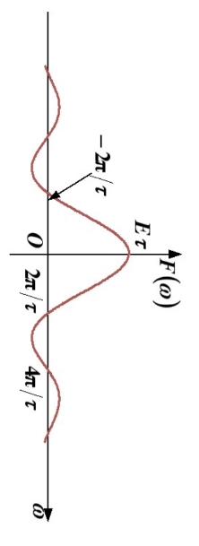  

其傅里叶变换为：  
$$F(\omega) = \int_{-\tau/2}^{\tau/2} E e^{-j\omega t} dt = \left. E \frac{e^{-j\omega t}}{-j\omega} \right|_{-\tau/2}^{\tau/2} = E \frac{e^{j\omega \tau/2} - e^{-j\omega \tau/2}}{j\omega} = E\tau \frac{\sin(\omega \tau/2)}{\omega \tau/2} = E\tau Sa\left(\frac{\omega\tau}{2}\right)$$  

*   **幅频特性**：  
    $$|F(\omega)| = E\tau \left| Sa\left(\frac{\omega\tau}{2}\right) \right|$$  
*   **相频特性**：  
    由于 $Sa\left(\frac{\omega\tau}{2}\right)$ 可正可负，相角在它为负值时会突变 $\pi$（或 $-\pi$）：  
    $$\varphi(\omega) = \begin{cases} 0 , & Sa\left(\frac{\omega\tau}{2}\right) > 0 \\ \pm\pi , & Sa\left(\frac{\omega\tau}{2}\right) < 0 \end{cases}$$  

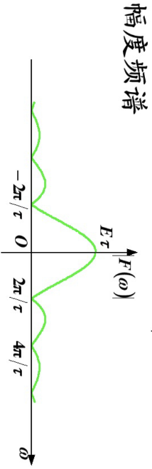  
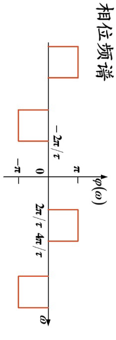  

#### 4.2 单边指数信号

设 $f(t) = E e^{-at} u(t)$，其中 $a > 0$。  

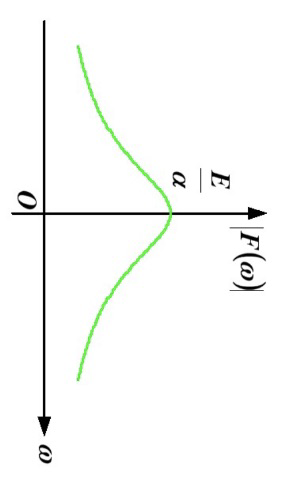  

其傅里叶变换为：  
$$F(\omega) = \int_{0}^{\infty} E e^{-at} e^{-j\omega t} dt = E \int_{0}^{\infty} e^{-(a+j\omega)t} dt = \left. E \frac{e^{-(a+j\omega)t}}{-(a+j\omega)} \right|_{0}^{\infty} = \frac{E}{a+j\omega}$$  

*   **幅频特性**：  
    $$|F(\omega)| = \frac{E}{\sqrt{a^2 + \omega^2}}$$  
*   **相频特性**：  
    $$\varphi(\omega) = -\arctan\left(\frac{\omega}{a}\right)$$  

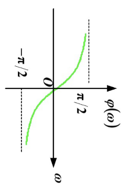  

#### 4.3 双边衰减指数信号

设 $f(t) = E e^{-a|t|}$，其中 $a > 0$。  

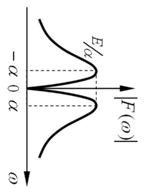  

其傅里叶变换为：  
$$F(\omega) = \int_{-\infty}^{\infty} E e^{-a|t|} e^{-j\omega t} dt = \int_{-\infty}^{0} E e^{at} e^{-j\omega t} dt + \int_{0}^{\infty} E e^{-at} e^{-j\omega t} dt$$  
$$= \frac{E}{a-j\omega} + \frac{E}{a+j\omega} = \frac{2aE}{a^2 + \omega^2}$$  

*   **幅频特性**：  
    $$|F(\omega)| = \frac{2aE}{a^2 + \omega^2}$$  
*   **相频特性**：  
    $$\varphi(\omega) = 0$$  

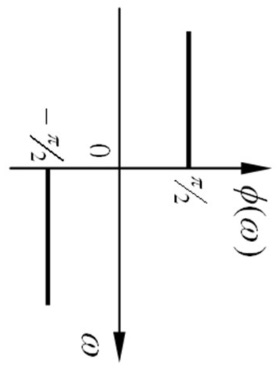  

#### 4.4 单位冲激信号

$$f(t) = \delta(t)$$  
其傅里叶变换为：  
$$F(\omega) = \int_{-\infty}^{\infty} \delta(t) e^{-j\omega t} dt = e^{-j\omega \cdot 0} = 1$$  

*   **物理意义**：单位冲激信号包含所有频率分量，且各分量强度相等（幅值为 1），相角为 0。常被称为==“白噪声”频谱==。  
*   冲激信号 $\delta(t)$ 也可看作脉宽 $\tau \to 0$ 的矩形脉冲的极限。  

#### 4.5 直流信号

$$f(t) = E \quad (-\infty < t < \infty)$$  

由于直流信号在 $(-\infty, \infty)$ 上不满足绝对可积条件，不能直接用积分定义计算其傅里叶变换。我们利用冲激函数进行扩充定义：  
$$F(\omega) = \lim_{\tau \to \infty} \int_{-\tau/2}^{\tau/2} E e^{-j\omega t} dt = \lim_{\tau \to \infty} E\tau Sa\left(\frac{\omega\tau}{2}\right) = 2\pi E \delta(\omega)$$  

*   **物理意义**：直流信号只有 $\omega = 0$ 的分量，其傅里叶变换在 $\omega = 0$ 处是一个强度为 $2\pi E$ 的冲激。  

#### 4.6 符号信号

设 $f(t) = \operatorname{sgn}(t) = \begin{cases} 1 , & t > 0 \\ -1 , & t < 0 \end{cases}$  

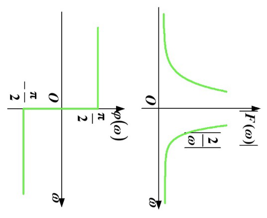  

其傅里叶变换可以视作两个单边指数信号的极限：  
$$\operatorname{sgn}(t) = \lim_{a \to 0} \left[ e^{-at} u(t) - e^{at} u(-t) \right]$$  
$$F(\omega) = \lim_{a \to 0} \left[ \frac{1}{a+j\omega} - \frac{1}{a-j\omega} \right] = \lim_{a \to 0} \frac{-2j\omega}{a^2 + \omega^2} = \frac{2}{j\omega}$$  

*   **幅频特性**：  
    $$|F(\omega)| = \frac{2}{|\omega|}$$  
*   **相频特性**：  
    $$\varphi(\omega) = \begin{cases} -\pi/2 , & \omega > 0 \\ \pi/2 , & \omega < 0 \end{cases}$$  

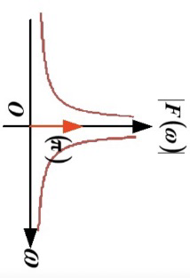  

#### 4.7 阶跃信号

设 $f(t) = u(t)$。  

我们可以将单位阶跃信号分解为直流分量与符号信号之和：  
$$u(t) = \frac{1}{2} + \frac{1}{2}\operatorname{sgn}(t)$$  

利用线性性质，可得其傅里叶变换：  
$$F(\omega) = \mathcal{F}\left[\frac{1}{2}\right] + \mathcal{F}\left[\frac{1}{2}\operatorname{sgn}(t)\right] = \pi \delta(\omega) + \frac{1}{j\omega}$$  

### 5. Fourier 变换的性质

#### 5.1 线性性质

若 $\mathcal{F}[f_1(t)] = F_1(\omega)$，$\mathcal{F}[f_2(t)] = F_2(\omega)$，则：  
$$\mathcal{F}[a f_1(t) + b f_2(t)] = a F_1(\omega) + b F_2(\omega)$$  

*   **例**：求 $u(t) = \frac{1}{2} + \frac{1}{2}\operatorname{sgn}(t)$ 的傅里叶变换。  
    $$F(\omega) = \pi\delta(\omega) + \frac{1}{j\omega}$$  

#### 5.2 奇偶虚实特性

若 $f(t)$ 是实函数，其傅里叶变换为 $F(\omega) = R(\omega) + jX(\omega)$，则：  
$$R(\omega) = \operatorname{Re}[F(\omega)] = \int_{-\infty}^{\infty} f(t) \cos(\omega t) dt \quad (\text{偶函数})$$  
$$X(\omega) = \operatorname{Im}[F(\omega)] = -\int_{-\infty}^{\infty} f(t) \sin(\omega t) dt \quad (\text{奇函数})$$  

因此有共轭对称性：  
$$F(-\omega) = F^*(\omega)$$  
$$|F(-\omega)| = |F(\omega)| \quad , \quad \varphi(-\omega) = -\varphi(\omega)$$  

*   若 $f(t)$ 是**实偶函数**，则 $F(\omega)$ 是**实偶函数**（$F(\omega) = R(\omega)$）。  
*   若 $f(t)$ 是**实奇函数**，则 $F(\omega)$ 是**虚奇函数**（$F(\omega) = jX(\omega)$）。  
*   **总结**：实信号变换后，实部为偶，虚部为奇，幅频为偶，相频为奇。  

#### 5.3 对称性质

若 $\mathcal{F}[f(t)] = F(\omega)$，则：  
$$\mathcal{F}[F(t)] = 2\pi f(-\omega)$$  

若 $f(t)$ 为偶函数，则：  
$$\mathcal{F}[F(t)] = 2\pi f(\omega)$$  

*   **例 1**：因为 $\mathcal{F}[\delta(t)] = 1$，由对称性得 $\mathcal{F}[1] = 2\pi \delta(-\omega) = 2\pi \delta(\omega)$。  
*   **例 2**：求抽样信号 $f(t) = E Sa(\omega_c t)$ 的傅里叶变换。  
    已知 $g(t) = \begin{cases} E , & |t| < \tau/2 \\ 0 , & |t| > \tau/2 \end{cases} \iff G(\omega) = E\tau Sa\left(\frac{\omega\tau}{2}\right)$。  
    令 $\frac{\tau}{2} = \omega_c \implies \tau = 2\omega_c$，则 $g(t) = E [u(t+\omega_c) - u(t-\omega_c)] \iff G(\omega) = 2E\omega_c Sa(\omega\omega_c)$。  
    由对称性质 $\mathcal{F}[G(t)] = 2\pi g(-\omega)$，有：  
    $$\mathcal{F}\left[2E\omega_c Sa(\omega_c t)\right] = 2\pi E [u(-\omega + \omega_c) - u(-\omega - \omega_c)]$$  
    $$\implies \mathcal{F}[Sa(\omega_c t)] = \frac{\pi}{\omega_c} [u(\omega + \omega_c) - u(\omega - \omega_c)]$$  
    因此：  
    $$\mathcal{F}[E Sa(\omega_c t)] = \frac{\pi E}{\omega_c} [u(\omega + \omega_c) - u(\omega - \omega_c)]$$  

#### 5.4 尺度特性

若 $\mathcal{F}[f(t)] = F(\omega)$，则：  
$$\mathcal{F}[f(at)] = \frac{1}{|a|} F\left(\frac{\omega}{a}\right)$$  

*   **物理意义**：  
    1) 当 $0 < |a| < 1$ 时，时域扩展，频带压缩，信号幅度减小；  
    2) 当 $|a| > 1$ 时，时域压缩，频域扩展 $|a|$ 倍，信号幅度增大。  

**等效脉宽与等效频宽**：  
定义等效脉冲宽度 $\tau$ 与等效频带宽度 $B_\omega$ 分别为：  
$$\tau = \frac{\int_{-\infty}^{\infty} f(t) dt}{f(0)} = \frac{F(0)}{f(0)}$$  
$$B_\omega = \frac{\int_{-\infty}^{\infty} F(\omega) d\omega}{F(0)} = \frac{2\pi f(0)}{F(0)}$$  
则有：  
$$B_\omega \cdot \tau = 2\pi$$  
该式子表明时域的脉宽与频域的频带宽度乘积为常数。尺度变换性质也体现了这一对立统一关系。  

#### 5.5 时移特性

若 $\mathcal{F}[f(t)] = F(\omega)$，则：  
$$\mathcal{F}[f(t - t_0)] = F(\omega) e^{-j\omega t_0}$$  

*   **物理意义**：时域的位移仅使频域的相位改变（初相位加上 $-\omega t_0$），而其幅频特性 $|F(\omega)|$ 保持不变。  
*   **例**：求如图所示的三个相同方波信号叠加后的傅里叶变换，方波间隔为 $T$。  
    设单个方波信号为 $f_0(t) \iff F_0(\omega) = E\tau Sa\left(\frac{\omega\tau}{2}\right)$。  
    总信号为：  
    $$f(t) = f_0(t) + f_0(t - T) + f_0(t + T)$$  
    利用时移性质：  
    $$F(\omega) = F_0(\omega) [1 + e^{-j\omega T} + e^{j\omega T}] = F_0(\omega) (1 + 2\cos\omega T)$$  
    即：  
    $$F(\omega) = E\tau Sa\left(\frac{\omega\tau}{2}\right) (1 + 2\cos\omega T)$$  

#### 5.6 频移特性（调制）

若 $\mathcal{F}[f(t)] = F(\omega)$，则：  
$$\mathcal{F}[f(t) e^{\pm j\omega_0 t}] = F(\omega \mp \omega_0)$$  

*   **物理意义**：频移特性的本质是==频谱搬移==（调制）。时域信号乘以 $e^{j\omega_0 t}$，对应频域中所有频率成分向右移动 $\omega_0$。  
*   **例 1**：求余弦信号 $\cos\omega_0 t$ 和正弦信号 $\sin\omega_0 t$ 的傅里叶变换。  
    根据 Euler 公式：  
    $$\cos\omega_0 t = \frac{1}{2}(e^{j\omega_0 t} + e^{-j\omega_0 t}) \quad , \quad \sin\omega_0 t = \frac{1}{2j}(e^{j\omega_0 t} - e^{-j\omega_0 t})$$  
    由频移性质和 $\mathcal{F}[1] = 2\pi\delta(\omega)$，可得：  
    $$\mathcal{F}[\cos\omega_0 t] = \pi [\delta(\omega - \omega_0) + \delta(\omega + \omega_0)]$$  
    $$\mathcal{F}[\sin\omega_0 t] = -j\pi [\delta(\omega - \omega_0) - \delta(\omega + \omega_0)]$$  
*   **例 2**：已知 $\mathcal{F}[f(t)] = F(\omega)$，求 $f(t)\cos\omega_0 t$ 的傅里叶变换。  
    $$\mathcal{F}[f(t)\cos\omega_0 t] = \mathcal{F}\left[f(t) \cdot \frac{1}{2}(e^{j\omega_0 t} + e^{-j\omega_0 t})\right] = \frac{1}{2} [F(\omega - \omega_0) + F(\omega + \omega_0)]$$  
*   **例 3（性质综合）**：若 $F(\omega) = \mathcal{F}[f(t)]$，求 $F(3\omega - 1) e^{j2\omega}$ 的傅里叶逆变换。  
    由于傅里叶反变换与正变换的对称性，我们由基本性质逐步推导：  
    已知 $f(t) \iff F(\omega)$。  
    由尺度特性：$f(t/3) \iff 3F(3\omega) \implies \frac{1}{3}f(t/3) \iff F(3\omega)$。  
    由频移特性：$e^{j\omega_0 t} f(t) \iff F(\omega - \omega_0)$。由于反变换对称性，我们对 $\omega$ 的位移在时域乘上相位移动：  
    位移 $\omega - 1/3$：$\frac{1}{3}f(t/3) e^{j t/3} \iff F(3(\omega - 1/3)) = F(3\omega - 1)$。  
    由时移特性：$f(t - t_0) \iff F(\omega) e^{-j\omega t_0}$。  
    这里乘以 $e^{j2\omega}$ 相当于 $t_0 = -2$，所以：  
    $$\mathcal{F}^{-1}[F(3\omega - 1) e^{j2\omega}] = \frac{1}{3} f\left(\frac{t+2}{3}\right) e^{j \frac{t+2}{3}}$$  

#### 5.7 时域微分特性

若 $\mathcal{F}[f(t)] = F(\omega)$，则：  
$$\mathcal{F}\left[\frac{df(t)}{dt}\right] = j\omega F(\omega)$$  
并可推广到 $n$ 阶微分：  
$$\mathcal{F}\left[\frac{d^n f(t)}{dt^n}\right] = (j\omega)^n F(\omega)$$  

*   **物理意义**：时域的求导相当于对其所有频率分量乘以 $j\omega$，在频域中即为幅值乘以 $\omega$ 且相位旋转 $90^\circ$（乘以 $j$）。  
*   **例**：利用微分性质求单位冲激信号 $\delta(t)$ 的傅里叶变换。  
    我们已知 $\delta(t) = \frac{du(t)}{dt}$。  
    $$\mathcal{F}[\delta(t)] = j\omega \mathcal{F}[u(t)] = j\omega \left[ \pi \delta(\omega) + \frac{1}{j\omega} \right] = j\omega \pi \delta(\omega) + 1$$  
    根据冲激函数性质 $\omega \delta(\omega) = 0$，上式化简为：  
    $$\mathcal{F}[\delta(t)] = 1$$  
    这与前文直接积分得到的结果一致。  
    > [!WARNING]  
    > **注意**：信号微分会丢失直流分量，微分后的信号无法反映原信号中的直流偏置。  

#### 5.8 频域微分特性

若 $\mathcal{F}[f(t)] = F(\omega)$，则：  
$$\mathcal{F}[(-jt)^n f(t)] = \frac{d^n F(\omega)}{d\omega^n} \implies \mathcal{F}[t^n f(t)] = j^n \frac{d^n F(\omega)}{d\omega^n}$$  
对于 $n=1$：  
$$\mathcal{F}[t f(t)] = j \frac{dF(\omega)}{d\omega}$$  

*   **例**：求 $t$ 的傅里叶变换。  
    已知 $\mathcal{F}[1] = 2\pi\delta(\omega)$。  
    由频域微分性质：  
    $$\mathcal{F}[t] = j \frac{d}{d\omega}(2\pi\delta(\omega)) = j 2\pi \delta'(\omega)$$  

#### 5.9 时域积分特性

若 $\mathcal{F}[f(t)] = F(\omega)$，则：  
$$\mathcal{F}\left[\int_{-\infty}^{t} f(\tau) d\tau\right] = \frac{F(\omega)}{j\omega} + \pi F(0) \delta(\omega)$$  

*   **物理意义**：时域积分是微分的逆运算，因此频域中对应除以 $j\omega$，并且由于积分可能引入直流分量（即信号在整个时间轴上的面积 $F(0)$），所以式中包含了一项直流成分项 $\pi F(0) \delta(\omega)$。  
*   **例**：利用时域积分性质求矩形脉冲信号的傅里叶变换。  
    设 $g(t) = E [u(t + \tau/2) - u(t - \tau/2)]$ 为矩形波。  
    其导数为：  
    $$g'(t) = E \delta(t + \tau/2) - E \delta(t - \tau/2)$$  
    对其求傅里叶变换：  
    $$\mathcal{F}[g'(t)] = E e^{j\omega \tau/2} - E e^{-j\omega \tau/2} = 2jE \sin\left(\frac{\omega\tau}{2}\right)$$  
    由于 $g'(t)$ 是奇函数，且 $g(t)$ 的直流面积 $G(0) = E\tau$，我们利用积分性质：  
    $$g(t) = \int_{-\infty}^{t} g'(\tau) d\tau$$  
    得：  
    $$G(\omega) = \frac{\mathcal{F}[g'(t)]}{j\omega} + \pi \mathcal{F}[g'(t)]|_{\omega=0} \delta(\omega) = \frac{2jE \sin(\omega\tau/2)}{j\omega} + 0 = E\tau Sa\left(\frac{\omega\tau}{2}\right)$$  
    这与用定义计算的结果完全一致。  

#### 5.10 时域卷积性质

若 $\mathcal{F}[f_1(t)] = F_1(\omega)$，$\mathcal{F}[f_2(t)] = F_2(\omega)$，则：  
$$\mathcal{F}[f_1(t) * f_2(t)] = F_1(\omega) \cdot F_2(\omega)$$  

*   **物理意义**：==时域相卷，频域相乘==。对于线性时不变系统，若其单位冲激响应为 $h(t) \iff H(\omega)$，输入激励为 $e(t) \iff E(\omega)$，系统零状态响应为 $r(t) = e(t) * h(t)$，则频域响应为：  
    $$R(\omega) = E(\omega) \cdot H(\omega)$$  
    其中 $H(\omega)$ 称为系统的==网络函数（或系统函数）==。  

#### 5.11 频域卷积性质

若 $\mathcal{F}[f_1(t)] = F_1(\omega)$，$\mathcal{F}[f_2(t)] = F_2(\omega)$，则：  
$$\mathcal{F}[f_1(t) \cdot f_2(t)] = \frac{1}{2\pi} F_1(\omega) * F_2(\omega)$$  

*   **物理意义**：==时域相乘，频域相卷（乘以 $1/2\pi$）==。  

### 6. 周期信号的傅里叶变换

**傅里叶变换存在的充分条件**（Dirichlet 条件）：  
*   在任一周期内，信号有有限个第一类间断点和有限个极值点；  
*   信号在任一周期内绝对可积。  

严格来说，周期信号在 $(-\infty, \infty)$ 上是不满足绝对可积条件的。但在引入冲激函数后，可以将周期信号的傅里叶变换加以推广。  

*   **回顾**：连续周期信号 $f_p(t)$ 周期为 $T$，基频 $\omega_1 = 2\pi/T$，其指数形式的傅里叶级数为：  
    $$f_p(t) = \sum_{k=-\infty}^{\infty} F(k\omega_1) e^{jk\omega_1 t}$$  
*   对该式两边进行傅里叶变换，利用频移性质：  
    $$\mathcal{F}[e^{jk\omega_1 t}] = 2\pi \delta(\omega - k\omega_1)$$  
    可得周期信号的傅里叶变换为：  
    $$F_p(\omega) = 2\pi \sum_{k=-\infty}^{\infty} F(k\omega_1) \delta(\omega - k\omega_1)$$  
*   **物理意义**：  
    1.  周期函数的傅里叶变换是一个==冲激序列==。  
    2.  冲激脉冲均位于各谐波频率 $k\omega_1$ 处。  
    3.  各冲激的强度是相应傅里叶级数系数的 $2\pi$ 倍。  

*   **例**：求周期冲激序列信号（又称冲激梳状函数） $\delta_p(t) = \sum_{n=-\infty}^{\infty} \delta(t - nT)$ 的傅里叶变换。  
    首先求其傅里叶级数系数：  
    $$F(k\omega_1) = \frac{1}{T} \int_{-T/2}^{T/2} \delta(t) e^{-jk\omega_1 t} dt = \frac{1}{T}$$  
    因此：  
    $$\delta_p(t) = \frac{1}{T} \sum_{k=-\infty}^{\infty} e^{jk\omega_1 t}$$  
    对其进行傅里叶变换：  
    $$\mathcal{F}[\delta_p(t)] = \frac{2\pi}{T} \sum_{k=-\infty}^{\infty} \delta(\omega - k\omega_1) = \omega_1 \sum_{k=-\infty}^{\infty} \delta(\omega - k\omega_1)$$  
    其中 $\omega_1 = \frac{2\pi}{T}$。  
*   **结论**：时域 of 冲激序列变换到频域，依然是频域的冲激序列。  

#### 6.1 任意周期信号的傅里叶变换

若已知非周期信号 $f(t) \iff F(\omega)$，由它延拓成的周期信号 $f_p(t) = \sum_{n=-\infty}^{\infty} f(t - nT)$，可以看作是 $f(t)$ 与周期冲激脉冲序列 $\delta_p(t)$ 的时域卷积：  
$$f_p(t) = f(t) * \delta_p(t) = f(t) * \sum_{n=-\infty}^{\infty} \delta(t - nT)$$  

利用时域卷积性质，其傅里叶变换为：  
$$F_p(\omega) = F(\omega) \cdot \mathcal{F}[\delta_p(t)] = F(\omega) \cdot \left[ \frac{2\pi}{T} \sum_{k=-\infty}^{\infty} \delta(\omega - k\omega_1) \right] = \frac{2\pi}{T} \sum_{k=-\infty}^{\infty} F(k\omega_1) \delta(\omega - k\omega_1)$$  
其中 $\omega_1 = \frac{2\pi}{T}$。  

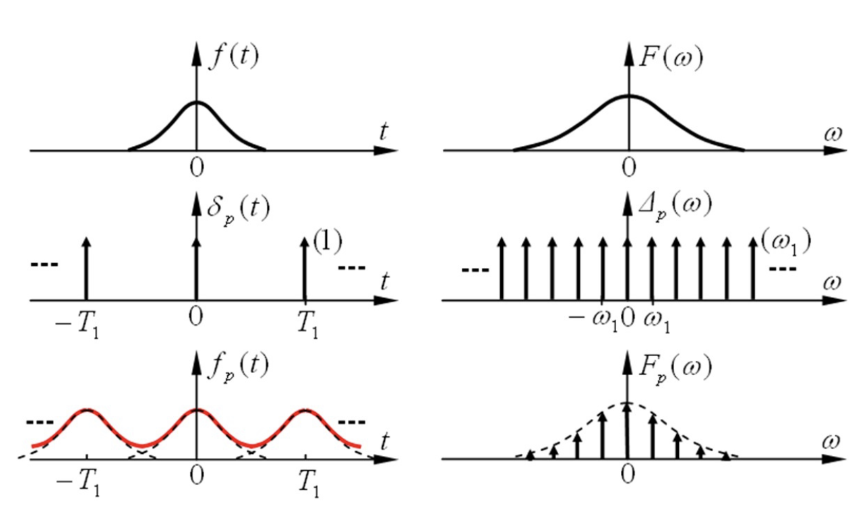  

#### 6.2 周期信号 Fourier 变换与 Fourier 级数的关系

对于周期信号 $f_p(t)$：  
*   其傅里叶变换为：  
    $$F_p(\omega) = 2\pi \sum_{k=-\infty}^{\infty} F_n \delta(\omega - k\omega_1)$$  
    其中 $F_n$ 是指数形式傅里叶级数系数。  
*   同时，利用单周期信号的傅里叶变换 $F(\omega)$ 表示为：  
    $$F_n = \frac{1}{T} F(k\omega_1) \implies F_p(\omega) = \omega_1 \sum_{k=-\infty}^{\infty} F(k\omega_1) \delta(\omega - k\omega_1)$$  
*   由此可得：  
    $$F_n = \frac{1}{T} F(\omega) \Big|_{\omega = k\omega_1}$$  
*   **总结**：==时域周期延拓 $\iff$ 频域离散抽样==。  

*   **例**：求周期矩形波信号的傅里叶变换。  
    周期矩形波 $f_p(t)$ 可以看作单脉冲 $g(t)$（宽度 $\tau$，幅值 $E$）的周期延拓。  
    单脉冲的频谱为：  
    $$G(\omega) = E\tau Sa\left(\frac{\omega\tau}{2}\right)$$  
    其周期延拓信号的傅里叶变换为：  
    $$G_p(\omega) = \frac{2\pi}{T} \sum_{k=-\infty}^{\infty} G(k\omega_1) \delta(\omega - k\omega_1) = \frac{2\pi}{T} \sum_{k=-\infty}^{\infty} E\tau Sa\left(\frac{k\omega_1\tau}{2}\right) \delta(\omega - k\omega_1)$   
    $$= 2\pi \sum_{k=-\infty}^{\infty} \frac{E\tau}{T} Sa\left(\frac{k\omega_1\tau}{2}\right) \delta(\omega - k\omega_1)$$  

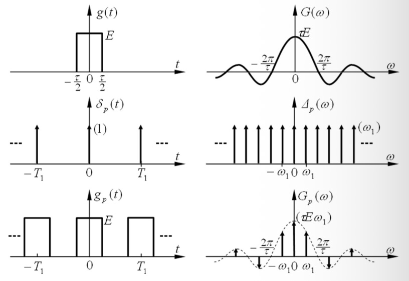  
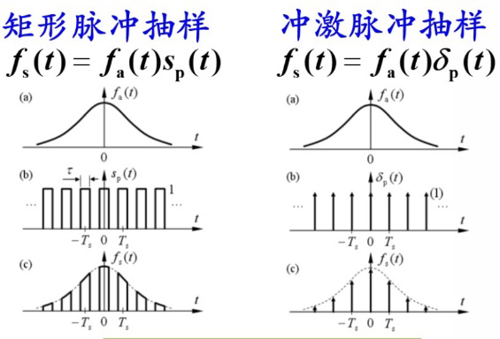  

### 7. 信号的抽样

抽样是将连续信号在时域或频域转换为离散信号的过程。  

#### 7.1 时域矩形脉冲序列抽样

时域抽样相当于将连续信号 $f(t)$ 乘以一个周期矩形脉冲序列 $p(t)$。  
*   当抽样间隔 $T_s$ 减小时，频域重复间隔 $\omega_s$ 增大，混叠减小；  
*   当抽样间隔 $T_s$ 增大时，频域重复间隔 $\omega_s$ 减小，可能产生混叠。  

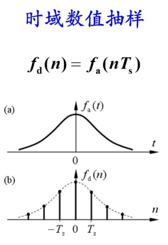  
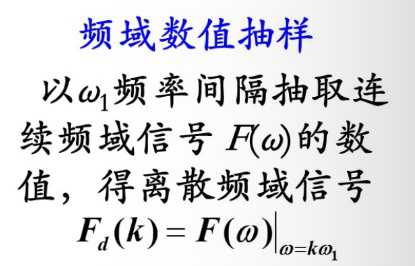  
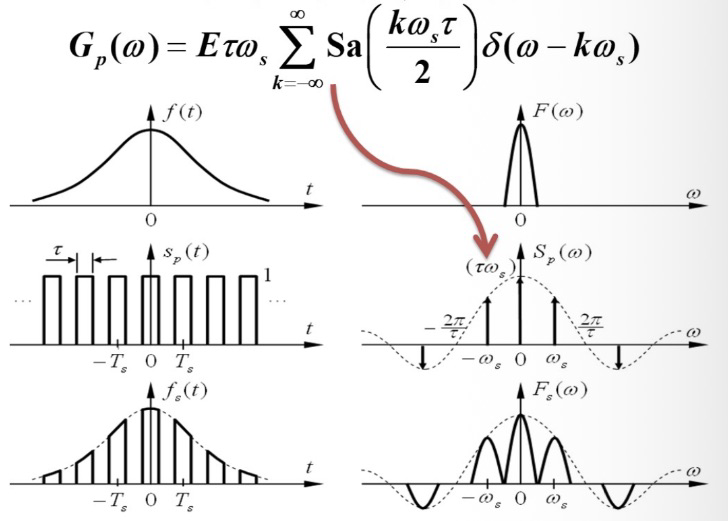  

#### 7.2 时域冲激脉冲序列抽样

时域抽样也可以简化为乘上一个冲激序列 $\delta_p(t) = \sum_{n=-\infty}^{\infty} \delta(t - nT_s)$。  
抽样后信号为：  
$$f_s(t) = f(t) \cdot \delta_p(t)$$  
根据频域卷积定理，抽样后信号的频谱为：  
$$F_s(\omega) = \frac{1}{2\pi} F(\omega) * \mathcal{F}[\delta_p(t)] = \frac{1}{2\pi} F(\omega) * \left[ \omega_s \sum_{k=-\infty}^{\infty} \delta(\omega - k\omega_s) \right] = \frac{1}{T_s} \sum_{k=-\infty}^{\infty} F(\omega - k\omega_s)$$  
其中 $\omega_s = \frac{2\pi}{T_s}$。  

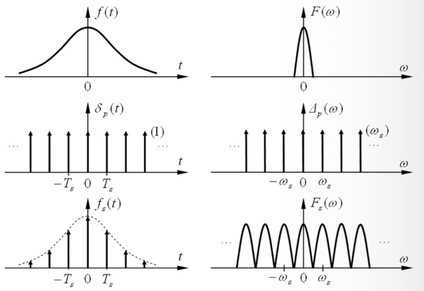  
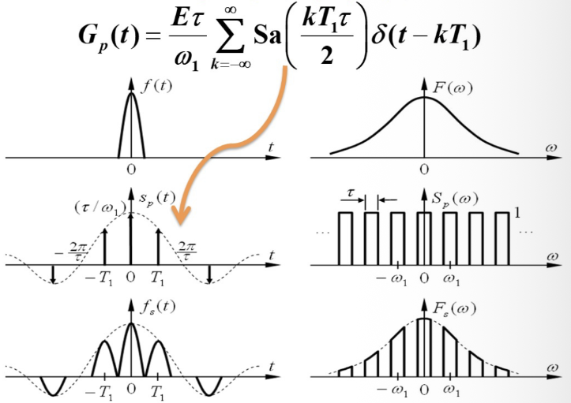  

#### 7.3 频域矩形脉冲序列抽样

频域抽样将频域连续 of $F(\omega)$ 乘上一个频域的矩形脉冲序列，使得频域在时域的投影产生周期延拓。  
*   频域抽样间隔减小，时域重复间隔增大。  

#### 7.4 频域冲激脉冲序列抽样

类似地，将 $F(\omega)$ 乘以频域冲激脉冲序列。  
*   频域抽样间隔减小 $\iff$ 时域重复间隔增大。  

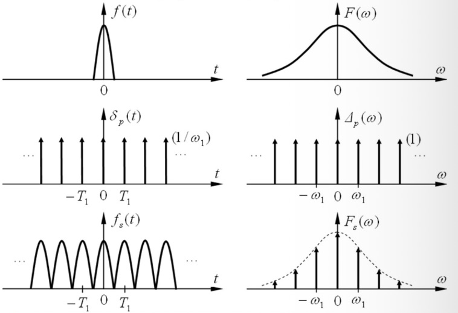  

### 8. 抽样定理 (Sampling Theorem)

#### 8.1 时域抽样定理 (Nyquist 抽样定理)

若连续信号 $f(t)$ 的频带是有限的，其最高频率为 $\omega_m$（即当 $|\omega| > \omega_m$ 时，$F(\omega) = 0$），则它可以用等间隔的时域样值信号 $f(nT_s)$ 唯一地表示。  
只要时域抽样角频率 $\omega_s$ 满足：  
$$\omega_s = \frac{2\pi}{T_s} \ge 2\omega_m \implies T_s \le \frac{\pi}{\omega_m}$$  
对应的抽样频率称为奈奎斯特频率：$f_s \ge 2f_m$。  
*   **物理意义**：为了无失真地恢复原连续信号，对信号最高频率分量进行有效抽样时，在一个周期内至少要抽取 2 个点。  

#### 8.2 频域抽样定理

若时域信号 $f(t)$ 的时间范围是有限的，只在区间 $(-t_m, t_m)$ 内有值，则它的频谱函数 $F(\omega)$ 可以用等间隔的频域抽样值唯一表示。  
只要频域抽样间隔 $\omega_s$ 满足：  
$$\omega_s = \frac{2\pi}{T_1} \le \frac{\pi}{t_m} \implies T_1 \ge 2t_m$$  
即频域抽样对应的时域周期 $T_1$ 必须大等于信号时域长度 $2t_m$。  

*   **例：三角信号抽样**  
    时域三角信号的抽样，如果在临界抽样时（$\omega_s = 2\omega_m$），其频谱刚好无重叠地拼接在一起。  

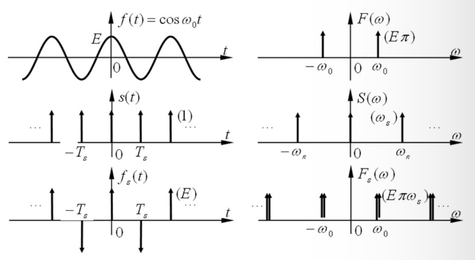  
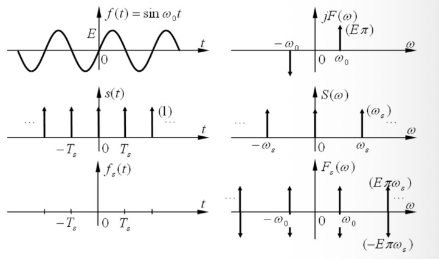  

### 9. 时域信号的恢复

在满足抽样定理（$\omega_s \ge 2\omega_m$）的条件下，可以通过一个低通滤波器将原信号无失真地恢复出来。  
理想低通滤波器的频率响应为：  
$$H(\omega) = \begin{cases} T_s , & |\omega| < \omega_c \\ 0 , & |\omega| > \omega_c \end{cases} \quad (\omega_m < \omega_c < \omega_s - \omega_m)$$  

恢复出来的时域信号为：  
$$f(t) = f_s(t) * h(t) = \left[ \sum_{n=-\infty}^{\infty} f(nT_s)\delta(t - nT_s) \right] * Sa(\omega_c t) = \sum_{n=-\infty}^{\infty} f(nT_s) Sa(\omega_c(t - nT_s))$$  

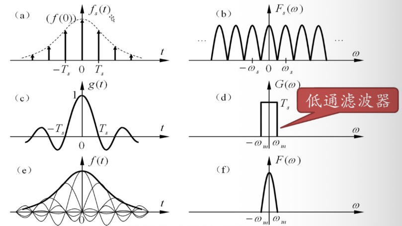

---

## 六、拉普拉斯变换

### 1. Laplace 变换的引出

傅里叶变换要求信号满足绝对可积等 Dirichlet 条件，对于随时间指数增长的信号（如 $e^{at}$，$a > 0$），傅里叶变换将无法直接应用。  

拉普拉斯变换的解决思路是：在原信号 $f(t)$ 上乘上一个指数衰减因子 $e^{-\sigma t}$，使其满足绝对可积条件，然后再进行傅里叶变换。  

对 $f(t) e^{-\sigma t}$ 进行傅里叶变换：  
$$\mathcal{F}[f(t) e^{-\sigma t}] = \int_{-\infty}^{\infty} f(t) e^{-\sigma t} e^{-j\omega t} dt = \int_{-\infty}^{\infty} f(t) e^{-(\sigma + j\omega)t} dt$$  

令复变量 $s = \sigma + j\omega$（其中复变量 $s$ 的取值范围称为 **s 平面**），得到**双边拉普拉斯变换**（象函数）：  
$$F(s) = \mathcal{L}[f(t)] = \int_{-\infty}^{\infty} f(t) e^{-st} dt$$  

其对应的**逆变换**（反变换）为：  
$$f(t) = \mathcal{L}^{-1}[F(s)] = \frac{1}{2\pi j} \int_{\sigma - j\infty}^{\sigma + j\infty} F(s) e^{st} ds$$  
这里称时域的 $f(t)$ 为**原函数**。  

对于因果信号（即 $t < 0$ 时 $f(t) = 0$ 的信号），通常采用从 $0^-$ 开始积分的**单边拉普拉斯变换**：  
$$F(s) = \mathcal{L}[f(t)] = \int_{0^-}^{\infty} f(t) e^{-st} dt$$  

### 2. 双边 Laplace 变换的收敛域 (ROC)

衰减因子 $e^{-\sigma t}$ 并不能在整个复平面上都起到衰减作用。  
*   当 $\sigma > 0$ 时，对于 $t > 0$ 的部分起到衰减作用，但对于 $t < 0$ 的部分反而是发散的；  
*   当 $\sigma < 0$ 时，情况刚好相反。  

为了使积分收敛，必须将积分区间划分为两部分讨论：  
$$F_{\text{bilateral}}(s) = \int_{-\infty}^{0} f(t) e^{-st} dt + \int_{0}^{\infty} f(t) e^{-st} dt$$  

对于 $(-\infty, 0)$ 区间，只要信号不以高于指数阶的速度发散，必存在一个实数 $\sigma_2$，当 $\sigma < \sigma_2$ 时，该部分积分绝对可积；  
对于 $(0, \infty)$ 区间，同理必存在一个实数 $\sigma_1$，当 $\sigma > \sigma_1$ 时，该部分积分绝对可积。  

In s 平面，双边拉普拉斯变换的**收敛域 (ROC)** 应该同时满足这两个区间收敛：  
$$\sigma_1 < \operatorname{Re}(s) < \sigma_2$$  
在 s 平面上，这表现为一个平行于虚轴的带状区域。若 $\sigma_1 > \sigma_2$，则两个区间的收敛域没有重叠，此时该信号的双边拉普拉斯变换不存在。  

### 3. 常见信号的 Laplace 变换

以下均假设信号为因果信号，采用单边拉普拉斯变换：  

**1) 单位阶跃信号 $u(t)$**  
$$\mathcal{L}[u(t)] = \int_{0^-}^{\infty} e^{-st} dt = \left. \frac{e^{-st}}{-s} \right|_{0}^{\infty} = \frac{1}{s} \quad (\operatorname{Re}(s) > 0)$$  

**2) 指数信号 $e^{-at} u(t)$**  
$$\mathcal{L}[e^{-at} u(t)] = \int_{0^-}^{\infty} e^{-(s+a)t} dt = \frac{1}{s+a} \quad (\operatorname{Re}(s) > -a)$$  

**3) 单位冲激信号 $\delta(t)$**  
$$\mathcal{L}[\delta(t)] = \int_{0^-}^{\infty} \delta(t) e^{-st} dt = e^{-s \cdot 0} = 1 \quad (\text{全平面收敛})$$  
对于有时延的冲激信号：  
$$\mathcal{L}[\delta(t - t_0)] = e^{-s t_0} \quad (\text{全平面收敛})$$  

**4) $t$ 的整数次幂 $t^n u(t)$**  
已知 $\mathcal{L}[t u(t)] = \frac{1}{s^2}$，递推可得：  
$$\mathcal{L}[t^n u(t)] = \frac{n!}{s^{n+1}} \quad (\operatorname{Re}(s) > 0)$$  

### 4. Laplace 变换的零极点

一般来说，实际信号的拉普拉斯变换可以写为有理分式形式：  
$$F(s) = \frac{N(s)}{D(s)} = K \frac{(s - z_1)(s - z_2) \dots (s - z_m)}{(s - p_1)(s - p_2) \dots (s - p_n)}$$  
其中：  
*   $s = z_j$ 为 $F(s)$ 的**零点**；  
*   $s = p_i$ 为 $F(s)$ 的**极点**。  

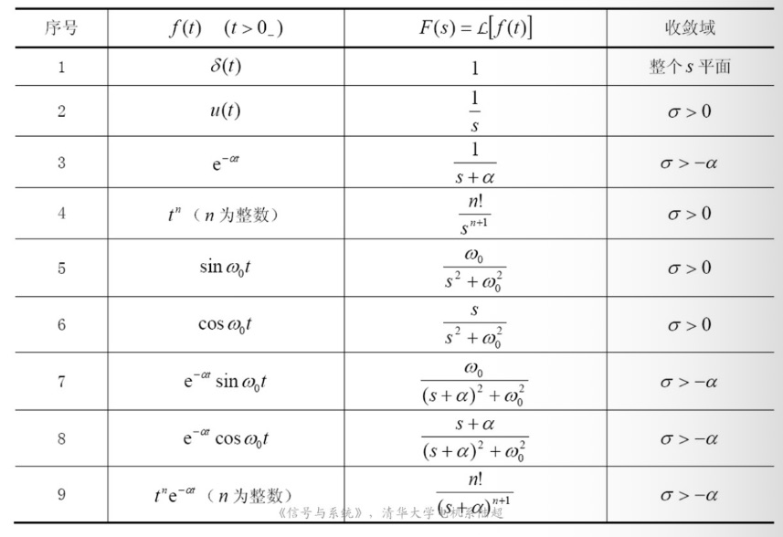  

### 5. 收敛域与极点的关系

*   拉普拉斯变换 of 收敛域中**不含任何极点**。  
*   收敛域的边界必定平行于虚轴，且通过距离收敛域最近的极点。对于因果信号（右边信号），其收敛域为最右边极点的右侧区域：  
    $$\operatorname{Re}(s) > \operatorname{Re}(p_{\text{max}})$$  

### 6. 由 Laplace 变换求 Fourier 变换

对于一个信号，如果其单边拉普拉斯变换为 $F(s)$：  
*   若 $F(s)$ 的收敛域**包含虚轴**（即包含 $\operatorname{Re}(s) = 0$），则可直接通过变量替换 $s = j\omega$ 求得其傅里叶变换：  
    $$F(\omega) = F(s)\Big|_{s = j\omega}$$  
*   若 $F(s)$ 的收敛域**不包含虚轴**，则其经典的傅里叶变换不存在。  
*   若 $F(s)$ 的收敛域边界恰好是虚轴（即在虚轴上有单极点），则需要加入冲激函数项求得推广的傅里叶变换：  
    $$F(\omega) = F(s)\Big|_{s = j\omega} + \pi \sum_k \operatorname{Res}[F(s), p_k] \delta(\omega - \omega_k)$$  

### 7. Laplace 变换的性质

#### 7.1 线性性质

$$\mathcal{L}[A f_1(t) + B f_2(t)] = A F_1(s) + B F_2(s)$$  

#### 7.2 时移性质

$$\mathcal{L}[f(t - t_0) u(t - t_0)] = F(s) e^{-s t_0} \quad (t_0 > 0)$$  

#### 7.3 s 域平移性质 (复频移性质)

$$\mathcal{L}[f(t) e^{\mp s_0 t}] = F(s \pm s_0)$$  

*   **例**：求 $f(t) = t u(t-1)$ 的拉普拉斯变换。  
    我们将 $f(t)$ 变形为：  
    $$f(t) = (t-1)u(t-1) + u(t-1)$$  
    由于 $\mathcal{L}[t u(t)] = \frac{1}{s^2}$，$\mathcal{L}[u(t)] = \frac{1}{s}$，利用时移性质可得：  
    $$F(s) = \frac{1}{s^2} e^{-s} + \frac{1}{s} e^{-s} = \frac{s+1}{s^2} e^{-s}$$  

#### 7.4 尺度变换性质

$$\mathcal{L}[f(at)] = \frac{1}{a} F\left(\frac{s}{a}\right) \quad (a > 0)$$  

*   **例**：已知 $\mathcal{L}[f(t)] = F(s)$，求 $\mathcal{L}[f(at-b) u(at-b)]$ ($a > 0, b > 0$)。  
    先利用时移性质：  
    $$\mathcal{L}[f(t - b) u(t - b)] = F(s) e^{-bs}$$  
    再根据尺度变换性质（注意把时间变量 $t$ 替换为 $at$，对应的时延变为 $b/a$）：  
    $$\mathcal{L}[f(at - b) u(at - b)] = \mathcal{L}\left[ f\left( a\left( t - \frac{b}{a} \right) \right) u\left( a\left( t - \frac{b}{a} \right) \right) \right] = \frac{1}{a} F\left(\frac{s}{a}\right) e^{-\frac{b}{a} s}$$  

#### 7.5 时域微分性质

若 $\mathcal{L}[f(t)] = F(s)$，则：  
$$\mathcal{L}[f'(t)] = s F(s) - f(0^-)$$  
$$\mathcal{L}[f''(t)] = s^2 F(s) - s f(0^-) - f'(0^-)$$  
推广至 $n$ 阶微分：  
$$\mathcal{L}[f^{(n)}(t)] = s^n F(s) - s^{n-1} f(0^-) - s^{n-2} f'(0^-) - \dots - f^{(n-1)}(0^-)$$  

#### 7.6 时域积分性质

若 $\mathcal{L}[f(t)] = F(s)$，则：  
$$\mathcal{L}\left[ \int_{0^-}^{t} f(\tau) d\tau \right] = \frac{F(s)}{s}$$  
若积分的下限为 $-\infty$，则需要考虑 $0^-$ 时刻之前的历史积分积累量（直流偏置）：  
$$\mathcal{L}\left[ \int_{-\infty}^{t} f(\tau) d\tau \right] = \frac{F(s)}{s} + \frac{\int_{-\infty}^{0^-} f(\tau) d\tau}{s}$$  

#### 7.7 时域卷积性质

时域相卷，频域相乘。  
$$\mathcal{L}[f_1(t) * f_2(t)] = F_1(s) \cdot F_2(s)$$  

#### 7.8 初值定理

如果 $f(t)$ 不含冲激项，则有：  
$$\lim_{t \to 0^+} f(t) = \lim_{s \to \infty} s F(s)$$  
> [!WARNING]  
> **注意**：如果 $F(s)$ 不是真分式（即分子最高次数 $\ge$ 分母最高次数），说明时域含有冲激项。在使用初值定理前，必须先利用长除法分离出多项式（冲激项），再对真分式部分应用初值定理。  

*   **例**：已知 $F(s) = \frac{2s^2 + 4s + 1}{(s+1)(s+2)}$，求 $f(0^+)$。  
    由于分子分母最高次数相同，先用长除法分离：  
    $$F(s) = 2 - \frac{2s + 3}{s^2 + 3s + 2}$$  
    这里常数项 2 对应时域的 $2\delta(t)$。对真分式部分求极限：  
    $$\lim_{s \to \infty} s \left( F(s) - 2 \right) = \lim_{s \to \infty} \frac{-2s^2 - 3s}{s^2 + 3s + 2} = -2$$  
    因此，除了冲激部分外，时域信号在 $0^+$ 时的初值为 $-2$。  

#### 7.9 终值定理

如果 $s F(s)$ 的所有极点都位于左半 s 平面（即时域信号在 $t \to \infty$ 时是收敛的），则有：  
$$\lim_{t \to \infty} f(t) = \lim_{s \to 0} s F(s)$$  

#### 7.10 s 域微积分性质

$$\mathcal{L}[-t f(t)] = \frac{dF(s)}{ds}$$  
$$\mathcal{L}\left[ \frac{f(t)}{t} \right] = \int_{s}^{\infty} F(u) du$$  

### 8. Laplace 逆变换的求解方法（部分分式展开法）

若 $F(s) = \frac{N(s)}{D(s)}$ 是有理真分式。我们将其分解为部分分式来求解反变换：  

#### 8.1 极点均为单根（简单极点）

设 $D(s) = (s - p_1)(s - p_2) \dots (s - p_n)$，其中各极点 $p_i$ 互不相同。则可以展开为：  
$$F(s) = \sum_{k=1}^{n} \frac{A_k}{s - p_k}$$  
其中系数为：  
$$A_k = \left. (s - p_k) F(s) \right|_{s = p_k}$$  
对应的时域信号为：  
$$f(t) = \sum_{k=1}^{n} A_k e^{p_k t} u(t)$$  

*   **若含有共轭复极点**：  
    设有一对共轭复根 $p_{1,2} = \alpha \pm j\beta$，其对应的部分分式系数也必定共轭：  
    $$A_{1,2} = C \pm jD$$  
    这一对共轭极点对应的时域分量为：  
    $$f_{\text{complex}}(t) = 2 e^{\alpha t} [C \cos\beta t - D \sin\beta t] u(t)$$  

*   **例**：求 $F(s) = \frac{s+3}{(s+2)(s^2 + 2s + 5)}$ 的逆变换 $f(t)$。  
    其极点为 $p_1 = -2$，以及共轭复极点 $p_{2,3} = -1 \pm j2$。  
    展开为部分分式：  
    $$F(s) = \frac{K_0}{s+2} + \frac{A}{s+1-j2} + \frac{A^*}{s+1+j2}$$  
    $$K_0 = \left. (s+2) F(s) \right|_{s=-2} = \left. \frac{s+3}{s^2+2s+5} \right|_{s=-2} = \frac{1}{5}$$  
    $$A = \left. (s+1-j2) F(s) \right|_{s=-1+j2} = \left. \frac{s+3}{(s+2)(s+1+j2)} \right|_{s=-1+j2} = \frac{2+j2}{(1+j2)(j4)} = -0.1 - j0.3$$  
    这里 $C = -0.1$，$D = -0.3$。代入公式得时域信号为：  
    $$f(t) = \left\{ \frac{1}{5} e^{-2t} + 2 e^{-t} [-0.1 \cos(2t) - (-0.3) \sin(2t)] \right\} u(t)$$  
    $$= \left\{ \frac{1}{5} e^{-2t} - \frac{1}{5} e^{-t} \cos(2t) + \frac{3}{5} e^{-t} \sin(2t) \right\} u(t)$$  

#### 8.2 极点含有重根

若 $D(s)$ 含有 $r$ 重极点 $p_1$，则可以展开为：  
$$F(s) = \sum_{j=1}^{r} \frac{A_{1j}}{(s-p_1)^j} + \dots$$  
其中重根系数为：  
$$A_{1j} = \frac{1}{(r-j)!} \left. \frac{d^{r-j}}{ds^{r-j}} \left[ (s-p_1)^r F(s) \right] \right|_{s = p_1}$$  
对应的时域信号为：  
$$\mathcal{L}^{-1}\left[ \frac{A}{(s-p)^k} \right] = \frac{A}{(k-1)!} t^{k-1} e^{pt} u(t)$$  

#### 8.3 特殊非真分式及非有理式情况

**1) 非真分式**  
先用长除法分离出多项式，分子最高次数比分母大多少，时域就会出现多少阶的冲激偶项：  
*   **例**：求 $F(s) = \frac{s^3 + 5s^2 + 9s + 7}{s^2 + 3s + 2}$ 的逆变换。  
    用长除法分离：  
    $$F(s) = s + 2 + \frac{s+3}{s^2+3s+2} = s + 2 + \frac{2}{s+1} - \frac{1}{s+2}$$  
    对其求逆变换，得：  
    $$f(t) = \delta'(t) + 2\delta(t) + (2e^{-t} - e^{-2t}) u(t)$$  

**2) 含有延迟项 $e^{-as}$ 的非有理分式**  
将 $e^{-as}$ 提出，只对有理分式求逆变换，最后应用时移性质：  
*   **例**：求 $F(s) = \frac{e^{-2s}}{(s+1)(s+2)}$ 的逆变换。  
    设 $F_1(s) = \frac{1}{(s+1)(s+2)} = \frac{1}{s+1} - \frac{1}{s+2} \iff f_1(t) = (e^{-t} - e^{-2t}) u(t)$。  
    利用时移性质可得：  
    $$f(t) = f_1(t-2) = [e^{-(t-2)} - e^{-2(t-2)}] u(t-2)$$  
*   **例**：求 $F(s) = \frac{e^{-(s+3)}}{s+3}$ 的逆变换。  
    变形为 $F(s) = e^{-3} \frac{e^{-s}}{s+3}$。  
    已知 $\mathcal{L}^{-1}\left[ \frac{1}{s+3} \right] = e^{-3t} u(t)$，利用时移性质可得：  
    $$f(t) = e^{-3} e^{-3(t-1)} u(t-1) = e^{-3t} u(t-1)$$  

### 9. Laplace 变换求解线性常系数微分方程

对于线性时不变系统：  
$$\frac{d^n r(t)}{dt^n} + a_{n-1}\frac{d^{n-1}r(t)}{dt^{n-1}} + \dots + a_0r(t) = b_m\frac{d^m e(t)}{dt^m} + \dots + b_0e(t)$$  

两边取单边拉普拉斯变换，利用时域微分性质，可得：  
$$D(s) R(s) - B(s) = N(s) E(s)$$  
$$R(s) = \frac{N(s)}{D(s)} E(s) + \frac{B(s)}{D(s)} = H(s) E(s) + \frac{B(s)}{D(s)}$$  
其中：  
*   $H(s) = \frac{N(s)}{D(s)}$ 称为**系统函数**。  
*   $R_{zs}(s) = H(s) E(s)$ 对应系统的**零状态响应**。  
*   $R_{zi}(s) = \frac{B(s)}{D(s)}$ 对应系统的**零输入响应**。  

*   **例**：用拉普拉斯变换求解下列方程：  
    $$i''(t) + 7i'(t) + 10i(t) = e''(t) + 6e'(t) + 4e(t)$$  
    初始状态：$i(0^-) = 0.8\text{ A}$，$i'(0^-) = 0\text{ A/s}$。激励信号在 $t < 0$ 时为 $2\text{ V}$ 稳态，在 $t > 0$ 时突变为 $4\text{ V}$（即 $e(t) = 4u(t)$）。  
    代入初始条件，取拉普拉斯变换：  
    $$[s^2 I(s) - 0.8s] + 7[s I(s) - 0.8] + 10 I(s) = [s^2 E(s) - 2s] + 6[s E(s) - 2] + 4 E(s)$$  
    由于 $e(t) = 4u(t) \iff E(s) = \frac{4}{s}$，代入化简可得：  
    $$(s^2 + 7s + 10) I(s) = (s^2 + 6s + 4)\frac{4}{s} - 2s - 12 + 0.8s + 5.6 = \frac{2.8s^2 + 17.6s + 16}{s}$$  
    $$I(s) = \frac{2.8s^2 + 17.6s + 16}{s(s+2)(s+5)} = \frac{1.6}{s} + \frac{4/3}{s+2} - \frac{2/15}{s+5}$$  
    求逆变换得到系统全响应：  
    $$i(t) = \left( 1.6 + \frac{4}{3} e^{-2t} - \frac{2}{15} e^{-5t} \right) u(t)$$  

### 10. Laplace 变换求解线性时不变电路

利用电路元件的 s 域模型，可以避免列写微分方程，直接进行代数运算求解电路。  

**电路元件的 s 域模型**：  
*   **电阻 $R$**：  
    $$V_R(s) = R I_R(s)$$  
*   **电感 $L$**：  
    $$V_L(s) = sL I_L(s) - L i_L(0^-)$$  
    （等效为阻抗 $sL$ 与一个方向与 $i_L$ 一致的电压源 $L i_L(0^-)$ 串联）  
*   **电容 $C$**：  
    $$V_C(s) = \frac{1}{sC} I_C(s) + \frac{v_C(0^-)}{s}$$  
    （等效为阻抗 $\frac{1}{sC}$ 与一个方向相同的电压源 $\frac{v_C(0^-)}{s}$ 串联）  

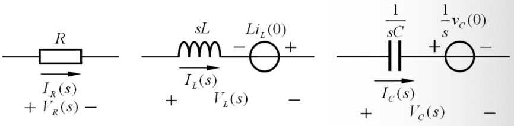  
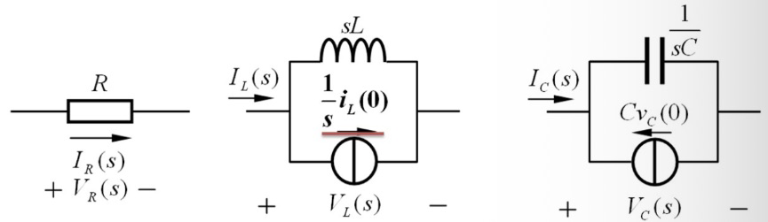  

### 11. 系统函数及其应用

**系统函数 $H(s)$** 定义为零状态下系统响应的拉普拉斯变换与激励的拉普拉斯变换之比：  
$$H(s) = \frac{R_{zs}(s)}{E(s)} = \mathcal{L}[h(t)]$$  
即系统函数为系统单位冲激响应的拉普拉斯变换。  

### 12. 系统函数的零点与极点

$$H(s) = K \frac{\prod_{j=1}^{M} (s - z_j)}{\prod_{i=1}^{N} (s - p_i)}$$  
*   **极点 $p_i$**：为系统微分方程的特征根，决定了系统特征响应分量（自然模）的频率与衰减速度。  
*   **零点 $z_j$**：影响各特征响应分量的幅值与初相位。  

**单阶极点位置与单位冲激响应关系**：  

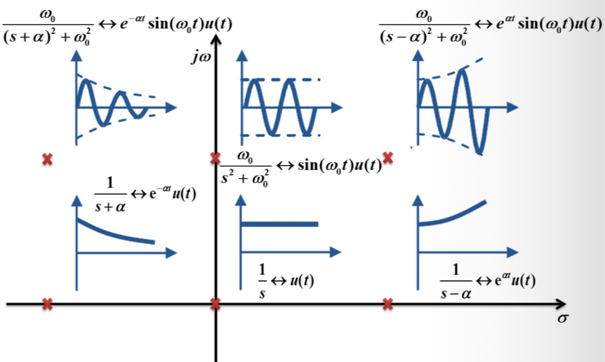  

*   极点在左半平面：时域响应指数衰减，系统是稳定的；  
*   极点在右半平面：时域响应指数增长，系统发散不稳定；  
*   单极点在虚轴（含原点）：时域响应为等幅振荡或常数，系统临界稳定。  

**二阶极点位置与单位冲激响应关系**：  

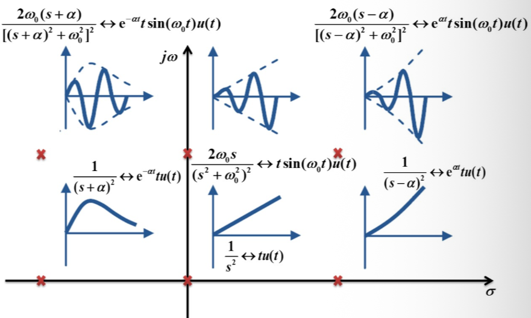  

### 13. 由极点分布判断系统稳定性

**BIBO 稳定（有界输入有界输出稳定）**的定义：  
若激励信号满足 $|e(t)| \le M_e$，产生的零状态响应满足 $|r_{zs}(t)| \le M_r < \infty$。  

**稳定性的充要条件**：  
1.  系统函数 $H(s)$ 的所有极点均位于 s 平面的**左半平面**（即极点的实部均小于 0）；或者说 $H(s)$ 的收敛域包含虚轴。  
2.  系统单位冲激响应 $h(t)$ 满足**绝对可积**：  
    $$\int_{-\infty}^{\infty} |h(t)| dt < \infty$$  

**必要条件**：  
$$\lim_{t \to \infty} h(t) = 0$$  

### 14. 系统频率响应特性

对于一个稳定的因果系统，当输入正弦激励 $e(t) = E_m \sin(\omega_0 t) u(t)$ 时，随着 $t \to \infty$，系统响应的暂态分量衰减为 0，仅保留**稳态响应**：  
$$r_{ss}(t) = E_m |H(j\omega_0)| \sin(\omega_0 t + \varphi(\omega_0))$$  

这里，系统的**频率响应函数 $H(j\omega)$** 恰好是系统函数 $H(s)$ 在虚轴上的取值：  
$$H(j\omega) = \left. H(s) \right|_{s = j\omega} = |H(j\omega)| e^{j\varphi(\omega)}$$  
其中 $|H(j\omega)|$ 为幅频特性，$\varphi(\omega)$ 为相频特性。  

---

## 七、离散周期信号的傅里叶级数

### 1. 离散信号的正交分解

在离散时间区间 $n_0 \le n \le n_0 + N - 1$ 上，如果两个离散信号 $\varphi_{di}(n)$ 与 $\varphi_{dj}(n)$ 满足：  
$$\langle \varphi_{di}(n), \varphi_{dj}(n) \rangle = \sum_{n=n_0}^{n_0+N-1} \varphi_{di}(n) \varphi_{dj}^*(n) = \begin{cases} A_i , & i = j \\ 0 , & i \neq j \end{cases}$$  
则称其在该区间上是**正交**的。  

定义用函数 $c \varphi_{dj}(n)$ 近似表示 $x_d(n)$ 的均方误差为：  
$$\varepsilon = \sum_{n=n_0}^{n_0+N-1} |x_d(n) - c \varphi_{dj}(n)|^2$$  
当误差最小时，有：  
$$c = \frac{\langle x_d(n), \varphi_{dj}(n) \rangle}{\langle \varphi_{dj}(n), \varphi_{dj}(n) \rangle} = \frac{\sum_{n=n_0}^{n_0+N-1} x_d(n) \varphi_{dj}^*(n)}{\sum_{n=n_0}^{n_0+N-1} |\varphi_{dj}(n)|^2}$$  

这与连续信号的内积 $\langle \varphi_i(t), \varphi_j(t) \rangle = \int_{t_0}^{t_0+T} \varphi_i(t) \varphi_j^*(t) dt$ 构成一一对应。  

一个正交函数集如果除该集合内的函数外，不再存在任何与集合内所有函数都正交的非零信号，则称其为**完备正交函数集**。  

任何在周期内绝对可和的离散周期信号 $x_d(n)$ 均可以用完备正交函数集 $\varphi_{dk}(n)$ 展开：  
$$x_d(n) = \sum_{k} c_k \varphi_{dk}(n) \quad , \quad n_0 \le n \le n_0 + N - 1$$  

在完备正交分解的情况下，离散周期信号的能量满足**巴塞瓦尔 (Parseval) 定理**：  
$$\sum_{n=n_0}^{n_0+N-1} |x_d(n)|^2 = \sum_k |c_k|^2 \sum_{n=n_0}^{n_0+N-1} |\varphi_{dk}(n)|^2$$  

### 2. 正交离散复指数函数集

考虑离散复指数序列集 $e^{j k \Omega_1 n}$，其中 $\Omega_1 = \frac{2\pi}{N}$ 为基本角频率，$N$ 为基本周期。  

该集合中的每个元素都是 $n$ 的周期函数。不同于连续复指数信号，==离散复指数信号的频率具有周期重复性==。即当 $k$ 增加 $N$ 的整数倍时，信号是完全相同的：  
$$e^{j(k+N)\Omega_1 n} = e^{j k \Omega_1 n} e^{j N \frac{2\pi}{N} n} = e^{j k \Omega_1 n} e^{j 2\pi n} = e^{j k \Omega_1 n}$$  

因此，离散复指数函数集中只有 $N$ 个互不相同的元素。  

*   **物理现象说明**：  
    以离散余弦序列为例，在时域对连续余弦信号 $\cos(\omega t)$ 进行抽样（抽样间隔 $T_s$），得到离散序列：  
    $$f_{dk}(n) = \cos(k \omega_1 n T_s) = \cos(k \Omega_1 n)$$  
    其中 $\Omega_1 = \omega_1 T_s$。由于：  
    $$\cos(n(2\pi m + \theta)) = \cos(n\theta) \quad , \quad \sin(n(2\pi m + \theta)) = \sin(n\theta) \quad , \quad e^{jn(2\pi m + \theta)} = e^{jn\theta}$$  
    当频率增加 $2\pi$ 的整数倍时，离散序列会完全重合。  

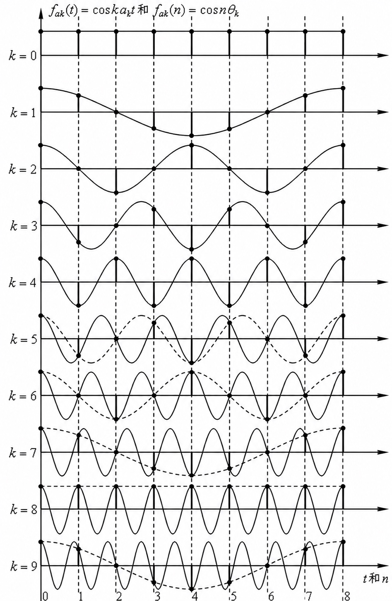  

在基本周期 $N$ 内，离散复指数序列集满足正交性：  
$$\langle e^{j k_1 \Omega_1 n}, e^{j k_2 \Omega_1 n} \rangle = \sum_{n=0}^{N-1} e^{j k_1 \Omega_1 n} e^{-j k_2 \Omega_1 n} = \sum_{n=0}^{N-1} e^{j(k_1 - k_2)\frac{2\pi}{N}n} = \begin{cases} N , & k_1 - k_2 = mN \\ 0 , & k_1 - k_2 \neq mN \end{cases}$$  
（其中 $m$ 为任意整数）  

因此，这 $N$ 个互不相同的复指数序列构成了一个**完备正交离散函数集**。  

### 3. 离散傅里叶级数 (DFS)

给定任意离散周期信号 $x_d(n)$，其周期为 $N$，基本角频率 $\Omega_1 = \frac{2\pi}{N}$。因为正交复指数序列只有 $N$ 个，所以在进行级数展开时，只需累加 $N$ 项：  

*   **正变换 (DFS)**：  
    $$X_d(k) = \operatorname{DFS}[x_d(n)] = \sum_{n=0}^{N-1} x_d(n) e^{-j k \Omega_1 n}$$  
*   **逆变换 (IDFS)**：  
    $$x_d(n) = \operatorname{IDFS}[X_d(k)] = \frac{1}{N} \sum_{k=0}^{N-1} X_d(k) e^{j k \Omega_1 n}$$  

**特点**：  
1.  时域周期 $\iff$ 频域离散。  
2.  时域离散 $\iff$ 频域周期（频域的重复周期也是 $N$）。  
3.  因为频域 $X_d(k)$ 是周期的，虽然它在形式上存在无数个谐波分量，但真正独立的分量只有 $N$ 个，我们只需任取一个周期（如 $k = 0 \sim N-1$）即可完成信号的正交分解。  

*   **奇偶虚实性**：  
    $$X_d(k) = \sum_{n=0}^{N-1} x_d(n) \cos(k\Omega_1 n) - j \sum_{n=0}^{N-1} x_d(n) \sin(k\Omega_1 n)$$  
*   **频谱特性**：  
    $$X_d(k) = |X_d(k)| e^{j\varphi_d(k)}$$  

### 4. 离散与连续周期信号傅里叶级数的关系

*   **回顾**：连续周期信号 $x_a(t)$ 周期为 $T_1$，基频 $\omega_1 = 2\pi/T_1$，其展开及傅里叶变换为：  
    $$x_a(t) = \sum_{k=-\infty}^{\infty} X_{as}(k\omega_1) e^{j k \omega_1 t} \iff X_a(\omega) = 2\pi \sum_{k=-\infty}^{\infty} X_{as}(k\omega_1) \delta(\omega - k\omega_1)$$  
*   离散周期信号 $x_d(n)$ 周期为 $N$，其级数展开为：  
    $$x_d(n) = \frac{1}{N} \sum_{k=0}^{N-1} X_d(k) e^{j k \Omega_1 n}$$  

在实际应用中，计算机只能采集并处理离散的数据 $x_d(n)$，其对应的频谱 $X_d(k)$ 是周期的；而真实的连续信号 $x_a(t)$ 的频谱 $X_a(\omega)$ 则是非周期的。  

我们利用**冲激序列抽样**建立起两者之间的联系。  
设抽样周期为 $T_s$，连续周期信号 $x_a(t)$ 经冲激序列 $s_p(t) = \sum_{n=-\infty}^{\infty} \delta(t - nT_s)$ 抽样后得到：  
$$x_{as}(t) = x_a(t) \cdot s_p(t) = \sum_{n=-\infty}^{\infty} x_a(n T_s) \delta(t - nT_s)$$  

可以证明，时域冲激抽样后的连续信号 $x_{as}(t)$ 在频域上与时域离散信号 $x_d(n)$ 具有完全对应的形式。  
对 $x_{as}(t)$ 计算傅里叶级数系数 $X_{asg}(k\omega_1)$：  
$$X_{asg}(k\omega_1) = \frac{1}{T_1} \int_{0}^{T_1} x_{as}(t) e^{-j k \omega_1 t} dt = \frac{1}{N T_s} \int_{0^-}^{N T_s^-} \left[ \sum_{n=0}^{N-1} x_a(n T_s) \delta(t - n T_s) \right] e^{-j k \omega_1 t} dt$$  
$$= \frac{1}{N T_s} \sum_{n=0}^{N-1} x_d(n) e^{-j k \omega_1 n T_s} = \frac{1}{N T_s} \sum_{n=0}^{N-1} x_d(n) e^{-j k \Omega_1 n}$$  
$$\implies X_{asg}(k\omega_1) = \frac{1}{N T_s} X_d(k)$$  

这表明抽样信号的傅里叶级数系数与离散信号 of DFS 系数之间仅相差一个常数比例。  

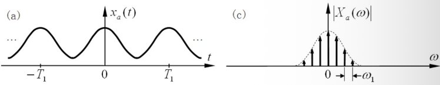  
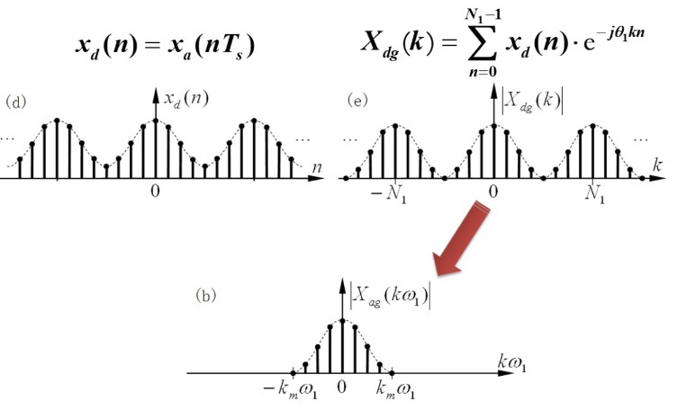  
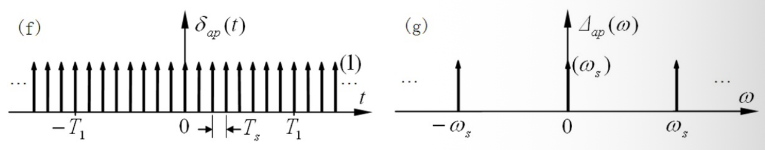  
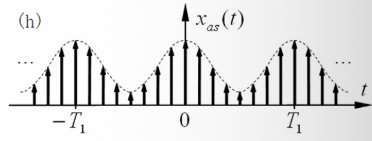  
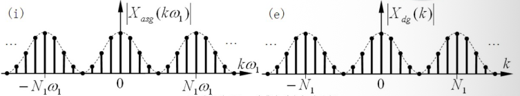  

而在频域中，时域乘以冲激序列等效于频域的积分，相当于将原信号频谱按 $\omega_s = \frac{2\pi}{T_s}$ 进行周期延拓：  
$$X_{as}(\omega) = \frac{1}{T_s} \sum_{m=-\infty}^{\infty} X_a(\omega - m\omega_s)$$  

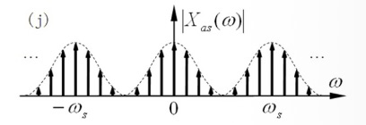  

因此，离散周期信号的傅里叶级数在物理上就是==原连续信号的级数按抽样频率进行周期延拓并乘上比例常数==的结果。  

### 5. 抽样的充分条件

为了使离散频谱无失真地代表连续频谱，必须满足：  
1.  **满足奈奎斯特抽样定理**：$f_s > 2 f_{\text{max}}$，以防止频域周期延拓时产生混叠；  
2.  **整周期抽样**：一个信号周期内必须包含整数个抽样点。即 $N = T_1 / T_s$ 必须为正整数。  

### 6. 参数汇总

*   时域映射：$t = n T_s$  
*   频域映射：$\theta = \omega T_s \implies \Omega_1 = \omega_1 T_s$  
*   周期映射：$N = \frac{T_1}{T_s}$  
*   抽样定理：$f_s > 2 f_{\text{max}}$  

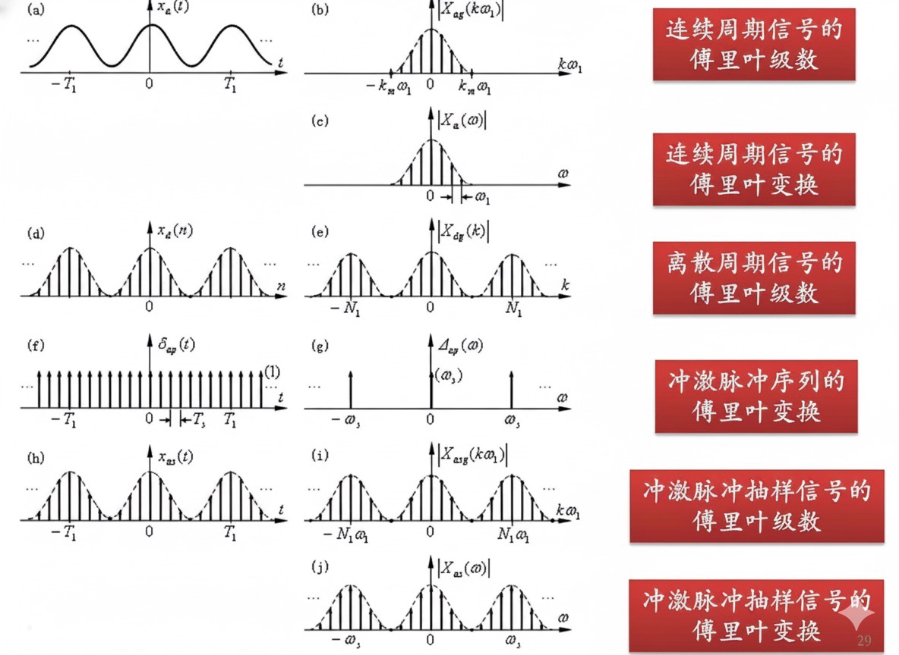  

### 7. 误差分析

如果抽样时不满足抽样的充分条件，用离散周期信号的级数 $X_d(k)$ 来逼近原信号的谱将引入以下误差：  
1.  **泄露误差 (Leakage Error)**：由于非整周期截断（$N T_s \neq m T_1$），导致本来是单频的谱线泄露到旁边的频率上。  
2.  **混叠误差 (Aliasing Error)**：由于抽样频率过低（$f_s < 2 f_{\text{max}}$），导致高频成分重叠到低频处。  

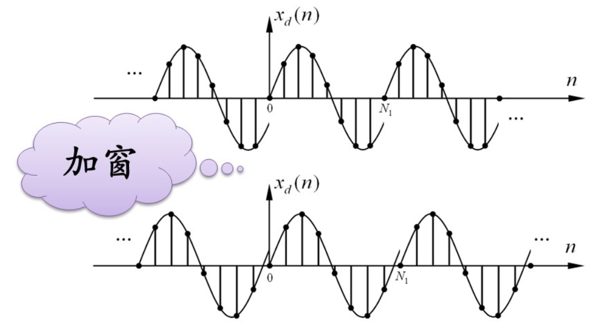  
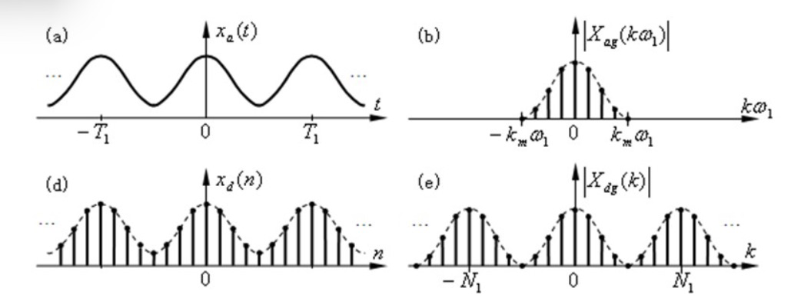  

---

## 八、离散非周期信号的傅里叶变换 (DTFT)

### 1. DTFT 的引出

与连续信号傅里叶变换的引出类似，我们将离散非周期信号 $x_d(n)$ 视作周期 $N \to \infty$ 的离散周期信号的极限情况。  

当 $N \to \infty$ 时，谱线间隔 $\Omega_1 = \frac{2\pi}{N} \to d\theta$，离散谱线趋于连续，离散周期傅里叶级数退化为连续的频谱密度函数。  

由此得到**离散时间傅里叶变换 (DTFT)**：  

*   **正变换 (DTFT)**：  
    $$X(e^{j\theta}) = \operatorname{DTFT}[x_d(n)] = \sum_{n=-\infty}^{\infty} x_d(n) e^{-j\theta n}$$  
*   **逆变换 (IDTFT)**：  
    $$x_d(n) = \operatorname{IDTFT}[X(e^{j\theta})] = \frac{1}{2\pi} \int_{-\pi}^{\pi} X(e^{j\theta}) e^{j\theta n} d\theta$$  

### 2. DTFT 的物理特性

*   **时域离散 $\iff$ 频域周期**：DTFT 的频谱密度函数 $X(e^{j\theta})$ 是关于角频率 $\theta$ 连续的，且是以 $2\pi$ 为周期的周期函数。  
*   正因为频域是周期性的，在进行逆变换（重构时域信号）时，积分区间只需取一个周期（如 $-\pi \sim \pi$）即可。  

### 3. DTFT 的特殊值

**1) 零频值 (直流分量)**  
$$X(e^{j0}) = \sum_{n=-\infty}^{\infty} x_d(n) \quad (\text{时域样值累加和})$$  

**2) 全频积分与 $x_d(0)$**  
$$\frac{1}{2\pi} \int_{-\pi}^{\pi} X(e^{j\theta}) d\theta = x_d(0)$$  

### 4. 例题

*   **例**：求离散非周期矩形序列的 DTFT。  
    设 $x_d(n) = \begin{cases} 1 , & |n| \le M \\ 0 , & |n| > M \end{cases}$。  
    
    其 DTFT 为：  
    $$X(e^{j\theta}) = \sum_{n=-M}^{M} 1 \cdot e^{-j\theta n} = 1 + 2\sum_{n=1}^{M} \cos(n\theta) = \frac{\sin\left((M + 1/2)\theta\right)}{\sin(\theta/2)}$$  
    
    该谱是连续的，以 $2\pi$ 为周期。  

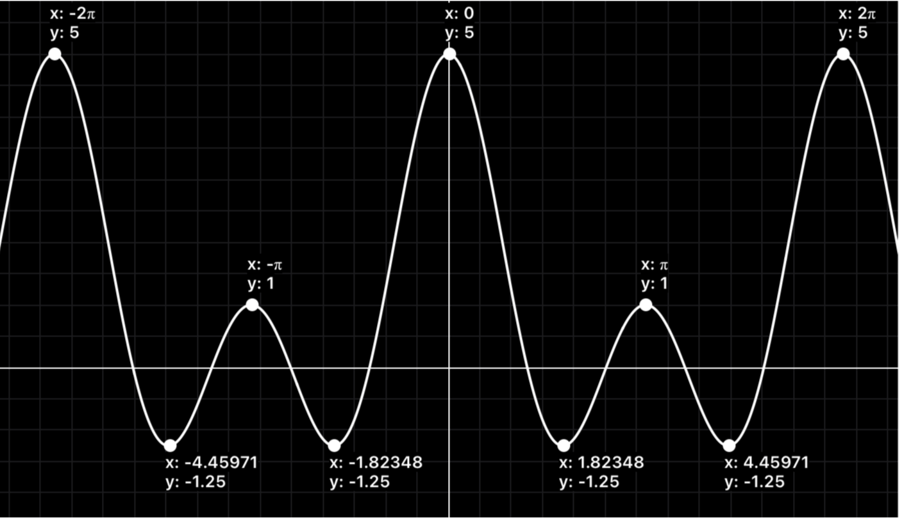  
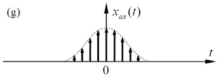  
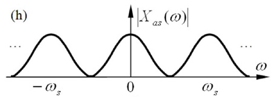  
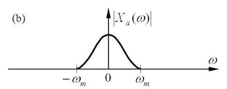  
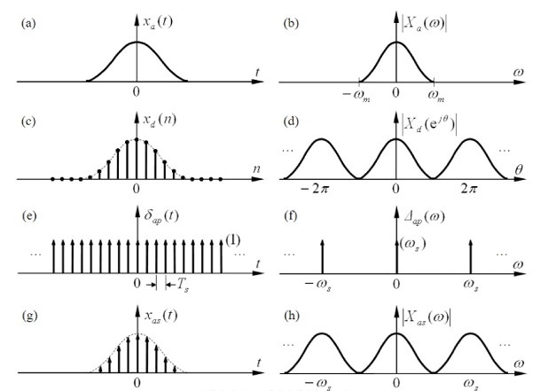  

### 5. DFS 与 DTFT 的关系

若 $x_d(n)$ 是长度为 $N$ 的有限长离散序列（仅在 $0 \le n \le N-1$ 内有值）。  
*   对其进行 **DTFT**，得到连续周期谱 $X(e^{j\theta})$；  
*   若将其以 $N$ 为周期进行周期延拓得到 $x_p(n) = \sum_{i=-\infty}^{\infty} x_d(n - iN)$，再对其进行 **DFS**，得到离散周期谱 $X_p(k)$。  

比较两者的公式：  
$$X(e^{j\theta}) = \sum_{n=0}^{N-1} x_d(n) e^{-j\theta n}$$  
$$X_p(k) = \sum_{n=0}^{N-1} x_p(n) e^{-j k \frac{2\pi}{N} n}$$  
可以发现，DFS 的系数 $X_p(k)$ 恰好是在一个周期内对连续的 DTFT 谱 $X(e^{j\theta})$ 进行等间隔抽样的结果：  
$$X_k = X(e^{j\theta})\Big|_{\theta = k \frac{2\pi}{N}}$$  

---

## 九、Z 变换

### 1. Z 变换的引出

离散时间傅里叶变换 (DTFT) 要求信号满足绝对可值等条件。对于随时间指数增长的信号（如 $a^n u_d(n)$，其中 $|a| > 1$），DTFT 将发散而无法直接应用。  

与拉普拉斯变换思路类似，我们对离散信号 $x_d(n)$ 乘以一个实指数衰减因子 $r^{-n}$（其中 $r > 0$），使其强制满足绝对可和条件：  
$$x_d(n) r^{-n}$$  

在收敛区域内，对 $x_d(n) r^{-n}$ 求 DTFT：  
$$X_{\text{temp}}(e^{j\theta}) = \sum_{n=-\infty}^{\infty} x_d(n) r^{-n} e^{-j\theta n} = \sum_{n=-\infty}^{\infty} x_d(n) (r e^{j\theta})^{-n}$$  

定义复变量 $z = r e^{j\theta}$（复变量 $z$ 的取值范围称为 **z 平面**），得到 **Z 变换**（象函数）：  
$$X(z) = \mathcal{Z}[x_d(n)] = \sum_{n=-\infty}^{\infty} x_d(n) z^{-n}$$  

其对应的**逆 Z 变换**（反变换）为：  
由于 $z = r e^{j\theta} \implies dz = j r e^{j\theta} d\theta = j z d\theta \implies d\theta = \frac{dz}{jz}$，代入反变换公式可得：  
$$x_d(n) = \frac{1}{2\pi j} \oint_{c} X(z) z^{n-1} dz$$  
其中 $c$ 为在收敛域内围绕原点的闭合逆时针积分曲线。  

### 2. Z 变换的收敛域 (ROC)

Z 变换是关于 $z^{-1}$ 的幂级数。级数的收敛性取决于 $z$ 的模值 $|z| = r$。  

1.  **右边序列**（即在 $n \ge n_1$ 时信号有值）：  
    为了保证级数在 $n \to \infty$ 时收敛，需要模值 $|z|$ 足够大。  
    其收敛域为圆外区域：  
    $$|z| > r_1$$  
    其中 $r_1$ 为最外侧极点的半径。  
2.  **左边序列**（即在 $n \le n_2$ 时信号有值）：  
    为了保证级数在 $n \to -\infty$ 时收敛，需要模值 $|z|$ 足够小。  
    其收敛域为圆内区域：  
    $$|z| < r_2$$  
    其中 $r_2$ 为最内侧极点的半径。  
3.  **双边序列**：  
    收敛域为两者的交集，表现为 s 平面上的一个圆环：  
    $$r_1 < |z| < r_2$$  
    如果 $r_1 > r_2$，则收敛域不存在，说明该信号的 Z 变换不存在。  
4.  **有限长序列**：  
    仅在有限个离散点上有值，其 Z 变换是有限项求和，除了 $z = 0$ 和 $z = \infty$ 可能会发散外，其余区域均收敛。其收敛域为整个 z 平面（可能排除 0 或 $\infty$）。  

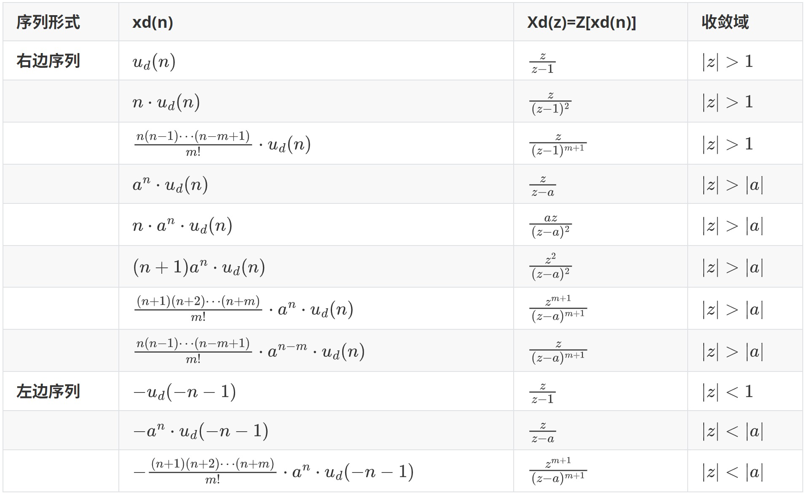  
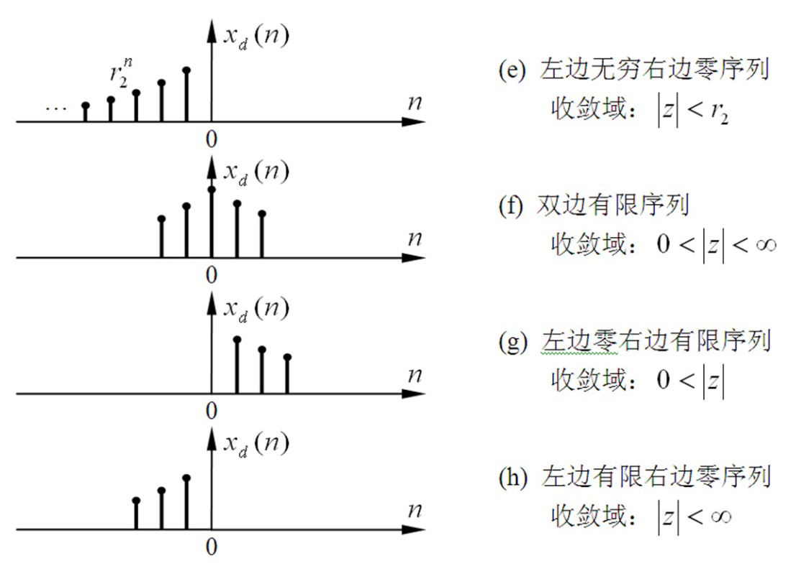  
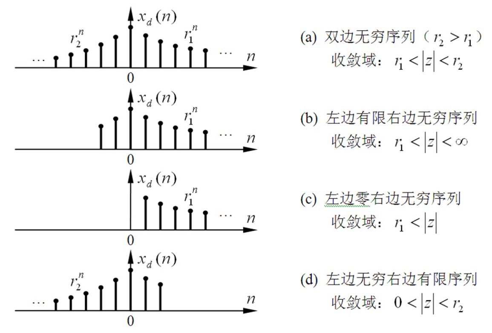  

### 3. Z 变换的零极点

有理分式形式的 Z 变换可以写作：  
$$X(z) = \frac{N(z)}{D(z)} = K \frac{\prod_{j=1}^{M} (z - z_j)}{\prod_{i=1}^{N} (z - p_i)}$$  
其中：  
*   $z = z_j$ 为 $X(z)$ 的**零点**；  
*   $z = p_i$ 为 $X(z)$ 的**极点**。  

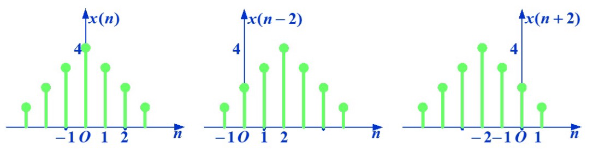  

### 4. 常见信号的 Z 变换

**1) 单位样值序列 $\delta_d(n)$**  
$$\mathcal{Z}[\delta_d(n)] = 1 \quad (\text{全平面收敛})$$  
对于有时延的样值序列：  
$$\mathcal{Z}[\delta_d(n - m)] = z^{-m} \quad (\text{除 } 0 \text{ 或 } \infty \text{ 外的整个平面})$$  

**2) 单位阶跃序列 $u_d(n)$**  
$$\mathcal{Z}[u_d(n)] = \sum_{n=0}^{\infty} z^{-n} = \frac{1}{1 - z^{-1}} = \frac{z}{z - 1} \quad (|z| > 1)$$  

**3) 指数序列**  
*   **右边指数序列 $a^n u_d(n)$**：  
    $$\mathcal{Z}[a^n u_d(n)] = \sum_{n=0}^{\infty} a^n z^{-n} = \frac{1}{1 - a z^{-1}} = \frac{z}{z - a} \quad (|z| > |a|)$$  
*   **左边指数序列 $-a^n u_d(-n-1)$**：  
    $$\mathcal{Z}[-a^n u_d(-n-1)] = -\sum_{n=-\infty}^{-1} a^n z^{-n} = -\sum_{m=1}^{\infty} a^{-m} z^m = \frac{1}{1 - a z^{-1}} = \frac{z}{z - a} \quad (|z| < |a|)$$  
> [!IMPORTANT]  
> **注意**：$a^n u_d(n)$ 与 $-a^n u_d(-n-1)$ 的 Z 变换代数表达式完全一致，但它们的**收敛域 (ROC) 不同**。因此，必须同时指出代数式和收敛域才能唯一确定原序列。  

### 5. Z 变换的性质

#### 5.1 线性性质

$$\mathcal{Z}[a x_1(n) + b x_2(n)] = a X_1(z) + b X_2(z) \quad (\text{收敛域至少为两者交集})$$  

*   **例**：求 $\delta_d(n) = u_d(n) - u_d(n-1)$ 的 Z 变换。  
    $$\mathcal{Z}[\delta_d(n)] = \frac{z}{z-1} - z^{-1} \frac{z}{z-1} = \frac{z}{z-1}(1 - z^{-1}) = 1$$  

#### 5.2 时移性质

*   **双边 Z 变换**：  
    $$\mathcal{Z}[x(n - k)] = z^{-k} X(z)$$  
*   **单边 Z 变换**（时移会导致信号边界溢出，需考虑初值）：  
    *   **左移（超前）**：  
        $$\mathcal{Z}[x(n + m)] = z^m \left[ X(z) - \sum_{k=0}^{m-1} x(k) z^{-k} \right]$$  
        例如：  
        $$\mathcal{Z}[x(n+1)] = z X(z) - z x(0)$$  
        $$\mathcal{Z}[x(n+2)] = z^2 X(z) - z^2 x(0) - z x(1)$$  
    *   **右移（延迟）**：  
        $$\mathcal{Z}[x(n - m)] = z^{-m} \left[ X(z) + \sum_{k=-m}^{-1} x(k) z^{-k} \right]$$  
        例如：  
        $$\mathcal{Z}[x(n-1)] = z^{-1} X(z) + x(-1)$$  
        $$\mathcal{Z}[x(n-2)] = z^{-2} X(z) + z^{-1} x(-1) + x(-2)$$  

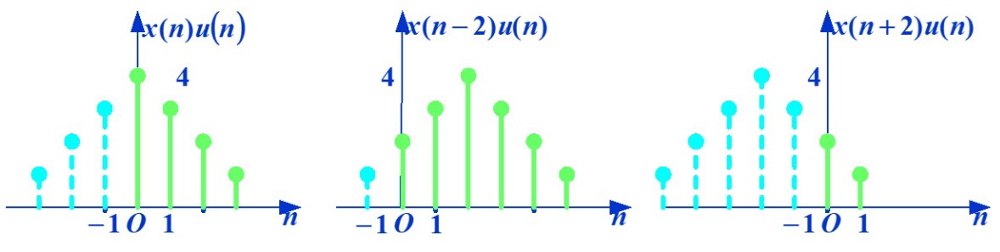  

#### 5.3 线性加权 (z 域求导)

$$\mathcal{Z}[n x(n)] = -z \frac{dX(z)}{dz}$$  

#### 5.4 指数加权 (z 域尺度变换)

$$\mathcal{Z}[a^n x(n)] = X\left( \frac{z}{a} \right)$$  

#### 5.5 时域卷积定理

时域卷积，频域相乘。  
$$\mathcal{Z}[x_1(n) * x_2(n)] = X_1(z) \cdot X_2(z)$$  

#### 5.6 时域反转

$$\mathcal{Z}[x(-n)] = X(z^{-1})$$  

#### 5.7 初值定理

若 $x(n)$ 为因果序列，则：  
$$x(0) = \lim_{z \to \infty} X(z)$$  

#### 5.8 终值定理

若 $(z-1) X(z)$ 的所有极点都在单位圆内（包括单位圆上，但至多在 $z=1$ 处有单极点），则：  
$$\lim_{n \to \infty} x(n) = \lim_{z \to 1} (z-1) X(z)$$  

### 6. 逆 Z 变换的部分分式展开法

如果 $X(z)$ 是有理真分式。由于常用公式形式多为 $\frac{z}{z-a}$，因此我们通常对 $\frac{X(z)}{z}$ 进行部分分式展开：  

#### 6.1 极点均为单根

将 $\frac{X(z)}{z}$ 展开为：  
$$\frac{X(z)}{z} = \sum_{k=1}^{n} \frac{A_k}{z - p_k} \implies X(z) = \sum_{k=1}^{n} A_k \frac{z}{z - p_k}$$  
其中系数为：  
$$A_k = \left. (z - p_k) \frac{X(z)}{z} \right|_{z = p_k}$$  

然后结合收敛域 (ROC)，查反变换表确定是右边序列（$|z| > |p_k| \implies A_k p_k^n u_d(n)$）还是左边序列（$|z| < |p_k| \implies -A_k p_k^n u_d(-n-1)$）。  

*   **例**：已知 $X(z) = \frac{z^2}{(z-1)(z-2)}$，收敛域为 $|z| > 2$，求 $x(n)$。  
    部分分式展开：  
    $$\frac{X(z)}{z} = \frac{z}{(z-1)(z-2)} = \frac{-1}{z-1} + \frac{2}{z-2}$$  
    $$X(z) = -\frac{z}{z-1} + \frac{2z}{z-2}$$  
    由于收敛域 $|z| > 2$ 是在外侧，表示各项均为右边序列。查表可得：  
    $$x(n) = \left[ -1^n + 2 \cdot 2^n \right] u_d(n) = (2^{n+1} - 1) u_d(n)$$  

#### 6.2 极点含有重根

对 $\frac{X(z)}{z}$ 展开，重根极点 $p_1$ 的系数求解公式与拉普拉斯展开类似，逆变换查表项为：  
$$\mathcal{Z}^{-1}\left[ \frac{A z}{(z-p)^k} \right] = \text{查表形式}$$  

### 7. 逆 Z 变换的长除法 (幂级数展开法)

长除法是将有理分式进行多项式除法直接展开为关于 $z$ 的幂级数形式，各幂次项前对应的系数即为时域样值。  

*   **右边序列**（收敛域为圆外）：应将分子、分母均按 $z$ 的**降幂排列**再相除，得到关于 $z^{-1}$ 的多项式。  
*   **左边序列**（收敛域为圆内）：应将分子、分母均按 $z$ 的**升幂排列**再相除，得到关于 $z$ 的多项式。  

*   **例**：已知 $X(z) = \frac{z}{z-1}$，分别在收敛域为 $|z| > 1$ 和 $|z| < 1$ 时求其逆变换 $x(n)$。  
    *   **当 $|z| > 1$ 时**（降幂排列）：  
        $$z \div (z-1) = 1 + z^{-1} + z^{-2} + \dots \implies x(n) = u_d(n)$$  
    *   **当 $|z| < 1$ 时**（升幂排列，即 $z \div (-1+z)$）：  
        $$z \div (-1+z) = -z - z^2 - z^3 - \dots \implies x(n) = -u_d(-n-1)$$  

### 8. Z 变换与 DTFT、Laplace 变换的关系

**1) 与 DTFT 的关系**  
若 Z 变换的收敛域包含单位圆 $|z| = 1$，则 Z 变换在单位圆上的取值（即代入 $z = e^{j\theta}$）恰好就是离散时间傅里叶变换：  
$$\operatorname{DTFT}[x(n)] = \left. X(z) \right|_{z = e^{j\theta}}$$  

**2) 与 Laplace 变换的关系**  
对连续信号的冲激抽样信号 $x^*(t) = \sum_{k=-\infty}^{\infty} x(k T_s) \delta(t - k T_s)$ 求解拉普拉斯变换：  
$$X^*(s) = \sum_{k=-\infty}^{\infty} x(k T_s) e^{-s k T_s}$$  
令变量关系为 $z = e^{s T_s}$，即为标准 Z 变换的代数式。  

**3) S 平面到 Z 平面的映射关系**  
由 $z = e^{s T_s} = e^{(\sigma + j\omega)T_s} = e^{\sigma T_s} e^{j\omega T_s} = r e^{j\theta}$：  
*   **s 平面左半平面** ($\sigma < 0$) $\implies$ 映射到 **z 平面单位圆内** ($|z| < 1$)；  
*   **s 平面虚轴** ($\sigma = 0$) $\implies$ 映射到 **z 平面单位圆上** ($|z| = 1$)；  
*   **s 平面右半平面** ($\sigma > 0$) $\implies$ 映射到 **z 平面单位圆外** ($|z| > 1$)。  
*   决定映射角为 $\theta = \omega T_s$。由于其周期性，虚轴上每隔 $\omega_s = \frac{2\pi}{T_s}$ 的区间都会重复映射到单位圆上一整圈。  

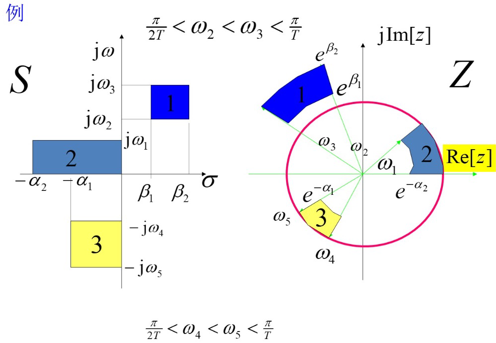  

### 9. 由 Laplace 变换求 Z 变换

已知连续信号的拉普拉斯变换为 $X_a(s)$：  
1.  对 $X_a(s)$ 进行部分分式展开：$X_a(s) = \sum_{i=1}^{M} \frac{A_i}{s - p_i}$；  
2.  求时域原信号：$x_a(t) = \sum_{i=1}^{M} A_i e^{p_i t} u(t)$；  
3.  对时域进行抽样 $t = n T_s$：$x_d(n) = \sum_{i=1}^{M} A_i e^{p_i T_s n} u_d(n)$；  
4.  取 Z 变换：  
    $$X(z) = \sum_{i=1}^{M} \frac{A_i z}{z - e^{p_i T_s}}$$  

### 10. Z 变换求解线性常系数差分方程

对于后向形式的差分方程：  
$$\sum_{k=0}^{N} a_k y(n-k) = \sum_{m=0}^{M} b_m e(n-m)$$  

两边取单边 Z 变换，并利用单边移位性质，可得：  
$$D(z) Y(z) - B(z) = N(z) E(z)$$  
$$Y(z) = \frac{N(z)}{D(z)} E(z) + \frac{B(z)}{D(z)} = Y_{zs}(z) + Y_{zi}(z)$$  
*   $Y_{zs}(z) = H(z) E(z)$ 为零状态响应；  
*   $Y_{zi}(z) = \frac{B(z)}{D(z)}$ 为零输入响应。  

*   **例**：已知差分方程为 $y(n) + 3y(n-1) + 2y(n-2) = e(n) + e(n-1)$。  
    已知初始状态为 $y(-1) = -1/2$，$y(-2) = 1/4$。输入激励为 $e(n) = u_d(n)$。  
    两边取单边 Z 变换：  
    $$Y(z) + 3[z^{-1}Y(z) + y(-1)] + 2[z^{-2}Y(z) + z^{-1}y(-1) + y(-2)] = E(z) + z^{-1}E(z)$$  
    代入初始值：  
    $$Y(z) (1 + 3z^{-1} + 2z^{-2}) - 1.5 - z^{-1} + 0.5 = E(z)(1 + z^{-1})$$  
    $$Y(z) (1 + 3z^{-1} + 2z^{-2}) - (1 + z^{-1}) = E(z)(1 + z^{-1})$$  
    由于 $e(n) = u_d(n) \iff E(z) = \frac{1}{1-z^{-1}}$。  
    
    1.  **零状态响应 $Y_{zs}(z)$**（令初始项为 0）：  
        $$Y_{zs}(z) (1 + 3z^{-1} + 2z^{-2}) = E(z)(1 + z^{-1})$$  
        $$Y_{zs}(z) = \frac{1+z^{-1}}{(1-z^{-1})(1+z^{-1})(1+2z^{-1})} = \frac{1}{(1-z^{-1})(1+2z^{-1})} = \frac{z^2}{(z-1)(z+2)}$$  
        部分分式展开后求逆变换得：  
        $$y_{zs}(n) = \left[ \frac{1}{3} \cdot 1^n + \frac{2}{3} \cdot (-2)^n \right] u_d(n)$$  
        
    2.  **零输入响应 $Y_{zi}(z)$**（令右侧输入项为 0）：  
        $$Y_{zi}(z) (1 + 3z^{-1} + 2z^{-2}) = 1 + z^{-1}$$  
        $$Y_{zi}(z) = \frac{1+z^{-1}}{(1+z^{-1})(1+2z^{-1})} = \frac{1}{1+2z^{-1}} = \frac{z}{z+2}$$  
        逆变换得：  
        $$y_{zi}(n) = (-2)^n u_d(n)$$  
        
    3.  **全响应 $y(n)$**：  
        $$y(n) = y_{zs}(n) + y_{zi}(n) = \left[ \frac{1}{3} + \frac{5}{3}(-2)^n \right] u_d(n)$$  

### 11. 系统函数

对于离散系统，零状态下系统响应的 Z 变换与激励的 Z 变换之比定义为**系统函数**：  
$$H(z) = \frac{R_{zs}(z)}{E(z)} = \mathcal{Z}[h(n)]$$  
即系统函数为单位样值响应 $h(n)$ 的 Z 变换。  

*   **离散系统与连续系统的对应关系**：  
    为离散模拟连续系统，通常取 $h_d(n) = T_s h_a(nT_s)$，这使得离散系统函数比连续系统函数多乘了一个 $T_s$ 因子。  

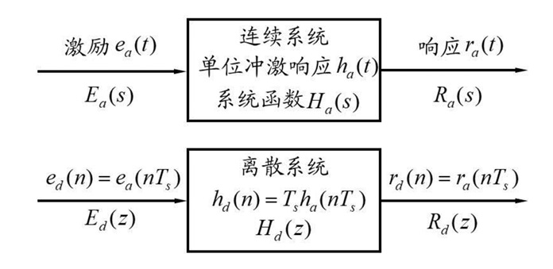  

### 12. 系统函数的零点与极点

$$H(z) = K \frac{\prod_{j=1}^{M} (z - z_j)}{\prod_{i=1}^{N} (z - p_i)}$$  
*   **极点 $p_i$**：决定自然响应的频率和衰减规律。  
*   **零点 $z_j$**：影响各响应分量的幅值和初相。  

**单阶极点与单位样值响应关系**：  

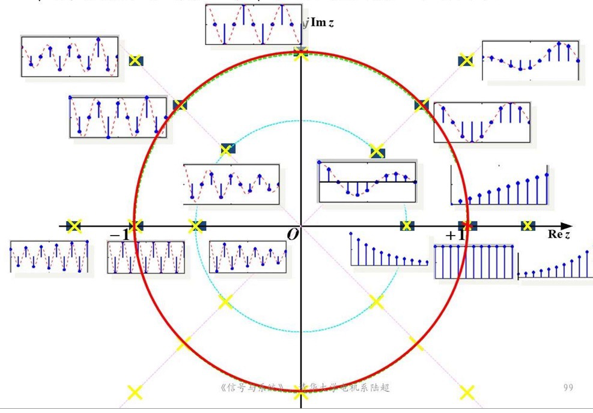  

*   极点在单位圆内 ($|p_i| < 1$) $\implies$ 时域自然响应指数衰减，系统是稳定的；  
*   极点在单位圆外 ($|p_i| > 1$) $\implies$ 时域自然响应指数增长，系统发散不稳定；  
*   极点在单位圆上 ($|p_i| = 1$) $\implies$ 临界稳定（等幅振荡或常数）。  

### 13. 系统稳定性判断

**BIBO 稳定充要条件**：  
1.  系统函数 $H(z)$ 的所有极点都必须位于**单位圆内**（即 $|p_i| < 1$）；或者说其收敛域包含单位圆。  
2.  系统单位样值响应绝对可和：  
    $$\sum_{n=-\infty}^{\infty} |h(n)| < \infty$$  

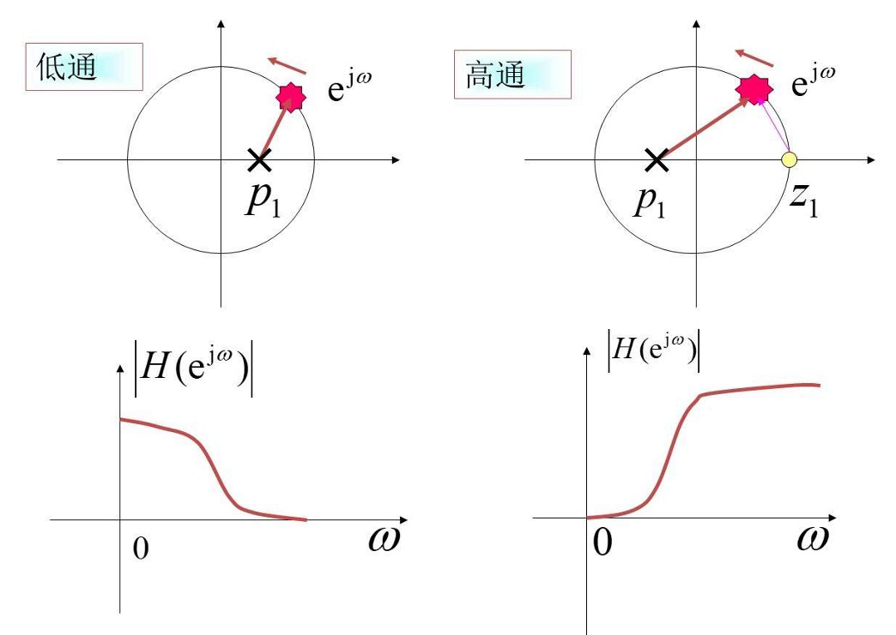  
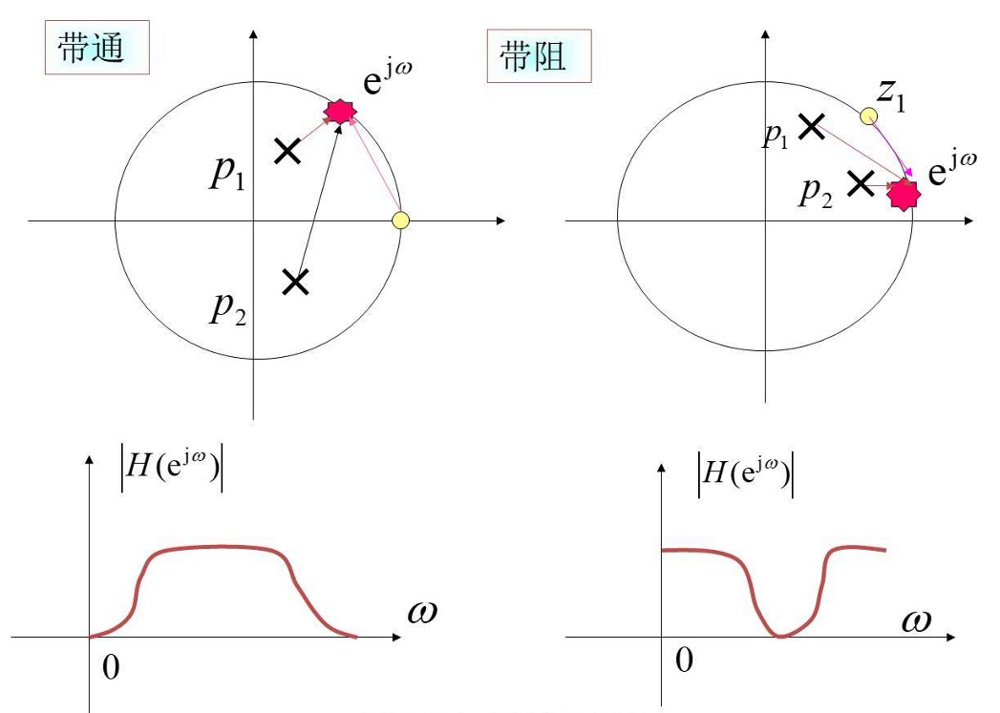  

### 14. 频域系统响应特性与矢量分析法

当系统稳定且包含单位圆时，令 $z = e^{j\theta}$ 得到频率响应函数：  
$$H(e^{j\theta}) = \left. H(z) \right|_{z = e^{j\theta}} = |H(e^{j\theta})| e^{j\varphi(\theta)}$$  

幅频特性可以几何表示为：  
$$|H(e^{j\theta})| = K \frac{\prod_{j=1}^{M} |V_{zj}|}{\prod_{i=1}^{N} |V_{pi}|}$$  
其中 $V_{zj}$ 和 $V_{pi}$ 分别是零点和极点指向单位圆上该点 $e^{j\theta}$ 的矢量。  

*   **物理特性规律**：==极点造峰，零点造谷==！  
    随着 $z = e^{j\theta}$ 在单位圆上逆时针移动，靠近零点时分母较小，产生波谷；靠近极点时，分母较小，产生波峰。由此可以直观地通过零极点分布设计出低通、高通、带通、带阻等各类滤波器。  

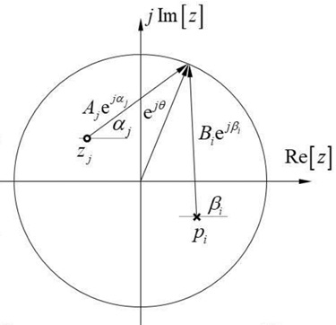  

---

## 十、离散傅里叶变换 (DFT) 与快速傅里叶变换 (FFT)

### 1. 离散傅里叶变换 (DFT) 的概念

计算机中表示并处理信号有两个基本要求：无论是在时域还是频域，信号都必须是**离散**且**有限长**的。  

离散周期信号的级数展开 (DFS) 能够满足离散的要求，但它是无限长的周期信号。我们将有限长序列（长度为 $N$）作为周期信号的单周期（主值区间）来处理，从而引出**离散傅里叶变换 (DFT)**：  

*   **正变换 (DFT)**：  
    $$X_d(k) = \operatorname{DFT}[x_d(n)] = \sum_{n=0}^{N-1} x_d(n) W_N^{kn} \quad , \quad 0 \le k \le N-1$$  
*   **逆变换 (IDFT)**：  
    $$x_d(n) = \operatorname{IDFT}[X_d(k)] = \frac{1}{N} \sum_{k=0}^{N-1} X_d(k) W_N^{-kn} \quad , \quad 0 \le n \le N-1$$  
其中 $W_N = e^{-j\frac{2\pi}{N}}$ 称为旋转因子。  

### 2. DFT 的物理本质

DFT 算法在物理上也就是离散傅里叶级数 (DFS)。我们可以从两个视角来看待它：  
1.  **时域周期信号视角**：如果认为 $x_d(n)$ 是对一个周期信号 $x_p(n)$ 的抽样，则有：  
    $$\operatorname{DFT}[x_d(n)] = \operatorname{DFS}[x_p(n)] \quad (0 \le k \le N-1)$$  
    这说明 DFT 的值是 DFS 在一个周期内（$0 \sim N-1$）的谱线值。  
2.  **时域非周期信号视角**：如果认为 $x_d(n)$ 是对一个非周期信号的抽样，则有：  
    $$\operatorname{DFT}[x_d(n)] = \operatorname{DTFT}[x_d(n)]\Big|_{\theta = k\frac{2\pi}{N}} \quad (0 \le k \le N-1)$$  
    这说明 DFT 的值是在频域上对连续的 DTFT 谱进行等间隔抽样，并取一个周期内的值。  

### 3. DFT 的性质

#### 3.1 线性性质

$$\operatorname{DFT}[a x_{d1}(n) + b x_{d2}(n)] = a X_{d1}(k) + b X_{d2}(k)$$  

#### 3.2 圆周时移性质

在圆周时移下，序列进行首尾衔接的循环移位，保持序列长度不变。  
*   **运算步骤**：  
    1.  周期延拓：将 $x_d(n)$ 延拓为周期序列 $x_p(n) = x_d((n))_N$；  
    2.  线性时移：在时域进行平移得到 $x_p(n \pm m) = x_d((n \pm m))_N$；  
    3.  截取主值：用窗口函数 $R_N(n)$ 截取 $0 \le n \le N-1$ 区间，表示为 $x_d((n \pm m))_N R_N(n)$。  
*   **时移特性**：  
    $$\operatorname{DFT}[x_d((n - m))_N R_N(n)] = W_N^{km} X_d(k)$$  

#### 3.3 圆周频移性质

$$\operatorname{IDFT}[X_d((k - l))_N R_N(k)] = W_N^{-ln} x_d(n)$$  

#### 3.4 时域圆周卷积性质

两个等长序列 $x_1(n)$ 与 $x_2(n)$（长度为 $N$）的**圆周卷积**定义为：  
$$y(n) = x_1(n) \text{ \textcircled{N} } x_2(n) = \sum_{m=0}^{N-1} x_1(m) x_2((n - m))_N R_N(n) \quad , \quad 0 \le n \le N-1$$  
其计算过程包括：反褶、周期延拓、圆周平移、相乘求和。  

*   **例**：已知 $x_1(n) = \{1, 2, 3, 4\}$，$x_2(n) = \{1, 2, 2, 1\}$，求它们的 4 点圆周卷积。  
    *   $n=0$：$x_2((-m))_4 = \{1, 1, 2, 2\}$。内积：$1\cdot 1 + 2\cdot 1 + 3\cdot 2 + 4\cdot 2 = 17$  
    *   $n=1$：$x_2((1-m))_4 = \{2, 1, 1, 2\}$。内积：$1\cdot 2 + 2\cdot 1 + 3\cdot 1 + 4\cdot 2 = 15$  
    *   $n=2$：$x_2((2-m))_4 = \{2, 2, 1, 1\}$。内积：$1\cdot 2 + 2\cdot 2 + 3\cdot 1 + 4\cdot 1 = 13$  
    *   $n=3$：$x_2((3-m))_4 = \{1, 2, 2, 1\}$。内积：$1\cdot 1 + 2\cdot 2 + 3\cdot 2 + 4\cdot 1 = 15$  
    故圆周卷积结果为 $y(n) = \{17, 15, 13, 15\}$。  

*   **圆周卷积定理**：  
    时域圆周卷积等效于频域乘积。  
    $$\operatorname{DFT}[x_1(n) \text{ \textcircled{N} } x_2(n)] = X_1(k) \cdot X_2(k)$$  
    这意味着我们可以通过快速傅里叶变换 (FFT) 和逆变换来高效计算圆周卷积：  
    $$x_1(n) \text{ \textcircled{N} } x_2(n) = \operatorname{IDFT}\left[ X_1(k) \cdot X_2(k) \right]$$  

#### 3.5 DFT 的奇偶对称性

对于实序列 $x_d(n)$，其 DFT $X_d(k)$ 的实部和虚部具有对称性：  
$$X_d(k) = X_{dr}(k) + j X_{di}(k)$$  
$$X_{dr}(k) = \sum_{n=0}^{N-1} x_d(n) \cos\left( \frac{2\pi}{N}kn \right) \quad (\text{实部，关于 } N/2 \text{ 偶对称})$$  
$$X_{di}(k) = -\sum_{n=0}^{N-1} x_d(n) \sin\left( \frac{2\pi}{N}kn \right) \quad (\text{虚部，关于 } N/2 \text{ 奇对称})$$  
由此可得共轭对称性：  
$$X_d(N - k) = X_d^*(k) \implies |X_d(N-k)| = |X_d(k)| \quad , \quad \varphi(N-k) = -\varphi(k)$$  
*   若 $x_d(n)$ 为**实偶**序列 $\implies$ $X_d(k)$ 为**实偶**；  
*   若 $x_d(n)$ 为**实奇**序列 $\implies$ $X_d(k)$ 为**虚奇**。  

#### 3.6 能量守恒 (Parseval 定理)

$$\sum_{n=0}^{N-1} |x_d(n)|^2 = \frac{1}{N} \sum_{k=0}^{N-1} |X_d(k)|^2$$  

### 4. 快速傅里叶变换 (FFT)

DFT 的计算量很大（需要 $N^2$ 次复数乘法）。FFT 利用旋转因子 $W_N^{kn}$ 的**周期性**与**对称性**，消除了重复计算。  
*   **$W_N$ 的基本特性**：  
    1.  周期性：$W_N^{k(n+N)} = W_N^{kn}$，以及 $W_N^{(k+N)n} = W_N^{kn}$  
    2.  对称性：$W_N^{kn + N/2} = -W_N^{kn}$  

以时域抽取基-2 FFT (Cooley-Tukey 算法) 为例，设序列长度为 $N = 2^M$，我们将 $x_d(n)$ 按索引的奇偶性分为两组：  
$$X_d(k) = \sum_{n=0}^{N-1} x_d(n) W_N^{kn} = \sum_{r=0}^{N/2-1} x(2r) W_N^{2rk} + \sum_{r=0}^{N/2-1} x(2r+1) W_N^{(2r+1)k}$$  
由于 $W_N^{2rk} = W_{N/2}^{rk}$，上式化简为：  
$$X_d(k) = X_e(k) + W_N^k X_o(k) \quad \left( 0 \le k \le \frac{N}{2} - 1 \right)$$  
$$X_d\left(k + \frac{N}{2}\right) = X_e(k) - W_N^k X_o(k) \quad \left( 0 \le k \le \frac{N}{2} - 1 \right)$$  
其中 $X_e(k)$ 和 $X_o(k)$ 分别为偶数点和奇数点序列的 $N/2$ 点 DFT。  

这构成了 FFT 运算的基本**蝴蝶单元**。通过多级蝴蝶分裂，可以将复杂度从 $\mathcal{O}(N^2)$ 降低到 $\mathcal{O}(N \log_2 N)$。  

*   **码位倒置 (Bit Reversal)**：  
    为了保证就地运算，第一级输入数据必须按照二进制码位翻转的顺序重新排列（如三位二进制中：001 -> 100，即 $x(1)$ 换到 $x(4)$ 的位置）。  

### 5. 信号的频谱分析

在用 DFT/FFT 对连续信号进行频谱分析时，有以下关键参数：  
*   **抽样频率 $f_s$**：单位时间内抽样的次数。  
    $$f_s = \frac{1}{T_s} \ge 2 f_{\text{max}}$$  
    抽样率决定了能够分析的最大频率范围。  
*   **频率分辨率 $f_1$**（谱线间隔）：  
    $$f_1 = \Delta f = \frac{f_s}{N} = \frac{1}{N T_s} = \frac{1}{T_0}$$  
    其中 $T_0 = N T_s$ 为总观测时间（记录长度）。这说明==提高频率分辨率的唯一途径是增加观测时间 $T_0$==。  

*   **例**：利用 FFT 分析一个连续非周期信号的频谱。要求频率分辨率 $f_1 = 100\text{ Hz}$，信号中最高频率分量 $f_{\text{max}} = 3\text{ kHz}$。确定抽样间隔和抽样长度（点数 $N$）。  
    *   **确定抽样率**：  
        根据抽样定理，抽样频率必须满足 $f_s \ge 2 f_{\text{max}} = 6\text{ kHz}$。  
        $$T_s \le \frac{1}{6000}\text{ s} \approx 166.7\ \mu\text{s}$$  
    *   **确定记录时间**：  
        由频率分辨率要求 $T_0 = \frac{1}{f_1} = \frac{1}{100}\text{ s} = 10\text{ ms}$。  
    *   **计算抽样点数**：  
        $$N = T_0 f_s \ge 10\text{ ms} \times 6\text{ kHz} = 60\text{ 点}$$  
        因为 FFT 算法要求点数必须为 $N = 2^M$，因此我们向上取整选择 $N = 64$。  
        此时对应的实际抽样率和抽样间隔微调为：  
        $$f_s = N \cdot f_1 = 64 \times 100 = 6.4\text{ kHz} \implies T_s = \frac{1}{6.4\text{ kHz}} = 156.25\ \mu\text{s}$$  

---

## 十一、模拟和数字滤波器

### 1. 滤波器概念与不失真传输

滤波器是一个系统，信号经过该系统后，各个频率分量的幅值按特定规律放大或缩小，相位按特定规律移位。  
根据处理信号的不同，滤波器分为**模拟滤波器**与**数字滤波器**。  

**信号的无失真传输条件**：  
对于连续系统，为实现无失真传输（输出 $r_a(t)$ 仅是输入 $e_a(t)$ 乘以常数增益并延迟时间 $t_0$，其波形形状不发生改变），有：  
$$r_a(t) = K e_a(t - t_0)$$  
对两边取傅里叶变换：  
$$R_a(\omega) = K E_a(\omega) e^{-j\omega t_0}$$  
所以系统传输函数（频率响应）必须为：  
$$H_a(\omega) = K e^{-j\omega t_0}$$  
由此可见，实现信号无失真传输的条件是：  
*   系统的幅频特性为常数：$|H_a(\omega)| = K$  
*   系统的相频特性为一条穿过原点的直线：$\varphi(\omega) = -\omega t_0$（线性相位）  

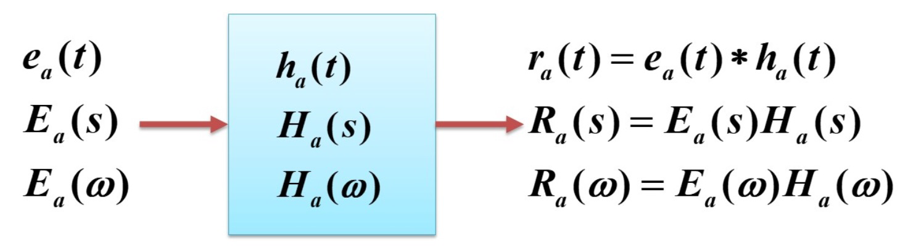  

### 2. 理想模拟滤波器与物理可实现性

理想的滤波器在频域具有垂直的过渡带边沿，通带内幅频响应为常数，阻带内幅频响应为 0。  

**物理可实现性（因果性限制）**：  
理想低通滤波器的频率响应在频域中是矩形窗，其对应的冲激响应为非因果的 $Sa(t)$ 函数（即在 $t < 0$ 时也有值），这意味着在激励加入之前系统就会产生输出。因此，==理想滤波器物理上是不可实现的==。  

**佩利-维纳 (Paley-Wiener) 准则**：  
从频域判断一个系统物理可实现的充要条件为：  
$$\int_{-\infty}^{\infty} \frac{|\ln |H_a(\omega)||}{1 + \omega^2} d\omega < \infty$$  
以及必要条件（能量有限）：  
$$\int_{-\infty}^{\infty} |H_a(\omega)|^2 d\omega < \infty$$  
这导致了物理可实现系统在频域上的两个限制：  
1.  幅频特性 $|H_a(\omega)|$ 不能在任何一个有限的连续频率段上恒为零（否则对数积分为 $-\infty$）。  
2.  幅频特性的衰减速度不能超过指数阶。  

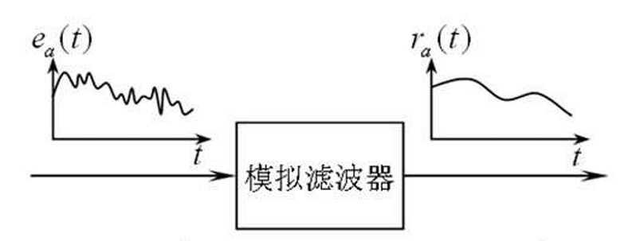  
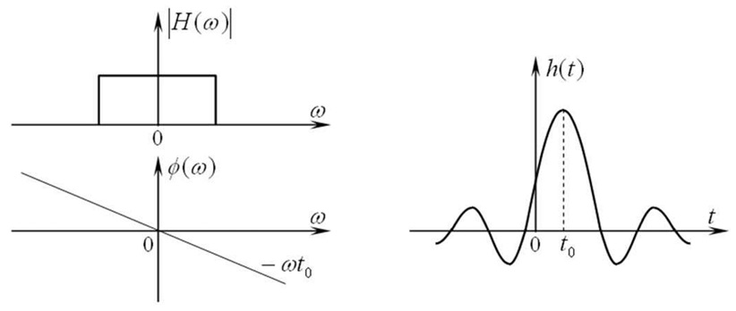  

**希尔伯特 (Hilbert) 变换**：  
物理可实现的因果系统，其频率响应的实部 $H_{ar}(\omega)$ 与虚部 $H_{ai}(\omega)$ 存在相互约束关系（通过希尔伯特变换约束）。这表明**幅频和相频特性是不可能独立设计的**，在设计时必须进行取舍。  

### 3. 巴特沃兹 (Butterworth) 滤波器

巴特沃兹滤波器是一种幅频特性在通带内最大平坦的滤波器。  
*   **幅频特性**：  
    $$|H_a(j\omega)| = \frac{1}{\sqrt{1 + \left( \frac{\omega}{\omega_c} \right)^{2n}}}$$  
    其以分贝表示的衰减为：  
    $$\alpha = -20 \lg |H_a(j\omega)| = 10 \lg \left[ 1 + \left( \frac{\omega}{\omega_c} \right)^{2n} \right]$$  
*   **特点**：无论滤波器阶数 $n$ 取何值，在截止频率 $\omega_c$ 处的衰减均为 $3\text{ dB}$。  

为了构造稳定的系统函数 $H_a(s)$：  
$$H_a(s) H_a(-s) = \frac{1}{1 + \left( \frac{s}{j\omega_c} \right)^{2n}}$$  
对其进行频率归一化，设 $s' = s/\omega_c$。极点分布为 $2n$ 个在单位圆上均匀分布的根：  
$$p_k = e^{j \frac{2k - 1 + n}{2n}\pi} \quad , \quad k = 1, 2, \dots, 2n$$  
为了保证滤波器 $H_a(s)$ 的稳定性，只取复平面**左半平面的极点**作为系统函数的极点。  

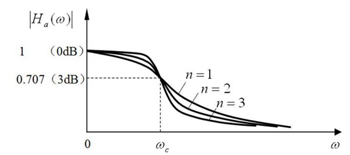  
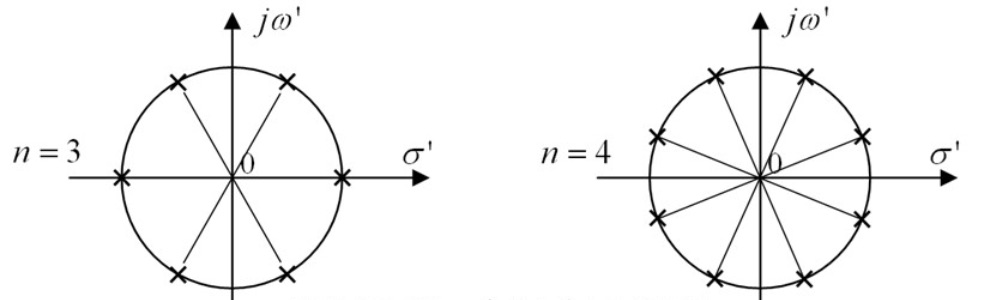  
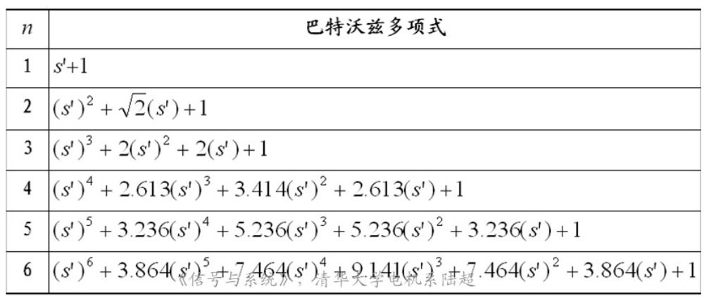  
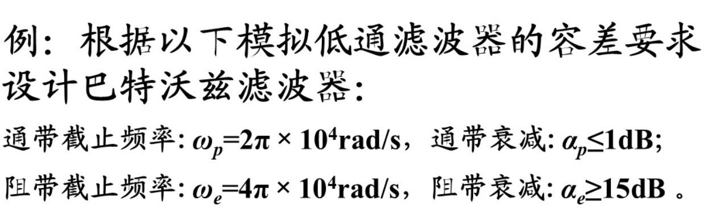  

*   **设计实例**：  
    已知设计指标为：通带截止频率 $\omega_p$，通带最大衰减 $\alpha_p$；阻带截止频率 $\omega_s$，阻带最小衰减 $\alpha_s$。  
    1.  建立方程组：  
        $$\alpha_p = 10 \lg \left[ 1 + \left( \frac{\omega_p}{\omega_c} \right)^{2n} \right] \quad , \quad \alpha_s = 10 \lg \left[ 1 + \left( \frac{\omega_s}{\omega_c} \right)^{2n} \right]$$  
    2.  求得滤波器阶数：  
        $$n = \frac{\lg \sqrt{\frac{10^{\alpha_s/10} - 1}{10^{\alpha_p/10} - 1}}}{\lg \left( \frac{\omega_s}{\omega_p} \right)}$$  
        向上取整得到整数阶数 $n$。  
    3.  计算截止频率 $\omega_c$ 的可选范围，选择左半平面极点构建归一化系统函数 $H_{an}(s')$，再进行去归一化（将 $s'$ 替换为 $s/\omega_c$）求得 $H_a(s)$。  

### 4. 数字滤波器

对于模拟信号，频率 $\omega$ 可以从 $-\infty$ 变化到 $+\infty$。而对于数字信号，复指数序列 $e^{j\theta n}$ 的频率具有以 $2\pi$ 为周期的周期性：  
*   $\theta = 2k\pi$ 对应于数字信号的**最低频**（直流）；  
*   $\theta = (2k+1)\pi$ 时，序列为 $e^{j\pi n} = (-1)^n$，对应信号交替变化最快的**最高频**。  

因此，数字滤波器分类为：  
*   **低通**：让 $\theta = 2k\pi$ 附近的低频成分通过，阻断高频。  
*   **高通**：让 $\theta = (2k+1)\pi$ 附近的高频成分通过，阻断低频。  
*   **带通**：阻断低频和高频，仅保留中间的特定频段。  
*   **带阻**：通过低频和高频，滤去中间的特定频段。  

数字滤波器主要分为两类：  
1.  **无限冲激响应 (IIR) 滤波器**：  
    采用递归结构（包含反馈项，输出不仅与当前及过去的输入有关，还与过去的输出有关）。  
    其差分方程为后向递归形式：  
    $$y(n) = \sum_{i=0}^{M} b_i e(n-i) - \sum_{k=1}^{N} a_k y(n-k)$$  
    系统函数为：  
    $$H(z) = \frac{\sum_{i=0}^{M} b_i z^{-i}}{1 + \sum_{k=1}^{N} a_k z^{-k}}$$  
2.  **有限冲激响应 (FIR) 滤波器**：  
    采用非递归结构（仅与当前及过去的输入有关，系统不含反馈环路）。  
    系统函数只在原点 $z = 0$ 处有极点：  
    $$H(z) = \sum_{i=0}^{M} b_i z^{-i}$$  
    时域单位样值响应 $h(n)$ 是有限长的。FIR 滤波器本质是对理想低通滤波器（其 $h_a(t)$ 是无限长的 $Sa$ 函数）进行截断，即用**窗函数法**（如矩形窗、汉宁窗）乘上无限长脉冲，并移动时轴保证因果性。  

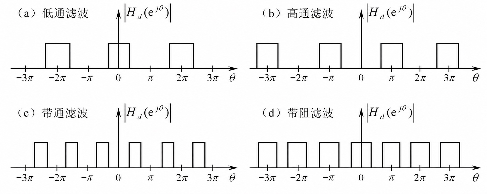  

### 5. IIR 滤波器设计方法 (s 域到 z 域映射)

利用模拟原型滤波器设计 IIR 数字滤波器，即寻找复频域从 s 域到 z 域的转换关系。  

#### 5.1 冲激响应不变法

将模拟滤波器的冲激响应 $h_a(t)$ 按等间隔抽样作为数字滤波器的样值响应：  
$$h(n) = h_a(n T_s)$$  
若将模拟滤波器部分分式展开：$H_a(s) = \sum_{i=1}^{M} \frac{A_i}{s - p_i}$，则对应的 Z 域系统函数为：  
$$H(z) = \sum_{i=1}^{M} \frac{A_i}{1 - e^{p_i T_s} z^{-1}}$$  
*   **本质**：它是将 s 平面的极点 $s = p_i$ 直接映射为 z 平面的极点 $z = e^{p_i T_s}$。  
*   **缺点**：S 平面到 Z 平面是**多值映射**，这会导致频域在以 $\omega_s$ 为周期的延拓上产生**频率混叠**。对于高通、带阻等滤波器，由于高频成分丰富，此方法无法使用。  

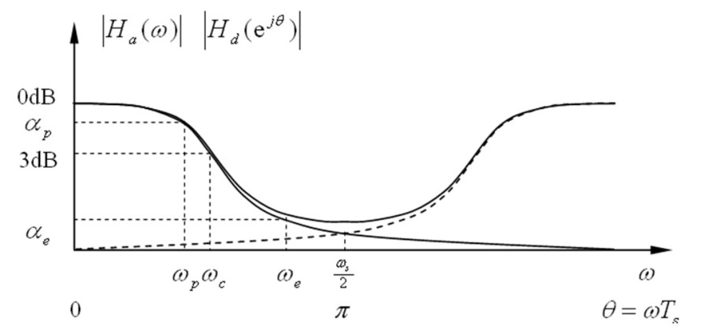  

#### 5.2 双线性变换法

双线性变换是通过一个单值映射关系，将整个左半 s 平面单值地保角映射到 z 平面的单位圆内部，彻底解决了频率混叠的问题：  
$$s = \frac{2}{T_s} \frac{1 - z^{-1}}{1 + z^{-1}} \iff z = \frac{1 + \frac{T_s}{2}s}{1 - \frac{T_s}{2}s}$$  

代入 $s = j\Omega$ 与 $z = e^{j\theta}$，可得模拟角频率与数字角频率的映射联系：  
$$\Omega = \frac{2}{T_s} \tan\left( \frac{\theta}{2} \right) \iff \theta = 2 \arctan\left( \frac{\Omega T_s}{2} \right)$$  

*   **缺点**：双线性变换使得模拟角频率与数字角频率之间存在高度非线性的映射关系（**频率畸变**）。因此，在设计中必须先进行**频率预校正**。  

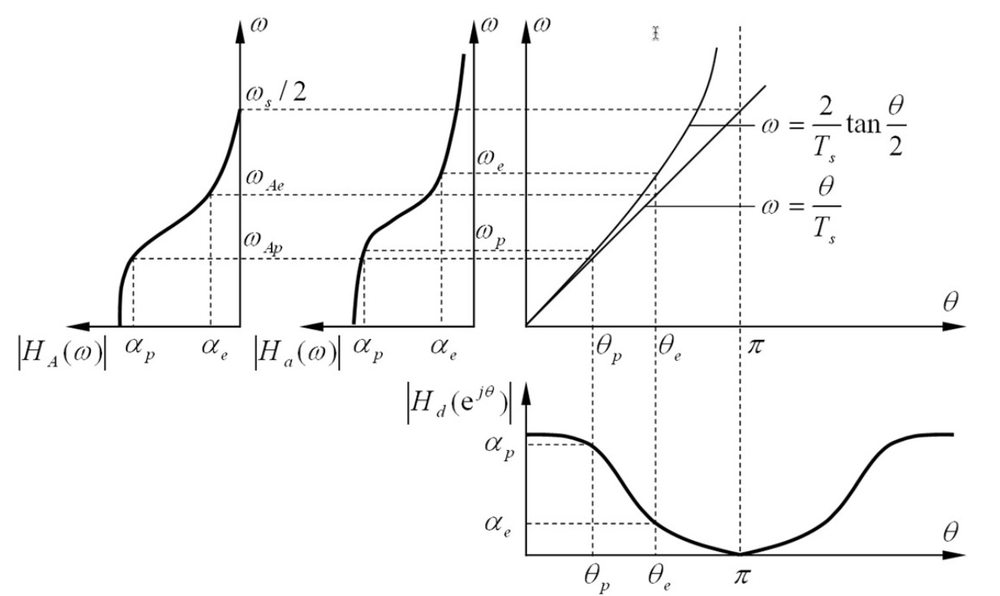  

**双线性变换法的数字滤波器设计步骤**：  
1.  给定数字滤波器的容差指标（如通带截止频率 $\theta_p$，阻带截止频率 $\theta_s$）。  
2.  通过频率预校正公式，将数字指标映射为模拟滤波器指标：  
    $$\Omega_p = \frac{2}{T_s} \tan\left( \frac{\theta_p}{2} \right) \quad , \quad \Omega_s = \frac{2}{T_s} \tan\left( \frac{\theta_s}{2} \right)$$  
3.  根据模拟指标 $\Omega_p, \Omega_s$ 设计出模拟原型滤波器 $H_a(s)$。  
4.  代入双线性变换关系式，求得数字滤波器系统函数 $H(z)$：  
    $$H(z) = \left. H_a(s) \right|_{s = \frac{2}{T_s} \frac{1 - z^{-1}}{1 + z^{-1}}}$$  
  

  