# 数字电子技术基础

## Chapter 1: Information & Encoding

**Information resolves uncertainty.**

**信息的量化：**

$N$ 种可能 $\longrightarrow$ 接收信息 $\longrightarrow$ $M$ 种可能

则：信息量：$\log_2(N/M)$

**Encoding：**

数制：数量的规则。
码制：事物的规则。

**Bits：**

$1001011\underline{0}$

其中 $\underline{0}$ 为 1 bit，整体为 byte。

**Bytes & Nibbles：**

$\overbrace{1001}^{\text{nibble}}\underbrace{0110}_{\text{nibble}}$

整体构成一个 byte。

**Bytes (16 进制)：**

CEBF9AD7

其中 D7 为一个 byte。

## Sign/Magnitude Num

第 1 位表示正负。

eg：$0110 = 6$   $1110 = -6$

### 二进制的补码

- 最高位表示正负
- 正数补码与原码相同
- 负数补码 = 数值位逐位取反 $+ 1$

eg：

$13 \Rightarrow 001101$

$-10 \Rightarrow 110110$ （求和）

$3 \Rightarrow 1000011$

溢出的最高位丢弃，最终补码为 $00011$。

### Fixed-Point Nums

$\Rightarrow$ Fixed Point：规定好整数位和小数位。

Ex：Represent $7.5_{10}$ using 4 integer and 4 fraction bits. As for $-7.5_{10}$?

$7.5_{10} = \underbrace{0}_{\text{sign}}111.\underbrace{1000}_{\text{point}}$

$\Rightarrow -7.5_{10} = 1000.0111 + \underbrace{1}_{\text{LSB}} = 1000.1000$

逻辑推导：
$0111.0111 + 1$ (LSB) $\Rightarrow 0111.1000 \xleftarrow{\text{自反性}} 1000.1000$

已知补码求数：

正：直接求。

负：$\underbrace{1}_{\text{sign}}010.0100$

$\Rightarrow$ 最高位报 $-2^{4-1} = -8$

$-[8 - (0010.0100)_2] = -(8 - 2.25) = -5.75$

$\star$ **注意，原码和补码分清楚**

$-7.5$ 的二进制 $\rightarrow$ 原码：

$\underbrace{1}_{\text{sign}}111.1000$

补码：$1000.1000 \Leftarrow \underbrace{1}_{\text{符号位不变(原码)}}000.0111 + 1$

### Zero Extension

4-bit value：$0011_2 = 3$

8-bit zero-extended value：$0000 0011$

But when it comes to negative nums：

4-bit value：$1011_2 = -5$ （补码）

8-bit：$0000 1011_2 = 8 + 2 + 1 = 11$

$\Rightarrow$ value changes for negative nums!

### Sign Extension

$\Rightarrow$ 针对补码

4-bit value：$1011_2 = -5$ （补码）

8-bit：$\underbrace{1111}_{\text{整个作为符号位}} 1011_2 = -5$

### 数制的对比

Unsigned：$[0, 2^N - 1]$，共 $2^N$ 个

Sign (原码)：$[-(2^{N-1}-1), 2^{N-1}-1]$，共 $2^N-1$ 个

$0$ 有两个表示：$0000$ & $1000$

Two's complement：$[-2^{N-1}, 2^{N-1}-1]$，共 $2^N$ 个

$0000 \Rightarrow 0$

$1000 \Rightarrow -8$

---

## Chapter 2: Algebra of Logic

三种基本运算：

### 1 与 (AND)

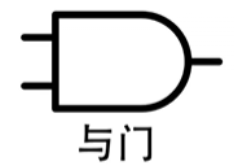

记 $Y = A \text{ AND } B = A \& B = A \cdot B = AB$

条件同时具备，结果发生。

$A = 1$ 且 $B = 1$，$Y = 1$

## 2 或 (OR)

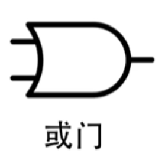

记 $Y = A \text{ OR } B = A + B$

条件之一具备，结果发生。

$A = 1$ 或 $B = 1$，$Y = 1$

### 3 非 (NOT)

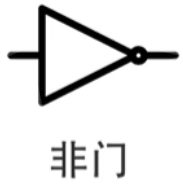

记 $Y = A' = \text{NOT } A$

$A = 1, A' = 0$；$A = 0, A' = 1$

### 常用复合逻辑运算

- 与非：$Y = (A \cdot B)'$
- 或非：$Y = (A + B)'$
- 与或非：$Y = (A \cdot B + C \cdot D)'$

### 异或 (XOR)

$Y = A \oplus B$

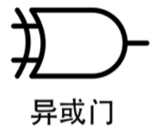

$(0,0) \rightarrow 0,\quad (0,1), (1,0) \rightarrow 1,\quad (1,1) \rightarrow 0$

相同得 0，不同得 1。

### 同或 (XNOR)

$Y = A \odot B = (A \oplus B)'$

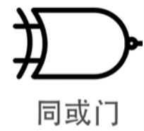

$(0,0), (1,1) \rightarrow 1,\quad (0,1), (1,0) \rightarrow 0$

相同得 1，不同得 0。

### 逻辑代数的运算性质

$AB = BA,\quad A(BC) = (AB)C$

$A + B = B + A,\quad A + (B + C) = (A + B) + C$

De Morgan 定理：$(AB)' = A' + B',\quad (A + B)' = A'B'$

$AA = A,\quad 1A = A,\quad AA' = 0,\quad 0A = 0$

$A + A = A + 0 = A,\quad A + A' = 1,\quad 1 + A = 1$

$\star$ **$AB + A'C + BC = AB + A'C$** （$BC$ 冗余）

$\star$ **$A + BC = (A + B)(A + C)$**

> Proof:
> $(A + B)(A + C) = A + A(B + C) + BC$
> $= A(1 + B + C) + BC = A + BC$

### 代入定理

任意逻辑被换元后仍成立。

eg：$A + BC = (A + B)(A + C)$

令 $CD \Rightarrow C$

则 $A + BCD = (A + B)(A + CD) = (A + B)(A + C)(A + D)$

### 反演定理

$Y \Rightarrow Y',\quad \cdot \Leftrightarrow +,\quad 0 \Leftrightarrow 1,\quad$ 原变量 $\Leftrightarrow$ 反变量。

### 逻辑函数的两种标准形式

最小项之和 $\quad$ 最大项之积

#### 最小项 $m$ (Minterm)

- $m$ 是乘积项
- 包含 $n$ 个因子
- $n$ 个变量均以原、反变量在 $m$ 中出现一次。

eg：
$A, B$：$A'B', A'B, AB', AB$ （$2^2 = 4$ 个）
$A, B, C$：$A'B'C', A'B'C, A'BC', A'BC, AB'C', AB'C, ABC', ABC$ （$2^3 = 8$ 个）

#### 最小项的编号

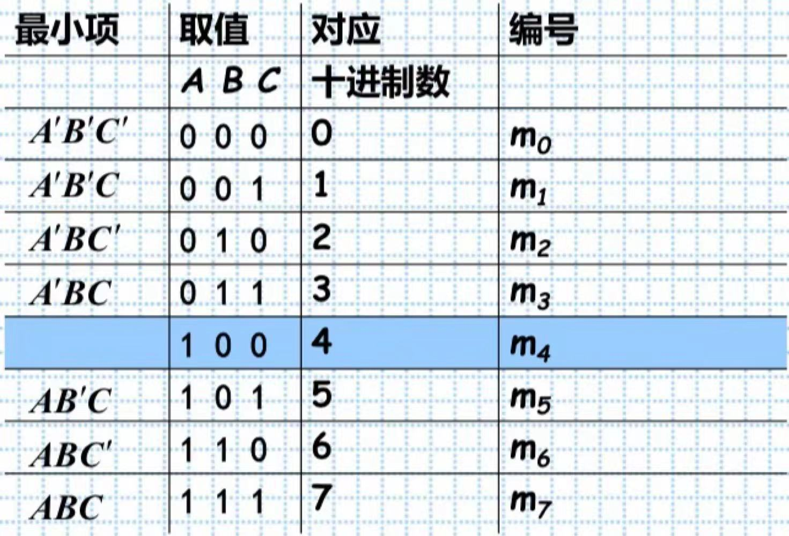

“相邻”意味着只有一项不同，且该项是相反关系。

#### 最小项的性质

- 在输入任一取值下，有且仅有一个最小项的取值为 1；
- 全体最小项之和为 1；
- 任何两个最小项之积为 0；
- 两个相邻最小项之和可以合并，消去一对因子，只留下公共因子。

eg：$A'BC' + A'BC = A'B(C' + C) = A'B$

### 逻辑函数最小项之和的形式

$Y = \sum m_i$，$i$ 为真值表对应十进制数。

eg：
$Y(A, B, C) = ABC' + BC$
$= ABC' + ABC + A'BC$
$= \sum m(3, 6, 7)$

#### 最大项 $M$ (Maxterm)

- $M$ 是相加项；
- 包含 $n$ 个因子；
- $n$ 个变量原反形式在 $M$ 中出现一次。

eg：

$A, B$：$A' + B', A' + B, A + B', A + B$ （$2^2 = 4$ 个）

#### 最大项的编号

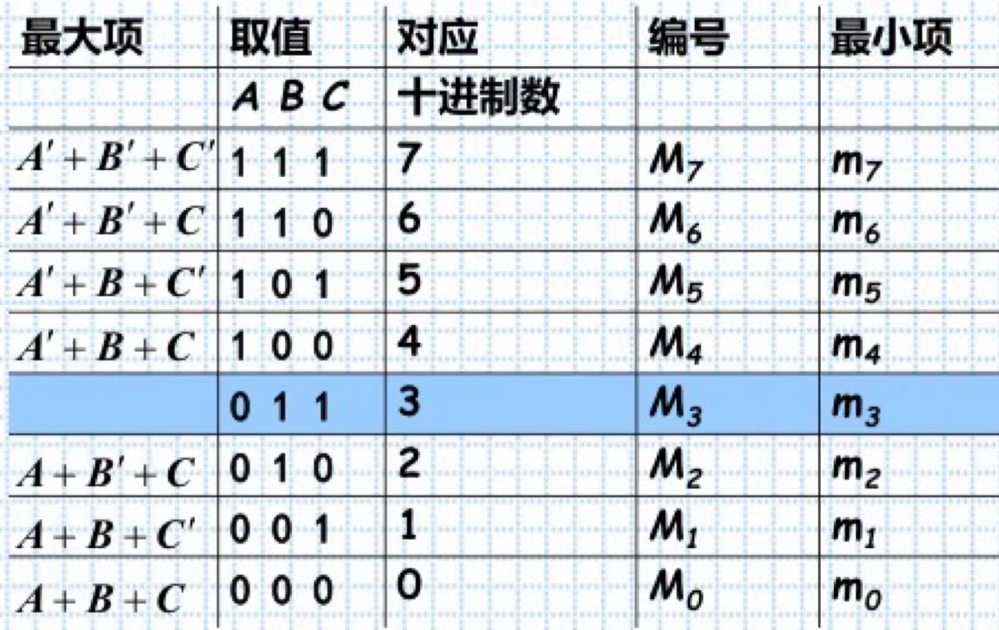

“相邻”意味着只有一项不同，且该项是相反关系。

### 由 De Morgan 定理

$Y = \sum m_i,\quad Y' = \sum_{k \neq i} m_k,\quad Y = \left(\sum_{k \neq i} m_k\right)'$

$\Rightarrow Y = \prod_{k \neq i} m_k' = \prod_{k \neq i} M_k$

eg：

$Y = A'B + AB' + AB = m_1 + m_2 + m_3$

$Y' = A'B'$

$Y = (A'B')' = A + B = M_0$

### 逻辑函数化简法

- 最简形式：最简与或。包含的乘积项已最少，每个乘积项因子也最少，称为最简与或式。

#### 1 公式化简法

反复运用基本公式，消去多余的乘积项和多余的因子。

eg：

$Y = AC + B'C + BD' + CD' + A(B + C') + ABCD' + AB'DE$

$= A(C + B + C' + B'DE) + BD'(1 + A'C) + B'C + CD'$

$= A + BD' + B'C + CD'$

$= A + BD' + B'C$

#### 2 卡诺图化简法

- 实质是以最小项之和的形式展开。
- 以 $2^n$ 个小方块表示 $n$ 个变量的所有最小项，排列成矩阵，而且使几何相邻的两个最小项同时逻辑相邻。

**2D：**

$A \backslash B$

$0 \quad 1$

$0 \quad m_0 \quad m_1$

$1 \quad m_2 \quad m_3$

**3D：**

$A \backslash BC \quad 00 \quad 01 \quad 11 \quad 10$

$0 \quad m_0 \quad m_1 \quad m_3 \quad m_2$

$1 \quad m_4 \quad m_5 \quad m_7 \quad m_6$

**4D：**

$AB \backslash CD \quad 00 \quad 01 \quad 11 \quad 10$

$00 \quad m_0 \quad m_1 \quad m_3 \quad m_2$

$01 \quad m_4 \quad m_5 \quad m_7 \quad m_6$

$11 \quad m_{12} \quad m_{13} \quad m_{15} \quad m_{14}$

$10 \quad m_8 \quad m_9 \quad m_{11} \quad m_{10}$

> 首尾相连，存在镜像与折叠对应关系！

用法：$Y \Rightarrow$ 用和的形式写出，直接填入。

不足最小项，有 $(n-k)$ 个元素相乘，意味着一项对应表内 $2^k$ 个 1。

#### 合并最小项的原则

- 两个相邻最小项可合并消去一对因子；
- 四个相邻矩形 ($2 \times 2, 1 \times 4$) 可合并消去两对因子；
- 八个相邻矩形 ($2 \times 4, 4 \times 2$) 可合并消去三对因子。
- 覆盖所有 1 $\Rightarrow$ 表达式等价要求。
- 圈成矩形最少 $\Rightarrow$ 乘积项最少。
- 圈成矩形最大 $\Rightarrow$ 乘积因子最少。

---

## Chapter 3: Gate Circuit

门电路：实现基本运算、复合运算的单元电路。

正逻辑：高电平 $\rightarrow 1$，低电平 $\rightarrow 0$

相反地，称之为负逻辑。

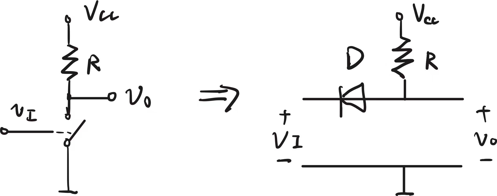

利用二极管的开关特性：

高电平：$D$ 截止，$V_I = V_{IH}$，$V_O = V_{OH} = V_{CC}$

低电平：$D$ 导通，$V_O = V_{OL} = 0.7\text{V}$

由此可以得到二极管与门的对应关系。

### 二极管与门

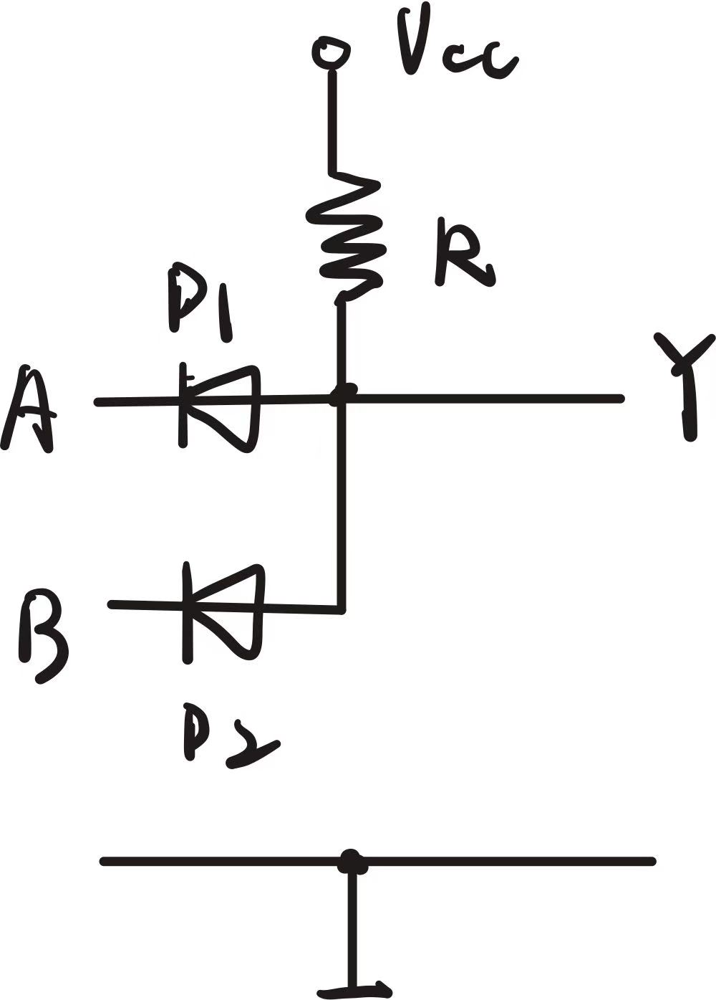

设 $V_{CC} = 5\text{V}$

加到 $A, B$ 的 $V_{IH} = 3\text{V}$

$V_{IL} = 0\text{V}$，$D$ 导通时 $V_{DF} = 0.7\text{V}$。

真值关系：

$A=0\text{V}, B=0\text{V} \rightarrow Y=0.7\text{V} \Rightarrow A=0, B=0, Y=0$

$A=0\text{V}, B=3\text{V} \rightarrow Y=0.7\text{V} \Rightarrow A=0, B=1, Y=0$

$A=3\text{V}, B=0\text{V} \rightarrow Y=0.7\text{V} \Rightarrow A=1, B=0, Y=0$

$A=3\text{V}, B=3\text{V} \rightarrow Y=3.7\text{V} \Rightarrow A=1, B=1, Y=1$

### 二极管或门

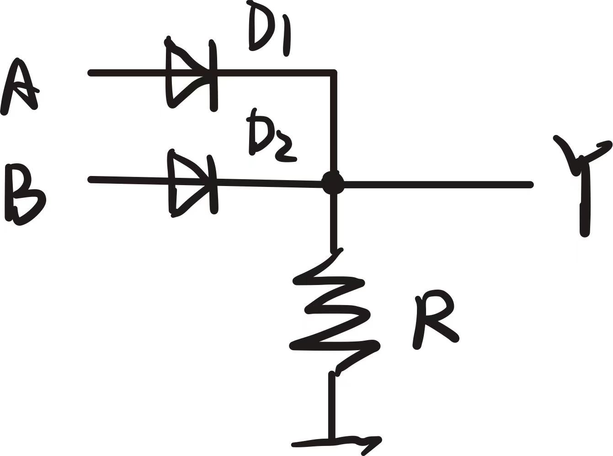

设 $V_{CC} = 5\text{V}$

加到 $A, B$ 的 $V_{IH} = 3\text{V}$

$V_{IL} = 0\text{V}$，$D$ 导通时 $V_{DF} = 0.7\text{V}$。

真值关系：

$A=0\text{V}, B=0\text{V} \rightarrow Y=0\text{V} \Rightarrow A=0, B=0, Y=0$

$A=0\text{V}, B=3\text{V} \rightarrow Y=2.3\text{V} \Rightarrow A=0, B=1, Y=1$

$A=3\text{V}, B=0\text{V} \rightarrow Y=2.3\text{V} \Rightarrow A=1, B=0, Y=1$

$A=3\text{V}, B=3\text{V} \rightarrow Y=2.3\text{V} \Rightarrow A=1, B=1, Y=1$

二极管构成门电路的缺点：
电平有偏移、带负载能力差
$\Rightarrow$ 只用于 IC 内部电路

### CMOS 门电路

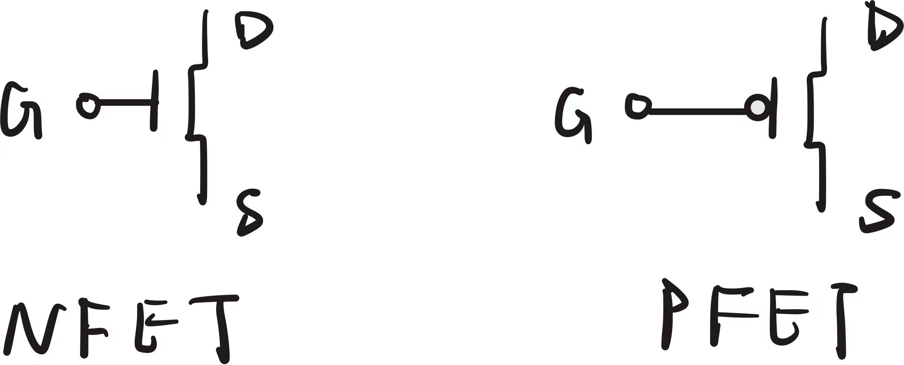

#### CMOS Inverter

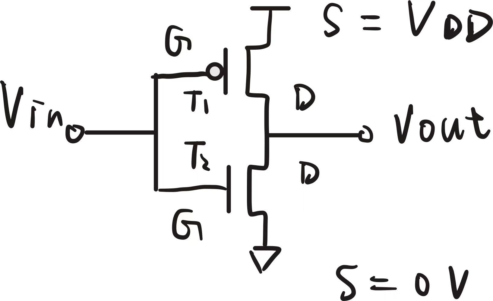

令 $V_{DD} > V_{GS(th)N} + |V_{GS(th)P}|$：
当 $V_{in} = 0$ 时，$T_1$ 导通，$T_2$ 截止，$V_{out} \approx V_{DD}$；
当 $V_{in} = V_{DD}$ 时，$T_1$ 截止，$T_2$ 导通，$V_{out} \approx 0$。

#### 电压、电流传输特性

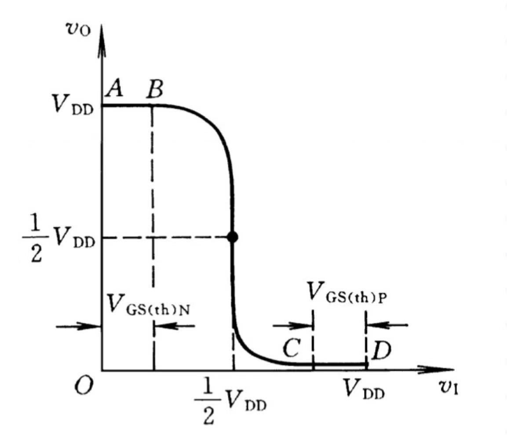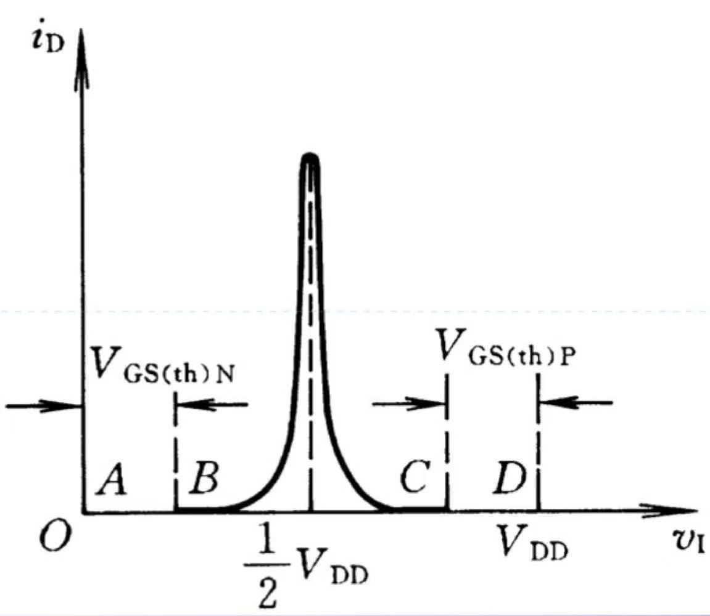

- **AB 段**：$V_I < V_{GS(th)N}$，$T_1$ 导通，$T_2$ 截止
$\Rightarrow V_O = V_{DD}$

- **CD 段**：$V_I > V_{DD} - |V_{GS(th)P}|$，$T_1$ 截止，$T_2$ 导通
$\Rightarrow V_O \approx 0$

- **BC 段**：$V_I \in[V_{GS(th)N}, V_{DD} - |V_{GS(th)P}|]$，$T_1, T_2$ 同时导通。

若 $T_1, T_2$ 参数对称，则有：$V_I = \frac{1}{2}V_{DD}$ 时，$V_O = \frac{1}{2}V_{DD}$。

#### 输入噪声容限

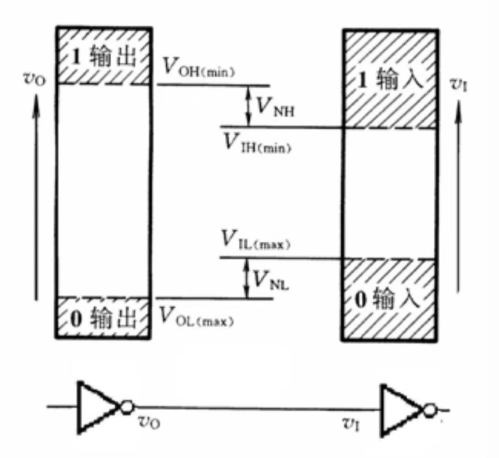

在 $V_I$ 偏离 $V_{IH}$ 和 $V_{IL}$ 的一定范围内，$V_O$ 基本不变；允许输入变化的范围称为输入噪声容限。

许多门电路相互连接时，有：

$V_{NH} = V_{OH(\min)} - V_{IH(\min)}$

$V_{NL} = V_{IL(\max)} - V_{OL(\max)}$

可以通过提高 $V_{DD}$ 来提高噪声容限。

### CMOS 反相器的静态输入输出特性

#### 输入特性

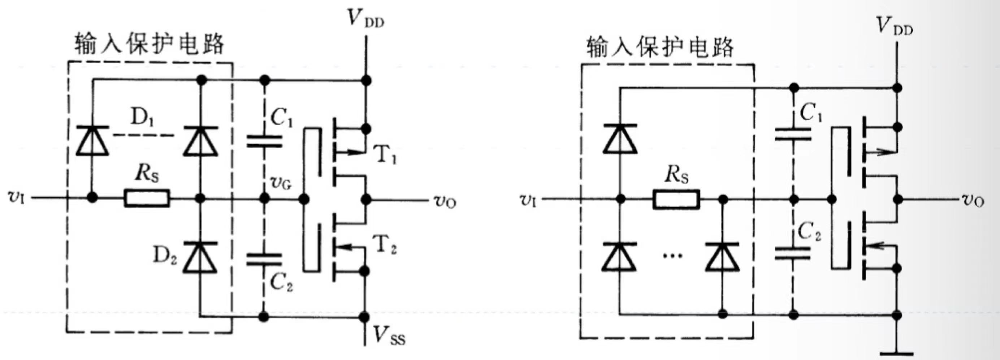

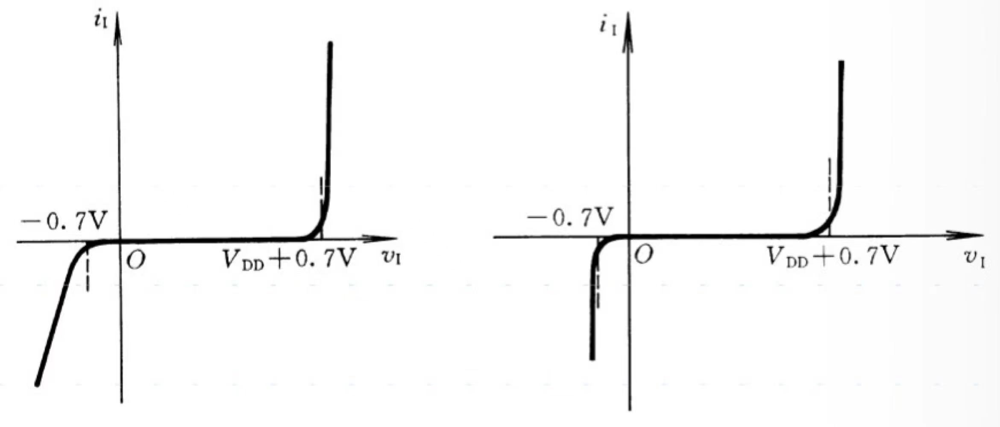

在工作状态下，$D_1, D_2$ 都反向截止，此时 $i_I$ 几乎为 0；

当 $V_I < -0.7\text{V}$ 时，$D_2$ 导通，将电压钳位在 $-0.7\text{V}$ 左右，电流剧增来防止负高压击穿栅极绝缘层；

当 $V_I > V_{DD} + 0.7\text{V}$ 时，同理，$D_1$ 导通将电荷泄至 $V_{DD}$。

#### 输出特性

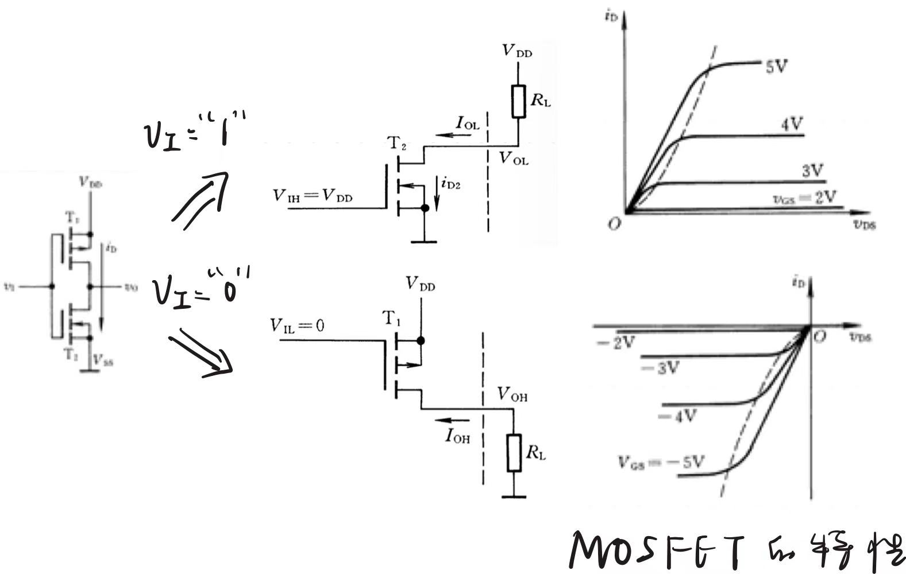

**低电平、高电平输出特性**

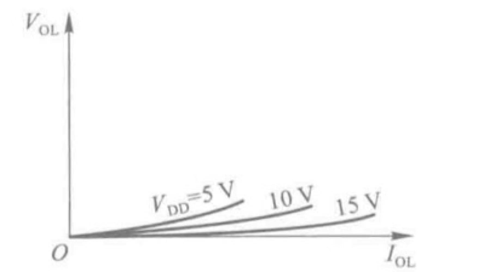

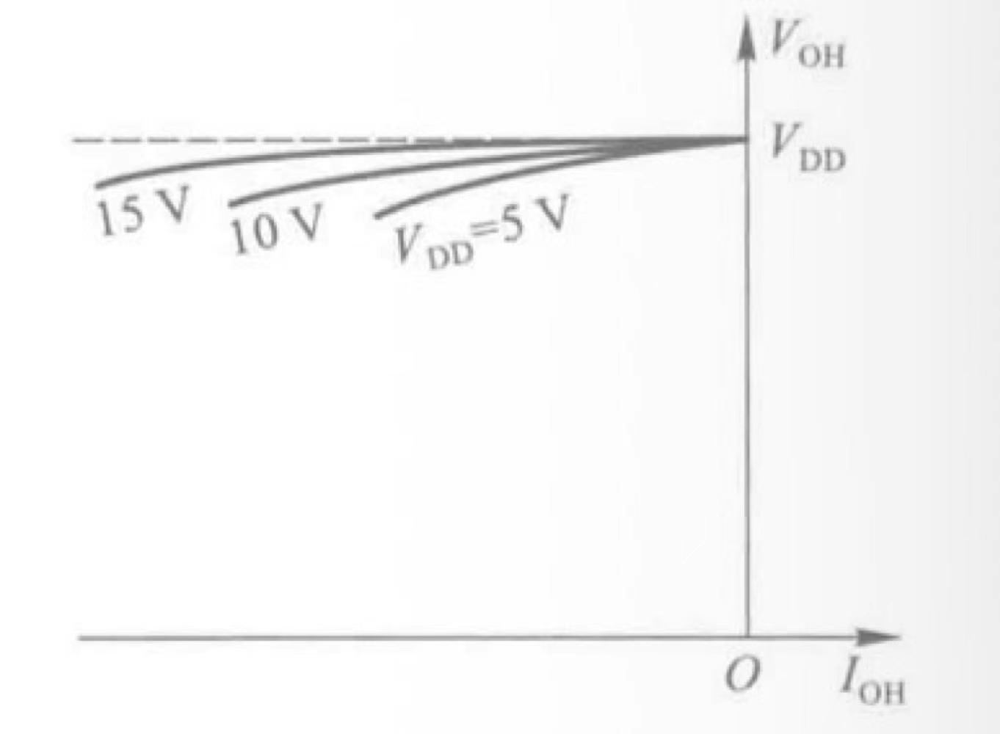

$V_I = "1" \Rightarrow V_{IL} = 0$，$T_1$ 导通，$T_2$ 截止。

$V_I = "0" \Rightarrow V_{IH} = V_{DD}$，$T_1$ 截止，$T_2$ 导通。

由特性可知，$V_{DD} \uparrow$，$V_{GS} \uparrow$，而 $V_{GS} \uparrow$，$I_D$ ($I_{OL}$) 一定时 $V_{OL}$ 和 $V_{OH}$ 浮动越小，即带载能力更强。

#### 扇出系数 (Fan-out)

描述了一个逻辑门的输出端最多能连接多少个同类逻辑门，在不影响逻辑电平的有效性。

描述了静态的门电路带载能力。

### CMOS 反相器的动态特性

#### 传输延迟时间

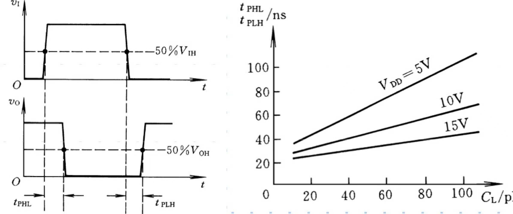

原因：极间电容 $C_1, C_2$ 及负载电容 $C_L$ 充放电。导通电阻 $R_{ON}$ 较大，因此 $C_L$ 的影响也较大。

$t_{PHL}, t_{PLH}$ 受 $C_L, V_{DD}$ 影响。

$t = RC \ln \frac{V_{C(0)} - V_{C(\infty)}}{V_{C(t)} - V_{C(\infty)}} = RC \ln \frac{V_{DD} - 0}{V_{DD} - V_{TH}} \approx RC \ln 2$

- **传输延迟 (Propagation Delay, $t_{PD}$)**：从输入变化开始，到输出稳定达到最终逻辑电平所经历的最大时间。
- **污染延迟 (Contamination Delay, $t_{CD}$)**：从输入变化开始，到输出开始变化 (污染) 所用的最小时间。

#### 组合电路协议 (The Combinational Contract)

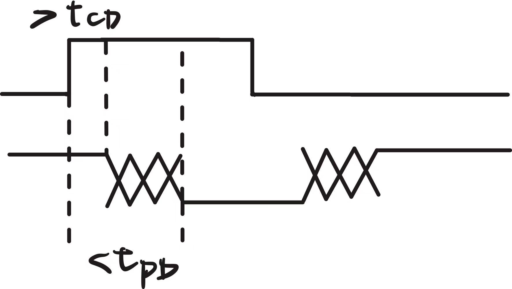

$t_{CD}$ 到 $t_{PD}$ 之间的区域不可信。

#### 多级电路的路径计算

- 计算 $t_{PD}$：从输入到输出，经过门最多的路径，所有 $t_{PD}$ 之和；
- 计算 $t_{CD}$：从输入到输出，最快能引起输出变化的路径，该路径的 $t_{CD}$ 之和。

#### 交流噪声容限

当输入信号为窄脉冲，且接近 $t_{PD}$ 时，输出跟不上变化，因此交流噪声容限远大于直流噪声容限。

#### 动态功耗

$P_D = P_T \text{ (导通)} + P_C \text{ (负载)}$

$P_T = C_{PT} f V_{DD}^2, \quad P_C = C_L f V_{DD}^2$

#### 静态功耗 & 总功耗

$P_S = I_{DD} V_{DD}$

$P_{\text{total}} = P_S + P_D$

### 其他类型的 CMOS 门电路

#### 上拉和下拉

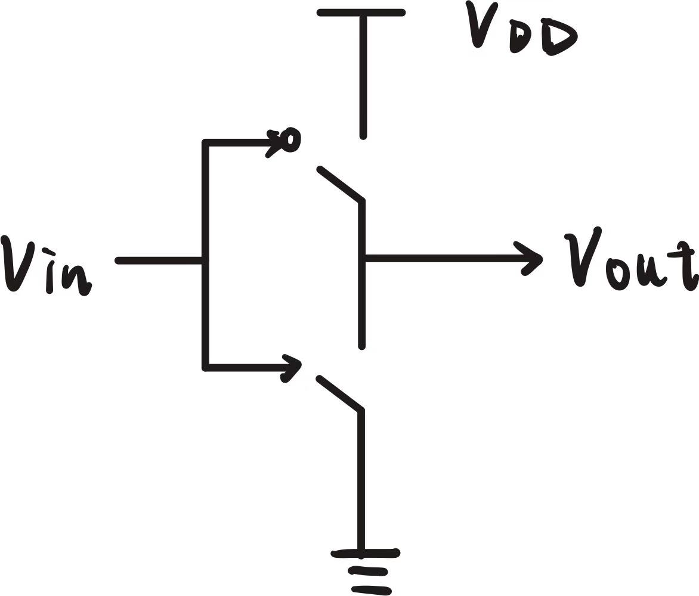

- Pull-up: make this connection when $V_{in} \approx 0$, so that: $V_{out} = V_{DD}$
- Pull-down: make this connection when $V_{in} \approx V_{DD}$, so that: $V_{out} = 0$

CMOS: complementary pull-up and pull-down.
$\star$ **上拉下拉必须一个串联一个并联。**

#### CMOS Complements

- 串联 NMOS：$A$ 和 $B$ 为高电平时导通 ($A \cdot B$)
- 并联 NMOS：$A$ 或 $B$ 为高电平时导通 ($A + B$)

### 带缓冲级的 CMOS 门

#### 1 与非门

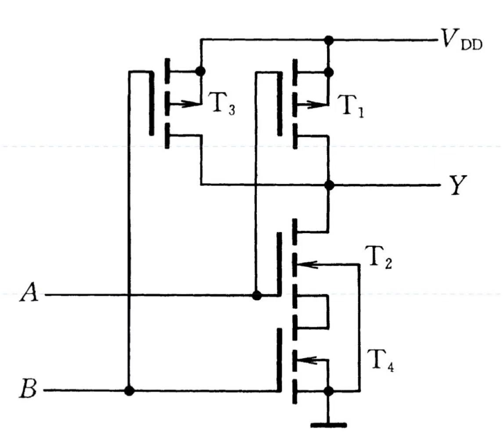

上拉：$A' + B' = 1$ 输出 1，$Y = A' + B' = (AB)'$

下拉：$AB = 1$ 输出 0，$Y = (AB)'$

存在的缺点：

1) 输出电阻受输入状态影响；
2) 输出的高低电平受输入端数目影响。输入端越多，$V_{OL}$ 和 $V_{OH}$ 都越高。

#### 2 解决方法：前后加上非门缓冲级

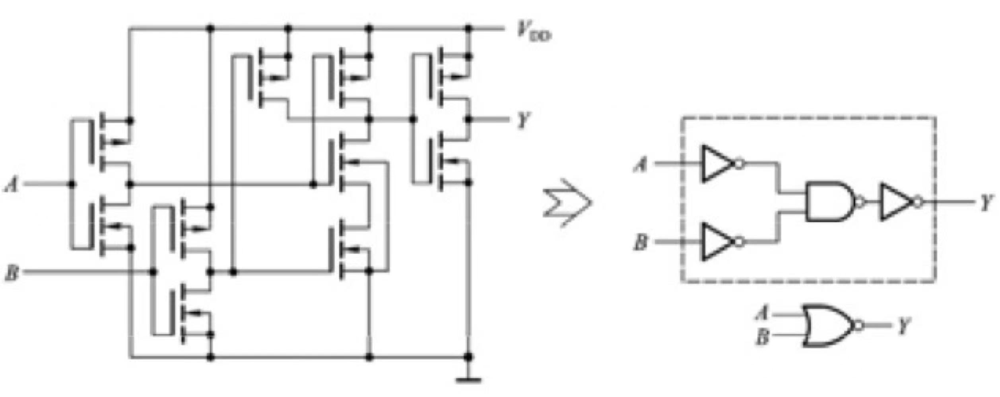

### 漏极开路的门电路 (OD 门)

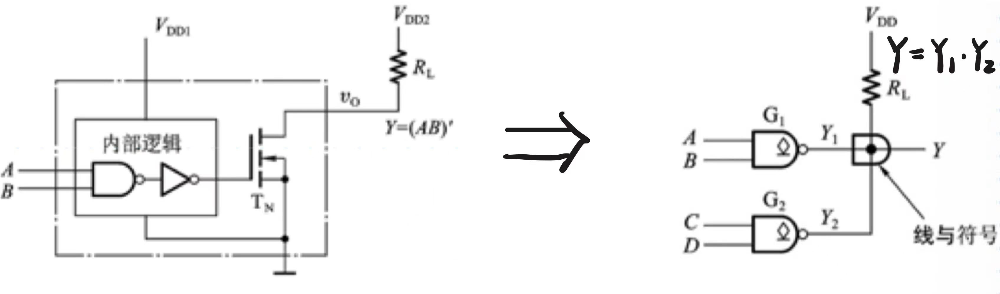

作用：实现“线与”，将输出并联使用。OD 门只有下拉，上拉通过 $R_L$ 实现。

$\star$ **为什么不能 CMOS 直连？**

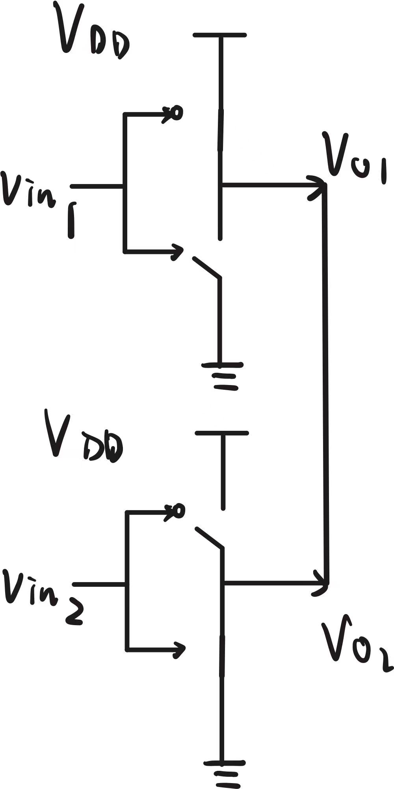

当 $V_{O1}$ 高电平，$V_{O2}$ 低电平时，$V_{DD}$ 到地直接短路，电流将巨大烧毁 MOS。
而 OD 门无上拉，统一用一个 $R_L$ 来替代上拉，可以防止短路出现。OD 门并联只要有下拉接地就输出 0。

#### $R_L$ 的计算方法

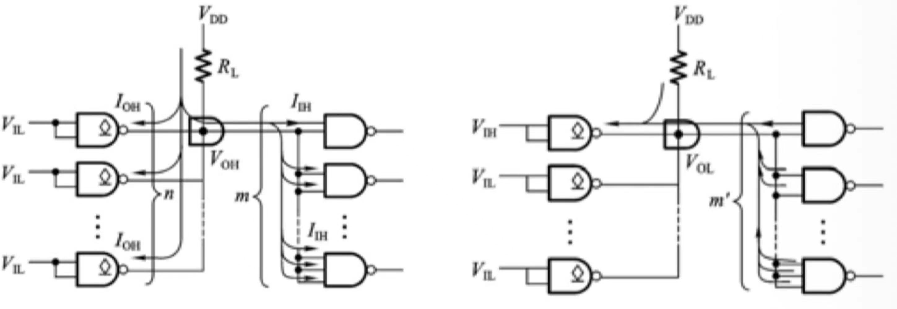

$R_L$ 上限：
$V_{DD} - (n I_{OH} + m I_{IH}) R_L \geq V_{OH}$
$R_L \leq \frac{V_{DD} - V_{OH}}{n I_{OH} + m I_{IH}} = R_{L(\max)}$

$R_L$ 下限：
$\frac{V_{DD} - V_{OL}}{R_L} + m' |I_{IL}| \leq I_{OL(\max)}$
$R_L \geq \frac{V_{DD} - V_{OL}}{I_{OL(\max)} - m' |I_{IL}|} = R_{L(\min)}$

### CMOS 传输门 —— 全摆幅传输

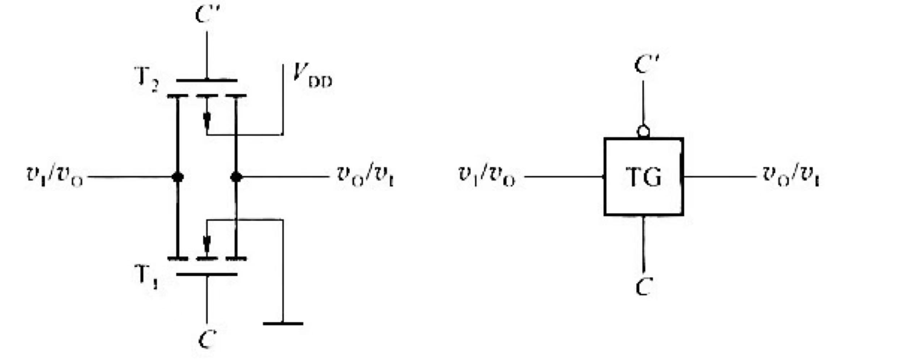

设 $R_L \gg R_{ON}$，$V_{IH} = V_{DD}$，$V_{IL} = 0$

1) 当 $C = 0, C' = 1$ 时：
只要 $V_I = 0 \sim V_{DD}$，则 $T_1, T_2$ 截止，相当于断开开关。

2) 当 $C = 1, C' = 0$ 时：

3) $V_I = 0 \sim V_{DD}$ 时，

$0 < V_I < V_{DD} - V_{GS(th)N}$，$T_1$ 导通；

$|V_{GS(th)P}| < V_I < V_{DD}$，$T_2$ 导通；

所以 $V_I$ 在 $0 \sim V_{DD}$，$T_1, T_2$ 至少一个导通。$V_I - V_O$ 之间为低电阻。

> 只有 $T_1, T_2$ 都会有 $V_{GS(th)}$ 的损失范围，因此需要互补！

#### 双向模拟开关

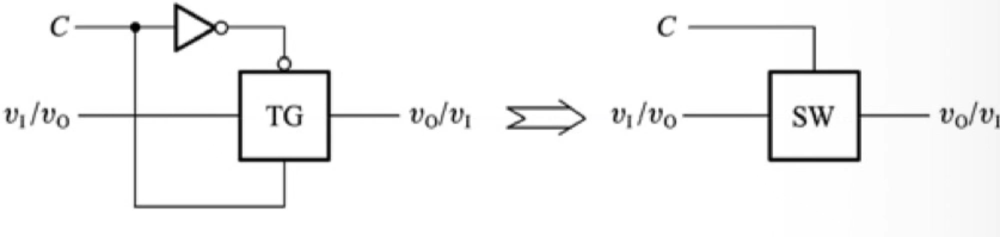

CMOS 传输门天然双向，$V_I, V_O$ 可以在两侧自由切换。

### 三态输出门

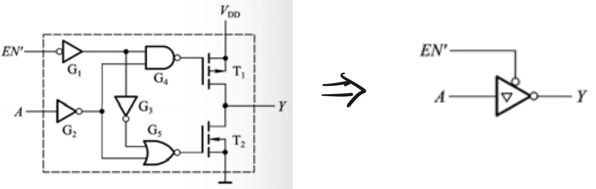

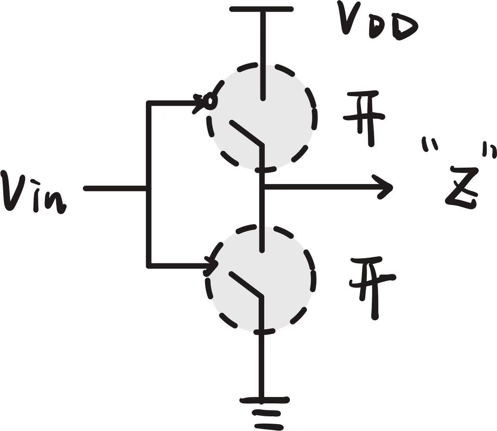

$EN' = 0$ 时，$Y = A'$

$EN' = 1$ 时，$Y = Z$ (高阻态)

#### 三态门的用途 —— 总线共享和双向传输

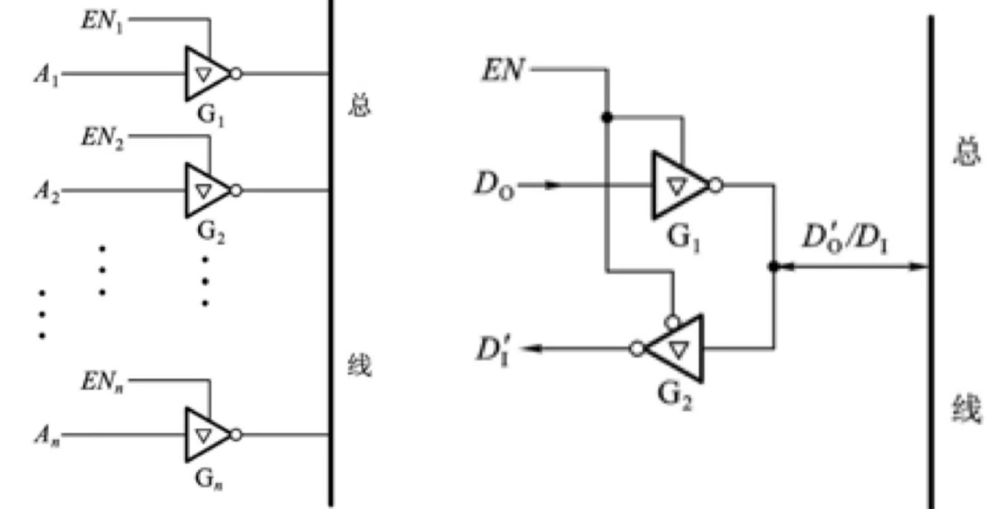

左图：MUX

将多个信号合并到总线，利用三态门来防止总线冲突：每个时刻只允许一个 $EN = 1$，其它三态门都呈高阻态。

右图：双向数据线接口

读写总线数据时自动关闭另一个端口，是 I/O 口的基础电路。

---

### TTL 门电路

双极型三极管的基本开关电路

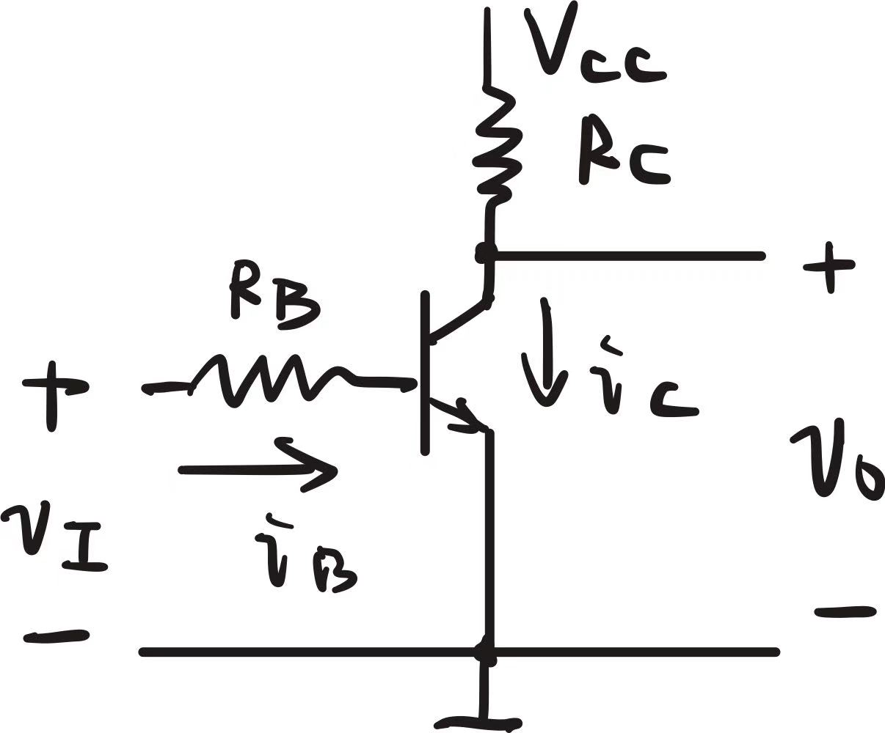

只要参数合适：

$V_I = V_{IL}$，$T$ 截止，$V_O = V_{OH}$；

$V_I = V_{IH}$，$T$ 导通，$V_O = V_{OL}$。

#### 开关等效电路

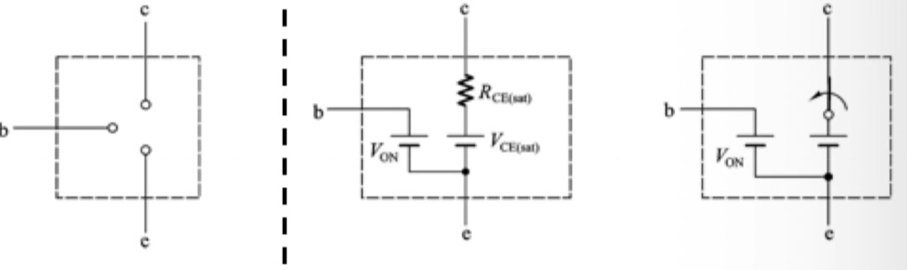

**截止状态 / 饱和导通状态**

PN 结存在电容效应，在饱和截止转换时，$i_C$ 的变化将滞后于 $V_I$，则 $V_O$ 也会滞后于 $V_I$。

### TTL 反相器

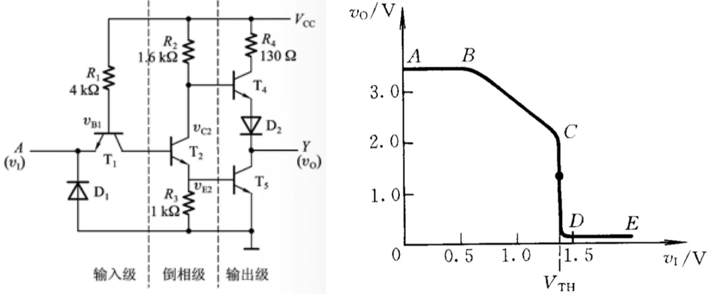

- **AB 段：截止区**
$V_I < 0.6\text{V}$ 时，$V_{B1} < 1.3\text{V}$
$T_1$ 导通，$T_2, T_5$ 截止，$T_4$ 导通
$V_{OH} = V_{CC} - V_{R2} - V_{BE4} - V_{D2} = 3.4\text{V}$

- **BC 段：线性区**
$0.7\text{V} < V_I < 1.3\text{V}$
$T_2$ 导通且工作在放大区，$T_5$ 截止，$T_4$ 导通
$V_I \uparrow \Rightarrow V_O \downarrow$

- **CD 段：转折区**
$V_I = V_{TH} \approx 1.4\text{V}$，$V_{B1} \geq 2.1\text{V}$，$T_2, T_5$ 导通，$T_4$ 截止
$V_O \downarrow\downarrow \Rightarrow V_{OL} \approx 0$

- **DE 段：饱和区**

#### 工作原理

1) **倒相级的作用**

当 $T_2$ 导通时，$I_{C2}$ 增大使得 $V_{C2}$ 下降，而随之增大 $I_{E2}$ 使 $R_3$ 上电压 $V_{E2}$ 上升。

这使得除了一段中间态，其它时刻 $V_{C2}, V_{E2}$ 一个高电平一个低电平，使 $T_4, T_5$ 分别导通。

2) **推挽式输出**

$T_4, T_5$ 相继导通控制输出，$T_4$ 导通输出高电平，$T_5$ 导通输出低电平。
快速充放电，带载能力强；避免同时导通发热，防止短路。

3) **$D_1, D_2$ 保护作用**

$D_1$ 钳位二极管：抑制负向干扰，保护 $T_1$ 不被反向击穿。

$D_2$ 电平转换与补偿：保证 $T_2, T_5$ 导通时 $T_4$ 可靠地截止，防止其微导通的影响。

### TTL 反相器的输入输出特性

#### 1 输入特性

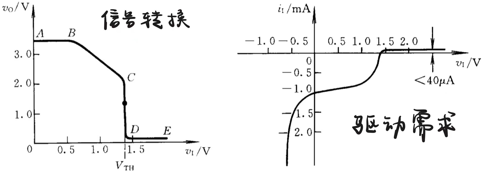

#### 2 输出特性

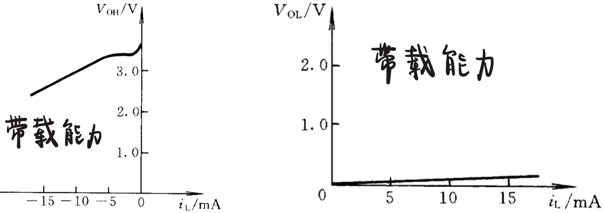

#### 3 输入端负载特性

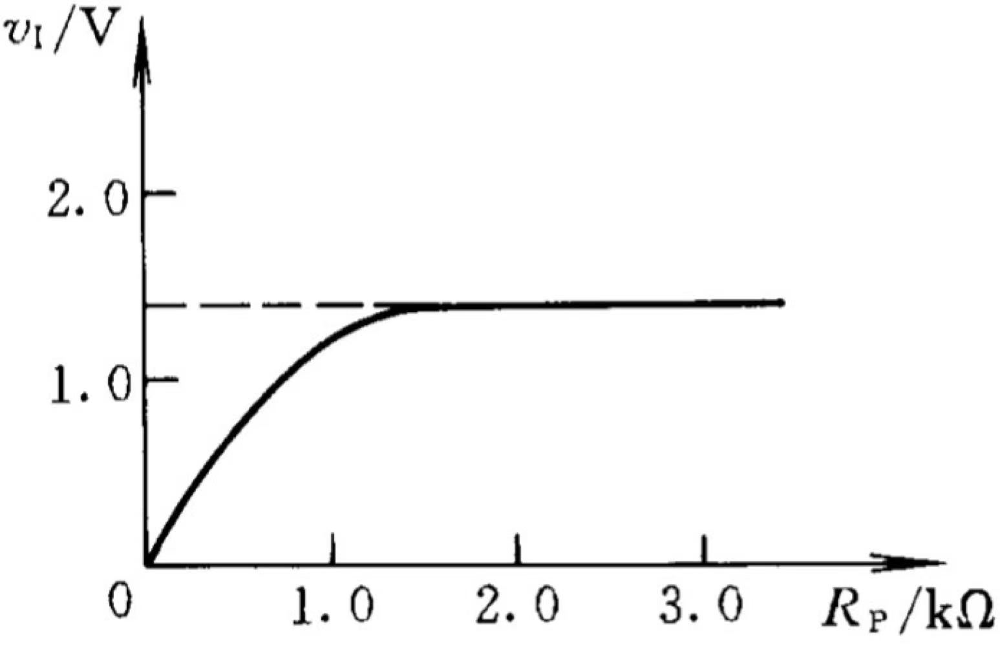

$\star$ **说明了 $R_P$ 很小时，输入低电平；悬空 ($R_P$ 很大) 视输入为高电平。**

TTL 的扇出系数 $= I_{OL} / I_{IL}$

### TTL 反相器的动态特性

#### 1 传输延迟时间

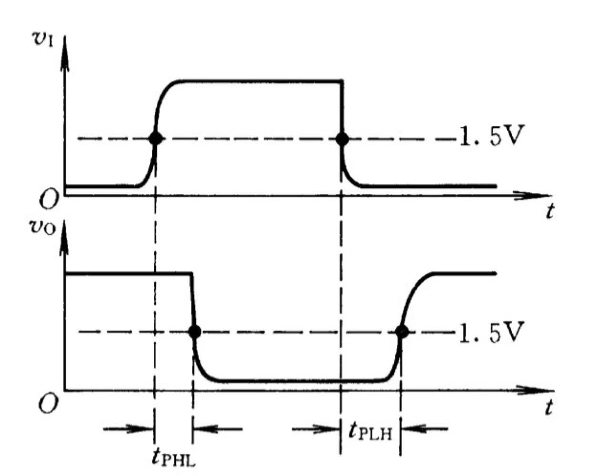

原因：三极管和二极管结电容和分布电容的影响。

#### 2 电源的动态尖峰电流

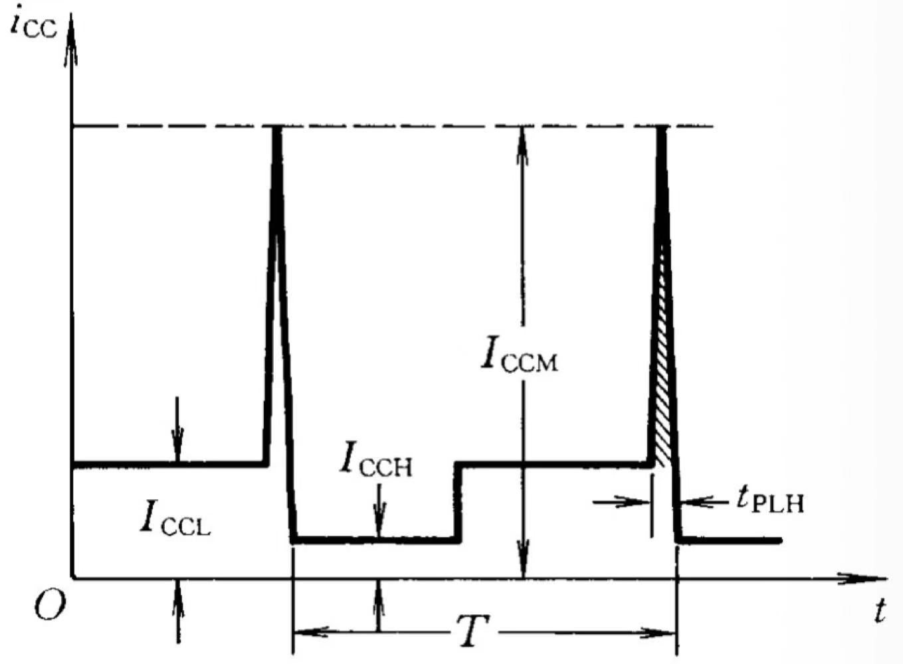

两种静态下电源负载电流不等：

$V_O = V_{OL}$ 时，$I_{CCL} \approx 3.4\text{mA}$

$V_O = V_{OH}$ 时，$I_{CCH} \approx 1.1\text{mA}$

$L \rightarrow H$，$T_5$ 饱和 $\rightarrow$ 截止

$T_5$ 的存储电荷放电形成尖峰电流。

$f \uparrow \Rightarrow I_{CC} \uparrow$ 次数更多！产生电磁干扰。

### 其它逻辑功能的 TTL 门电路

#### 1 与非门

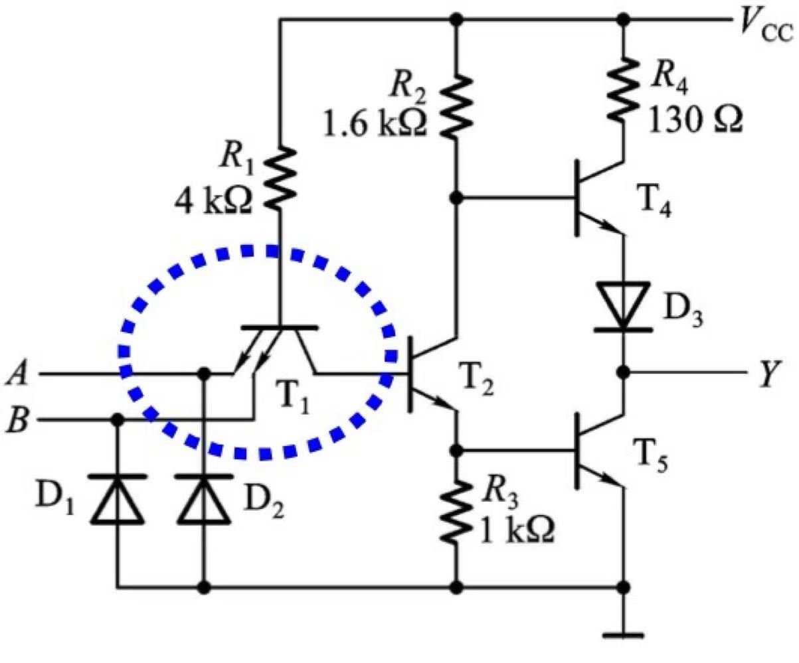

只有 $A, B$ 同时为 "1" 时，$T_4$ 截止，输出 $Y$ 为低电平。
$Y = (AB)'$

#### 2 或非门

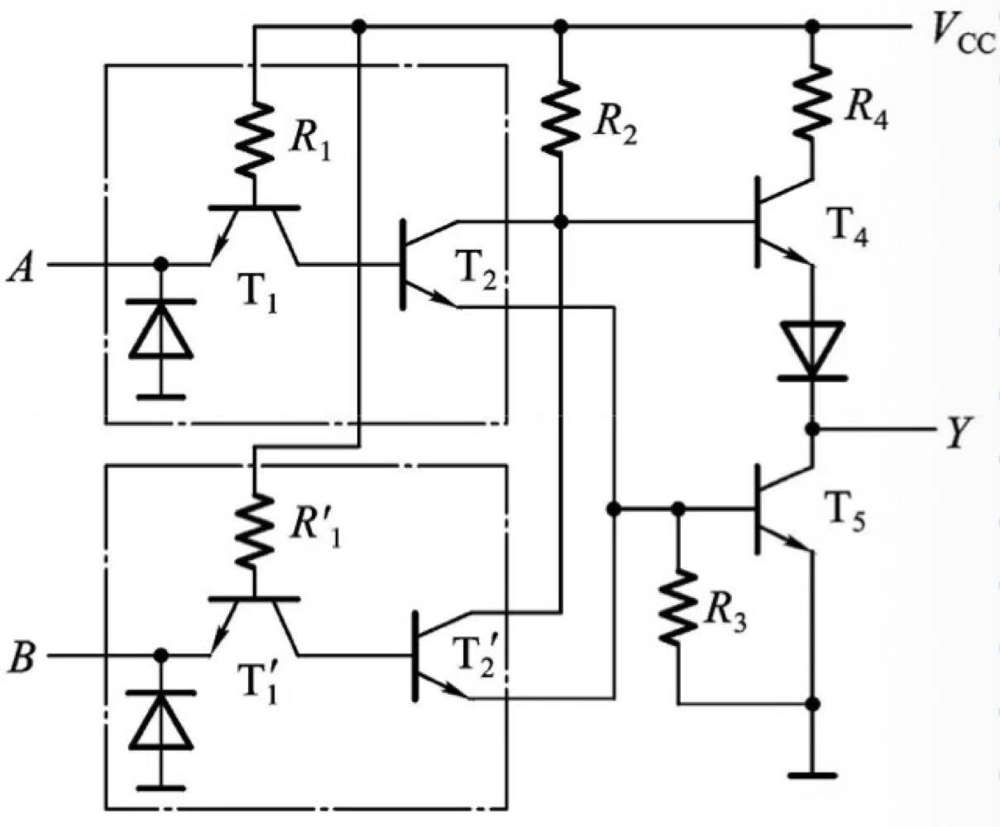

#### 3 与或非门

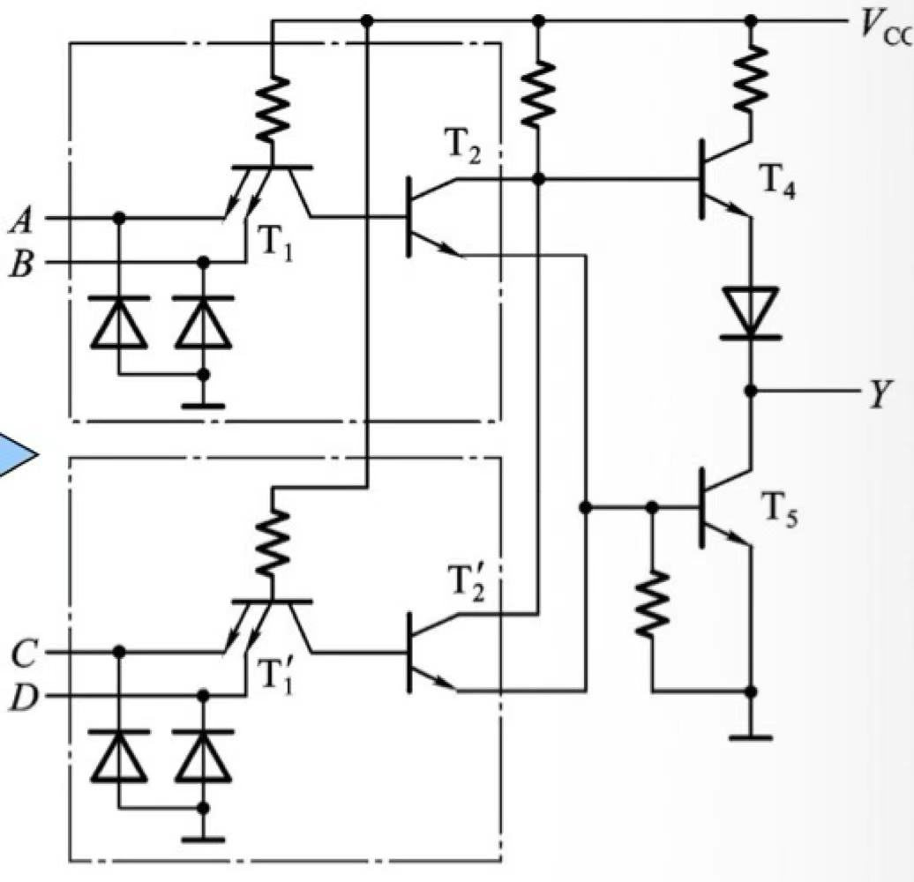

#### 4 异或门

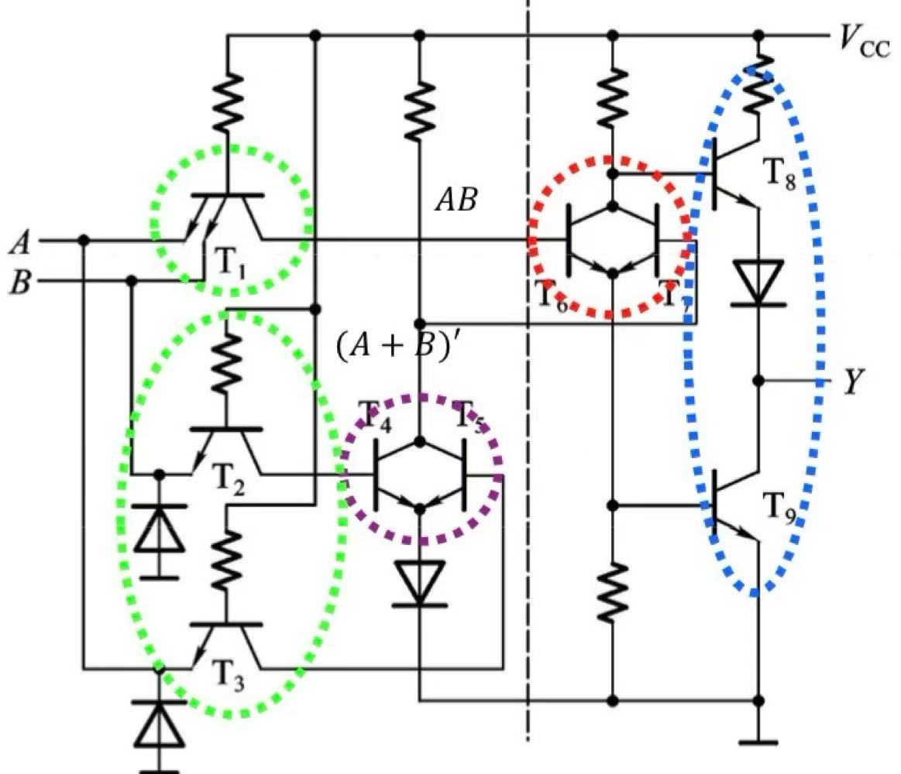

### 集电极开路的门电路 (OC 门)

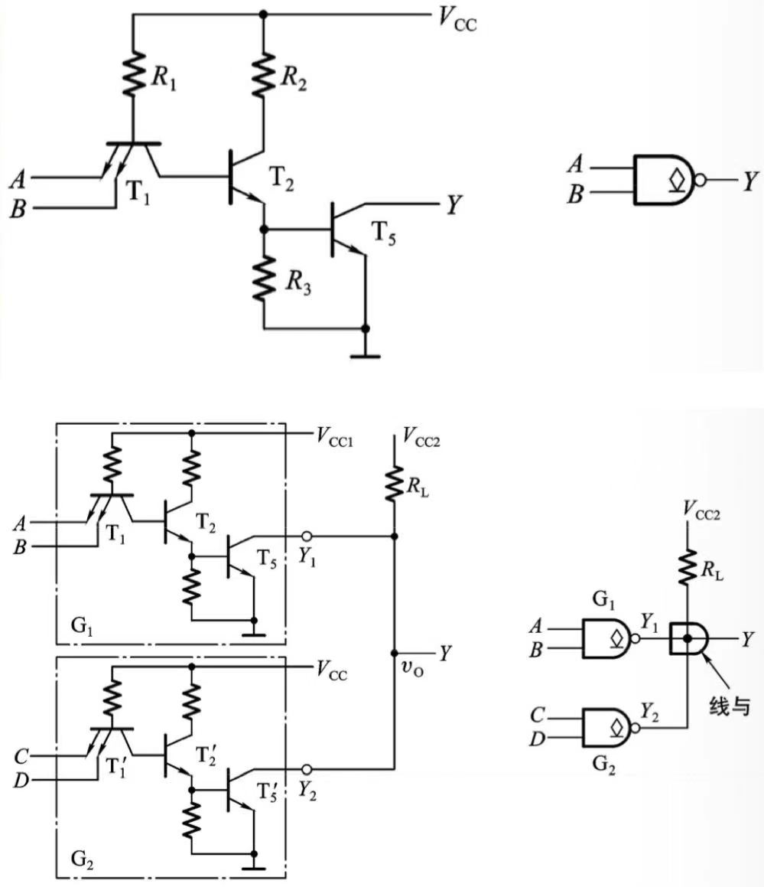

和 OD 门类似，通过取消上拉管来支持并联以实现线与。

$T_5$ 需要承受较大的电压和电流，需要特别选择管。

#### OC 门上拉电阻 $R_L$ 的计算

与 OD 门完全类似：

$\frac{V'_{CC} - V_{OL}}{I_{OL(\max)} - m' |I_{IL}|} \leq R_L \leq \frac{V_{CC} - V_{OH}}{n I_{OH} + m I_{IH}}$

### TTL 三态门结构

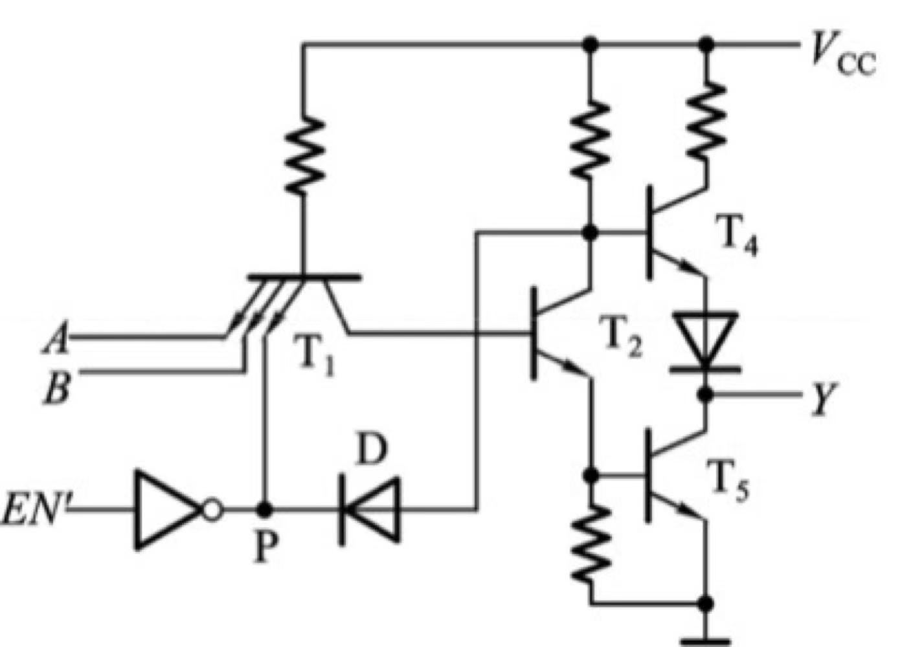

$EN' = 0,\quad P = 1,\quad D$ 截止 $\Rightarrow Y = (AB)'$

$EN' = 1,\quad P = 0,\quad D$ 导通 $\Rightarrow Y = Z$

---

## Chapter 4: Combinational Logic Circuit