# Electric Machinery
---
## I. Electric Machinery Principles

Speed: $\omega_m$ (rad/s) $\rightarrow f_m = \frac{\omega_m}{2\pi} \cdot n$ (per min) $\rightarrow n_m = 60 f_m$, $1 \text{ RPM} = \frac{\pi}{30} \text{ rad/s}$

Torque: Torque is counterclockwise!
**$\vec{\tau} = \vec{F} \times \vec{r} = J \cdot \vec{\alpha}$** $\swarrow$ $\vec{\alpha} = \frac{d\vec{\omega}}{dt}$
$\tau = F \cdot r \cdot \sin\theta$

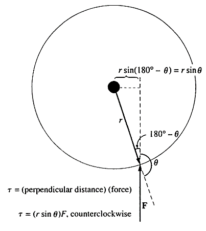

Work: **$W = \int_{\theta_1}^{\theta_2} \tau d\theta = \tau \cdot \theta$**

Power: **$P = \frac{dW}{dt} = \tau \frac{d\theta}{dt} = \tau \cdot \omega$**

watts & horsepower: $1 \text{ hp} = 746 \text{ W}$

The magnetic field:

$\oint_c \vec{H} \cdot d\vec{l} = \int_s \vec{J} \cdot d\vec{a} = I_{net}$   - Ampere's Law

$\oint_s \vec{B} \cdot d\vec{a} = 0$                      - MF's Gausses' Law

$\Rightarrow$ To simplify, we have a 1-D circuit equivalent of MF:
    **Magnetic circuit**

---

### § Simple Magnetic Circuit

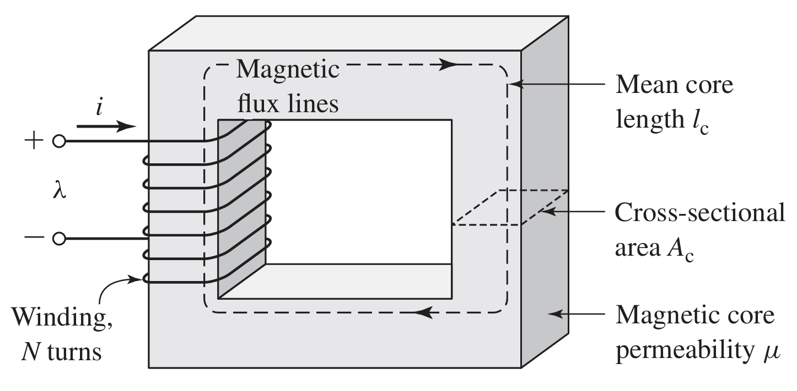

For a really high $\mu$: magnetic flux will be confined to the paths defined by the structure.
Thus, we can use magnetic circuit to simplify this model.

**Details:**

* The source of MF ($I_{net}$), **$\mathscr{F} = N \cdot i$**
  we call $\mathscr{F}$ as magnetomotive force (mmf)
  For multiple windings: $\mathscr{F} = N_1 \cdot i_1 + N_2 \cdot i_2 + \cdots$
* Magnetic flux: $\phi = \int_s \vec{B} \cdot d\vec{a}$ (Wb)
  Simplify as MC: **$\phi_c = B_c \cdot A_c$**
  $\phi_c$: core flux, $B_c$: core flux density
* mmf: According to Ampere's Law:
  $\mathscr{F} = I_{net} = \oint \vec{H} \cdot d\vec{l}$
  For MC: $\vec{H} \approx \vec{H}_c$, $l \approx l_c$, so:
  **$\mathscr{F} = N \cdot i = H_c \cdot l_c$** $\Rightarrow$ **$H_c = \frac{Ni}{l_c}$**
* $\vec{H}$ & $\vec{B}$: $\vec{B} = \mu\vec{H} \Rightarrow B = \mu \frac{Ni}{l_c}$

☆ **Magnetic Circuit V.S. Electric Circuit**

$\phi_c = B_c A_c = \mu \frac{Ni}{l_c} A_c$  	$\sim$	 $I = J \cdot a$

$\mathscr{F} = N \cdot i = H \cdot l$		$\sim$ 	$V = E \cdot l$

$\mathscr{R} = \frac{\mathscr{F}}{\phi_c} = \frac{l_c}{\mu A_c}$		     $\sim$	 $R = \frac{V}{I} = \rho \frac{l}{A}$

Magnetic analogue to Kirchhoff's Law:

Divergence of $\vec{B} = 0$   ($\nabla \cdot \vec{B} = 0$)

Total flux entering one node is 0.

Reluctance of MC:
Series: $\mathscr{R} = \mathscr{R}_1 + \mathscr{R}_2 + \mathscr{R}_3 + \cdots$
Parallel: $\frac{1}{\mathscr{R}} = \frac{1}{\mathscr{R}_1} + \frac{1}{\mathscr{R}_2} + \frac{1}{\mathscr{R}_3} + \cdots$

---

**The errors in MC computation:**

* There is a small fraction of the flux escapes from the core into the air. The flux outside is called **leakage flux**.
* The assumption of $l = l_c$ is not really very good, especially at corners.
* In ferromagnetic materials, the $\mu$ varies with the amount of flux already inside. Thus, the effect is always **nonlinear**.
* Air gap "fringing effect".

---

### § Magnetic Circuit with Air Gap

Provided $g$ is sufficiently small, we can analyze this as two series components.

Ignoring the leakage: $\phi_c = \phi_g = \phi$

$\mathscr{F} = Ni = \oint \vec{H} \cdot d\vec{l}= H_c l_c + H_g g = \frac{B_c}{\mu} l_c + \frac{B_g}{\mu_0} g$

$\Rightarrow$ **$\mathscr{F} = \phi (\frac{l_c}{\mu A_c} + \frac{g}{\mu_0 A_g})$**

$\Rightarrow$ verify the $\mathscr{R}$ series' law:

**$\mathscr{R} = \mathscr{R}_c + \mathscr{R}_g = \frac{l_c}{\mu A_c} + \frac{g}{\mu_0 A_g}$**

As $\mu$ is relatively much higher than $\mu_0$ ($2000 \sim 80000$ times), $\mathscr{R}_g \gg \mathscr{R}_c$

$\mathscr{R} \approx \mathscr{R}_g$, **$\phi \approx Ni \frac{\mu_0 A_g}{g}$**

---

As we mentioned before, $\mu$ in the core will change with flux inside. But with $\phi \approx Ni \frac{\mu_0 A_g}{g}$, its variation won't significantly affect the performance of MC, because the dominant $\mathscr{R}$ is that in air gap.

☆ Fringing effect: why $A_g \neq A_c$?

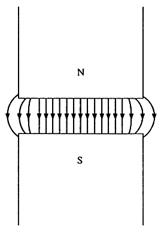

The fringing effect causes $A_g$ to increase, so there is always $A_g > A_c$.
If fringing is neglected, $A_g = A_c$.

---

### § Magnetic behavior of ferromagnetic materials
- Saturation

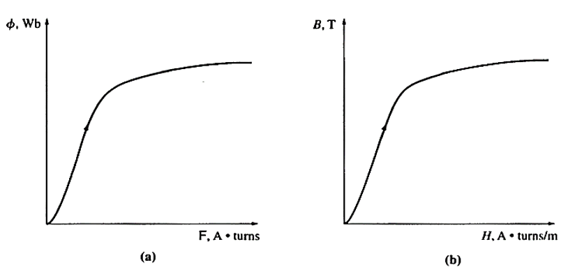

| $\phi = Ni \frac{\mu A}{l}$                 | $B = \mu H$                                 |
| ------------------------------------------- | :------------------------------------------ |
| $\mathscr{F} = Ni \uparrow, \mu \downarrow$ | $H = \frac{Ni}{l} \uparrow, \mu \downarrow$ |

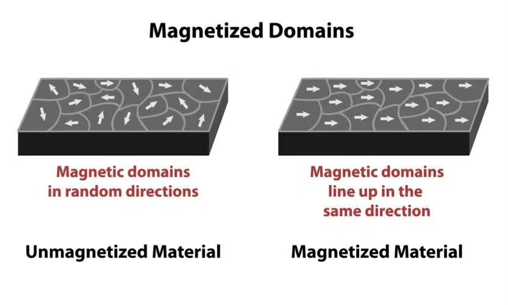

Saturation occurs when all the magnetic domains in a material are all aligned together. When the temperature reaches Curie Point ($T_c$), the domains will be reoriented and $\mu$ will decrease sharply.

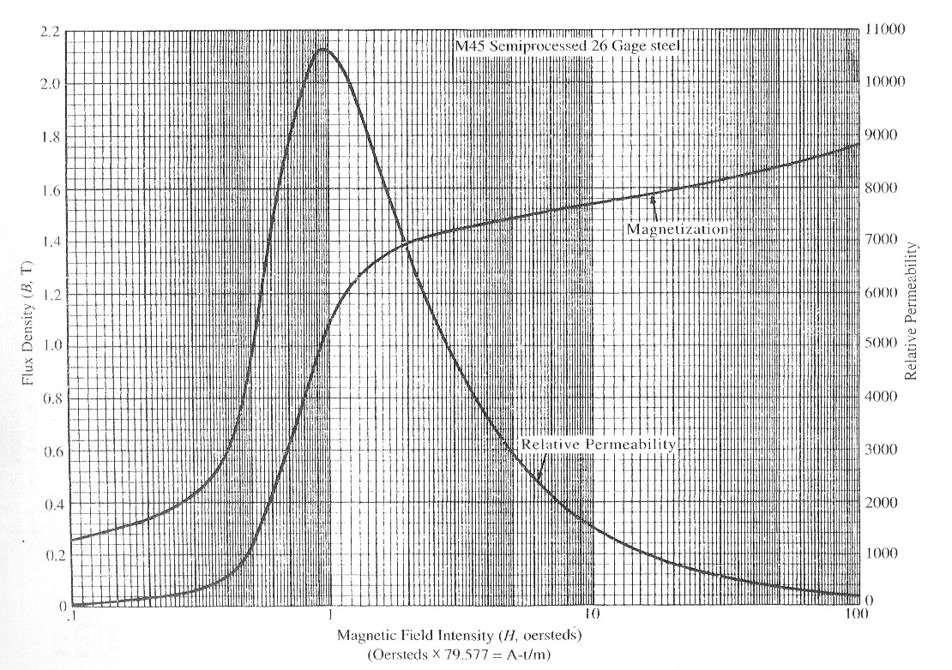

---

At first, $H \uparrow \rightarrow B \uparrow \uparrow, \mu_r \uparrow$;

Then, most of domains lined up, $\mu_r$ saturate as $\mu_{r \max}$;

Finally, $H \uparrow \uparrow \rightarrow B \uparrow, \mu_r \downarrow$, no more domains can contribute to the increase of $B, \mu \rightarrow \mu_0, \mu_r \rightarrow 1$.

**Energy loss in ferromagnetic core**

**Hysteresis Loss**

When a ferromagnetic material is subjected into an alternating MF, $B$ always lags behind $H$, which is called Hysteresis.

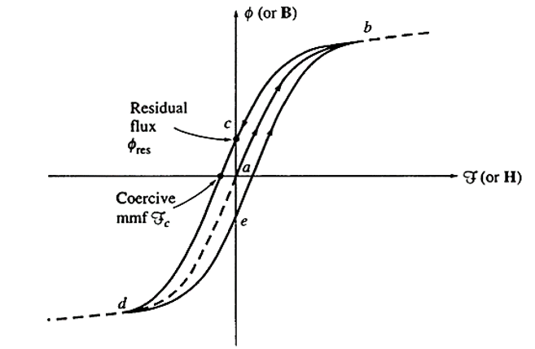

**Root causes:**

1) Friction of domain rotation;
2) Domain wall pinning (impurities, $\dots$);
   These effects above cause the process of magnetization to be irreversible.
   When $H$ removed, some domains stay aligned, creating Remanence.

**The effect of mmf on the loop**

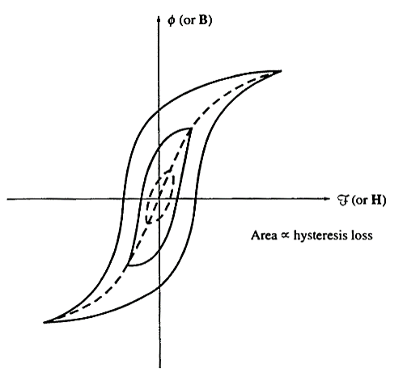

As $\mathscr{F} = Ni$ increasing, the loop grows taller and wider to reach the saturation point. This means hysteresis loss is higher as it equals to the area of the loop.

---

How to calculate Hysteresis Loss?

**$W = A_c l_m \int_{\text{one cycle}} H dB$**

$A_c$: cross-section area

$l_m$: mean magnetic path length

$A_c l_m = \text{Volume of the core}$

The integral is the area of B-H Loop.

Proof: $W = \int v(t)i(t)dt$

Faraday's Law: $v(t) = N \frac{d\Phi}{dt} = N A_c \frac{dB(t)}{dt}$

Ampere's Law: $H(t) l_m = N i(t) = \mathscr{F}$

Thus, $W = A_c l_m \int_{\text{one cycle}} H dB$ is proved.

Then, as for the power:
**$P = f \cdot A_c l_m \int_{\text{one cycle}} H dB$**

---

### § Faraday's law

Induced voltage magnitude and polarity
$$
\begin{cases}
e_i = -\frac{d\phi}{dt} \\
e_{ind} = \sum_{i=1}^{N} e_i
\end{cases}
$$
$N$: turns of wires

$\phi$: flux passing through coils

$\Rightarrow$ **$e_{ind} = -N \frac{d\phi}{dt}$**

Polarity - Lenz's Law

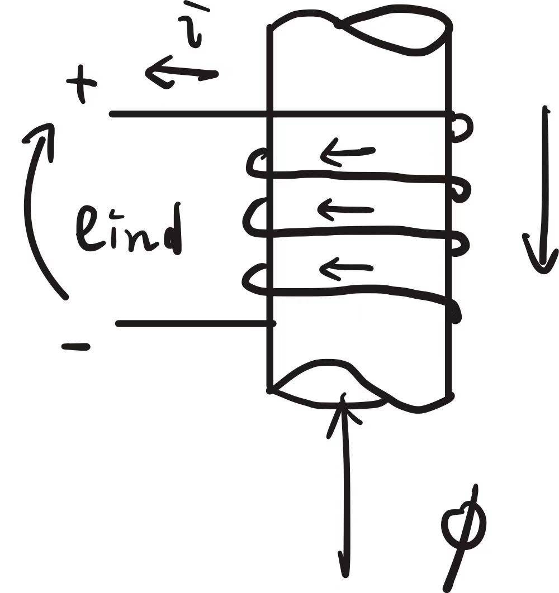

Direction of opposing flux $\phi$ increasing.

---

**Flux and flux linkage**

For $e_{ind} = N \frac{d\phi}{dt} = \frac{d(N\phi)}{dt}$, the term in parentheses is called the flux linkage $\lambda$ of the coil.

Thus:

**$e_{ind} = \frac{d\lambda}{dt}$**, where **$\lambda = \sum_{i=1}^{N} \phi_i$**

Unit of $\lambda$: Wb (or Weber-turns)

Produce an induced force on a wire

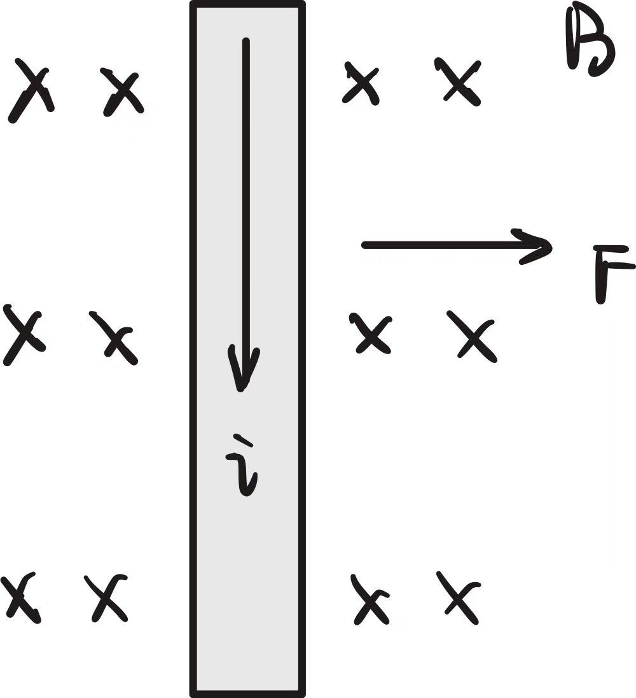

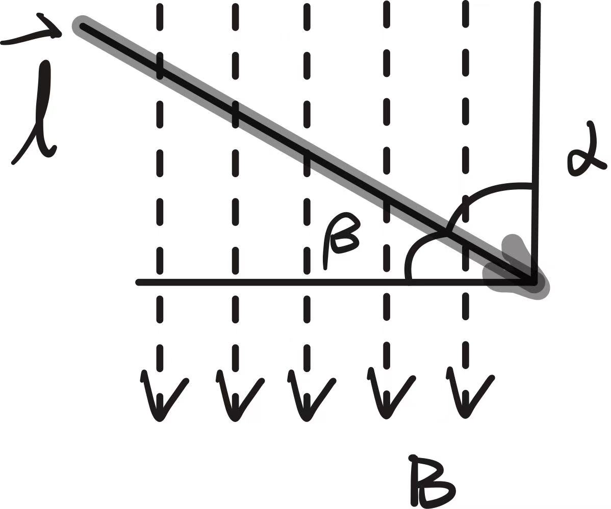

**$\vec{F} = i(\vec{l} \times \vec{B})$**
$F = i l B \sin\alpha$

---

**Flux bunching**

flux flowing in the same direction are the same polarity and repel each other. flux flowing in the opposite direction are of opposite polarity and attract each other.

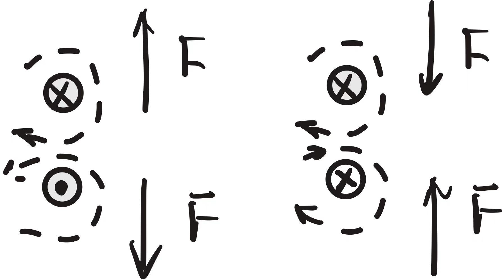

**Flux refuses to bunch!**

Application of flux bunching

Motor Action

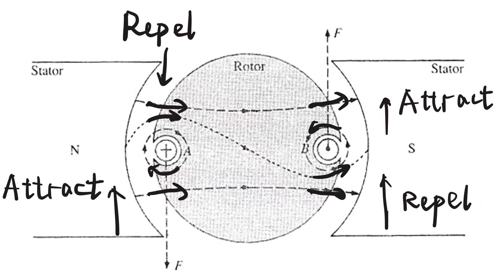

Counterclockwise rotation is generated from flux bunching.

---

### § Torque using a simplified diagram

$d$: distance between the center of the shaft and the center of conductor.

For each coil side:  $F = B i l \cos \beta$ 

(Considering Radial MF)

Torque: $T_D = 2 F d = 2 B i l d \cos\beta$ (N·m)

---

### § The Linear DC machine

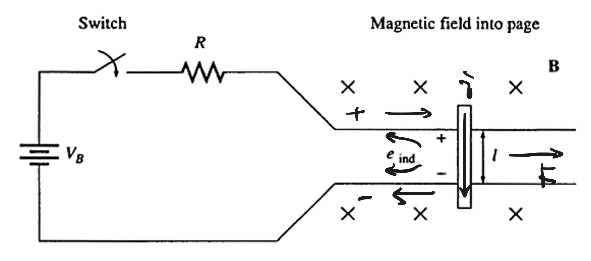

$\vec{F} = i(\vec{l} \times \vec{B})$

The voltage induced on a wire moving in B:

$e_{ind} = (\vec{v} \times \vec{B}) \cdot \vec{l}$

Thus:
$$
\begin{cases}
V_B = e_{ind} + iR = 0 \\
F_{net} = ma
\end{cases}
$$
$i = \frac{V_B - B l v}{R}$, $F = B i l = ma$

$v \uparrow, i \downarrow, a \downarrow, v \rightarrow v_{ss}$

**$v_{ss} = V_B / B l$**

---

**Linear DC motor while a load is applied**

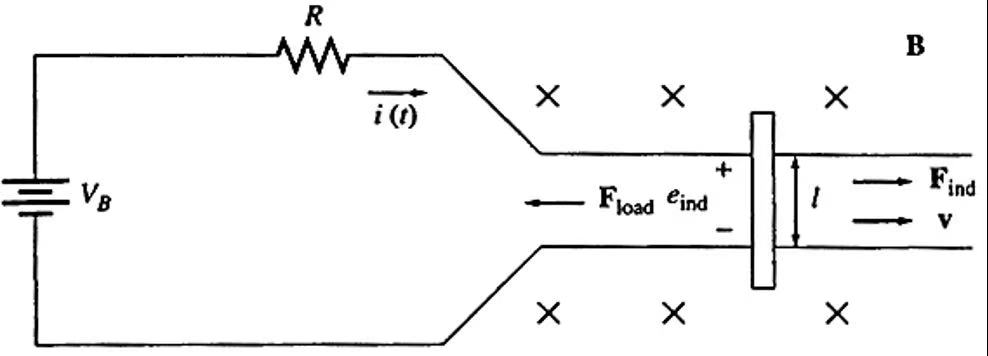

$P_{conv} = e_{ind} \cdot i = F_{ind} v$

A force $F_{load}$ is applied opposite to $\vec{v}$ and $F_{net}$ is negative now.

$v \downarrow$, $e_{ind} = B l v \downarrow$, $i \uparrow$, $F_{ind} \uparrow$

until $F_{ind} = F_{load} = 0$

$\frac{V_B - B l v'_{ss}}{R} B l = F_{load}$

$\Rightarrow$ **$v'_{ss} = \frac{B L V_B - F_{load} R}{B^2 l^2} = v_{ss} - \frac{F R}{B^2 l^2}$**

---

**Sinusoidal current flow from motion**

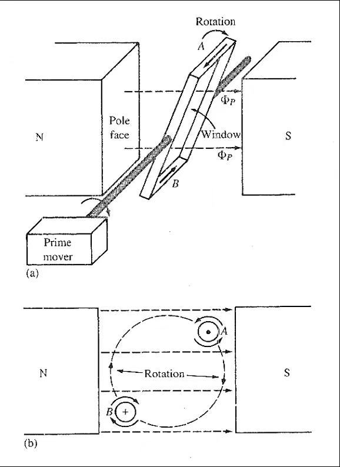

---

## II. Transformers
**Types and construction**

* Core-form:
  consists a simple rectangular laminated piece of steel with the transformers windings wrapped around two sides.

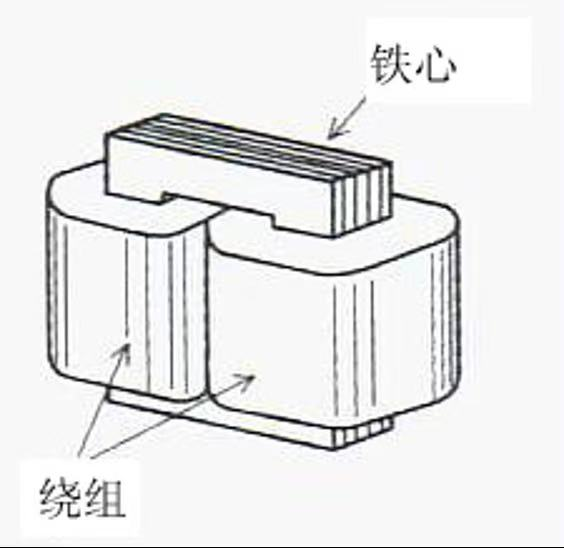

* Shell-form:
  consists three legs laminated core with winding wrapped around the center leg.

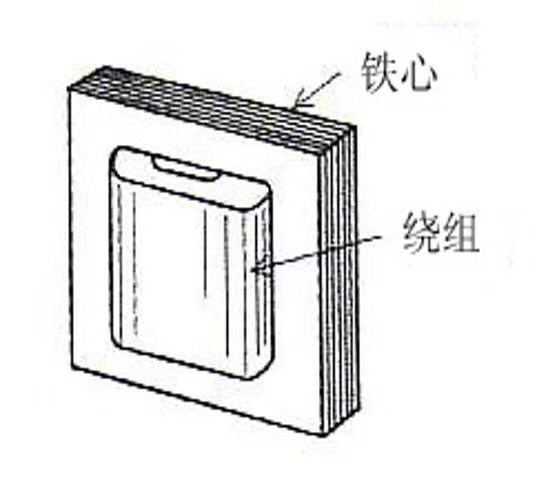

---

* Primary winding or input winding:
  The winding connected to the power source.
* Secondary winding or output winding:
  The winding connected to the loads.

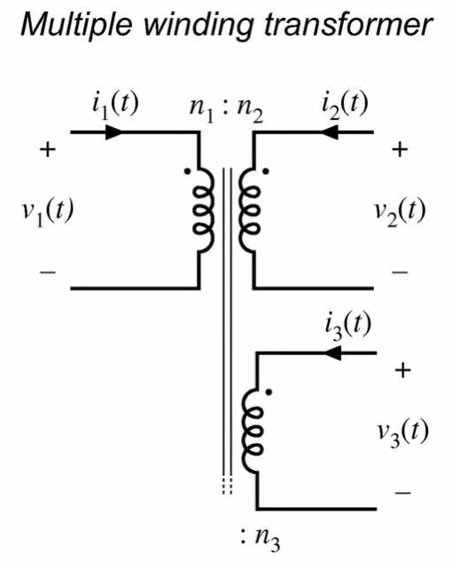

* Core material and eddy current:
  The core is constructed of thin laminations electrically isolated from each other in order to minimize the eddy current.
* Eddy current:

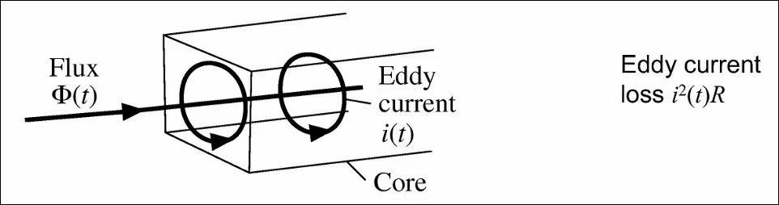

---

### § Ideal Transformer
* **Assumptions**

  **Neglect:** Leakage flux, copper losses, hysteresis losses, eddy-current losses.

* **Characteristics**

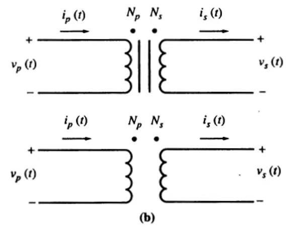

$\frac{v_p(t)}{v_s(t)} = \frac{N_p}{N_s} = a$

Energy balance:

$N_p i_p(t) = N_s i_s(t)$

$\frac{i_p(t)}{i_s(t)} = \frac{N_s}{N_p} = \frac{1}{a}$

Phasor relation:

$\frac{\dot{V}_p}{\dot{V}_s} = a$, $\frac{\dot{I}_p}{\dot{I}_s} = \frac{1}{a}$

The turns ratio $a$ only effects the magnitude not the angle.

---

* **Dot convention**

  If the primary current flows into the dotted end of the primary winding, the secondary current will flow out of the dotted end of the secondary winding.

* **Power**

  $P_{in} = V_p I_p \cos\theta_p$, $P_{out} = V_s I_s \cos\theta_s$
  
  Since the transformer can't change the angles, the primary and secondary windings have the same power factor.
  
  Power, reactive power, apparent power are all the same for input and output.
  
  $P_{in} = P_{out}$, $Q_{in} = Q_{out}$, $S_{in} = S_{out}$

---

* **Impedance transformation**

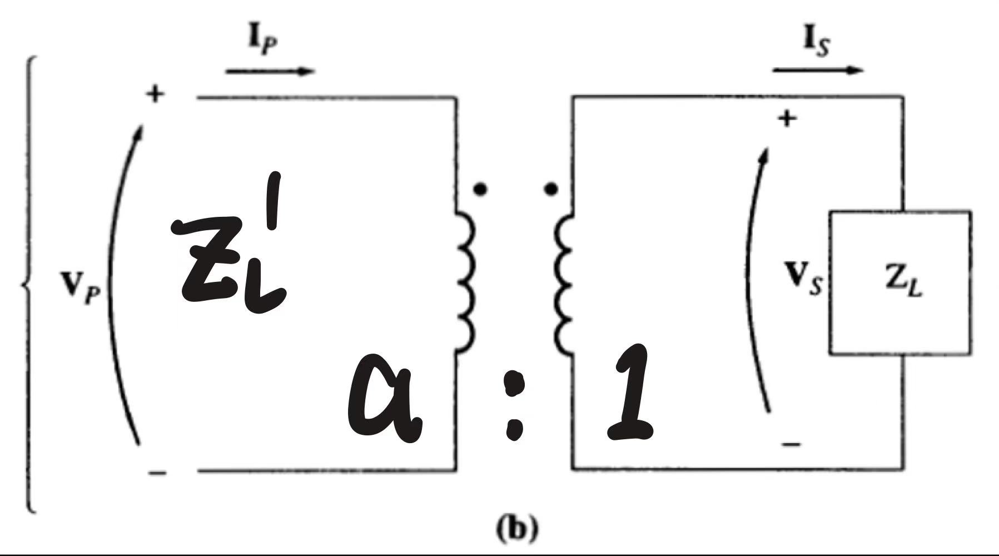

  $\dot{V}_p = a \dot{V}_s$

  $\dot{I}_p = \frac{1}{a} \dot{I}_s$

  $\dot{Z}'_L = \frac{\dot{V}_p}{\dot{I}_p} = a^2 \frac{\dot{V}_s}{\dot{I}_s}$

  $\Rightarrow$ **$\dot{Z}'_L = a^2 Z_L$**

---

**Transformer Quantities**

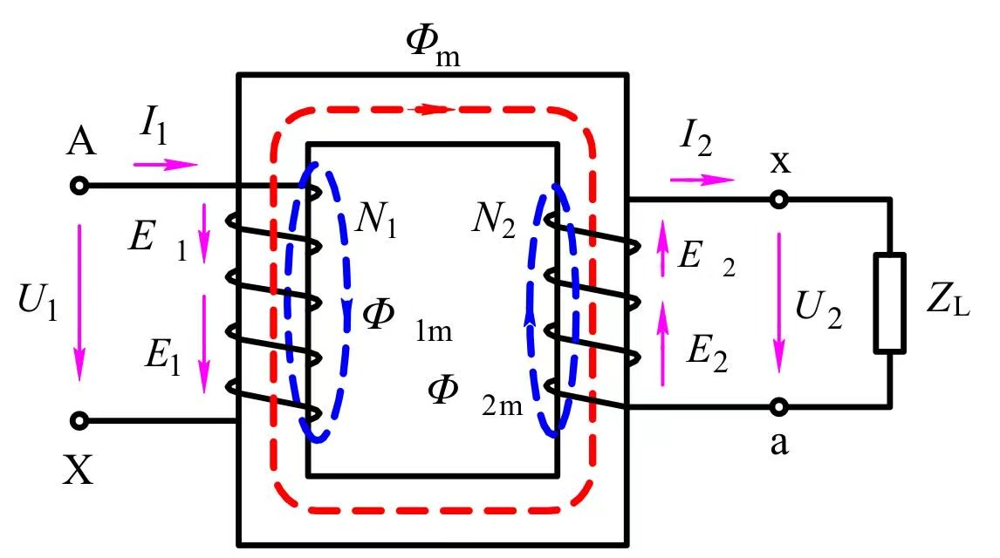

**Reference Direction**

* Current, Voltage, Flux and EMF

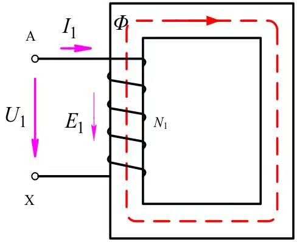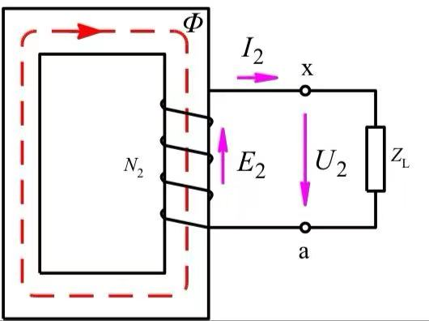

* Current, Flux

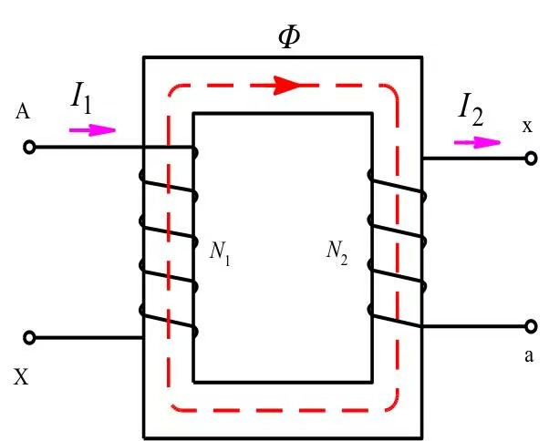

* EMF, Mutual Flux

---

### § No load operation of transformers

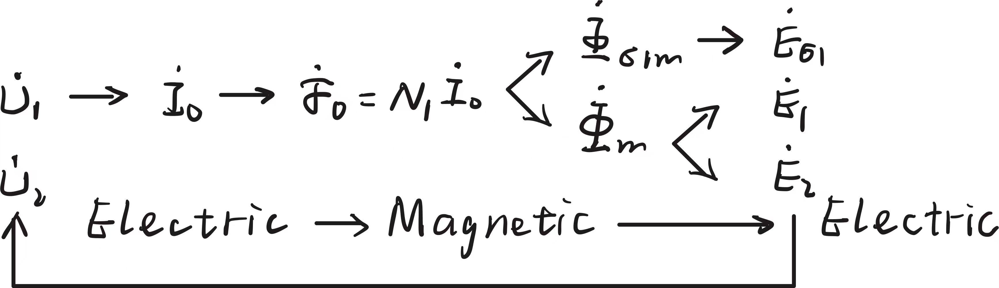

Mutual Magnetic Flux:

$\phi = \Phi_m \sin\omega t$, $\Phi_m$: Wb, $\omega$: rad/s

Induced EMF by Mutual Flux:

$e_1 = -N_1 \frac{d\phi}{dt}$, $e_2 = -N_2 \frac{d\phi}{dt}$

Emf on Primary winding:

$e_1 = -\omega N_1 \Phi_m \cos\omega t = E_{1m} \sin(\omega t - 90^\circ)$

Emf on Secondary winding:

$e_2 = -\omega N_2 \Phi_m \cos\omega t = E_{2m} \sin(\omega t - 90^\circ)$

---

Emf Phasor:

$\dot{E}_1 = -j \frac{1}{\sqrt{2}} \omega N_1 \dot{\Phi}_m = -j \sqrt{2} \pi \omega N_1 \dot{\Phi}_m$

**$\dot{E}_1 = -j 4.44 f N_1 \dot{\Phi}_m$**

Thus,

**$\dot{E}_2 = -j 4.44 f N_2 \dot{\Phi}_m$**

Neglecting leakage and losses:

$\dot{U}_1 = -\dot{E}_1 = j 4.44 f N_1 \dot{\Phi}_m = Z_m \cdot \dot{I}_0$

---

### § Loaded operation of transformers

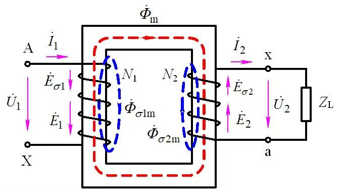

$\dot{E}_1 = -j \frac{1}{\sqrt{2}} \omega N_1 \Phi_m = -j 4.44 f N_1 \Phi_m$

$\dot{E}_2 = -j \frac{1}{\sqrt{2}} \omega N_2 \Phi_m = -j 4.44 f N_2 \Phi_m$

$\frac{\dot{E}_1}{\dot{E}_2} = \frac{N_1}{N_2} = a$

The same as no load operation.

What has changed? Mmf.
No load: $\dot{\mathscr{F}}_0 = N_1 \dot{I}_0 = \dot{\Phi}_m \mathscr{R}_m$
Loaded: $\dot{\mathscr{F}}_1 = N_1 \dot{I}_1$, $\dot{\mathscr{F}}_2 = N_2 \dot{I}_2$
$\dot{\mathscr{F}}_m = \dot{\mathscr{F}}_1 + \dot{\mathscr{F}}_2$

---

Mmf under loaded condition is similar to the Mmf under no load condition.
**$\dot{\mathscr{F}}_m = \dot{\mathscr{F}}_0 = \dot{\Phi}_m \mathscr{R}_m$**
Why?
$\Phi_m$ is determined by $\dot{E}_1$ according to $\dot{E}_1 = -j 4.44 f N_1 \Phi_m$, so $\Phi_m$ stays the same under loaded condition.
Thus, $\dot{\mathscr{F}}_m = \dot{\Phi}_m \mathscr{R}_m = \dot{\mathscr{F}}_0$.
$\Rightarrow \dot{\mathscr{F}}_1 = \dot{\mathscr{F}}_0 + (-\dot{\mathscr{F}}_2)$
$N_1 \dot{I}_1 = N_1 \dot{I}_0 - N_2 \dot{I}_2$
Primary = Source - Secondary
$\Rightarrow$ **$\dot{I}_1 = \dot{I}_0 - \frac{N_2}{N_1}\dot{I}_2 = \dot{I}_0 - \frac{1}{a}\dot{I}_2$**
   Magnetic current $\nearrow$              $\nwarrow$  Load current

---

### § Real Transformers v.s. Ideal Transformers
* Leakage flux  |  * Hysteresis losses
* Copper losses  |  * Eddy-current losses

**Voltage Relation derive from Faraday**

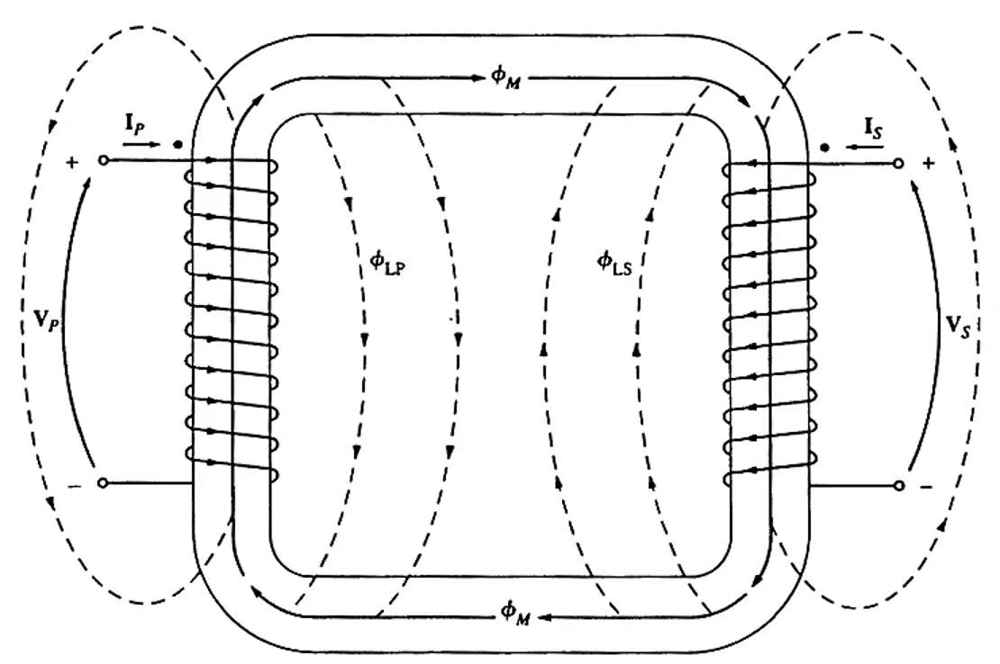

Induced voltage: 		    $\bar{\phi} = \frac{1}{N_p} \int v_p(t)dt$
Primary side flux:                    $\bar{\phi}_p = \phi_M + \phi_{LP}$
flux component linking both sides$\swarrow$            $\searrow$ primary leakage
Secondary side flux: $\bar{\phi}_S = \phi_m + \phi_{LS}$

Induced voltage on primary side:
$v_p(t) = N_p \frac{d\bar{\phi}_p}{dt} = N_p(\frac{d\phi_m}{dt} + \frac{d\phi_{LP}}{dt})$
**$v_p(t) = e_p(t) + e_{Lp}(t)$**

Induced voltage on secondary side:

$v_s(t) = N_s \frac{d\bar{\phi}_S}{dt} = N_s(\frac{d\phi_m}{dt} + \frac{d\phi_{LS}}{dt})$

**$v_s(t) = e_s(t) + e_{Ls}(t)$**

Induced by mutual flux:

Primary voltage from $\bar{\phi}_m$: $e_p(t) = N_p \frac{d\bar{\phi}_m}{dt}$

Secondary voltage from $\bar{\phi}_m$: $e_s(t) = N_s \frac{d\bar{\phi}_m}{dt}$

Notice that: $\frac{e_p(t)}{N_p} = \frac{d\bar{\phi}_m}{dt} = \frac{e_s(t)}{N_s}$

Therefore: $\frac{e_p(t)}{e_s(t)} = \frac{N_p}{N_s} = a$

Since in a well-designed transformer $\phi_m \gg \phi_{Lp}$, $\phi_m \gg \phi_{LS}$, this is approximately correct.

---

**Modeling the leakage flux by leakage inductance**

$e_{Lp}(t) = N_p \frac{d\bar{\phi}_{Lp}}{dt}$, $e_{Ls}(t) = N_s \frac{d\bar{\phi}_{Ls}}{dt}$

$\bar{\phi}_{Lp} = \mathscr{P} N_p i_p$, $\bar{\phi}_{Ls} = \mathscr{P} N_s i_s$

[for every circuit: $Ni = N_L i_L$]

$\mathscr{P} = \frac{1}{\mathscr{R}}$ : permeance of flux path

Thus, $e_{Lp}(t) = N_p^2 \mathscr{P} \frac{di_p}{dt}$

$e_{Ls}(t) = N_s^2 \mathscr{P} \frac{di_s}{dt}$

The constants can be lumped together.

Then let: $L = N^2 \mathscr{P}$

$e_L(t) = L \frac{di}{dt}$

---

### § Theory of operation of real single-phase transformers

**Secondary side open**

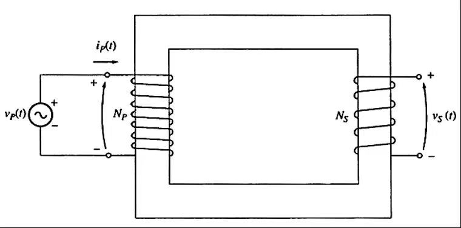

* Secondary side is open circuit.
* Input voltage and current to measure hysteresis curve.
* Flux is proportional to $v_p$ and mmf is proportional to $i_p$.
* $i_p(t) = 0$ for ideal transformer.

---

**Magnetization current in real transformers**

1. The magnetization current $i_m$ is used to generate mutual flux $\phi_M$.
2. While secondary side is opened, the current measured at primary side contains two parts and is called excitation current $i_{ex}$, which includes:

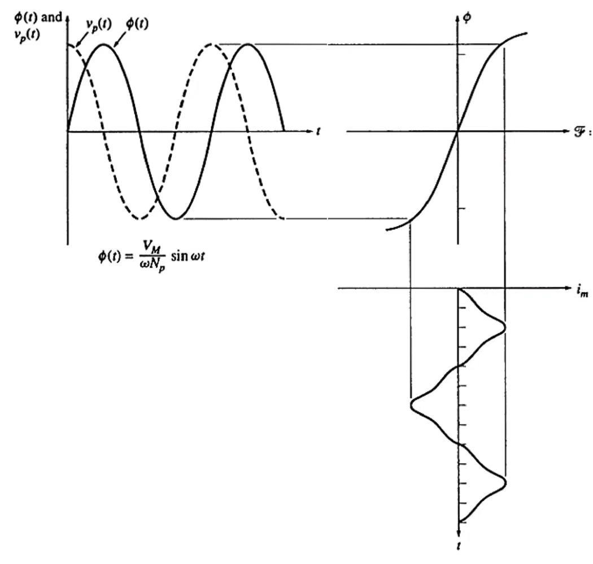

* Magnetization current $i_m$:

  To generate mutual flux.
  
* Core loss current $i_{h+e}$:

  Hysteresis and eddy current.
  
* The magnetization current in the transformer is not sinusoidal.

  The higher-frequency components are due to magnetic saturation. ($i \uparrow \uparrow \Rightarrow \phi \uparrow \rightarrow$)

* The fundamental component of $i_m$ lags the voltage applied to the core by $90^\circ$.

**Core-loss current**

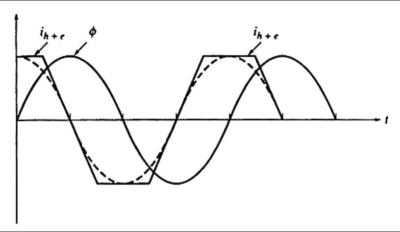

* The core-loss current $i_{h+e}$ is nonlinear because of the nonlinear effects of hysteresis.
* The fundamental component of $i_{h+e}$ is in phase with the voltage applied to the core.

**Excitation current**
We have **$i_{ex} = i_m + i_{h+e}$**, thus:

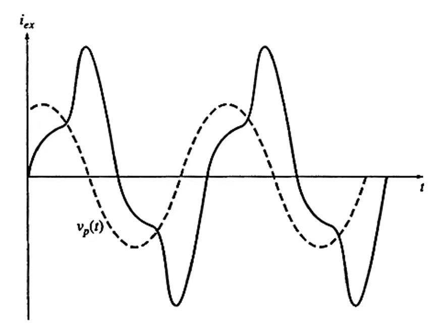

---

### § The equivalent circuit of non-ideal transformers
1> Copper losses. ($I^2R$, heating losses on windings)
2> Eddy current losses. (heating losses in the core)
3> Hysteresis losses.
4> Leakage flux. (self-inductance)

Modeling excitation current & copper losses
* **The hysteresis and eddy current** is in-phase with input voltage.

  $\Rightarrow$ Modeled as a shunt resistor **$R_c$**.
  
* **The magnetization current** is lagging input voltage by $90^\circ$.

  $\Rightarrow$ Modeled as a shunt inductor **$X_m$**.
  
* **The copper loss** can be modeled as series resistor $R_p$ and $R_s$.

---

**The resulting equivalent circuit**

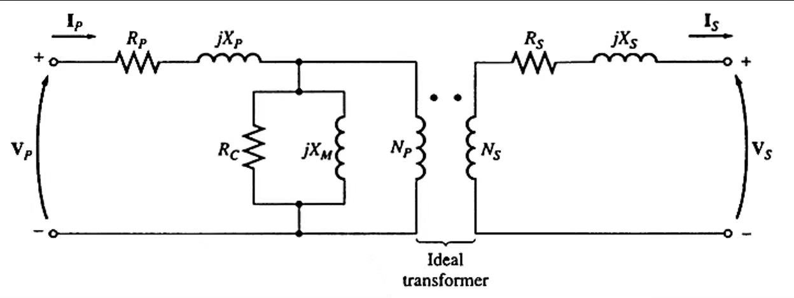

**Impedance transform to primary or secondary side**

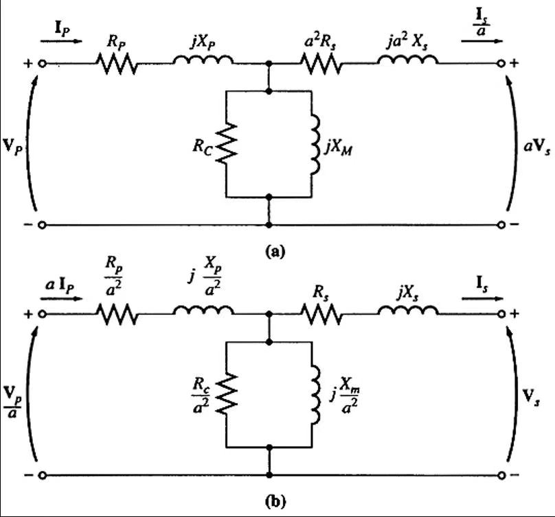

**Approximate equivalent circuit**

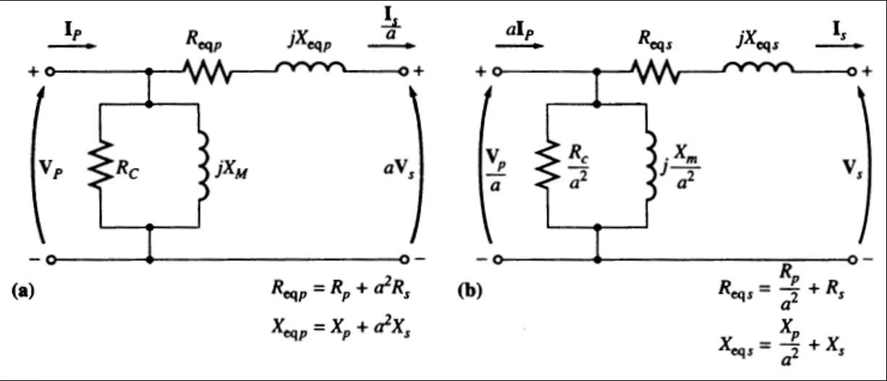

**Neglecting excitation current**

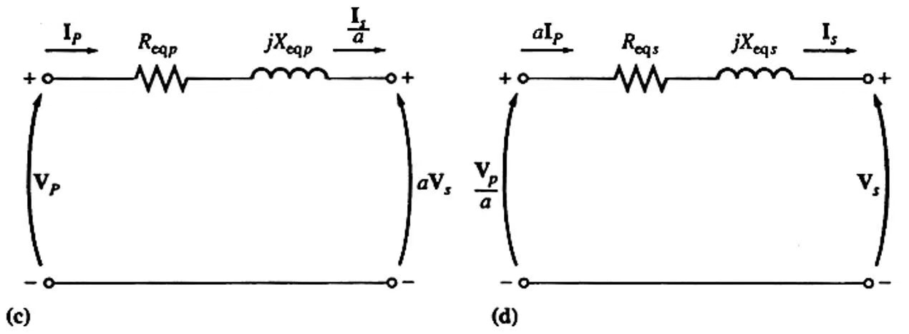

How to measure those parameters?
* **Open circuit test - excitation branch**
* **Short circuit test - series branch**

---

### § Open circuit test

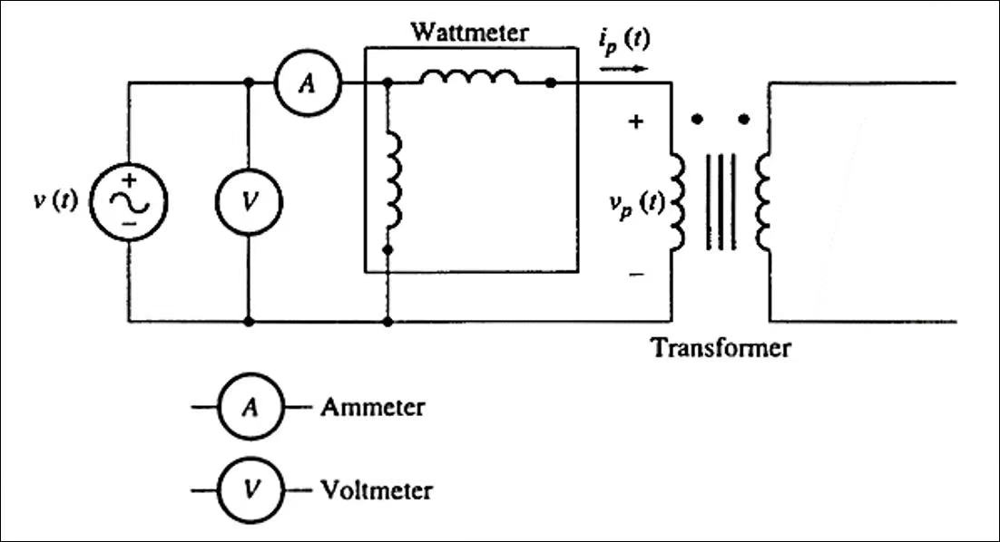

Under the open circuit condition, all the input current flows through the excitation branch.
Thus, we have:
$$
\begin{cases}
Y_E = \frac{I_{oc}}{V_{oc}} \angle -\theta \\
\theta = \cos^{-1}\frac{P_{oc}}{V_{oc} I_{oc}} \\
PF = \cos\theta = \frac{P_{oc}}{V_{oc} I_{oc}}
\end{cases}
$$

$$
Y_E = G_c - j B_M = \frac{1}{R_c} - j\frac{1}{X_M}
$$

---

### § Short circuit test

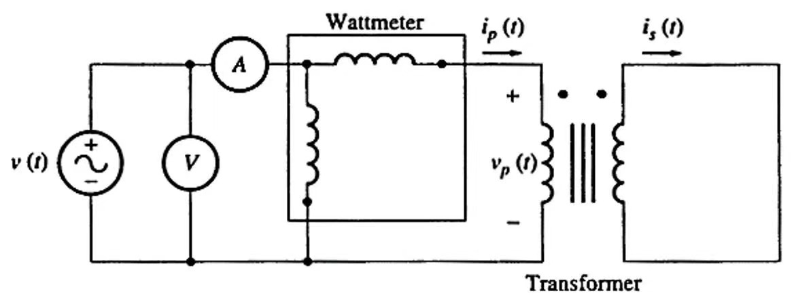

At secondary side short circuit condition, the input voltage must be very low to prevent input large short circuit current.
$$
\begin{cases}
|Z_{SE}| = \frac{V_{sc}}{I_{sc}} \\
Z_{SE} = \frac{V_{sc}}{I_{sc}} \angle \theta^\circ \\
PF = \cos\theta = \frac{P_{sc}}{V_{sc} I_{sc}}
\end{cases}
$$

$$
Z_{SE} = R_{eq} + j X_{eq}= (R_p + a^2 R_s) + j(X_p + a^2 X_s)
$$

---

### § Transformer voltage regulation and efficiency

Because a real transformer has series impedances within it, the load can influence the output voltage.

To conveniently compare transformers in this respect, we defined a quantity called voltage regulation (VR).

It's defined by the equation:

$$VR = \frac{V_{s,nl} - V_{s,fl}}{V_{s,fl}} \times 100\%$$

$V_{s,nl}$: No-load voltage of secondary side

Since at no load, $V_s = V_p / a$, thus:

$$VR = \frac{V_p/a - V_{s,fl}}{V_{s,fl}} \times 100\%$$
---

### § Transformer Phasor Diagram

To obtain the voltage regulation (VR), we use the phasor relation:
$$\frac{\vec{V}_p}{a} = \vec{V}_s + R_{eq}\vec{I}_s + j X_{eq}\vec{I}_s$$

**Phasor diagrams under different load conditions:**

* **Lagging power factor (inductive load):**
  $\vec{I}_s$ lags $\vec{V}_s$. The required primary voltage $\frac{V_p}{a}$ is significantly larger than the secondary terminal voltage $V_s$.
  
  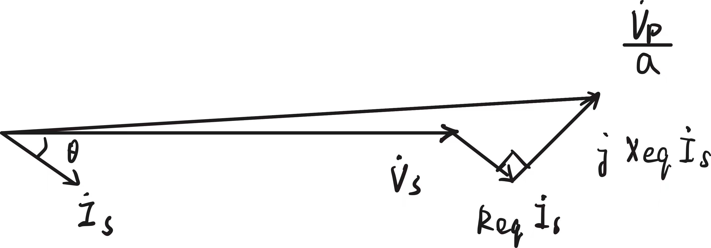

* **Unity power factor (resistive load):**
  $\vec{I}_s$ is in phase with $\vec{V}_s$. The voltage regulation is positive but smaller than the lagging case.
  
  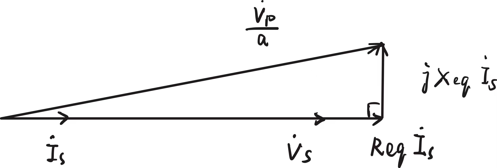
  
* **Leading power factor (capacitive load):**
  $\vec{I}_s$ leads $\vec{V}_s$. The terminal voltage $V_s$ can actually be larger than the referred primary voltage $\frac{V_p}{a}$, resulting in a negative voltage regulation.
  
  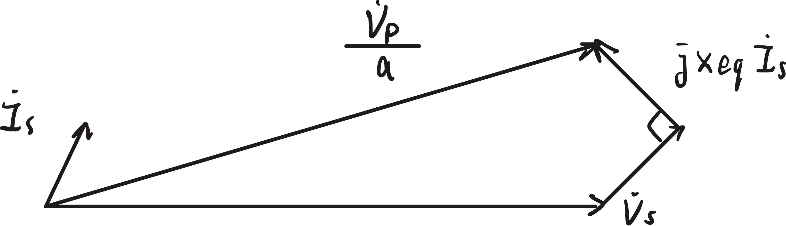
  
* **Approximation:**

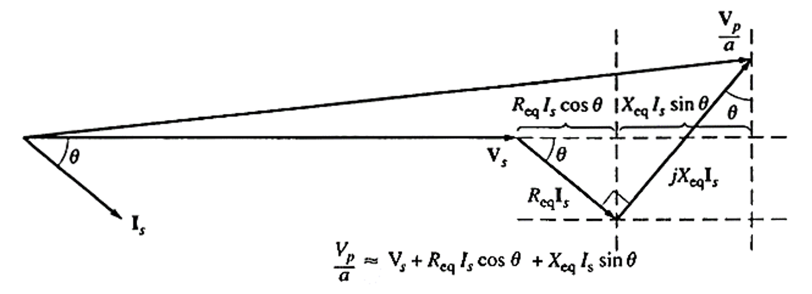

---

### § Transformer Efficiency

The efficiency of a transformer is defined as:
$$\eta = \frac{P_{out}}{P_{in}} \times 100\% = \frac{P_{out}}{P_{out} + P_{loss}} \times 100\%$$

When is the efficiency maximized?

$$\eta = 1 - \frac{\sum P}{P_{2} + \sum P}$$

$$P_2 = U_2 I_2 \cos \varphi_2 \approx U_{2N} I_2 \cos \varphi_2$$

$$= \beta S_N \cos \varphi_2$$

$S_N$ : Apparent Power , $S_N = U_{2N} I_{2N} $$ \beta $: Load Factor ,$ \beta = I_2 / I_{2N} $

$P_{Fe} \approx p_0 \text{ (constance)} $$ P_{cu} = P_k = \frac{I_2^2}{I_{2N}^2} P_{kN} = \beta^2 P_{kN} $

Thus ,

$$\eta = \left( 1 - \frac{P_0 + \beta^2 P_{kN}}{\beta S_N \cos \varphi_2 + P_0 + \beta^2 P_{kN}} \right) \times 100 \%$$

For constant power factor :

$P_0 = \beta_m^2 P_{kN}$ ，$\beta_m = \sqrt{\frac{P_0}{P_{kN}}}$

$\beta = \frac{I_1}{I_{1N}} = \frac{I_2}{I_{2N}}$

For a certain $P_{2N}$

we have:

$$\frac{1}{\eta} = \frac{\beta P_{2N} + P_0 + \beta^2 P_{kN}}{\beta P_{2N}} = 1 + \frac{1}{P_{2N}} \left( \frac{P_0}{\beta} + \beta P_{kN} \right)$$

Therefore , when $\beta = \beta_m$ , $\left( \frac{1}{\eta} \right)_{min} \Rightarrow \eta_{max}$

Efficiency is optimized when copper loss = core loss !

Core loss is constant ($P_{Fe}$), while copper loss varies as $\beta^2 P_{Cu,fl}$.

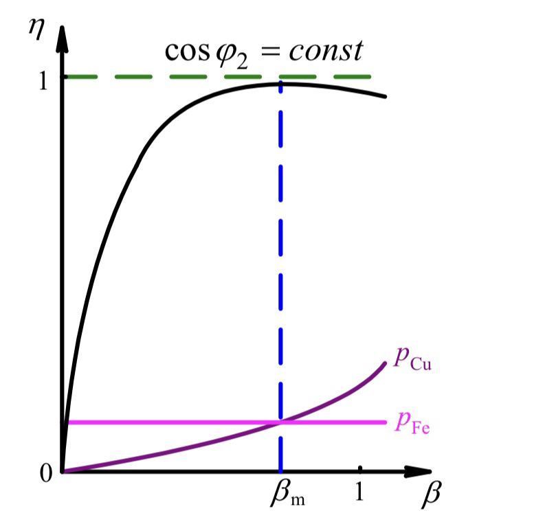

Efficiency is optimized (maximized) when **copper loss equals core loss**:
$$\beta^2 P_{Cu,fl} = P_{Fe}$$

The load factor for maximum efficiency is:
$$\beta_m = \sqrt{\frac{P_{Fe}}{P_{Cu,fl}}}$$

---

### § Transformer Taps and Voltage Regulation

* **Transformer Taps**: Taps are intermediate connection points on the transformer windings used to change the effective turns ratio $a$. When the utility line voltage fluctuates, changing the taps helps maintain a stable output voltage.
* **TCUL (Tap Changing Under Load)**: A specialized transformer capable of changing its tap connections while the power is connected and the transformer is under load.
* **Voltage Regulator**: A TCUL equipped with automatic voltage sensing circuitry that changes taps dynamically to maintain the output voltage at a predefined level.

---

### § The Autotransformer

* **Autotransformer**: A transformer in which the primary and secondary windings share a common physical winding.
  * Allows continuous tuning of the output voltage magnitude.
  * The physical size (and cost) of an autotransformer is smaller than a conventional two-winding transformer of the same power rating.
  * There is **no electrical isolation** between the primary and secondary sides.

**The Step-Up Connection of Autotransformer (AT):**

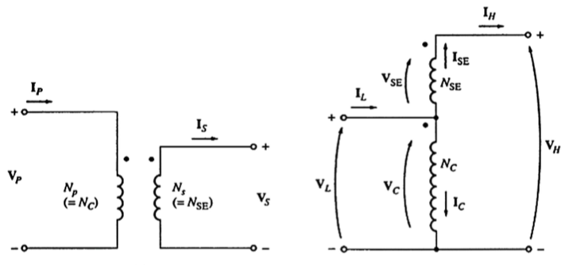

An autotransformer has one continuous winding divided into:
* Common winding with $N_C$ turns.
* Series winding with $N_{SE}$ turns.

---

### § The Step-Down Connection of Autotransformer

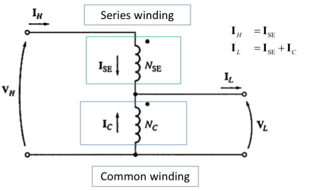

**Voltage and current relations in the windings:**
* Coil voltage and current in $N_C$ and $N_{SE}$ follow the standard transformer relations:
  $$\frac{V_C}{V_{SE}} = \frac{N_C}{N_{SE}}$$
  $$N_C I_C = N_{SE} I_{SE}$$

* **Terminal voltage and current relationships (Step-Down):**
  * Low-voltage side: $V_L = V_C$, $I_L = I_C + I_{SE}$
  * High-voltage side: $V_H = V_C + V_{SE}$, $I_H = I_{SE}$
  
  $$\frac{V_L}{V_H} = \frac{N_C}{N_C + N_{SE}}$$
  $$\frac{I_L}{I_H} = \frac{N_C + N_{SE}}{N_C}$$

---

### § Apparatus Power Rating Advantage of Autotransformer

We define two power ratings:
* **Terminal apparent power rating ($S_{IO}$)**: The apparent power transformed and delivered between terminals.
  $$S_{IO} = V_L I_L = V_H I_H$$
* **Winding apparent power rating ($S_W$)**: The actual physical capacity of the winding/core.
  $$S_W = V_C I_C = V_{SE} I_{SE}$$

The relation between them is:
$$S_W = V_L (I_L - I_H) = S_{IO} \left(1 - \frac{N_C}{N_C + N_{SE}}\right) = S_{IO} \frac{N_{SE}}{N_C + N_{SE}}$$

Therefore:
$$\frac{S_{IO}}{S_W} = \frac{N_C + N_{SE}}{N_{SE}} > 1$$

* **Advantage**: Since $N_C + N_{SE} > N_{SE}$, the terminal capacity $S_{IO}$ is always larger than the physical winding capacity $S_W$. This advantage becomes very large when the primary and secondary voltages are close (i.e., $N_{SE}$ is small). It provides a highly compact and inexpensive way to tie two nearly equal voltages together.

---

### § Review of Three-Phase Power

Three-phase systems have two main connection types: **Wye ($\text{Y}$)** and **Delta ($\Delta$)**.

* **Line voltage ($V_L$)**: The voltage between any two line conductors ($V_{AB}$, $V_{BC}$, $V_{CA}$).

* **Phase voltage ($V_\phi$)**: The voltage across a single phase winding ($V_{AN}$, $V_{BN}$, $V_{CN}$).

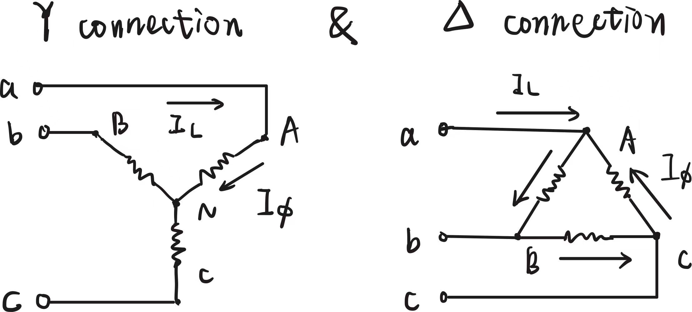

**Wye ($\text{Y}$) connection:**

* Line voltage is $\sqrt{3}$ times phase voltage: $V_L = \sqrt{3} V_\phi$

* Line current equals phase current: $I_L = I_\phi$

* Line voltages lead their corresponding phase voltages by $30^\circ$ (for positive sequence ABC).

  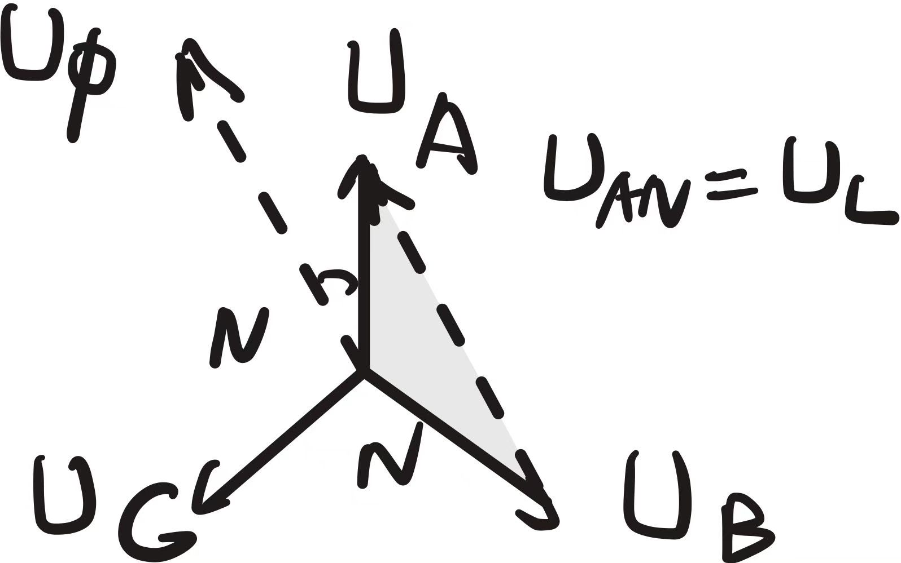

**Delta ($\Delta$) connection:**

* Line voltage equals phase voltage: $V_L = V_\phi$

* Line current is $\sqrt{3}$ times phase current: $I_L = \sqrt{3} I_\phi$

* Line currents lag their corresponding phase currents by $30^\circ$ (for positive sequence ABC).

  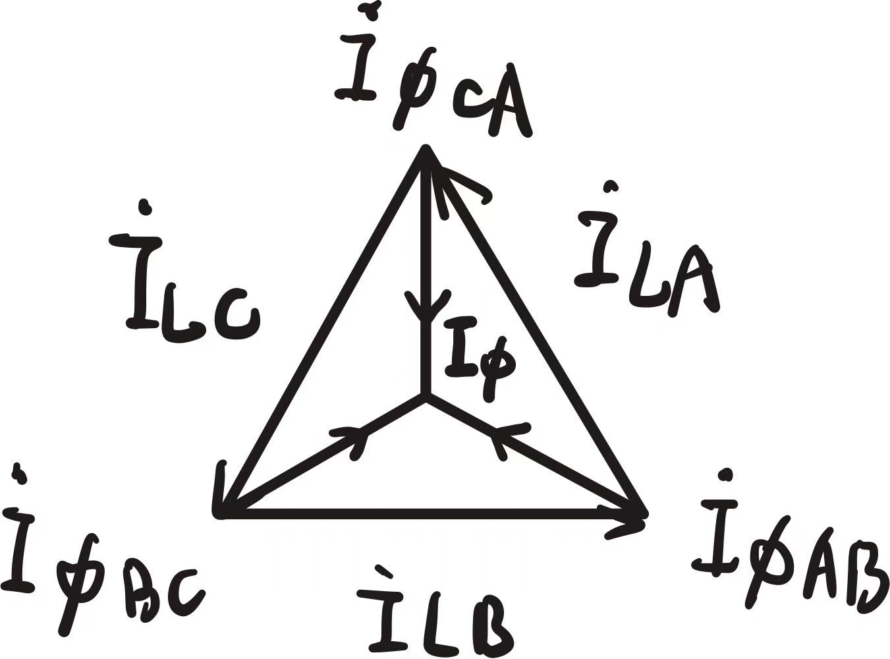

---

### § Three-Phase Power Equations

* **Power on a single phase:**
  $$P_\phi = V_\phi I_\phi \cos\theta$$
* **Total active power ($P$):**
  $$P = 3 P_\phi = 3 V_\phi I_\phi \cos\theta = \sqrt{3} V_L I_L \cos\theta \quad (\text{W})$$
* **Total reactive power ($Q$):**
  $$Q = \sqrt{3} V_L I_L \sin\theta \quad (\text{var})$$
* **Total apparent power ($S$):**
  $$S = \sqrt{3} V_L I_L \quad (\text{VA})$$

* **Phase sequence:**
  * Positive sequence: $A \to B \to C$
  * Negative sequence: $A \to C \to B$

> [!IMPORTANT]
> The turns ratio $a$ applies directly to the **Phase Voltages** of the transformer windings, not blindly to the line voltages.
>
> * **Delta ($\Delta$) connection**: Suitable for low voltage, high current (since $I_L = \sqrt{3} I_\phi$).
> * **Wye ($\text{Y}$) connection**: Suitable for high voltage, low current (since $V_L = \sqrt{3} V_\phi$).

---

### § Three-Phase Transformer Connections

A three-phase transformer bank can be connected in four ways:

#### 1) Wye-Wye (Y-Y) Connection

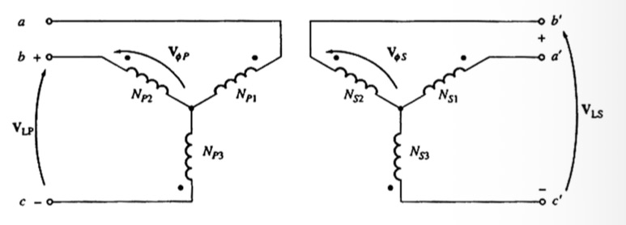

* The line voltage ratio is:
  $$\frac{V_{LP}}{V_{LS}} = \frac{\sqrt{3} V_{\phi P}}{\sqrt{3} V_{\phi S}} = a$$

> [!WARNING]
>  1. If the loads are unbalanced, the neutral point will shift, causing severe unbalance in phase voltages.
>  2. The third-harmonic voltage component can be very large.

> [!IMPORTANT]
> **Why is the third-harmonic voltage large?**
> The third-harmonic magnetizing currents in all three phases are in-phase ($3(\omega t - 120^\circ) = 3\omega t$). Being zero-sequence components, they require a return path to flow. In an ungrounded $\text{Y-Y}$ connection, they cannot flow, distorting the core flux and inducing large third-harmonic voltages.
> 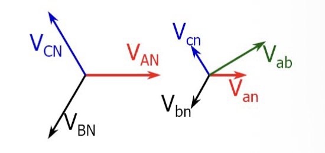

**Solutions:**
1. **Solidly ground the neutral** of the primary winding to the source neutral, providing a path for the third-harmonic currents.
2. **Add a $\Delta$-connected tertiary winding**. The third-harmonic currents circulate inside the closed $\Delta$ loop, suppressing the harmonic voltage.

> [!IMPORTANT]
> **Why $\Delta$ is special?**
> With a Delta connection, we do not need a neutral line to release the third-harmonic current. Its physical loop construction allows third-harmonic currents to circulate and be confined within the loop.

---

#### 2) Wye-Delta ($\text{Y-}\Delta$) Connection:

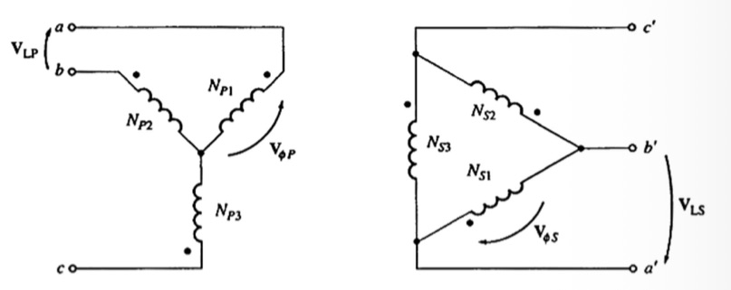

* The line voltage ratio is:
  $$\frac{V_{LP}}{V_{LS}} = \frac{\sqrt{3} V_{\phi P}}{V_{\phi S}} = \sqrt{3} a$$
* There is a $30^\circ$ phase shift between primary and secondary sides. Typically, the secondary line voltage lags the primary line voltage by $30^\circ$.

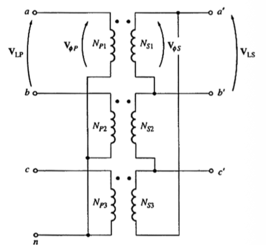

* Because of the closed Delta winding, we do not have third-harmonic components in Wye-Delta.
* In the United States, the standard convention is that the secondary voltage lags the primary voltage by $30^\circ$.

---

#### 3) Delta-Wye ($\Delta\text{-Y}$) Connection:

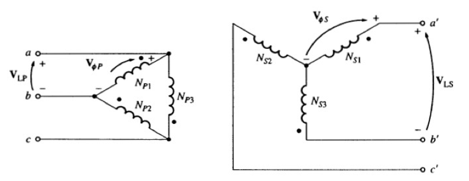

* The line voltage ratio is:
  $$\frac{V_{LP}}{V_{LS}} = \frac{V_{\phi P}}{\sqrt{3} V_{\phi S}} = \frac{a}{\sqrt{3}}$$
  
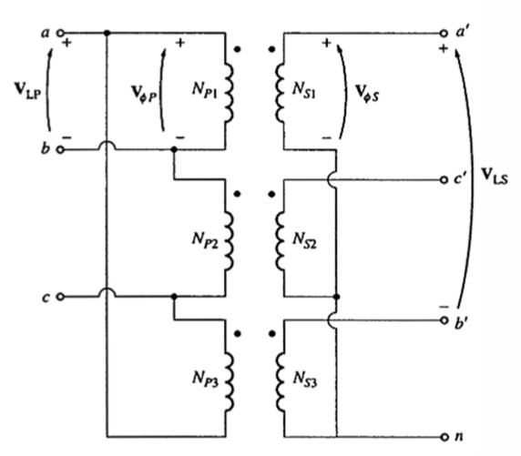

**Delta-Wye Connection Applications**

* **Common Applications:**
  * Widely used for step-down distribution (transforming a 3-phase 3-wire line to a 3-phase 4-wire line, providing a neutral for single-phase loads).
  * Used to isolate the ground of the Wye side from the source ground on the Delta side.
  
> **Summary:**
> -  **$\Delta\text{-Y}$**: Common for **step-down** distribution. 
>    Low-voltage side is grounded Wye (3-phase 4-wire). 
>    High-voltage Delta isolates zero-sequence currents.
> - **$\text{Y-}\Delta$**: Common for **step-up** generation or interconnection.
>    High-voltage side is grounded Wye.
>    Protection & Reference

---

#### 4) Delta-Delta ($\Delta\text{-}\Delta$) Connection:

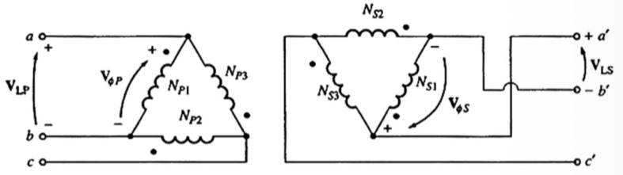

* Line voltage ratio:
  $$\frac{V_{LP}}{V_{LS}} = a$$

> [!Note]
> $\Delta\text{-}\Delta$ Connection is **rarely** used because it does not have a neutral line to provide necessary protection for operation.

---

### § Three-Phase Transformation Using Two Transformers

In emergencies or for low-power applications, three-phase power can be transformed using only two single-phase transformers.

**1) $\text{V-V}$ Connection (Open Delta):**

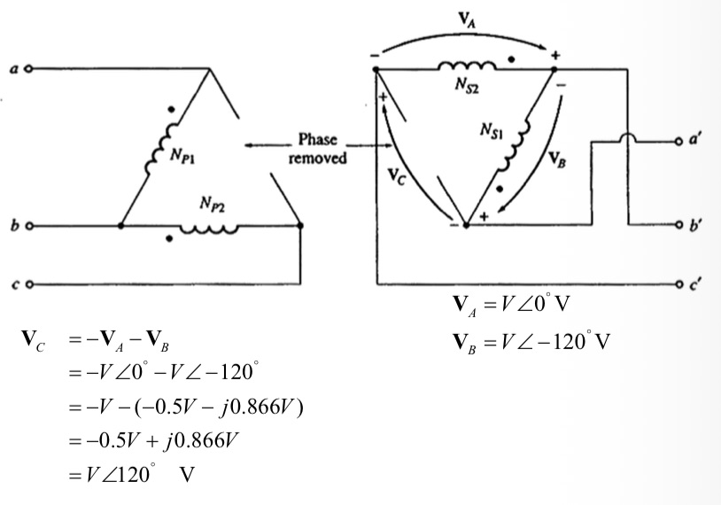

If one transformer in a $\Delta\text{-}\Delta$ bank is removed, the remaining two can still supply a symmetrical three-phase voltage system to the load.

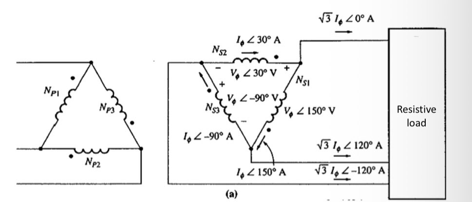

**Power Rating of V-V Connection**

Even if we remove one phase, the terminal line voltages $V_{AB}$, $V_{BC}$, $V_{CA}$ remain symmetrical.

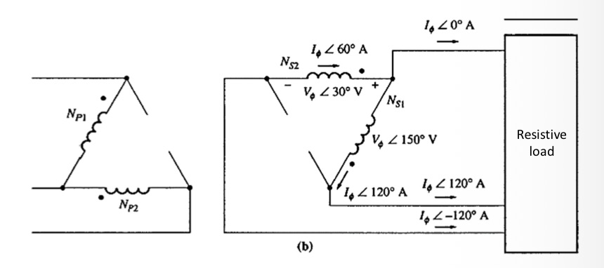

* **Power capacity of $\text{V-V}$ connection:**
  The total active power delivered by two transformers is:
  $$P = \sqrt{3} V_L I_L \cos\theta$$
  Since the line current $I_L$ cannot exceed the rated phase current $I_\phi$ of the individual transformer, the apparent power capacity of the open-delta bank is:
  $$S_{\text{V-V}} = \sqrt{3} V_\phi I_\phi$$
  Comparing to a full $\Delta\text{-}\Delta$ bank ($S_{\Delta\text{-}\Delta} = 3 V_\phi I_\phi$):
  $$\frac{S_{\text{V-V}}}{S_{\Delta\text{-}\Delta}} = \frac{\sqrt{3}}{3} \approx 0.577 \quad (57.7\%)$$
  The bank can only deliver $57.7\%$ of the capacity of a three-transformer bank.
  Compared to the sum of the ratings of the two remaining transformers:
  $$\frac{S_{\text{V-V}}}{2 S_\phi} = \frac{\sqrt{3}}{2} \approx 0.866 \quad (86.6\%)$$
  Therefore, the transformers operate at $86.6\%$ of their combined capacity.

---

### § Open-Delta Phasor Relations

* In the $\text{V-V}$ connection, the phase currents are out of phase with their phase voltages by $30^\circ$.
* **Power delivered by each transformer:**
  $$P_1 = V_\phi I_\phi \cos(30^\circ - \theta)$$
  $$P_2 = V_\phi I_\phi \cos(30^\circ + \theta)$$
  
  * For a unity power factor load ($\theta = 0^\circ$), one transformer operates at a lagging power factor of $0.866$, and the other operates at a leading power factor of $0.866$.

---

### § Open Wye - Open Delta and Scott-T Connections

**2) Open Wye - Open Delta (Open $\text{Y}$ - Open $\Delta$) Connection:**

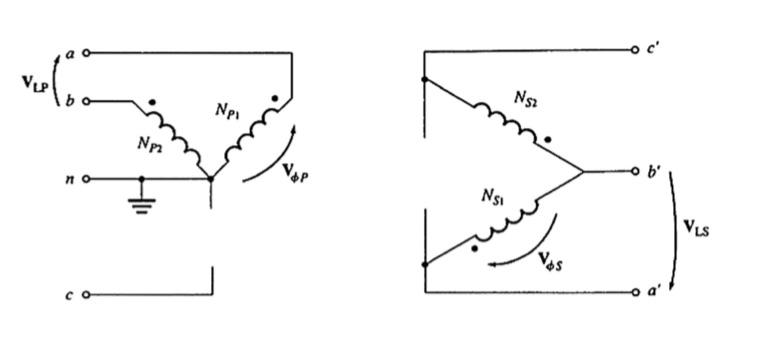

* The primary neutral line must be connected back to the source neutral.
* **Drawback**: A large return current flows through the primary neutral line, which can cause significant unbalance and noise.

**3) Scott-T Connection:**

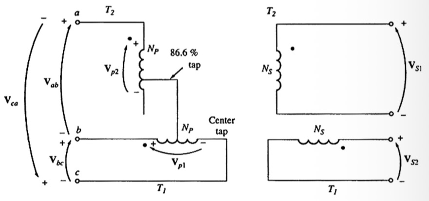

* Used to convert three-phase power into two-phase power (and vice versa).
* Common in electric railroad applications where heavy single-phase locomotive loads are balanced across a three-phase utility supply.

---

### § Scott-T and T-T Connections

The Scott-T connection uses two single-phase transformers:
* A **main transformer** (connected across line BC, with a center tap).
* A **teaser transformer** (connected between phase A and the main transformer center tap, having $86.6\%$ of the turns of the main transformer).

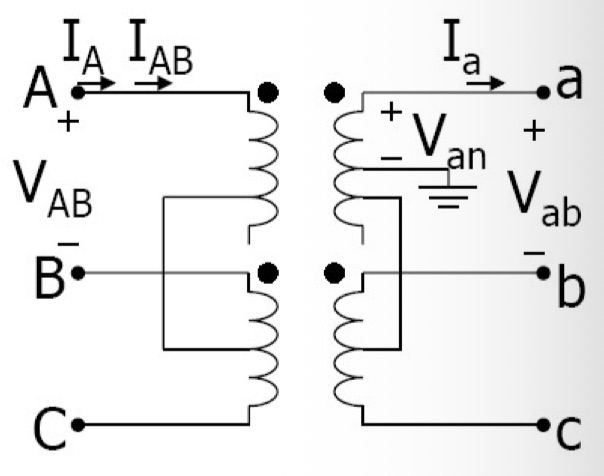

**4) T-T Three-Phase Connection:**
Uses two T-connected transformers to perform 3-phase to 3-phase transformation. It is lighter and cheaper than a standard three-phase transformer bank.

---

### § Transformer Ratings and Related Problems

**1. Voltage Rating:**
* Prevents over-voltage insulation breakdown.
* Prevents core saturation. Since core flux is:
  $$\phi(t) = \frac{1}{N_p} \int v_p(t) dt$$
  If voltage $V_m$ is too high or frequency $f$ is too low, the core will saturate, causing massive magnetizing currents.

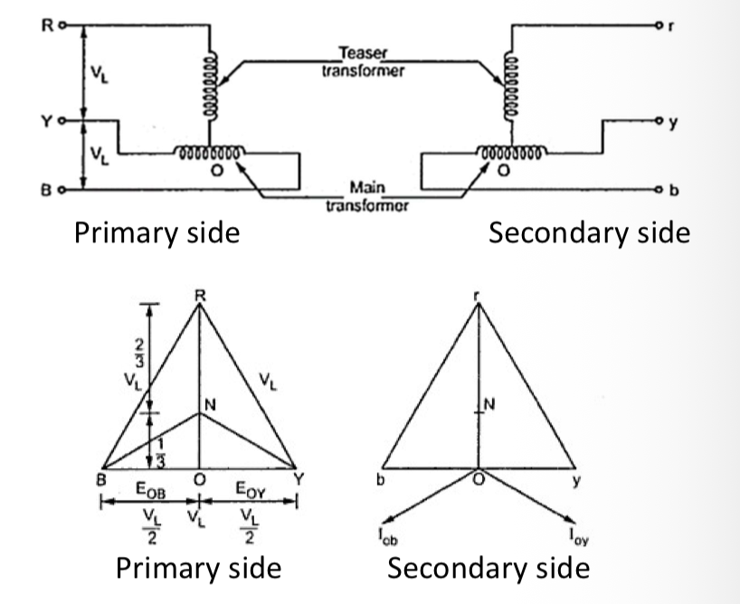

---

### § Frequency Limitation and Inrush Current

**2. Frequency Limitation:**
* A $60\text{ Hz}$ transformer operated on $50\text{ Hz}$ requires the input voltage to be reduced by $20\%$ to prevent saturation.
* A $50\text{ Hz}$ transformer operated on $60\text{ Hz}$ can handle up to $20\%$ higher voltage.

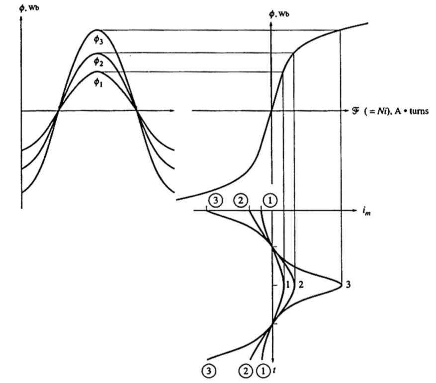

**3. Inrush Current Problem:**

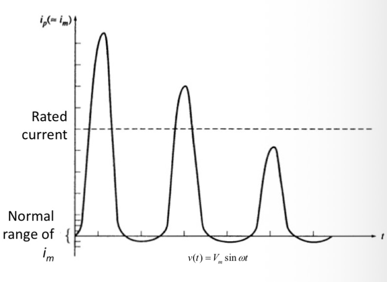

* When first turned on, the transient flux can reach up to $2\phi_{max} + \phi_r$ (due to residual flux). This drives the core deep into saturation, resulting in a large magnetizing current spike (inrush current).

---

### § Parallel Operation of Transformers

**Advantages of parallel operation:**
* Flexible operation facing load changes, improving overall efficiency.
* Cost-effective (easier to replace or maintain smaller units).
* Highly expandable for future capacity planning.

**Ideal parallel operation conditions:**
* No circulating currents under no-load conditions.
* Each unit shares the load in proportion to its power rating.

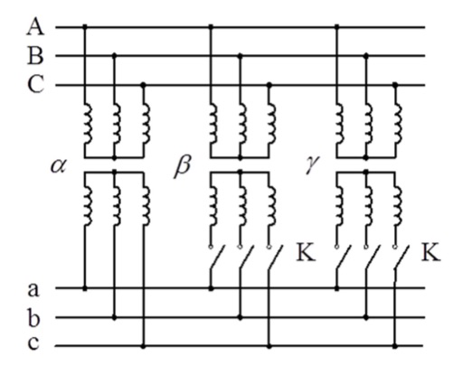

---

### § How to Achieve Parallel Operation

**To achieve ideal parallel operation:**
1. Same voltage rating (turns ratio must be equal; difference should be $< 0.5\%$).
2. Same phase angle shift between primary and secondary (same connection group).
3. Short-circuit impedance (per-unit impedance) should be similar to ensure equal load sharing.

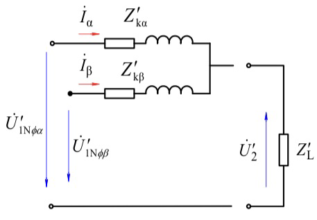

---

### § Load Sharing and Per-Unit System

**Load sharing between parallel units:**

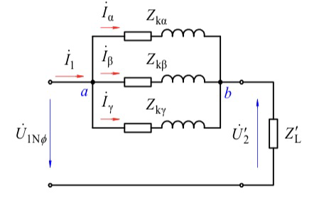

$$\frac{I_A}{I_B} = \frac{Z_B}{Z_A}$$

**The Per-Unit (PU) System:**
$$\text{Per-Unit Value} = \frac{\text{Actual Quantity}}{\text{Base Quantity}}$$

Base value relationships:
* $P_{base} = Q_{base} = S_{base}$
* $V_{base}$ is defined.
* $I_{base} = \frac{S_{base}}{V_{base}}$
* $Z_{base} = \frac{V_{base}^2}{S_{base}}$

---

### § Per-Unit System for Transformers

For transformers:
* The rated apparent power $S_N$ is used as $S_{base}$.
* The rated voltages of the primary and secondary windings are used as $V_{base}$ on their respective sides.
* **Advantage**: The per-unit system **eliminates the turns ratio $a$** from the equivalent circuit! The per-unit impedance remains the same whether calculated from the primary or secondary side:
  $$Z_{pu,p} = Z_{pu,s}$$

## III. AC Machinery Fundamentals

AC machines can be divided into two major classes:
* **Synchronous machines**: The magnetic field is generated by a rotor supplied with DC current (or permanent magnets), and the rotor rotates at synchronous speed.
  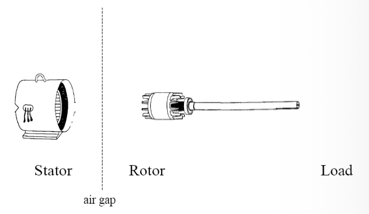
* **Asynchronous (Induction) machines**: The rotor magnetic field is induced by electromagnetic induction from the stator currents. The rotor always rotates slower than the synchronous speed.

---

### § Simple Loop in a Uniform Magnetic Field

To understand AC generators, we analyze a simple rotating loop in a uniform magnetic field:

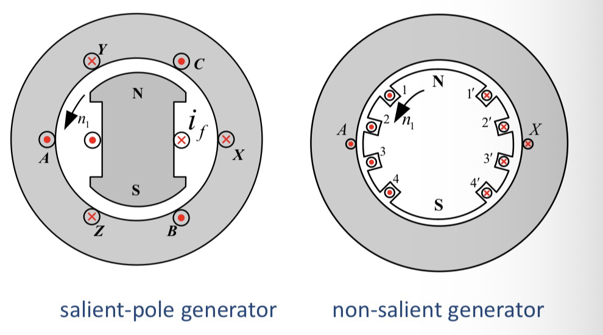

According to Faraday's law of induced voltage on a moving wire:
$$e_{ind} = (\vec{v} \times \vec{B}) \cdot \vec{l}$$

For the rotating loop of radius $r$ and length $l$ rotating at angular speed $\omega$:

* **Segment ab**: The velocity vector $\vec{v}$ is directed at angle $\theta$ to the $\vec{B}$ field.
  $$e_{ba} = v B l \sin\theta_{ab} \quad (\text{directed into the page})$$
* **Segment cd**:
  $$e_{dc} = v B l \sin\theta_{cd} \quad (\text{directed out of the page})$$
* **Segments bc and ad**: Since the velocity is parallel to the magnetic field along these segments, the induced voltage is zero.
  $$e_{bc} = e_{ad} = 0$$

The total induced voltage around the loop is:
$$e_{ind} = e_{ba} + e_{dc} = 2 v B l \sin\theta$$

Using the relationships $v = r \omega$ and the loop area $A = 2 r l$, we get:
$$e_{ind} = 2 r \omega B l \sin\omega t = A B \omega \sin\omega t$$

Since the maximum flux through the loop is $\Phi_{max} = A B$, the induced voltage can be written as:
$$e_{ind} = \Phi_{max} \omega \sin\omega t$$

---

### § Induced Torque in a Current-Carrying Loop

When the loop carries a current $i$, a magnetic force is exerted on the wire segments:
$$\vec{F} = i (\vec{l} \times \vec{B})$$

The torque on each segment is:
$$\tau = F \cdot r \sin\theta$$

* **Segment ab**:
  $$\tau_{ab} = r i l B \sin\theta_{ab} \quad (\text{clockwise})$$
* **Segment cd**:
  $$\tau_{cd} = r i l B \sin\theta_{cd} \quad (\text{clockwise})$$
* **Segments bc and ad**: Induced torque is zero.
  $$\tau_{bc} = \tau_{ad} = 0$$

The total induced torque is:
$$\tau_{ind} = 2 r i l B \sin\theta$$

This can be alternatively expressed in vector form using the loop's magnetic moment:
$$\vec{\tau}_{ind} = k \vec{B}_R \times \vec{B}_S$$

where $\vec{B}_R$ is the rotor-produced flux density and $\vec{B}_S$ is the stator-produced flux density.

---

### § Rotating Magnetic Field

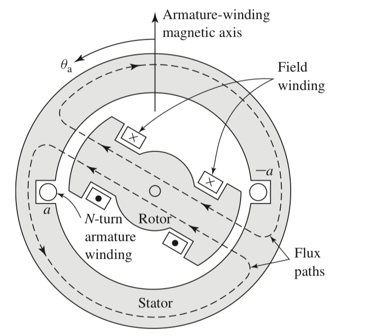

In real AC machines, instead of a rotating loop in a stationary magnetic field, we have a **rotating magnetic field (RMF)** interacting with stationary windings (stator).

To generate a rotating magnetic field, we place three coils spaced $120^\circ$ electrical degrees apart on the stator and supply them with balanced three-phase currents:
$$i_a(t) = I_m \cos\omega t$$
$$i_b(t) = I_m \cos(\omega t - 120^\circ)$$
$$i_c(t) = I_m \cos(\omega t - 240^\circ)$$

* **Armature winding**: Located on the stator, used to collect electrical power (generator) or supply power (motor).
* **Field winding**: Located on the rotor, supplied with DC current to generate the main magnetic field.

---

### § Induced Voltage on a Three-Phase Stator

Assuming the rotor produces a sinusoidally distributed flux density:
$$B(\theta) = B_m \cos\theta$$

As the rotor rotates at electrical speed $\omega$:
$$B(\theta, t) = B_m \cos(\omega t - \theta)$$

The total induced voltage in an $N_c$-turn stator coil is:
$$e_{ind}(t) = N_c \Phi_{max} \omega \sin\omega t$$

For three coils spaced $120^\circ$ apart, the induced voltages are:
$$e_{aa'}(t) = E_{max} \sin\omega t$$
$$e_{bb'}(t) = E_{max} \sin(\omega t - 120^\circ)$$
$$e_{cc'}(t) = E_{max} \sin(\omega t - 240^\circ)$$

The RMS phase voltage is:
$$E_{rms} = \frac{E_{max}}{\sqrt{2}} = \frac{N_c \Phi_{max} \omega}{\sqrt{2}} = \sqrt{2} \pi f N_c \Phi_{max} \approx 4.44 f N_c \Phi_{max}$$

---

### § Three-Phase Stator Connections and Harmonics

* **Wye (Y) Connection:**
  * Line-to-line voltage is $V_L = \sqrt{3} V_\phi$.
  * The third-harmonic voltages ($3\omega t$, $3(\omega t - 120^\circ) = 3\omega t$) in each phase are in-phase (zero-sequence). Because of this, the third harmonics cancel out in the line-to-line voltage:
    $$e_{AB, 3} = e_{A, 3} - e_{B, 3} = 0$$
  * **Benefit**: Line-to-line voltage contains **no third-harmonic components**.

* **Delta ($\Delta$) Connection:**
  * Line-to-line voltage equals phase voltage ($V_L = V_\phi$).
  * The third-harmonic voltages are in-phase and drive a circulating current around the closed Delta loop.
  * **Benefit**: No third-harmonic voltage exists at the terminals, but third-harmonic current circulates inside the Delta windings.

---

### § Distributed Winding and Breadth Factor

A simple concentrated winding produces a highly non-sinusoidal (square-like) air gap flux density containing significant odd harmonics:
$$B(\theta) = B_{s1} + B_{s3} + B_{s5} + B_{s7} + \dots$$

To make the flux density and induced voltage more sinusoidal, the windings are distributed across multiple slots.

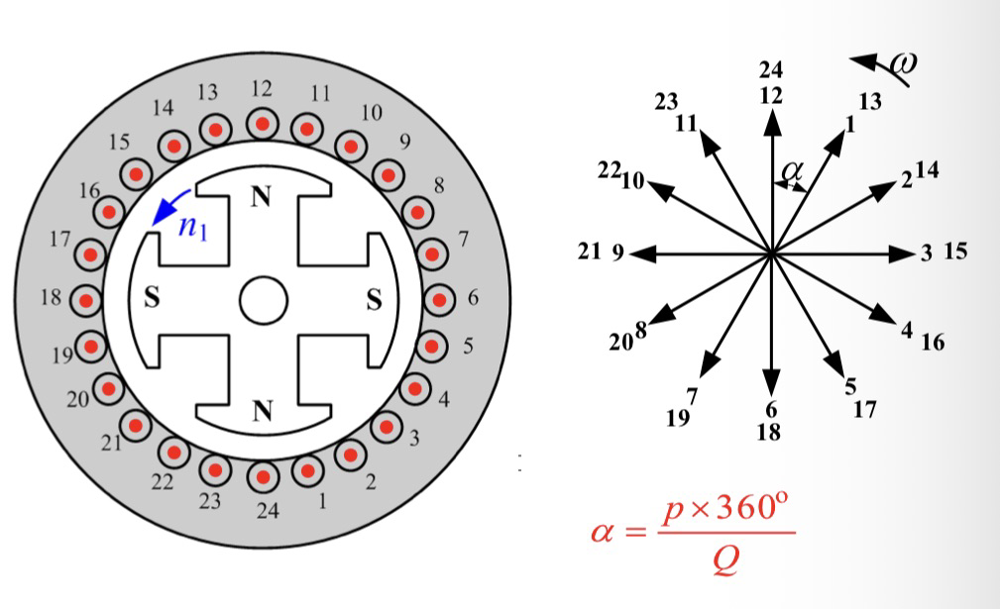

* **Slot-pitch angle ($lpha$)**: The electrical angle between adjacent slots.
  $$\alpha = \frac{p \cdot 360^\circ}{Q} \quad (\text{electrical degrees})$$
* **Slots per pole per phase ($q$)**:
  $$q = \frac{Q}{2pm}$$
  where $Q$ is the total number of slots, $p$ is the pole pairs, and $m$ is the number of phases ($m=3$).

**Breadth Factor ($k_d$ or $k_b$):**
Because the coils in adjacent slots are physically shifted by angle $\alpha$, their induced EMFs are out of phase. The vector sum of these EMFs is smaller than their algebraic sum. We define the breadth factor $k_{d\nu}$ for the $\nu$-th harmonic as:
$$k_{d\nu} = \frac{\sin(q \nu \alpha / 2)}{q \sin(\nu \alpha / 2)}$$

For the fundamental component ($
u = 1$):
$$k_{d1} = \frac{\sin(q \alpha / 2)}{q \sin(\alpha / 2)}$$

---

### § Double-Layer Winding and Pitch Factor

* **Double-layer winding**: Each slot contains two coil sides (one top, one bottom), allowing the use of a **fractional pitch** (chorded winding).
* **Pitch ratio ($y$)**: The ratio of coil pitch to pole pitch ($y = \frac{\text{coil pitch}}{\tau_p} \le 1$). For a full-pitch coil, $y = 1$. For fractional pitch, $y < 1$.

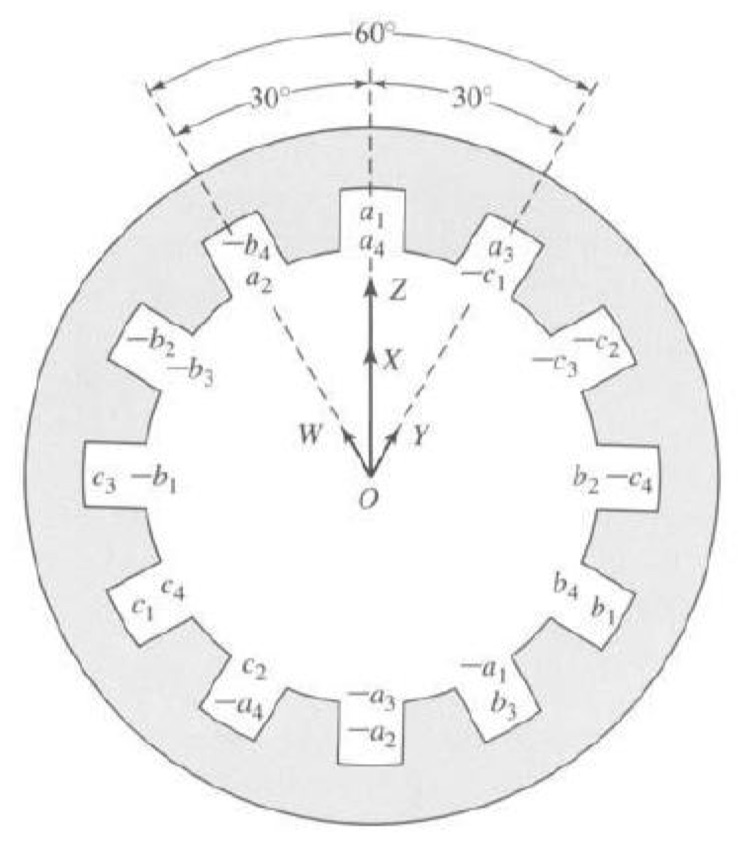

**Pitch Factor ($k_p$):**
For a fractional-pitch coil, the coil sides are not exactly $180^\circ$ electrical apart, reducing the induced EMF. The pitch factor $k_{p\nu}$ for the $\nu$-th harmonic is:
$$k_{p\nu} = \sin\left(\frac{\nu y \pi}{2}\right)$$

* **Harmonic Elimination**: By selecting a specific pitch ratio $y$, we can eliminate or significantly reduce certain harmonics:
  * To eliminate the 5th and 7th harmonics, we choose $y = 5/6 \approx 0.83$.
  * For $y = 5/6$, the fundamental pitch factor is $k_{p1} = \sin(5\pi/12) \approx 0.966$, while the 5th and 7th harmonic pitch factors are reduced to $\sin(25\pi/12) \approx 0.259$ and $\sin(35\pi/12) \approx 0.259$, successfully suppressing these harmonics.

---

### § Combined Winding Factor and Total EMF

The combined effect of distributed winding and fractional pitch is represented by the **winding factor ($k_w$)**:
$$k_{w\nu} = k_{d\nu} \cdot k_{p\nu}$$

The total induced RMS EMF per phase for the fundamental component is:
$$E_1 = \sqrt{2} \pi f N_c k_{w1} \Phi = 4.44 f N_c k_{w1} \Phi$$

where $N_c$ is the total number of series turns per phase:
$$N_c = \frac{2 p q N_K}{a}$$
($N_K$: turns per coil, $a$: number of parallel paths).

For the $\nu$-th harmonic:
$$E_\nu = 4.44 f N_c k_{w\nu} \Phi_\nu$$

---

### § Armature MMF and Fourier Decomposition

When load currents flow through the stator armature windings, they generate an armature magnetomotive force (MMF).

For a single-phase winding carrying a sinusoidal current, the MMF is a pulsating standing wave:
$$f(x, t) = \sum_{\nu=1,3,5,\dots}^{\infty} F_{\nu} \cos(\nu x) \cos(\omega t)$$

where the peak MMF of the $\nu$-th harmonic is:
$$F_{\nu} = \frac{4}{\pi} \frac{N_c k_{w\nu}}{\nu} I_m$$

This pulsating MMF can be decomposed into two counter-rotating fields (Forward and Backward rotating fields):
$$f(x, t) = \frac{1}{2} F_{\nu} \cos(\nu x - \omega t) + \frac{1}{2} F_{\nu} \cos(\nu x + \omega t)$$

---

### § Generation of rotating magnetic field

When balanced three-phase currents flow through three-phase distributed windings, the individual phase MMFs sum up:
$$f_{tot}(x, t) = f_a(x, t) + f_b(x, t) + f_c(x, t)$$

Summing the forward and backward components for all three phases:
* The backward-rotating components cancel each other out to zero.
* The forward-rotating components add up constructively.

The total MMF of the fundamental component is a purely rotating magnetic field of constant magnitude:
$$F_{tot}(x, t) = \frac{3}{2} F_1 \cos(x - \omega t) = \frac{3}{2} \left(\frac{4}{\pi} N_c k_{w1} I_m\right) \cos(x - \omega t)$$

$$F_{tot}(x, t) = 1.35 N_c k_{w1} I_{rms} \cos(x - \omega t)$$

---

### § Speed and Frequency of the Rotating Field

The relationship between the electrical frequency $f_e$ of the stator currents and the mechanical rotational speed $n_m$ (rpm) of the rotating magnetic field is:
$$f_e = \frac{P \cdot n_m}{120} = p \cdot f_m$$

where $P$ is the number of poles ($p = P/2$ is the number of pole pairs), and $n_m$ is the synchronous speed.
$$n_s = \frac{120 f_e}{P}$$

* **Reversing Rotation Direction**: Swap any two of the three stator phase connections (e.g. swap phase B and C). This changes the phase sequence from $A-B-C$ to $A-C-B$, reversing the direction of the rotating magnetic field.

---

### § Space Harmonics in the MMF

For the $\nu$-th harmonic MMF:
* **3rd harmonic**: Since the currents are $120^\circ$ out of phase in time, the sum of third-harmonic MMFs is zero. There is no rotating 3rd-harmonic MMF.
* **5th harmonic**: Decomposing the 5th harmonic shows that it forms a **negative-sequence** rotating field. It rotates in the opposite direction (backward) at $1/5$ of the synchronous speed:
    $$n_5 = -\frac{n_s}{5}$$
* **7th harmonic**: Forms a **positive-sequence** rotating field. It rotates in the same direction (forward) at $1/7$ of the synchronous speed:
    $$n_7 = +\frac{n_s}{7}$$

---

### § Induced Torque and Power Flow

The interaction between the stator-produced magnetic field $\vec{B}_S$ and the rotor-produced magnetic field $\vec{B}_R$ generates an electromagnetic torque:
$$\vec{\tau}_{ind} = k \vec{B}_R \times \vec{B}_S$$

$$\tau_{ind} = k B_R B_S \sin\delta$$

where $\delta$ is the power angle (torque angle) between the two fields.

**Power Flow in AC Machines:**

* **Losses:**
  1. **Stator copper loss (3-phase)**: $P_{SCL} = 3 I_A^2 R_A$
  2. **Rotor copper loss**: $P_{RCL} = I_R^2 R_R$
  3. **Core losses ($P_{core}$)**: Hysteresis and eddy currents in the stator core.
  4. **Mechanical losses**: Friction and windage.
  5. **Stray losses**: Miscellaneous load losses.

* **Power Flow Diagrams:**
  * **Generator:**
    $$P_{in} \text{ (Mechanical)} \to P_{conv} \text{ (Converted)} \to P_{out} \text{ (Electrical)}$$
    $$P_{conv} = \tau_{ind} \omega_m = P_{out} + P_{SCL} + P_{core}$$
    
  * **Motor:**
    $$P_{in} \text{ (Electrical)} \to P_{conv} \text{ (Converted)} \to P_{out} \text{ (Mechanical)}$$
    $$P_{conv} = P_{in} - P_{SCL} - P_{core} = \tau_{ind} \omega_m$$

## IV. Synchronous Machines

### § Synchronous Generator Construction

Synchronous generators (also called alternators) convert mechanical power into three-phase electrical power. Their construction consists of two main parts:
* **Field windings**: Located on the rotor, supplied with DC current to produce the main magnetic field.
* **Armature windings**: Located on the stator, where three-phase AC voltages are induced.

There are two rotor types:
1. **Salient-pole rotor**: Large diameter and short axial length, with poles projecting outward from the rotor core. Used in low-speed applications (such as hydro-turbines).
2. **Non-salient pole (cylindrical) rotor**: Small diameter and long axial length, with field windings embedded in slots. Used in high-speed applications (such as steam or gas turbines).

The speed of rotation of a synchronous generator $n_m$ (in RPM) is directly locked to the electrical frequency $f_e$:
$$f_e = \frac{P n_m}{120}$$

where $P$ is the number of poles.

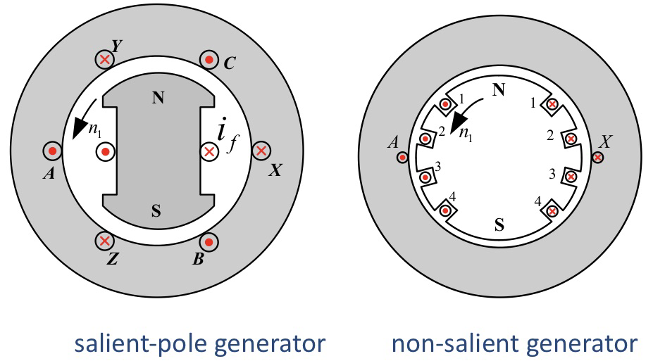

---

### § Armature Reaction

When a synchronous generator operates under no-load conditions, the rotor field current $I_f$ produces a rotor magnetic field $B_0$ (associated with field MMF $F_f$), which rotates at synchronous speed and induces a three-phase voltage in the stator windings.

Under load, three-phase currents flow through the stator windings, producing their own rotating stator magnetic field $B_a$ (associated with armature MMF $F_a$). The distortion of the net air-gap magnetic field by stator currents is called **armature reaction**.

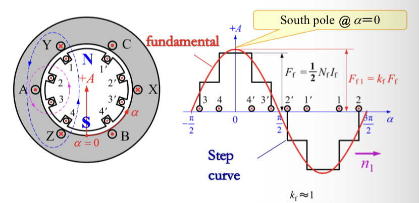
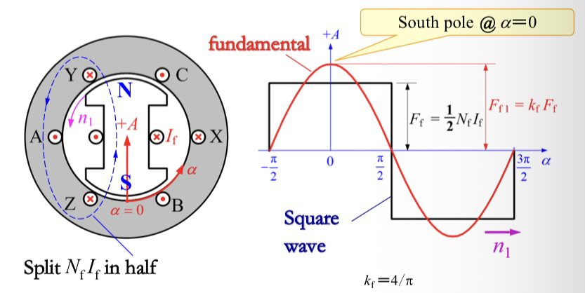

---

### § No-Load Characteristics

On a per-phase basis, the induced no-load EMF $E_0$ is given by:
$$E_0 = \sqrt{2} \pi f_e N_c k_w \Phi_1 = 4.44 f_e N_c k_w \Phi_1$$

where:
* $N_c$: number of series turns per phase
* $k_w$: winding factor ($k_w = k_d k_p$)
* $\Phi_1$: fundamental flux per pole

Since $\Phi_1 \propto F_f \propto I_f$, the induced EMF $E_0$ is proportional to the field current $I_f$ at low values. As the field current increases, the magnetic core begins to saturate, and the curve flattens. This is the **Open-Circuit Characteristic (OCC)**.

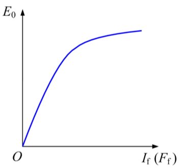

---

### § Equivalent Circuit of a Synchronous Generator

To model the generator electrically under load, we assume linear magnetic conditions (neglecting saturation). Under this assumption, the net air-gap flux density $B_{net}$ is the vector sum of the rotor field $B_f$ and the armature reaction field $B_a$:
$$\vec{B}_{net} = \vec{B}_f + \vec{B}_a$$

Correspondingly, the net induced voltage $\vec{E}_s$ in the stator is:
$$\vec{E}_s = \vec{E}_0 + \vec{E}_a$$

Since the armature reaction field $\vec{B}_a$ is produced by the armature current $\vec{I}$, the induced EMF $\vec{E}_a$ lags the armature current $\vec{I}$ by $90^\circ$. We can represent this relationship using an armature reaction reactance $X_a$:
$$\vec{E}_a = -j \vec{I} X_a$$

Including the stator armature leakage reactance $X_l$ and winding resistance $R_A$, the terminal voltage $\vec{V}_\phi$ is:
$$\vec{V}_\phi = \vec{E}_s - j\vec{I}X_l - \vec{I}R_A = \vec{E}_0 - j\vec{I}X_a - j\vec{I}X_l - \vec{I}R_A$$

We define the total **synchronous reactance** as $X_s = X_a + X_l$. Thus:
$$\vec{E}_0 = \vec{V}_\phi + \vec{I}R_A + j\vec{I}X_s$$

The per-phase equivalent circuit of a synchronous generator consists of:
1. **Rotor field circuit (DC)**: Excitation voltage $V_F$ supplying the field winding $R_F$ and adjustable resistance $R_{adj}$.
2. **Stator armature circuit (AC)**: The internal generated voltage $E_0$ in series with $R_A$ and $jX_s$ supplying the phase terminal voltage $V_\phi$.

---

### § Phasor Diagram and Armature Reaction States

The angle $\psi$ is defined as the phase angle between the stator current $\vec{I}$ and the excitation EMF $\vec{E}_0$. This angle determines the nature of the armature reaction:

1. **Cross-magnetizing armature reaction ($\psi = 0^\circ$)**:
   The stator current $\vec{I}$ is in phase with $\vec{E}_0$. The armature MMF $\vec{F}_a$ lies along the q-axis, perpendicular to the field MMF $\vec{F}_f$ (d-axis). It distorts the field but does not demagnetize or magnetize it.
2. **Demagnetizing armature reaction ($\psi = 90^\circ$)**:
   The stator current $\vec{I}$ lags $\vec{E}_0$ by $90^\circ$ (purely inductive load). The armature MMF $\vec{F}_a$ directly opposes the field MMF $\vec{F}_f$ along the d-axis, reducing the net flux.
3. **Magnetizing armature reaction ($\psi = -90^\circ$)**:
   The stator current $\vec{I}$ leads $\vec{E}_0$ by $90^\circ$ (purely capacitive load). The armature MMF $\vec{F}_a$ aids the field MMF $\vec{F}_f$ along the d-axis, increasing the net flux.

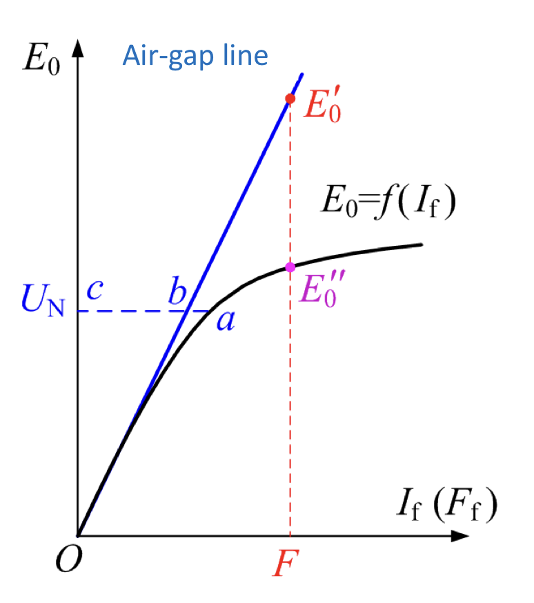
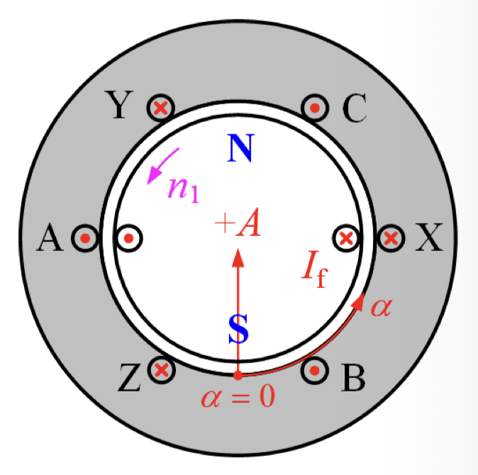
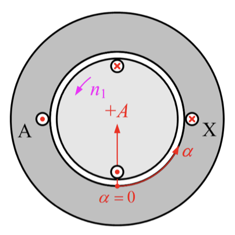

---

### § Salient-Pole Machines and Two-Reaction Theory

In salient-pole machines, the air-gap length is highly non-uniform. The reluctance along the pole axis (**d-axis**) is much smaller than the reluctance along the interpolar axis (**q-axis**). Therefore, the armature reaction cannot be described by a single synchronous reactance $X_s$.

Using **two-reaction theory**, we resolve the armature MMF $\vec{F}_a$ and current $\vec{I}$ into direct-axis (d-axis) and quadrature-axis (q-axis) components:
$$\vec{I} = \vec{I}_d + \vec{I}_q$$
$$I_d = I \sin\psi, \quad I_q = I \cos\psi$$

The corresponding reactances are the d-axis synchronous reactance $X_d$ and q-axis synchronous reactance $X_q$:
$$X_d = X_l + X_{ad}$$
$$X_q = X_l + X_{aq}$$

Since the d-axis reluctance is smaller, the d-axis permeance is higher, meaning:
$$X_{ad} > X_{aq} \implies X_d > X_q$$

The excitation EMF $\vec{E}_0$ is given by:
$$\vec{E}_0 = \vec{V}_\phi + \vec{I}R_A + j\vec{I}_d X_d + j\vec{I}_q X_q$$

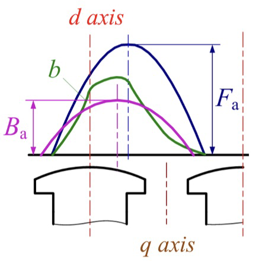
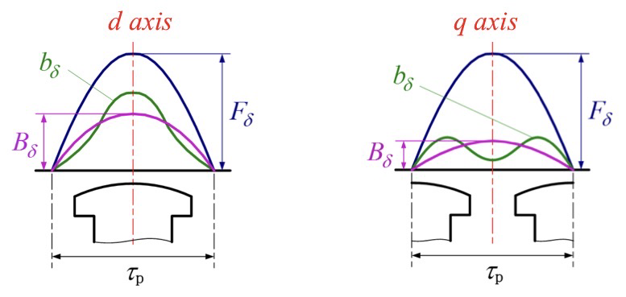

---

### § Phasor Diagram of Salient-Pole Generator

To draw the phasor diagram, we locate the d-axis and q-axis. The power angle $\delta$ is the angle between $\vec{E}_0$ and $\vec{V}_\phi$, and $\psi = \delta + \phi$, where $\phi$ is the power factor angle of the load.

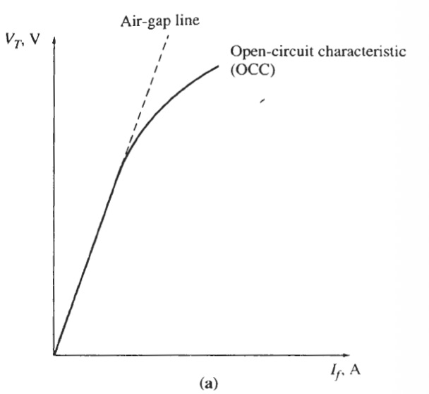

Neglecting the armature resistance $R_A$, the power angle $\delta$ can be calculated from:
$$\tan\delta = \frac{I X_q \cos\phi}{V_\phi + I X_q \sin\phi}$$

Once $\delta$ is found, we decompose the current:
$$I_d = I \sin(\delta + \phi)$$
$$I_q = I \cos(\delta + \phi)$$

The magnitude of the excitation EMF is:
$$E_0 = V_\phi \cos\delta + I_d X_d + I_q R_A$$

---

### § Open-Circuit and Short-Circuit Tests

The parameters $R_A$ and $X_s$ of a synchronous generator can be determined by two tests:

1. **Open-Circuit Test (OCC)**:
   The generator is driven at rated speed with open armature terminals. The field current $I_f$ is varied, and the terminal voltage $V_{oc} = E_0$ is measured.
2. **Short-Circuit Test (SCC)**:
   The armature terminals are short-circuited. The field current $I_f$ is increased from zero, and the armature current $I_{sc} = I_A$ is measured.
   
* **Why the SCC is a straight line**: Under short-circuit, the impedance is dominated by the synchronous reactance ($X_s \gg R_A$). The load is almost purely inductive ($\psi \approx 90^\circ$). The armature reaction is strongly demagnetizing, meaning the net MMF $F_{net} = F_f - F_a$ is very small, keeping the machine far from saturation.

The synchronous impedance $Z_s$ is calculated at a given field current:
$$Z_s = \sqrt{R_A^2 + X_s^2} = \frac{E_0 \text{ (from OCC)}}{I_{sc} \text{ (from SCC)}}$$

Since $X_s \gg R_A$, we have $X_s \approx Z_s$.

The **Short-Circuit Ratio (SCR)** is defined as:
$$\text{SCR} = \frac{I_{f,oc} (V_N)}{I_{f,sc} (I_N)}$$

SCR is the reciprocal of the per-unit synchronous reactance:
$$\text{SCR} = \frac{1}{X_{s,pu}}$$

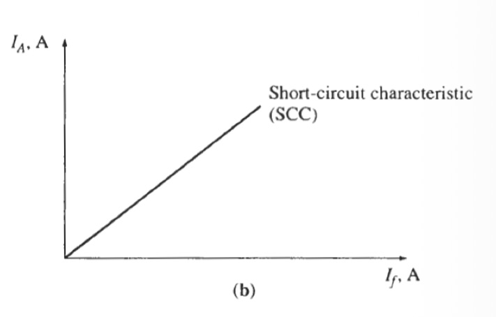
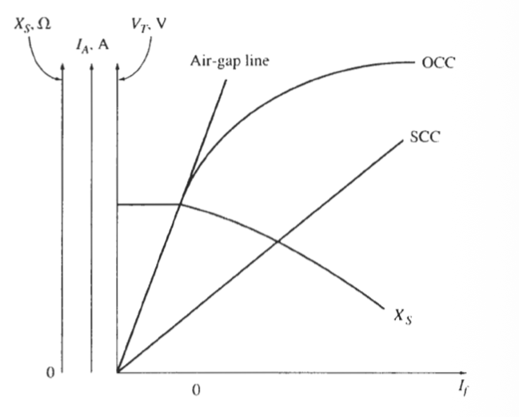

---

### § Slip Test for Measuring Xd and Xq

In salient-pole machines, $X_d$ and $X_q$ are measured using a **slip test**:
1. The field winding is open-circuited ($I_f = 0$).
2. A balanced three-phase voltage at reduced magnitude is applied to the armature windings.
3. The rotor is driven by a prime mover at a speed slightly different from the synchronous speed (a very small slip).

As the stator MMF slowly slips past the rotor poles:
* When the stator MMF aligns with the rotor **d-axis**, the reluctance is minimum, flux is maximum, current is minimum ($I_{min}$), and voltage is maximum ($V_{max}$).
* When the stator MMF aligns with the rotor **q-axis**, the reluctance is maximum, flux is minimum, current is maximum ($I_{max}$), and voltage is minimum ($V_{min}$).

The reactances are calculated as:
$$X_d = \frac{V_{max}}{\sqrt{3} I_{min}}$$
$$X_q = \frac{V_{min}}{\sqrt{3} I_{max}}$$

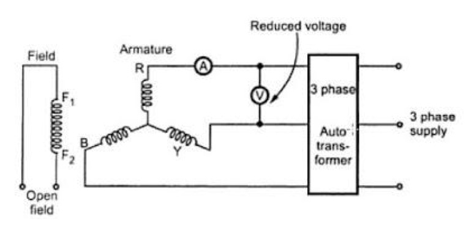
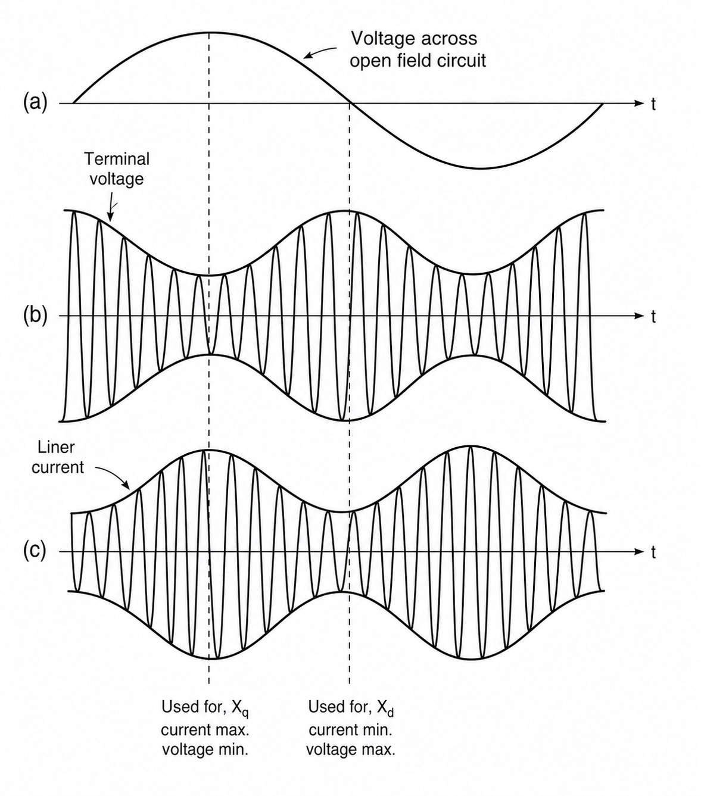

---

### § Zero-Power-Factor Test and Potier Triangle

To determine the leakage reactance $X_l$ and separate it from the armature reaction, a **zero-power-factor (ZPF) test** is conducted:
1. The generator is loaded with an adjustable purely inductive load (power factor $\cos\phi = 0$ lagging).
2. The field current $I_f$ is adjusted while maintaining the armature current at its rated value $I_N$.
3. The terminal voltage $V$ is recorded for various values of $I_f$. This yields the ZPF characteristic.

Using the **Potier Triangle**, we can determine the Potier reactance $X_p$ (which is close to $X_l$) and the demagnetizing armature reaction MMF $F_a$.

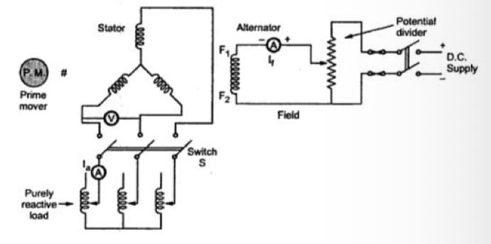
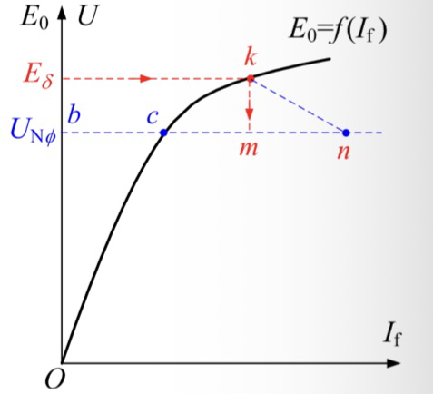
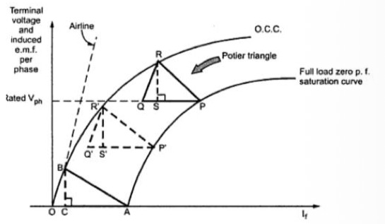

---

### § Voltage Regulation of a Synchronous Generator

Voltage regulation (VR) is the percentage change in terminal voltage when rated load is removed:
$$\text{VR} = \frac{E_0 - V}{V} \times 100\%$$

* **Lagging PF (inductive load)**: $\vec{I}$ lags $\vec{V}_\phi$. The armature reaction is demagnetizing, causing terminal voltage to drop sharply as load increases. VR is positive and large.
* **Unity PF (resistive load)**: $\vec{I}$ is in phase with $\vec{V}_\phi$. Terminal voltage drops slightly. VR is positive and small.
* **Leading PF (capacitive load)**: $\vec{I}$ leads $\vec{V}_\phi$. The armature reaction is magnetizing, causing terminal voltage to rise under load. VR can be negative.

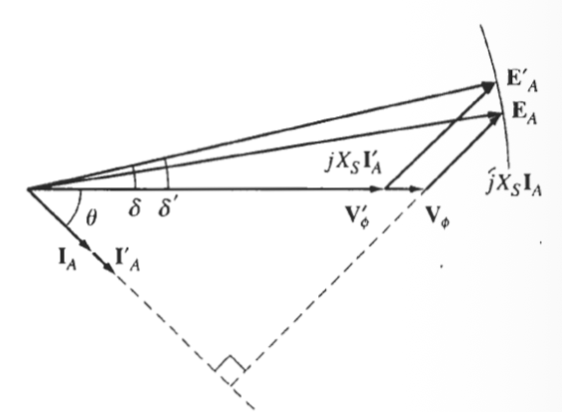
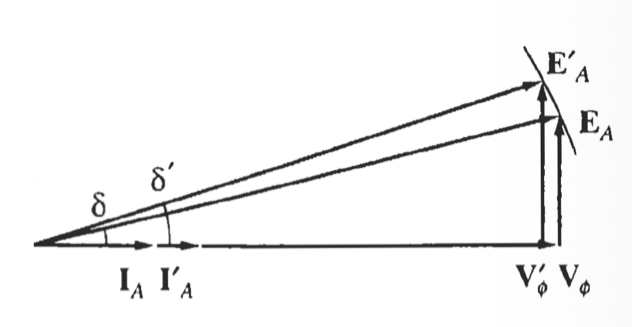
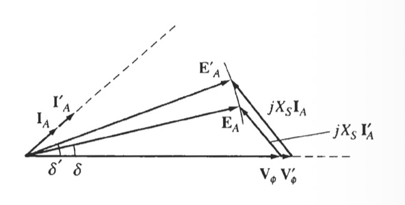

---

### § External and Regulation Characteristics

The relationship between terminal voltage and load current ($V_T$ vs $I_A$) is the **external characteristic**. The relationship between field current and load current ($I_f$ vs $I_A$) required to keep terminal voltage constant is the **regulation characteristic**.

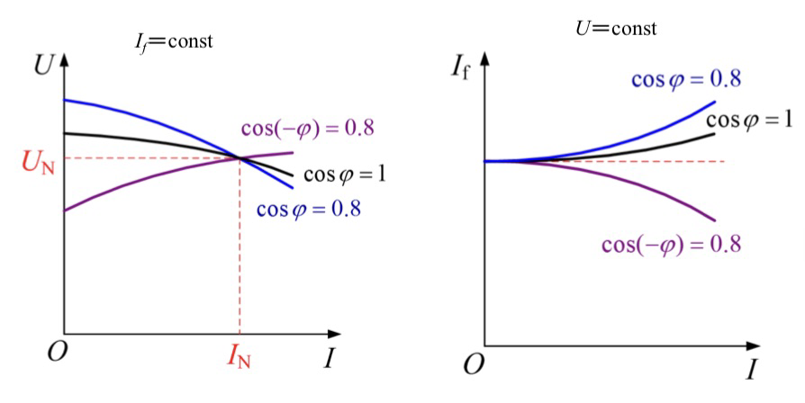
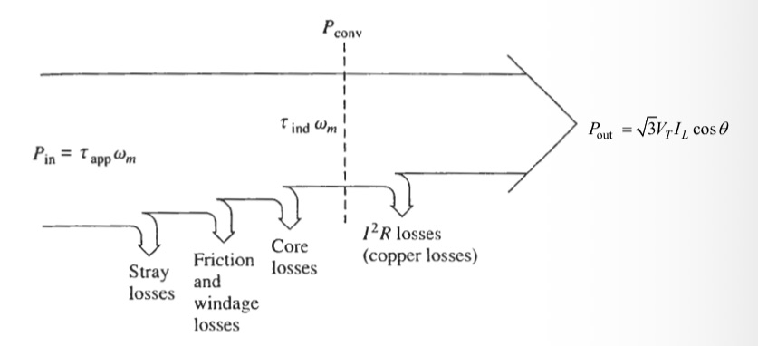

---

### § Power and Torque in a Synchronous Generator

Neglecting the armature resistance $R_A$, the real power output $P$ of a cylindrical rotor generator is:
$$P = \frac{3 V_\phi E_A}{X_s} \sin\delta$$

The induced torque $\tau_{ind}$ is:
$$\tau_{ind} = \frac{P}{\omega_m} = \frac{3 V_\phi E_A}{\omega_m X_s} \sin\delta$$

The power angle $\delta$ is the electrical angle between $\vec{E}_A$ and $\vec{V}_\phi$. The maximum output power occurs at $\delta = 90^\circ$:
$$P_{max} = \frac{3 V_\phi E_A}{X_s}$$

---

### § Power Angle Characteristic of a Salient-Pole Machine

For a salient-pole machine, neglecting $R_A$, the power is:
$$P = \frac{3 V_\phi E_A}{X_d} \sin\delta + \frac{3 V_\phi^2 (X_d - X_q)}{2 X_d X_q} \sin 2\delta$$

The power expression consists of two terms:
1. **Field excitation power**: $\frac{3 V_\phi E_A}{X_d} \sin\delta$ (depends on rotor excitation $E_A$).
2. **Reluctance power**: $\frac{3 V_\phi^2 (X_d - X_q)}{2 X_d X_q} \sin 2\delta$ (independent of excitation; exists because of the unequal inductances $X_d \neq X_q$).

Due to the double-frequency reluctance component ($\sin 2\delta$), the maximum power $P_{max}$ of a salient-pole machine occurs at a power angle $\delta < 90^\circ$.

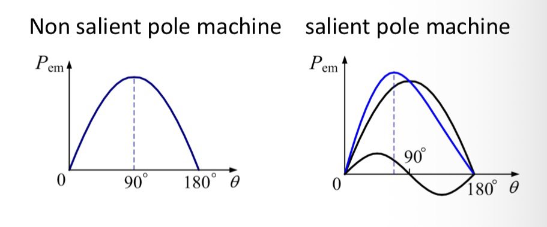

---

### § Frequency-Power Characteristics of a Generator

The mechanical speed of a generator's prime mover is inversely proportional to the load power:
$$\text{SD} = \frac{n_{nl} - n_{fl}}{n_{fl}} \times 100\%$$

The frequency-power relation is modeled as:
$$P = s_p (f_{nl} - f_{sys})$$

where:
* $f_{nl}$: no-load frequency of the generator
* $f_{sys}$: system frequency
* $s_p$: governor slope (kW/Hz)

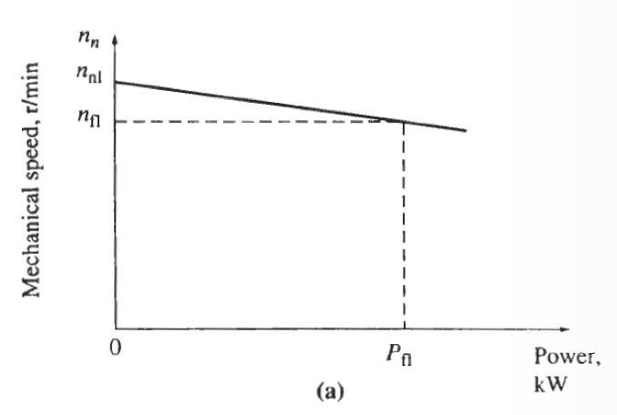
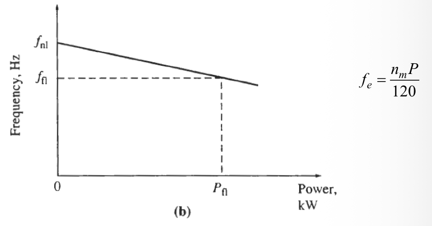

---

### § Reactive Power and V-Curves of a Synchronous Machine

If a generator's active power output $P$ is kept constant:
$$I_A \cos\phi = \text{constant}$$
$$E_A \sin\delta = \text{constant}$$

As the excitation field current $I_f$ is varied:
* **Normal excitation**: $\cos\phi = 1$, the generator produces zero reactive power ($Q = 0$).
* **Overexcitation**: The generator operates at a lagging power factor, supplying reactive power to the grid ($Q > 0$).
* **Underexcitation**: The generator operates at a leading power factor, absorbing reactive power from the grid ($Q < 0$).

The plot of armature current $I_A$ vs field current $I_f$ forms a series of **V-curves**.

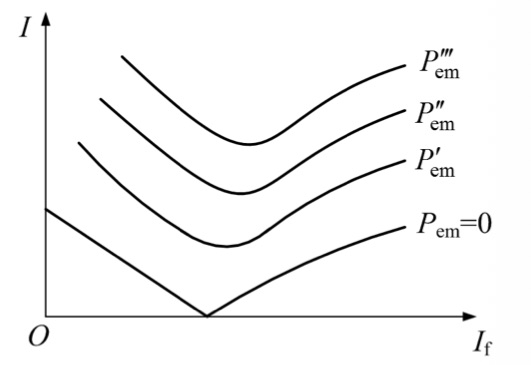
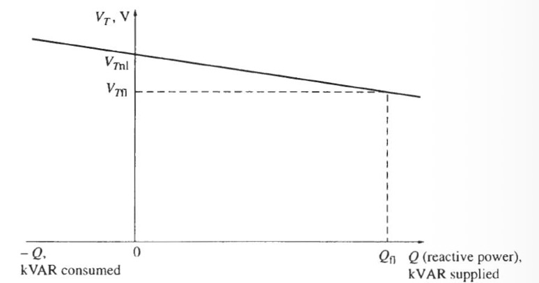

---

### § Parallel Operation of AC Generators

To connect a generator in parallel with an existing system, four conditions must be met:
1. **Voltage magnitudes**: The RMS line voltages of the oncoming generator and the running system must be equal.
2. **Phase sequence**: Both systems must have the same phase sequence (e.g., $a-b-c$).
3. **Phase angles**: The phase angles of the two systems must be identical.
4. **Frequency**: The frequency of the oncoming generator must be slightly higher than the system frequency to prevent it from acting as a motor immediately upon connection.

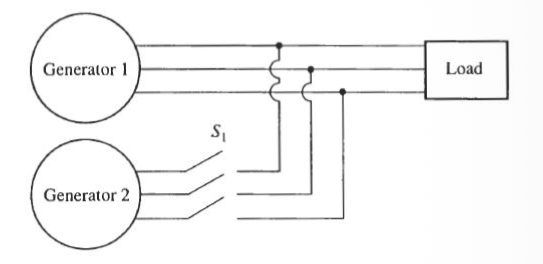

---

### § Parallel Operation with an Infinite Bus

When a generator is connected to an infinite bus:
* The system frequency $f_{sys}$ and terminal voltage $V_T$ are fixed.
* Adjusting the governor shifts the no-load frequency $f_{nl}$, changing the active power output $P$ of the generator:
  $$P_G = s_p (f_{nl} - f_{sys})$$
* Adjusting the field excitation $I_f$ changes the reactive power output $Q$ without affecting active power.

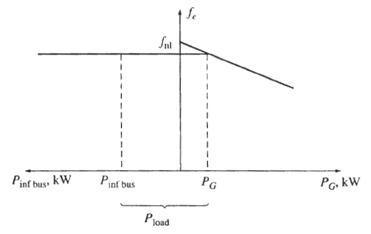
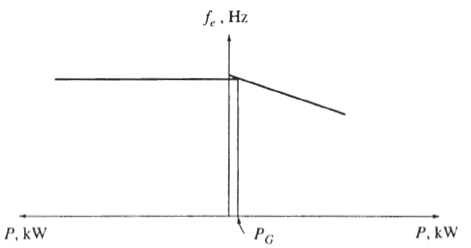
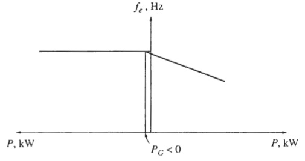
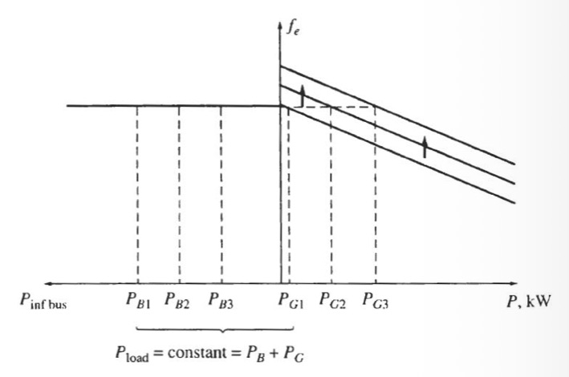
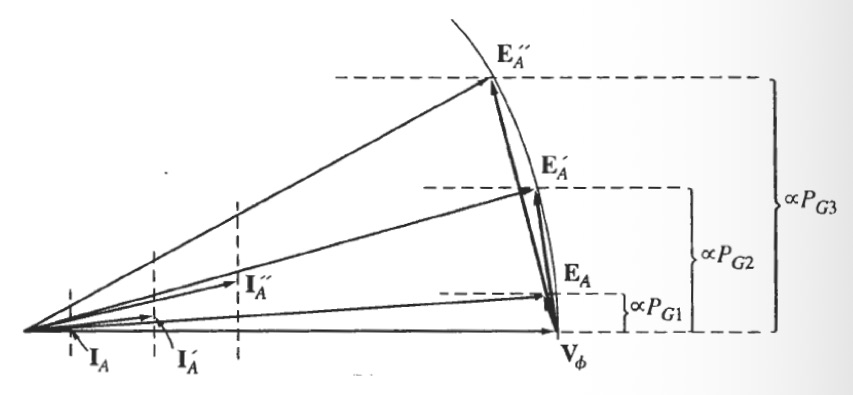

---

### § Power Sharing between Parallel Generators

When two generators of comparable size operate in parallel, the total active and reactive load must be shared between them:
$$P_{load} = P_{G1} + P_{G2}$$
$$Q_{load} = Q_{G1} + Q_{G2}$$

* Adjusting the governor of one generator changes the active power allocation between them and alters the system frequency unless both governors are adjusted in opposite directions.
* Adjusting the excitation of one generator changes the reactive power allocation between them and alters the terminal voltage.

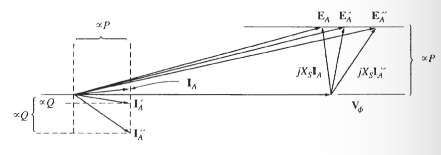
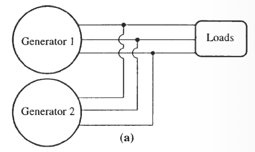
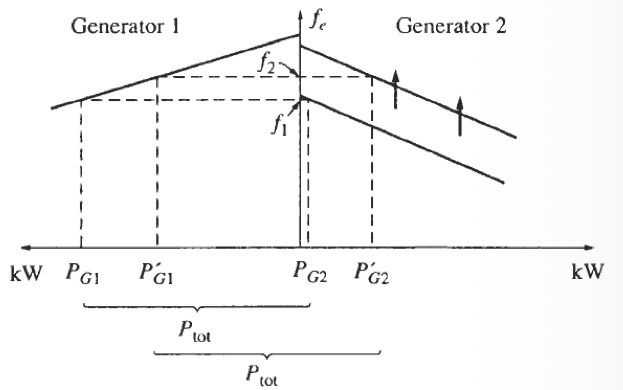
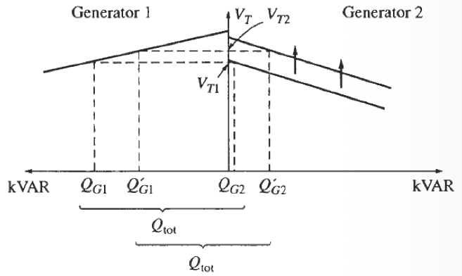

---

### § House Diagram of a Parallel System

House diagrams show the frequency-power and voltage-reactive power relationships of two generators operating in parallel.

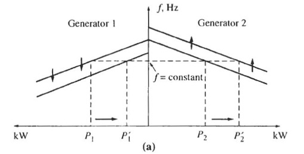
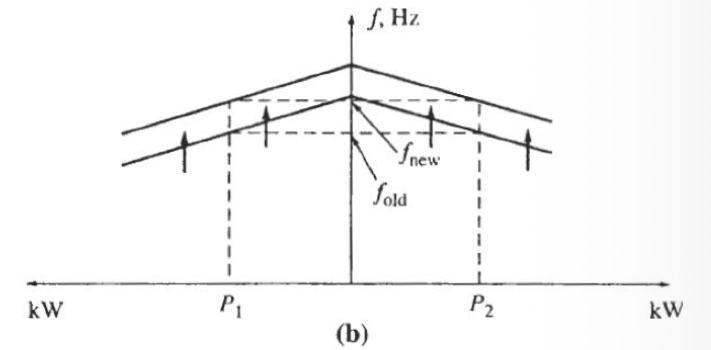

---

### § Synchronous Generator Transients

When a generator is synchronized to a grid, transients occur due to phase and speed differences:
* If the generator speed is slightly faster before connection, a positive torque is induced:
  $$\vec{t}_{ind} = k \vec{B}_R \times \vec{B}_{net}$$
  This torque acts as a mechanical load on the rotor, slowing it down to match the synchronous speed of the power grid.

---

### § Synchronous Generator Ratings

Synchronous machine ratings protect the windings and core from thermal and insulation breakdown:
* **Voltage and Frequency**: Operating at lower frequencies (e.g. 50Hz for a 60Hz machine) requires reducing the rated voltage by the same proportion to prevent magnetic saturation.
* **Apparent Power**: Limited by stator winding heating ($I_A^2 R_A$).
  $$S_{rated} = 3 V_{\phi,rated} I_{A,rated}$$
* **Power Factor**: Limited by field winding heating ($I_f^2 R_f$).

---

### § Generator Capability Curve

The capability curve describes the safe operating limits of a synchronous generator on a P-Q plane:
1. **Stator current limit**: A circle centered at the origin with radius:
   $$S = 3 V_\phi I_{A,max}$$
2. **Rotor current limit**: A circle centered at $(0, -\frac{3 V_\phi^2}{X_s})$ with radius:
   $$\frac{3 V_\phi E_{A,max}}{X_s}$$
3. **Prime-mover power limit**: A vertical line bounding active power output.

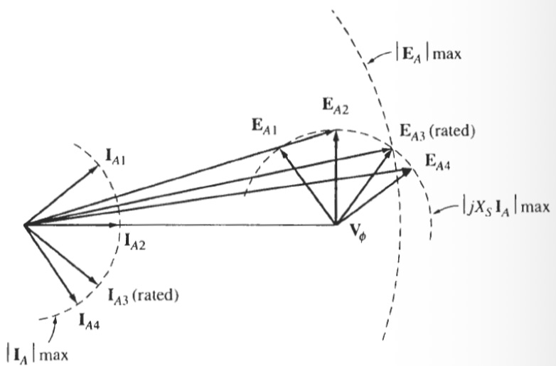
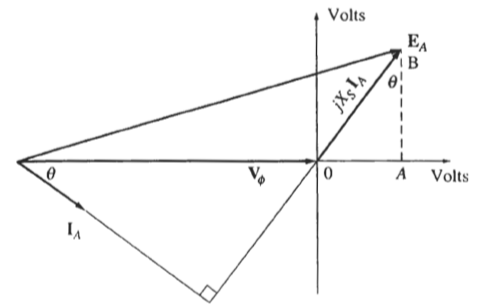
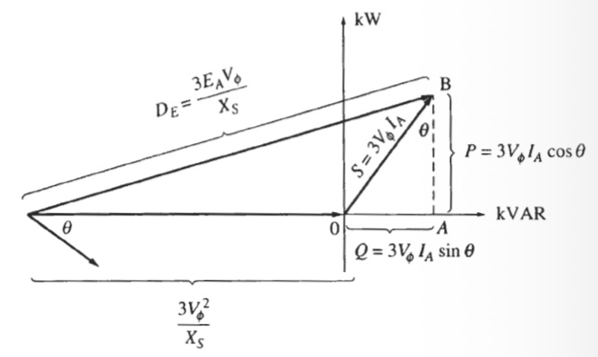
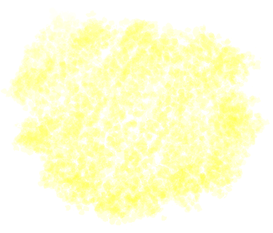
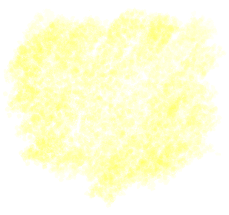

---

### § Synchronous Motor

A synchronous motor has the same physical structure as a generator but converts electrical power to mechanical power. At starting ($n_m = 0$), the average torque is zero because the magnetic field rotates too quickly for the rotor to accelerate.

Methods to start a synchronous motor:
1. **Assisted start**: Use an auxiliary prime mover (pony motor) to accelerate the rotor to synchronous speed before applying excitation.
2. **Variable frequency drive**: Supply power at a low frequency and ramp it up as the motor accelerates.
3. **Amortisseur (damper) windings**: Short-circuited bars in the pole faces act as an induction motor rotor during starting.

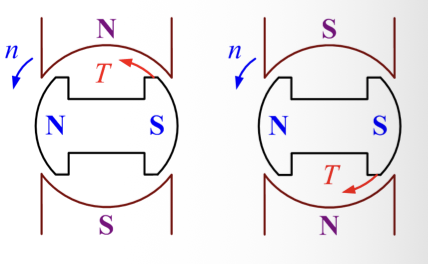
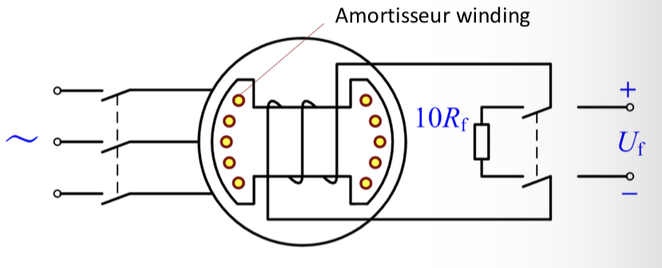

---

## V. Induction Machines

### § Induction Motor Rotor Construction

Induction motors use a stator that produces a rotating magnetic field and a rotor that relies on electromagnetic induction.
Rotor types:
1. **Squirrel-cage rotor**: Consists of thick conducting bars laid in slots on the rotor core, short-circuited by end rings. It is simple, rugged, and requires no brushes.
2. **Wound rotor**: Features a complete three-phase winding connected to slip rings and brushes. External resistors can be added to control starting current and torque.

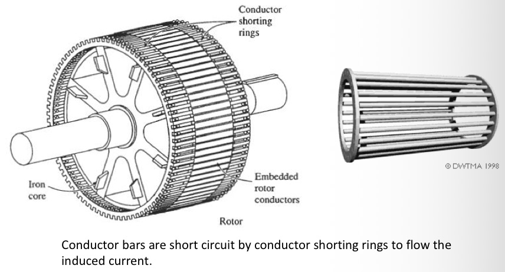
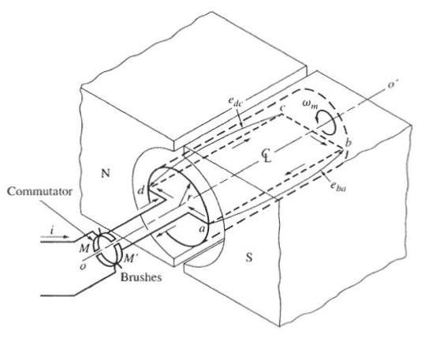

---

### § Squirrel-Cage Rotor Equivalent Phases

The squirrel-cage rotor acts as a multi-phase system:
* Number of phases $m_c$ equals the number of rotor slots.
* Winding factor $k_{dp2} = 1$.
* Stator rotating magnetic field speed:
  $$n_s = \frac{120 f_e}{P}$$

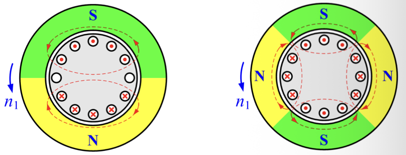

---

### § Principle of Operation

As the stator magnetic field rotates, it cuts the rotor bars and induces a voltage:
$$e_{ind} = (\vec{v} \times \vec{B}) \cdot \vec{l}$$

where $\vec{v}$ is the velocity of the bar relative to the magnetic field.
The induced voltage drives a rotor current. Because of the rotor's leakage inductance, the rotor current lags behind the induced voltage. The interaction of the rotor current with the stator field produces torque:
$$\vec{\tau}_{ind} = k \vec{B}_R \times \vec{B}_S$$

This torque accelerates the rotor in the direction of the rotating field.

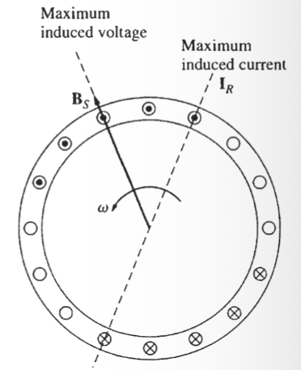
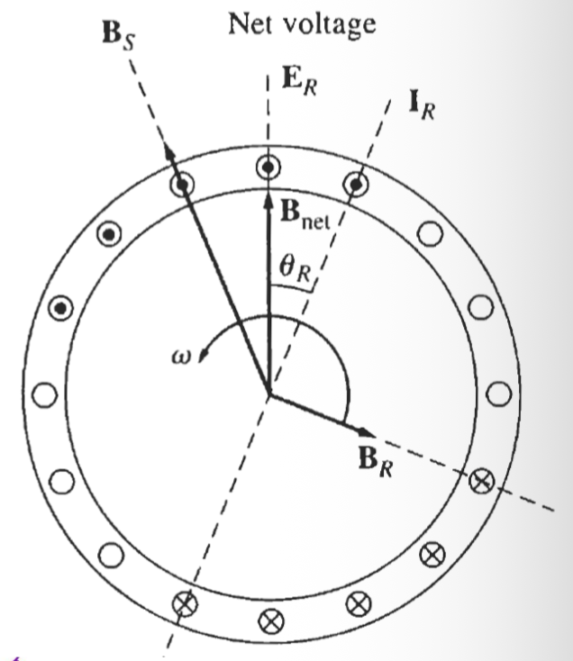

---

### § Slip and Mechanical Speed Relations

To induce voltage, the rotor mechanical speed $n_m$ must be less than the synchronous speed $n_s$. We define the **slip speed** as $n_{slip} = n_s - n_m$ and the **slip** $s$ as:
$$s = \frac{n_s - n_m}{n_s} \times 100\%$$

* At standstill: $s = 1$ ($100\%$).
* At synchronous speed: $s = 0$.

The mechanical speed is:
$$n_m = (1-s) n_s, \quad \omega_m = (1-s) \omega_s$$

Stator frequency $f_e$ and rotor frequency $f_r$ are related by:
$$f_r = s f_e$$

The rotor MMF rotates at synchronous speed $n_s$ relative to the stator:
$$n_{R,stator} = n_r + n_m = s n_s + (1-s) n_s = n_s$$

---

### § Induction Motor Circuit Model under Locked-Rotor Conditions

At standstill ($s=1$), the induction motor acts as a static transformer. The effective turns ratio is:
$$k_e = \frac{N_1 k_{w1}}{N_2 k_{w2}}$$

Stator and rotor voltages are related by $k_e$. The magnetizing current $I_0$ supplies the main flux and accounts for core losses.
$$I_0 = I_a + I_m$$

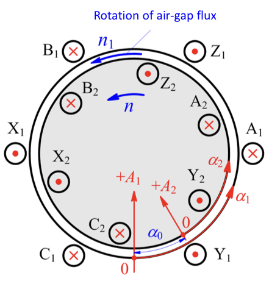

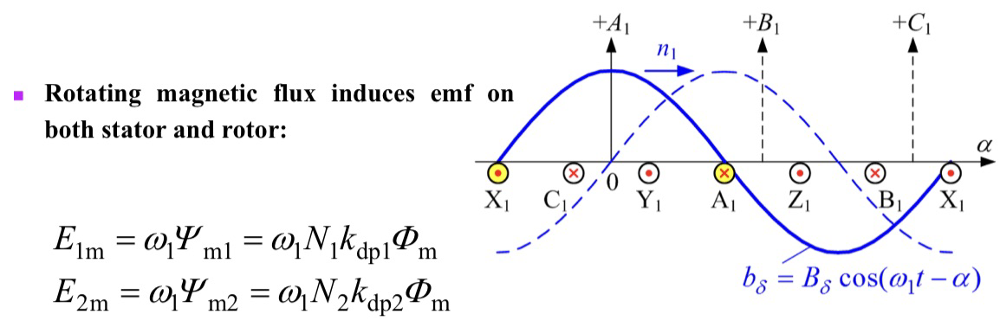

---

### § Equivalent Circuit of an Induction Motor

The per-phase equivalent circuit of an induction motor at standstill is identical to that of a transformer:
$$\vec{V}_1 = \vec{I}_1 R_1 + j\vec{I}_1 X_1 + \vec{E}_1$$
$$\vec{E}_1 = -j\vec{I}_0 X_m$$
$$\vec{E}_2 = \vec{I}_2 R_2 + j\vec{I}_2 X_2$$

where:
* $R_1, X_1$: stator resistance and leakage reactance
* $R_2, X_2$: rotor resistance and leakage reactance
* $X_m$: magnetizing reactance

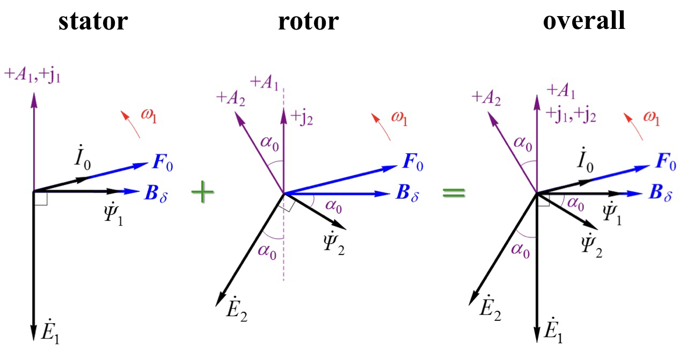
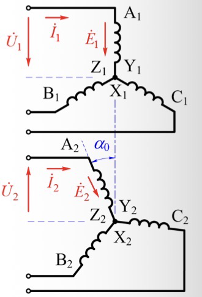

---

### § Secondary to Primary Side Parameter Conversion

Rotor parameters are referred to the stator using the effective turns ratio $k_e$ and current ratio $k_i$:
$$k_e = \frac{N_1 k_{w1}}{N_2 k_{w2}}, \quad k_i = \frac{m_1 N_1 k_{w1}}{m_2 N_2 k_{w2}}$$
$$E_2' = k_e E_2 = E_1$$
$$I_2' = \frac{I_2}{k_i}$$
$$R_2' = k_e k_i R_2$$
$$X_2' = k_e k_i X_2$$

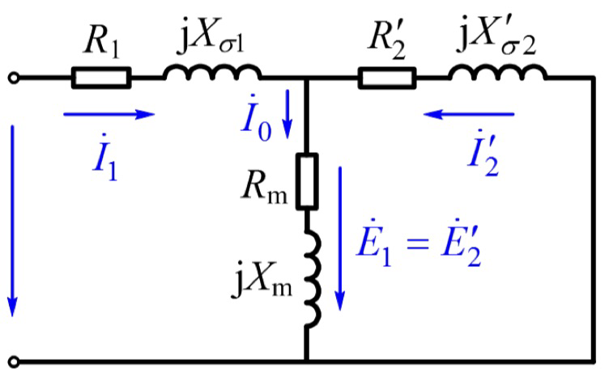

---

### § Equivalent Circuit under Rotating Conditions

When the rotor is rotating at slip $s$:
* The rotor induced EMF is $E_{2s} = s E_2$.
* The rotor leakage reactance is $X_{2s} = s X_2$.
The rotor current is:
$$I_2 = \frac{s E_2}{R_2 + j s X_2} = \frac{E_2}{\frac{R_2}{s} + j X_2}$$

Referring to the stator:
$$I_2' = \frac{E_1}{\frac{R_2'}{s} + j X_2'}$$

The slip-dependent resistance $\frac{R_2'}{s}$ is split into two parts:
$$\frac{R_2'}{s} = R_2' + R_2' \frac{1-s}{s}$$

where:
* $R_2'$: represents rotor copper losses.
* $R_2' \frac{1-s}{s}$: represents converted mechanical power.

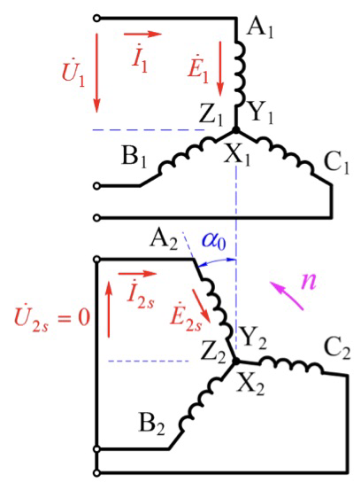
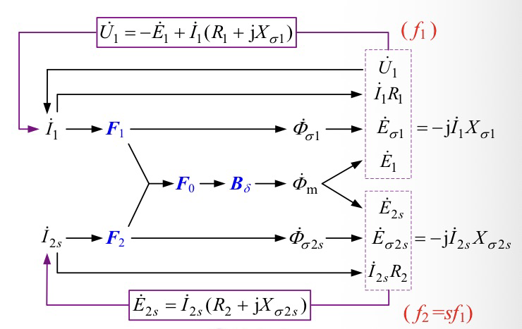
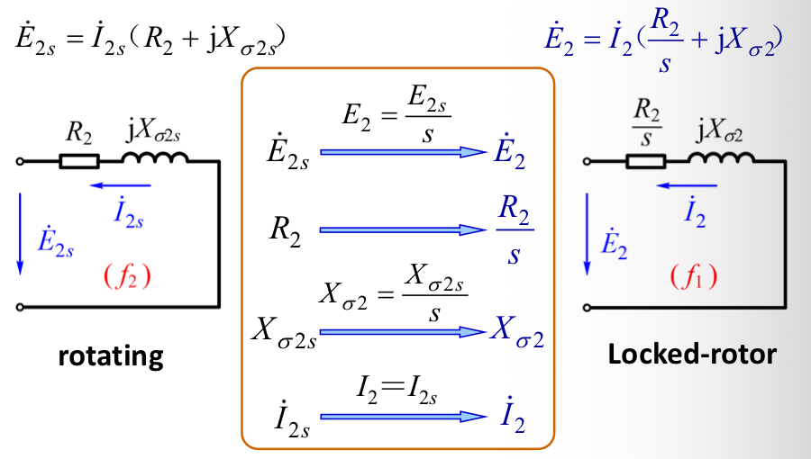
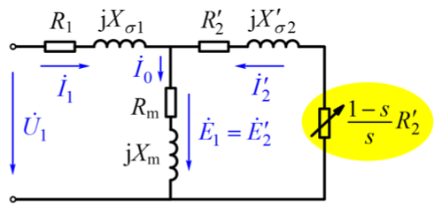
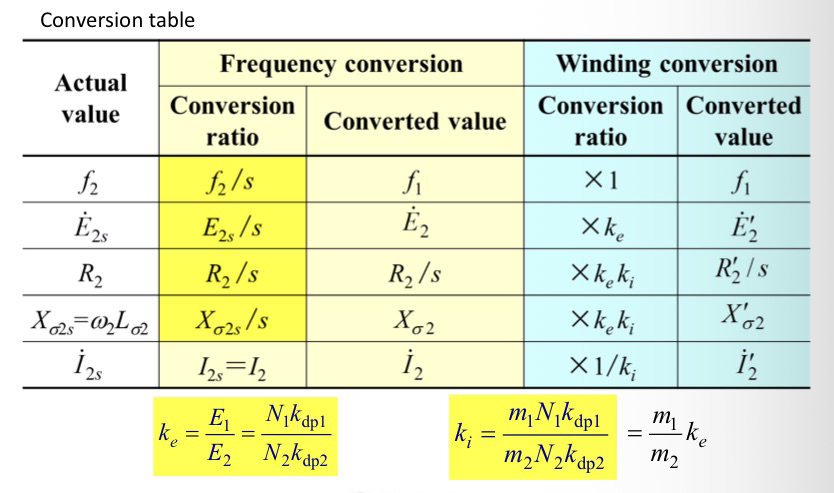

---

### § Determining Circuit Model Parameters

Induction motor parameters are determined using three tests:
1. **DC Test**: Measures stator resistance $R_1$.
2. **No-Load Test**: Motor runs unexcited and unloaded ($s \approx 0$). Input power equals stator copper loss plus rotational losses (core loss + friction/windage).
   $$P_{in} = 3 I_1^2 R_1 + P_{rot}$$
   $$Z_{nl} \approx X_1 + X_m$$
3. **Locked-Rotor Test**: Rotor is locked ($s = 1$). A reduced frequency voltage is applied to determine leakage reactances and rotor resistance.
   $$R_{LR} = R_1 + R_2' = \frac{P_{LR}}{3 I_{LR}^2}$$
   $$X_{LR}' = X_1 + X_2' = \sqrt{Z_{LR}^2 - R_{LR}^2}$$
   Reactance at rated frequency:
   $$X_{LR} = X_{LR}' \frac{f_{rated}}{f_{test}}$$

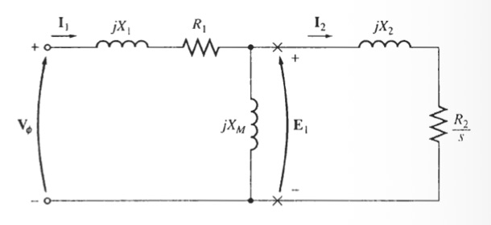
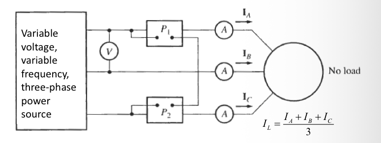
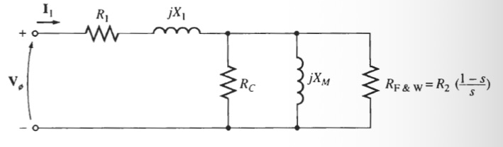
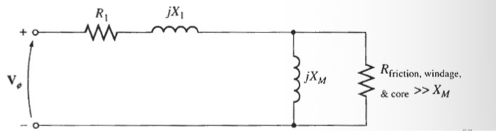
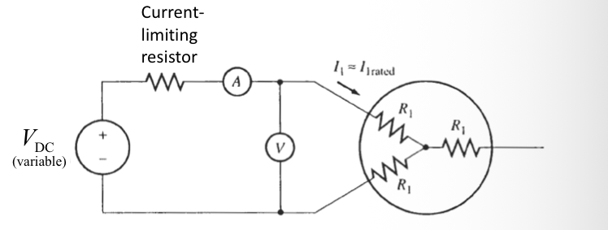
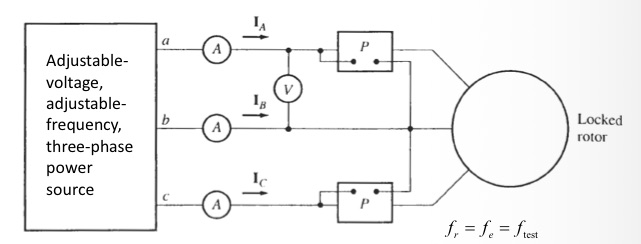
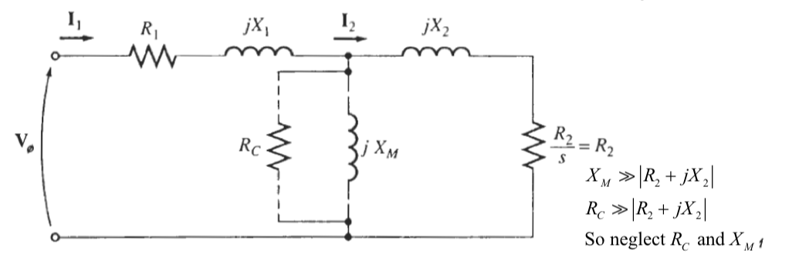
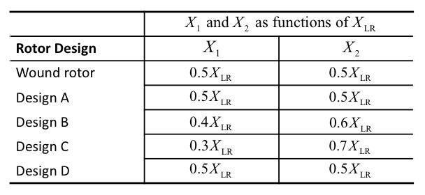

---

### § Power and Torque in Induction Motors

The input power is:
$$P_{in} = \sqrt{3} V_L I_L \cos\theta$$

Stator copper loss and core loss:
$$P_{SCL} = 3 I_1^2 R_1, \quad P_{core} = 3 E_1^2 G_c$$

Air-gap power:
$$P_{AG} = P_{in} - P_{SCL} - P_{core} = 3 I_2'^2 \frac{R_2'}{s}$$

Rotor copper loss:
$$P_{RCL} = 3 I_2'^2 R_2' = s P_{AG}$$

Converted power (mechanical):
$$P_{conv} = P_{AG} - P_{RCL} = 3 I_2'^2 R_2' \frac{1-s}{s} = (1-s) P_{AG}$$

Induced torque:
$$\tau_{ind} = \frac{P_{AG}}{\omega_s}$$

Output power:
$$P_{out} = P_{conv} - P_{F\&W} - P_{misc}$$

The power ratios are:
$$P_{AG} : P_{RCL} : P_{conv} = 1 : s : (1-s)$$

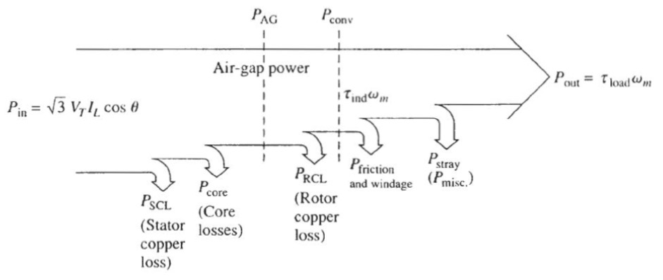

---

### § Torque-Speed Characteristics of an Induction Motor

The induced torque is:
$$\tau_{ind} = k B_R B_S \sin\delta$$

Neglecting stator impedance:
$$\vec{V}_1 \approx \vec{E}_1 \implies B_{net} \approx \text{constant}$$
The torque-speed curve is divided into:
1. **Low-slip region**: $s \to 0$, $R_2/s \gg X_2$, rotor power factor $\approx 1$, torque is linear with slip.
2. **Moderate-slip region**: Rotor reactance $s X_2$ becomes comparable to $R_2$. Torque reaches a maximum (pullout torque).
3. **High-slip region**: $s \to 1$. High current but low torque due to low power factor.

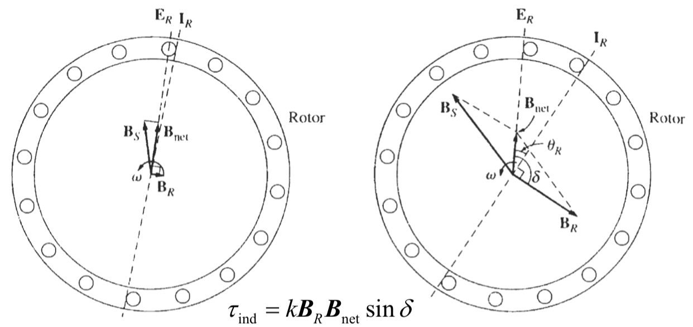
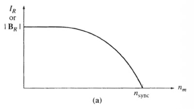
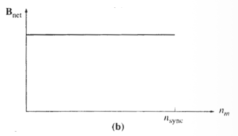
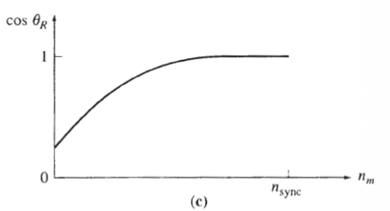
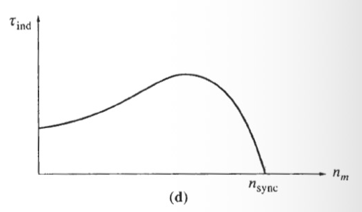

---

### § Derivation of the Torque-Speed Equation

Using Thevenin's theorem at the stator side:
$$\vec{V}_{TH} = \vec{V}_\phi \frac{j X_m}{R_1 + j(X_1 + X_m)} \approx \vec{V}_\phi \frac{X_m}{X_1 + X_m}$$
$$Z_{TH} = R_{TH} + j X_{TH} = \frac{j X_m (R_1 + j X_1)}{R_1 + j(X_1 + X_m)}$$
$$R_{TH} \approx R_1 \left(\frac{X_m}{X_1 + X_m}\right)^2, \quad X_{TH} \approx X_1$$

The rotor current is:
$$I_2' = \frac{V_{TH}}{\sqrt{\left(R_{TH} + \frac{R_2'}{s}\right)^2 + (X_{TH} + X_2')^2}}$$

The induced torque is:
$$\tau_{ind} = \frac{3 V_{TH}^2 \frac{R_2'}{s}}{\omega_s \left[\left(R_{TH} + \frac{R_2'}{s}\right)^2 + (X_{TH} + X_2')^2\right]}$$

---

### § Maximum (Pullout) Torque

By impedance matching, maximum torque occurs at:
$$s_{max} = \frac{R_2'}{\sqrt{R_{TH}^2 + (X_{TH} + X_2')^2}}$$

The maximum torque is:
$$\tau_{max} = \frac{3 V_{TH}^2}{2 \omega_s \left[R_{TH} + \sqrt{R_{TH}^2 + (X_{TH} + X_2')^2}\right]}$$

The maximum torque is independent of rotor resistance $R_2$, but the slip at which it occurs is proportional to $R_2$.

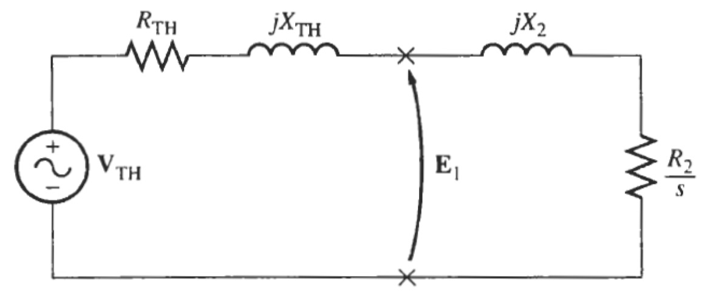
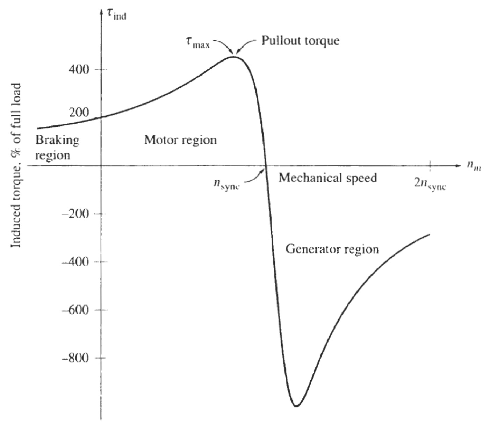
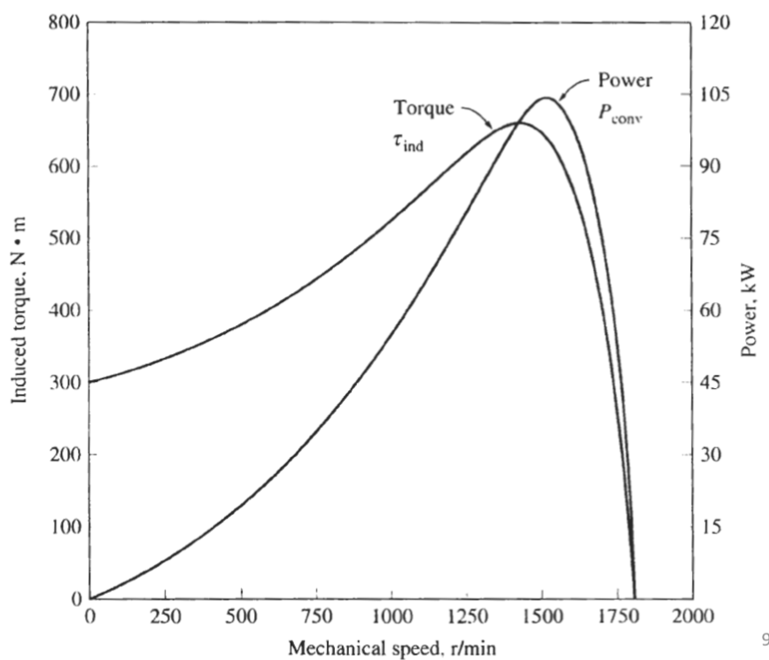
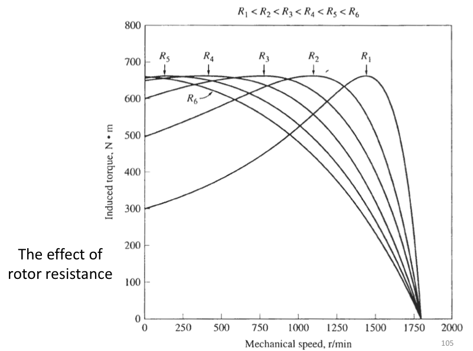

---

### § Control by Rotor Bar Structure and NEMA Classes

Wound-rotor motors can vary $R_2$ using external resistors. For cage rotors, variable rotor resistance is achieved using:
* **Deep rotor bars**: At starting, high rotor frequency (equal to stator frequency) causes current to crowd to the top of the bars (skin effect), increasing resistance. At running, low rotor frequency allows current to distribute evenly, reducing resistance.
* **Double-cage rotor**: Has an outer cage of high resistance/low reactance and an inner cage of low resistance/high reactance.

NEMA Design Classes (A, B, C, D) represent different starting torque and current characteristics.

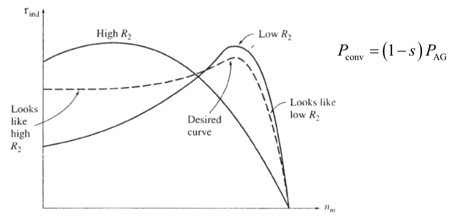
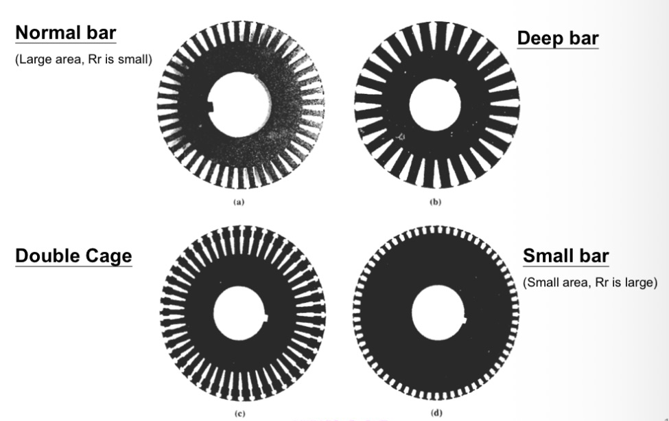
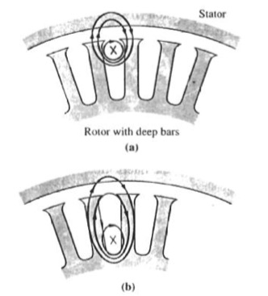
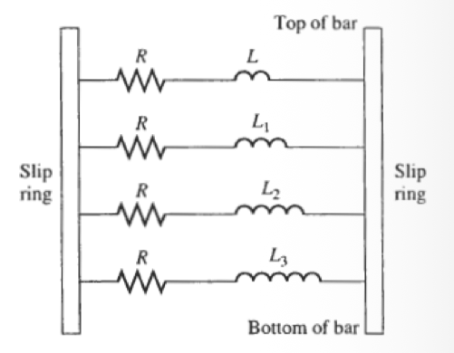
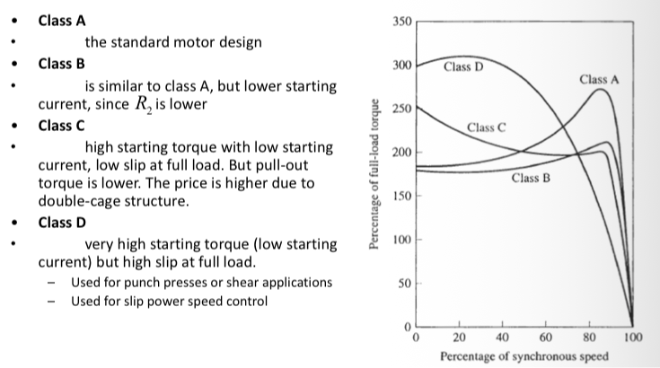

---

### § Speed Control of an Induction Motor

Methods for speed control:
1. **Changing line voltage**: Torque is proportional to $V^2$. High slip operation results in high rotor losses and low efficiency. Limited speed range.
2. **Changing rotor resistance**: Wound-rotor only. Simple but inefficient.
3. **Variable Voltage Variable Frequency (VVVF) control**:
   To prevent saturation, the stator voltage is scaled with frequency ($V \propto f$). Above rated frequency, voltage is constant and torque limit decreases ($\tau \propto 1/f$).

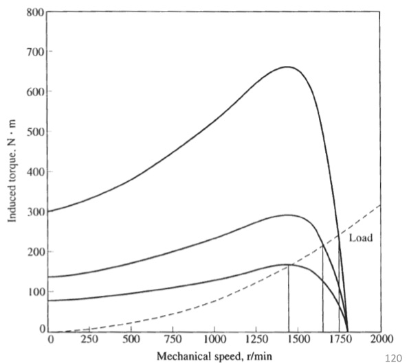
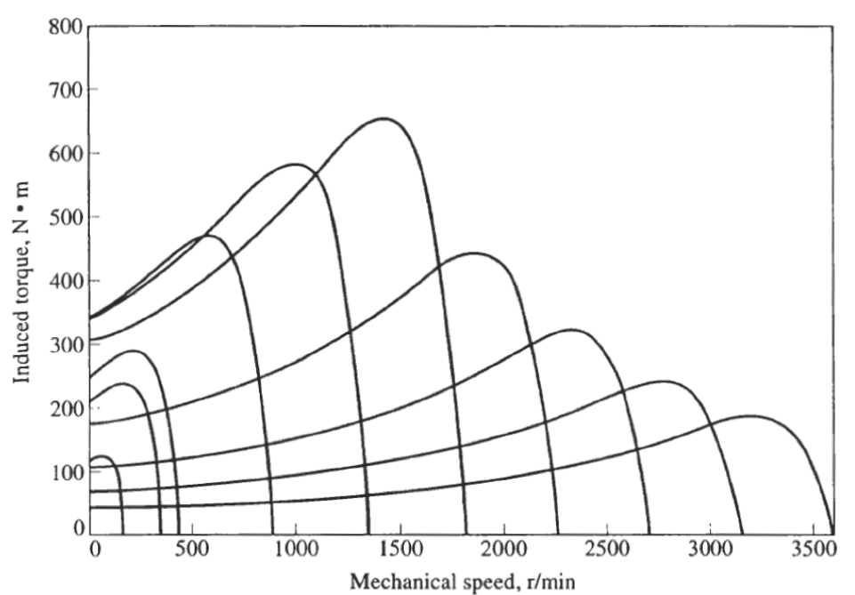

---

### § Starting of Induction Motors

The starting current is very large (5 to 8 times rated) while the starting torque is modest.
Methods to reduce starting current:
* Reduced-voltage starting (using autotransformer or star-delta starter).
* Deep rotor bars / double cage.
* Rotor resistance (wound rotor).

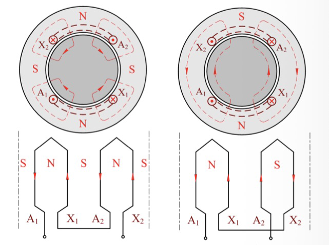
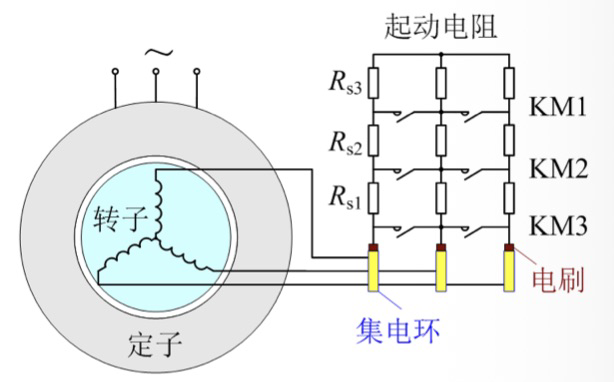

---

## VI. DC Machines

### § Basic Principles of DC Machines

DC machines rely on a rotating armature winding and a stationary field system.
* Induced EMF:
  $$E_a = K_a \Phi \omega_m$$
* Induced torque:
  $$\tau_{ind} = K_a \Phi I_a$$

where:
* $K_a = \frac{p N_c}{\pi a}$ (machine constant)
* $\Phi$: flux per pole
* $I_a$: armature current
* $\omega_m$: rotor speed (rad/s)

The **commutator** acts as a mechanical rectifier, converting the internal AC voltage of the armature coils to DC at the brushes.

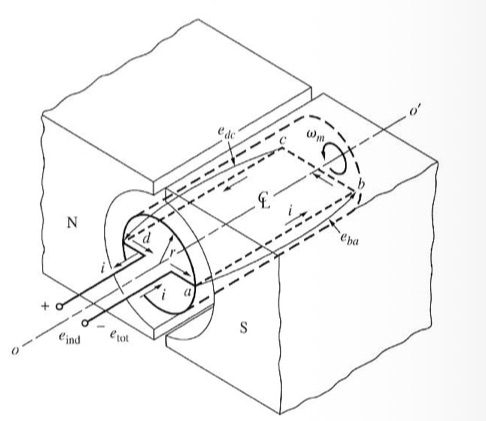
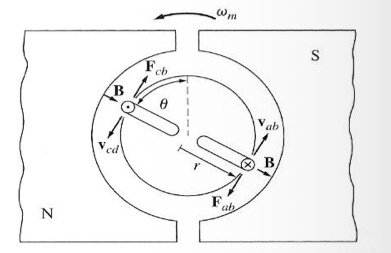
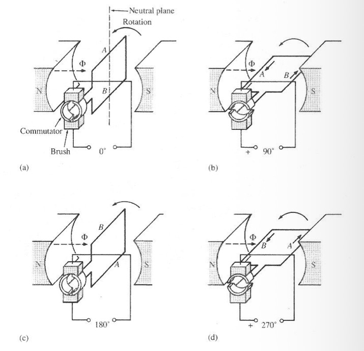

---

### § Voltage Ripple and Commutator Segments

A simple loop generator produces a highly pulsating DC voltage. By adding more coils and commutator segments, the brushes always connect to the coil inducing the highest instantaneous EMF. This reduces the **voltage ripple** (harmonics), producing a smooth DC output.

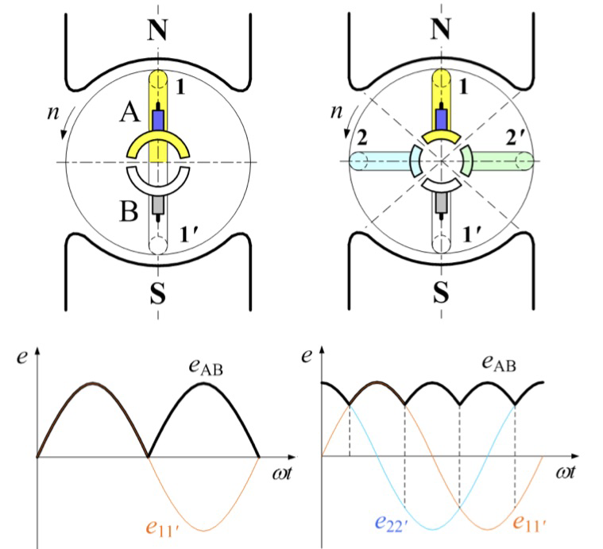
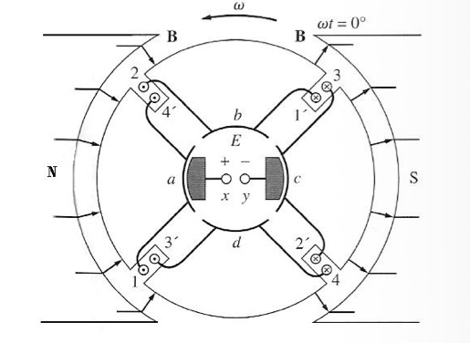

---

### § Armature Windings of DC Machines

DC armature windings are closed-loop windings classified into:
1. **Lap Winding**: The ends of each coil are connected to adjacent commutator segments. The number of parallel paths $a$ equals the number of poles $P$ ($a = P$). Used for high current, low voltage applications.
2. **Wave Winding**: The coil ends are connected to segments spaced far apart. The number of parallel paths is always two ($a = 2$). Used for high voltage, low current applications.

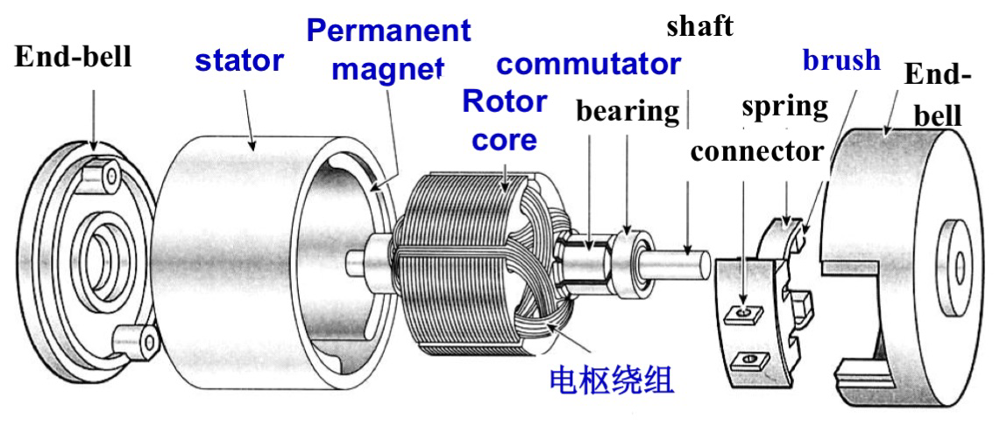
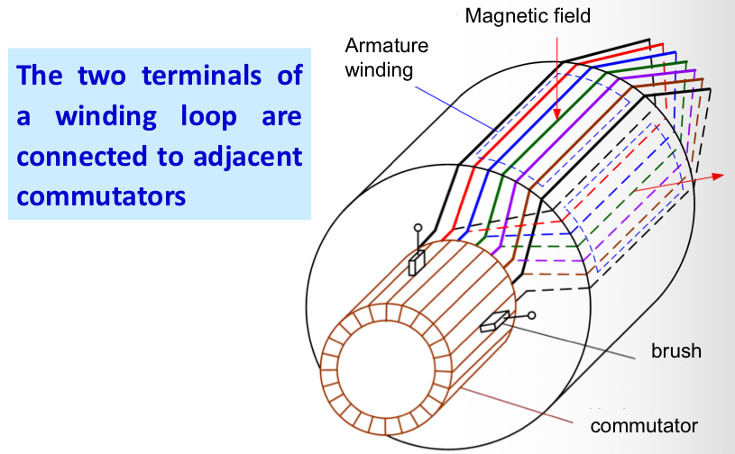
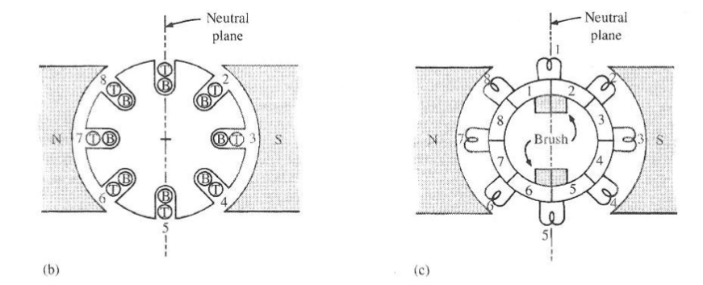
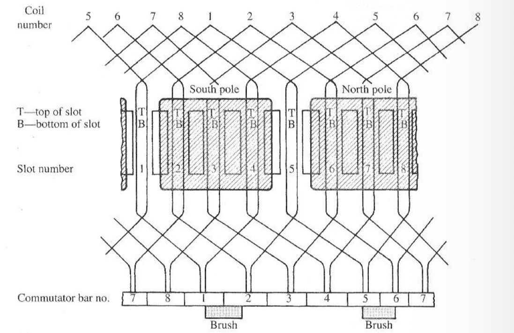
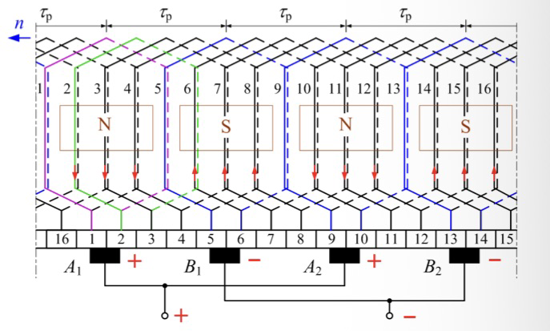

---

### § Problems with Commutation

During commutation, the armature current in a coil must reverse direction. Because of the coil's inductance $L$, a self-induced EMF (reactance voltage) opposes this change:
$$v = L \frac{di}{dt}$$

With short commutation times, this induced voltage is large, causing sparking at the brushes.

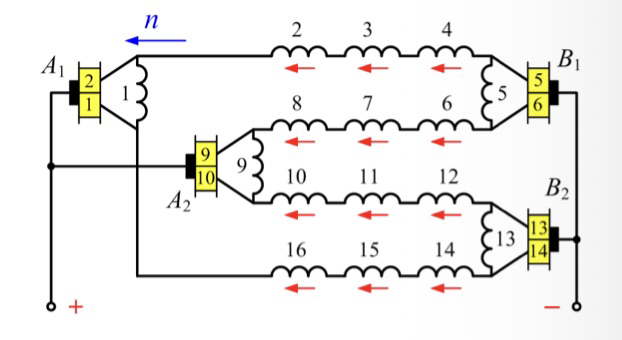
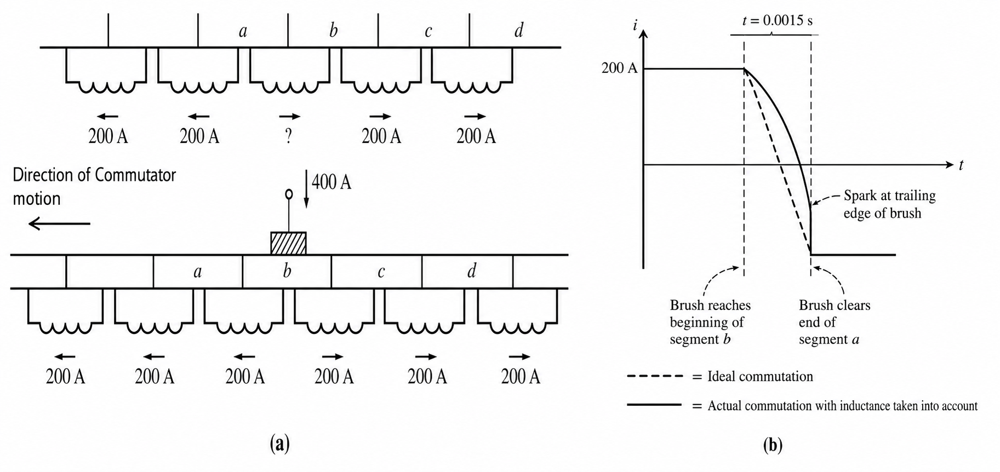

---

### § Solutions to Commutation Problems

1. **Interpoles (commutating poles)**: Small auxiliary poles placed between main poles. They induce a voltage in the short-circuited coil that cancels the reactance voltage and assists commutation.
2. **Compensating windings**: Windings placed in the main pole faces, connected in series with the armature, to cancel the cross-magnetizing armature reaction MMF.

---

### § Armature Reaction in DC Machines

Under no-load, the air-gap flux density $B_0$ is symmetrical, and the **magnetic neutral axis (MNA)** is perpendicular to the main pole axis.

Under load, the armature current generates a cross-magnetizing MMF $F_a$ (along the q-axis). This distorts the net flux density:
1. **Neutral axis shift**: The MNA shifts in the direction of rotation for a generator, and in the opposite direction for a motor.
2. **Flux weakening**: Due to saturation at the pole tips, the net flux per pole decreases, reducing the induced EMF $E_a$.

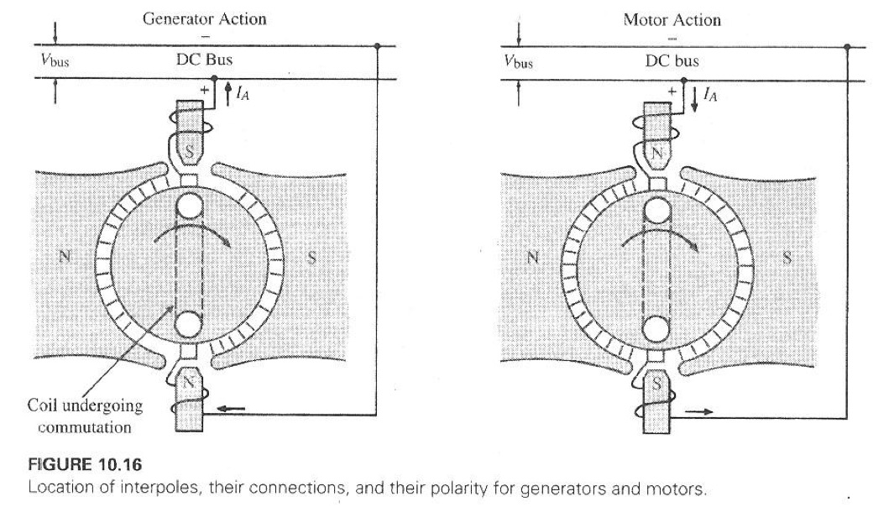
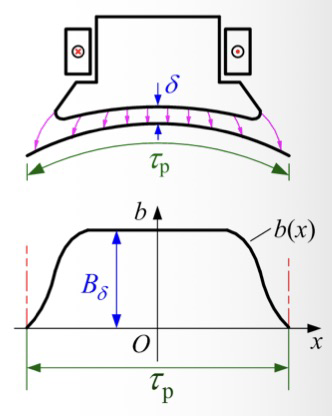
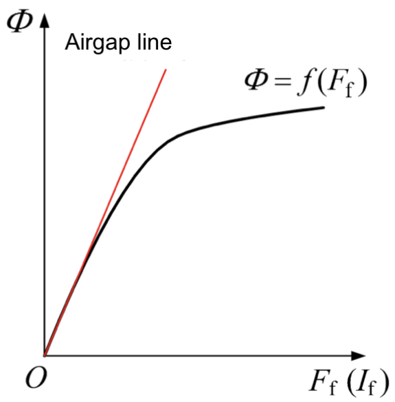
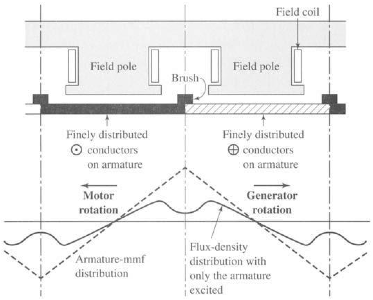
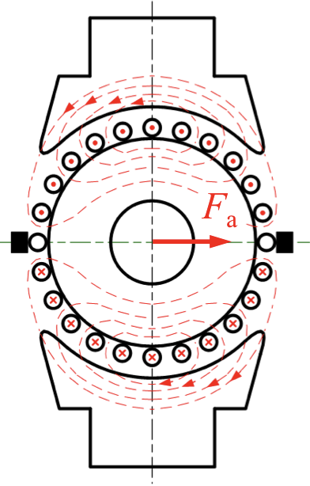
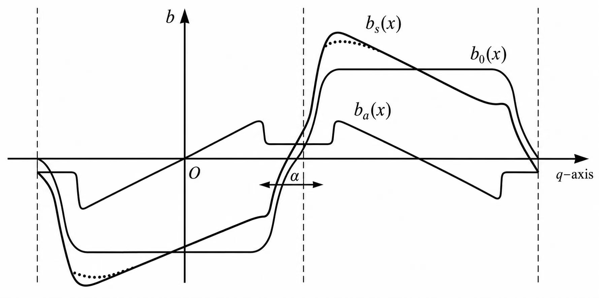

---

### § Equivalent Circuit of a DC Machine

The equivalent circuit consists of:
* Field circuit: $V_f = I_f R_f$
* Armature circuit: $V_t = E_a \pm I_a R_a$ ($-$ for generator, $+$ for motor).
* Converted power: $P_{conv} = E_a I_a = \tau_{ind} \omega_m$.

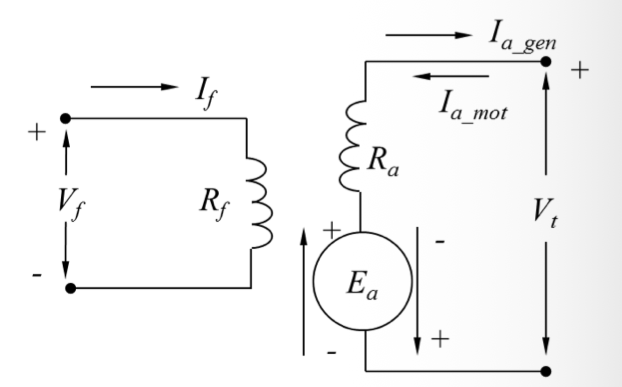

---

### § DC Machine Excitation Types

DC machines are classified by how the field winding is connected:
1. **Separately Excited**: Field winding is supplied by an independent DC source.
2. **Shunt**: Field winding is connected in parallel with the armature.
3. **Series**: Field winding is connected in series with the armature.
4. **Compound**: Has both shunt and series windings (can be cumulatively or differentially compounded).

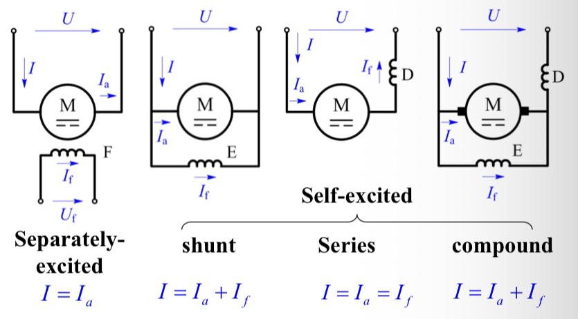
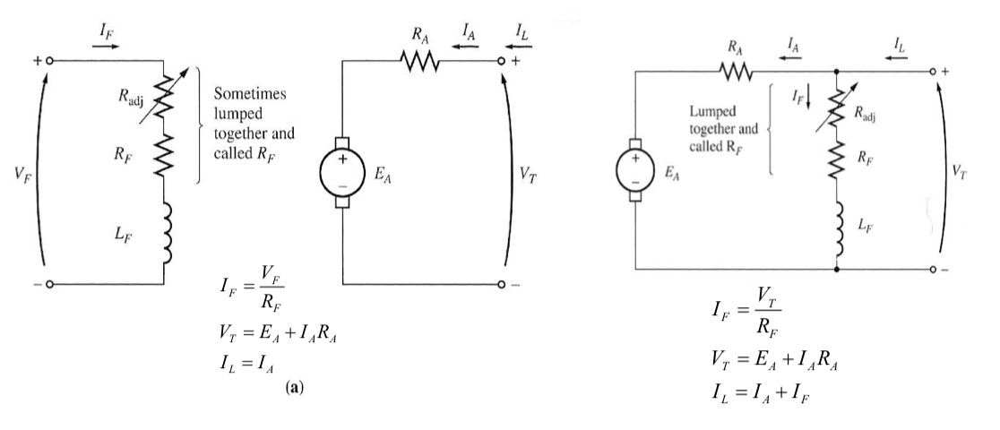

