## 电磁场

### Chapter 1： 静止电荷的电场

**1.1 电场强度 $\vec{E}$ 与 Coulomb 定律**

$\vec{E}$ 定义为位于该点静止的单位正电荷所受的电场力。

$$ \vec{E} = \frac{\vec{F}}{q} $$

自由空间中静电场的边值问题：

$$ \begin{cases} \nabla \cdot \vec{E}(\vec{r}) = \rho(\vec{r})/\varepsilon_0 \\ \nabla \times \vec{E}(\vec{r}) = 0 \\ E_t(\vec{r})|_{r \to \infty} = 0 \end{cases} $$

真空介电常数 $\varepsilon_0 = \frac{10^{-9}}{36\pi} \; \text{F/m}$

**积分形式：**

$$ \begin{cases} \oiint_S \vec{E} \cdot d\vec{S} = \frac{1}{\varepsilon_0} q_{net}

\\ \\ \oint_l \vec{E} \cdot d\vec{l} = 0 \end{cases} $$

**积分形式通解：**

$$ \vec{E}(\vec{r}) = \iiint_V \frac{\rho(\vec{r}')}{4\pi\varepsilon} \nabla'\frac{1}{R} dV' - \frac{1}{4\pi} \left\{ \oiint_S \vec{n} \cdot \vec{E}(\vec{r}') \nabla'\frac{1}{R} dS + \oiint_S [\vec{n} \times \vec{E}(\vec{r}')] \times \nabla'\frac{1}{R} dS \right\} $$

**解读：**

$\vec{r}'$：源点的矢径；

$\vec{r}$：场点的矢径（待求点）；

$\vec{R}$：场源间距，$R = |\vec{r} - \vec{r}'|$；

$\nabla'$：对源点求梯度；

$\nabla'\frac{1}{R} = \nabla'\frac{1}{|\vec{r}-\vec{r}'|} = -\nabla\frac{1}{R}$。

**扩充内容：** 已知 $\vec{E} = E_p(\vec{r})\vec{r}^\circ$，在导体面上 $\vec{n} \times \vec{E} = 0$，$\vec{n} \cdot \vec{E}$ 均匀分布。

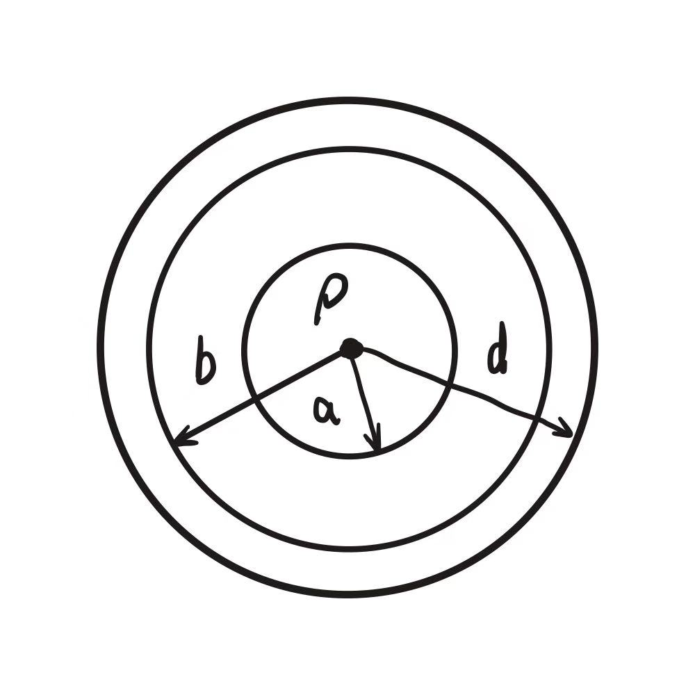

内部电场： 

$$\vec{E}_n(b) = \underbrace{ \vec{n} \cdot \vec{E}_p(b) }_{\text{源电场}} - \underbrace{ \frac{1}{4\pi}\vec{n} \cdot \oiint_S E_n(\vec{r}') \frac{\vec{R}^\circ}{R^2} dS' }_{\text{感应电荷贡献 = 0 （由球的对称性）}} $$

$$E_n(b) = \vec{n} \cdot \vec{E}_p(b) = \frac{q}{4\pi\varepsilon_0 b^2}$$

**结论：** 导体球壳不影响内部场！

$\Rightarrow$ **静电屏蔽**

---

**库仑定律：**

由边值问题的通解，自由空间静电场边值问题的解为：

$$ \vec{E}(\vec{r}) = \iiint_{V'} \frac{\rho(\vec{r}')}{4\pi\varepsilon_0 R^2} dV' \vec{R}^\circ $$

微元化，点电荷场强：

$$ \vec{E}(\vec{r}) = \frac{q}{4\pi\varepsilon_0 |\vec{r}-\vec{r}'|^2} \vec{e}_R $$

面电荷有：$\vec{E}(\vec{r}) = \frac{1}{4\pi\varepsilon_0} \iint_{S'} \frac{\rho_S(\vec{r}')dS'}{|\vec{r}-\vec{r}'|^2} \vec{e}_R$

线电荷有：$\vec{E}(\vec{r}) = \frac{1}{4\pi\varepsilon_0} \int_{l'} \frac{\tau(\vec{r}')dl'}{|\vec{r}-\vec{r}'|^2} \vec{e}_R$

**推论 - 常见电场** （此处 $\tau\Delta l \rightarrow q_{net}$）

带电直线中垂线：$E = \frac{\tau L}{4\pi\varepsilon_0 x (x^2 + L^2/4)^{1/2}}$

无限长直线 ($L \gg x$)：$E = \frac{\tau}{2\pi\varepsilon_0 x}$

> **高斯视角：** $2\pi x \cdot \Delta l \cdot E = \tau\Delta l$

球、板、环 ($x \gg R$)：退化为点电荷。

---

**1.2 高斯通量定理**

$$ \begin{cases} \oiint_S \vec{E} \cdot d\vec{S} = \frac{1}{\varepsilon_0} \iiint_V \rho dV = \frac{1}{\varepsilon_0} q_{net} \\ \oint_l \vec{E} \cdot d\vec{l} = 0 \end{cases} $$

全息思想：测量边界来求内部源。

平方反比的实质：三维空间球面面积的几何约束 ($4\pi R^2$)。

---

**1.3 电位**

电场是无旋场，无旋意味着环量处处为 0。

则 $U_{ab} = \int_a^b \vec{E} \cdot d\vec{l}$ 与积分路径无关。

由位函数的定义，位函数由于泊松方程积分变量的原因必须指定参考点！

以无限远处为参考点时，一点的电位有：
$$ \varphi_a = \int_a^\infty \vec{E} \cdot d\vec{l} $$

根据 Coulomb 定律：
$$ d\varphi(\vec{r}) = \frac{\rho(\vec{r}')dV'}{4\pi\varepsilon_0 R} \quad \Rightarrow \quad \varphi(\vec{r}) = \iiint_V \frac{\rho(\vec{r}')}{4\pi\varepsilon_0 R} dV' $$

对于点电荷有：
$$ \varphi(\vec{r}) = \frac{q}{4\pi\varepsilon_0 R} $$

无限长线电荷的电位：
$$ E(x) = \frac{\tau}{2\pi\varepsilon_0 x} $$
$$ \varphi(x) = \int_x^a \frac{\tau}{2\pi\varepsilon_0 r} dr = \frac{\tau}{2\pi\varepsilon_0} (\ln a - \ln x) $$

---

**1.4 电偶极子 Electric charge dipole**

由一对等量异号电荷相距很近所构成的电荷源。

电偶极子的大小和方向可以用电偶极矩来表示：
$$ \vec{p} = q\vec{d} $$

电偶极子的电位近似表达式：

球坐标系中 $\varphi_m = \frac{q}{4\pi\varepsilon_0} \left(\frac{1}{r_1} - \frac{1}{r_2}\right)$

对于 $r \gg d$ 的远场区域：
$$ r_1 \approx r - \frac{d}{2}\cos\theta \, , \quad r_2 \approx r + \frac{d}{2}\cos\theta $$
则有：
$$ \varphi_m = \frac{dq\cos\theta}{4\pi\varepsilon_0 r^2} = \frac{\vec{p} \cdot \vec{e}_r}{4\pi\varepsilon_0 r^2} $$

由 $\varphi_m = \frac{qd\cos\theta}{4\pi\varepsilon_0 r^2}$ 和 $\vec{E} = -\nabla\varphi$，可得：
$$ \vec{E}_m = -\nabla\varphi_m = \frac{p}{4\pi\varepsilon_0 r^3} (2\cos\theta\vec{e}_r + \sin\theta\vec{e}_\theta) $$

这个例子是为了说明 $\varphi \to \vec{E}$ 的方便性。

---

**1.5 静电场中的导体和电介质**

**导体：**

*   **场内性质**：内部 $E = 0$，$\varphi$ 处处相等。
*   **表面性质**：电场与表面总是垂直关系，大小由高斯定理可得 $E = \frac{\sigma}{\varepsilon_0}$。
    $\Rightarrow$ 电荷面密度 $\sigma$ 与凸出表面的曲率正相关。突出处电场大，凹陷处小。
*   *注意*：交变电场中会感应出振荡电流。

**电介质：**

电介质不是导体，没有自由电荷，但分子有极性，且分子是被束缚的。

在外加电场中，电介质会发生极化：

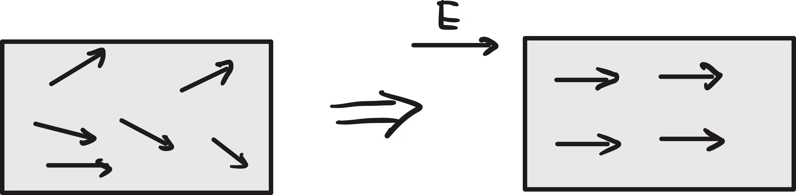

可以想象，在介质内部，由于分子紧密相邻，仍然保持电中性。但在边界上，会堆积多余的电荷，称为**束缚电荷**。

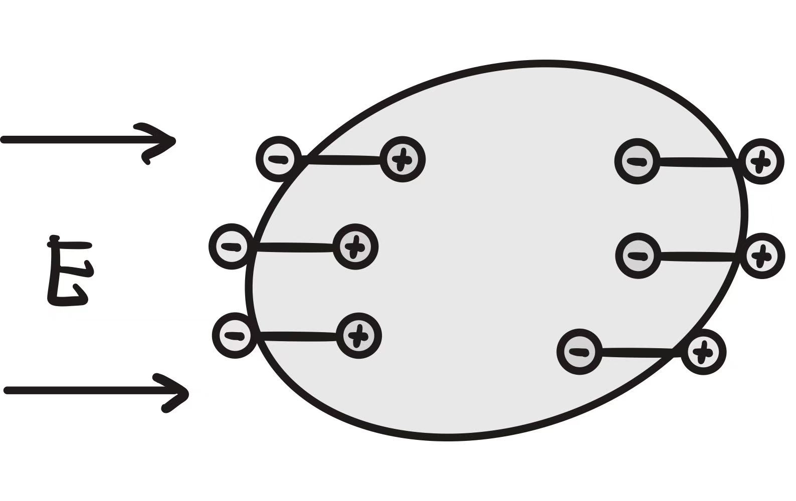

由介质受极化的程度，用**极化强度 $\vec{P}$** 表示：
$$ \vec{P} = \lim_{\Delta V \to 0} \frac{\sum \vec{p}}{\Delta V} $$
即为单位体积的电偶极矩。

实际上，各种电介质的 $\vec{P}$ 与 $\vec{E}$ 有关，对于各向同性的线性电介质：
$$ \vec{P} = \chi_e \varepsilon_0 \vec{E} $$
其中 $\chi_e$ 为介质的相对极化率。

---

**1.6 电介质中的电场与电位移**

高斯定律中，$q_{net}$ 既考虑自由电荷又考虑束缚电荷：
$$ \oiint_S \vec{E} \cdot d\vec{S} = \frac{1}{\varepsilon_0} (\sum q + \sum q_p) $$

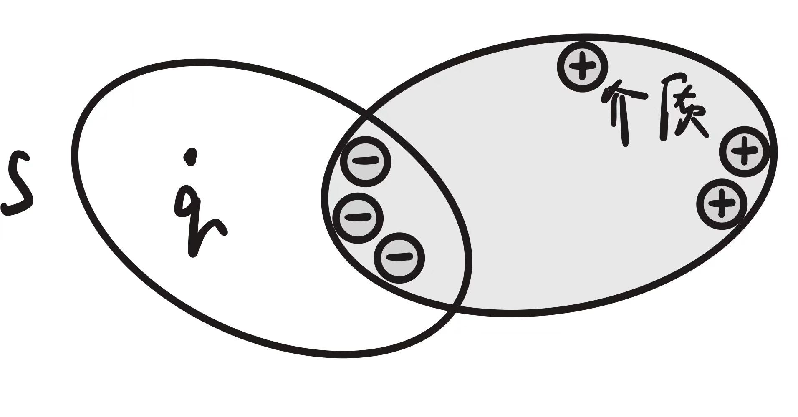

可以认为，高斯面 $S$ 内介质并非电中性，因为另一部分 $q_p$ 不在 $S$ 内。

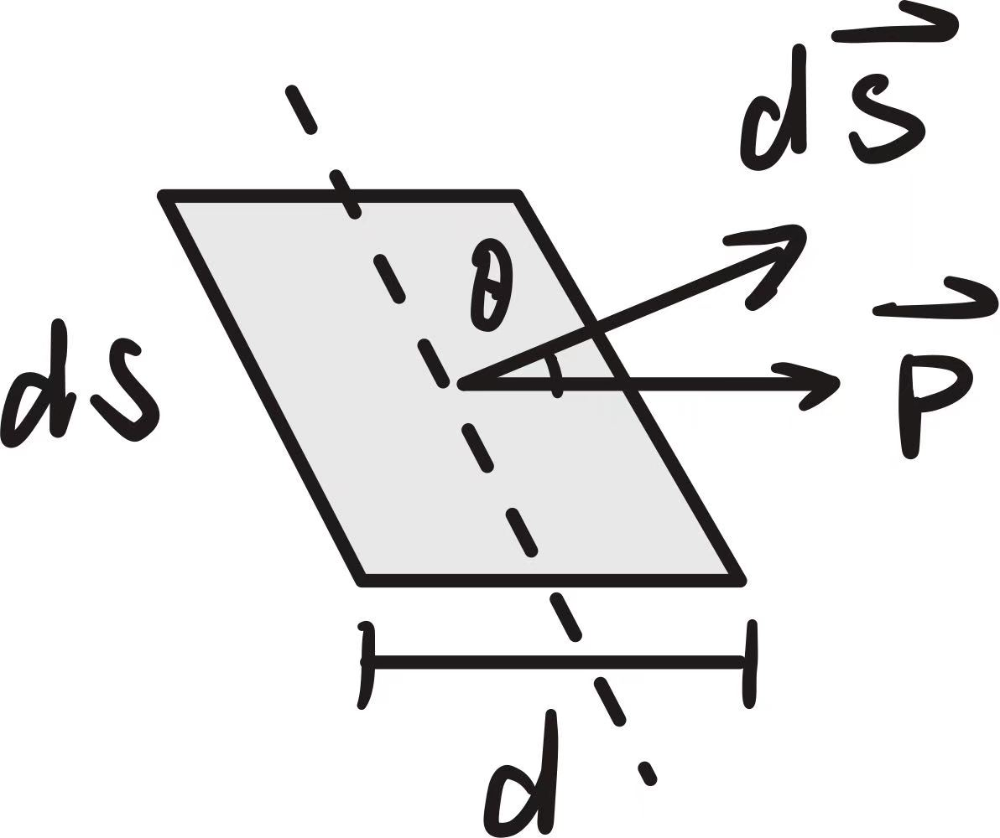

由于 $S$ 两侧的束缚电荷净值为 0，穿过 $S$ 的电荷为 $q_p$ 的负值。
则：
$$ \sum q_p = -\oiint_S \vec{P} \cdot d\vec{S} $$

代入高斯定律：
$$ \oiint_S (\varepsilon_0 \vec{E} + \vec{P}) \cdot d\vec{S} = \sum q $$

令 $\varepsilon_0 \vec{E} + \vec{P} \equiv \vec{D}$，则有：
$$ \oiint_S \vec{D} \cdot d\vec{S} = \sum q $$
称 $\vec{D}$ 为**电位移**。

$$ \vec{D} = \varepsilon_0 \vec{E} + \vec{P} = \varepsilon_0 \vec{E} + \chi_e \varepsilon_0 \vec{E} = (1 + \chi_e)\varepsilon_0 \vec{E} $$
令 $(1 + \chi_e)\varepsilon_0 = \varepsilon_r \varepsilon_0 = \varepsilon$。

则 $\vec{D} = \varepsilon \vec{E}$，$\varepsilon$ 称介电常数 (F/m)。

---

**1.7 分界面条件**

**A. 切向边界条件：**

描述界面两侧场量平行于界面方向的连续性。

$$ \begin{cases} E_{1t} = E_{2t} & \text{连续} \\ H_{1t} - H_{2t} = J_S & \text{有电流则突变} \end{cases} $$

**Proof:** (见上图矩形环路)

$\oint_l \vec{E} \cdot d\vec{l} = -\frac{d\Phi}{dt}$ 。由于 $w \to 0$ ，面积 $\Phi=0$，所以 $E_{1t} = E_{2t}$ 。

$\oint_l \vec{H} \cdot d\vec{l} = I + \frac{d\Psi}{dt}$ ，因为 $S \to 0$ $\Psi=0$ ，$H_{1t} - H_{2t} = J_S$  (界面)。

**B. 法向边界条件：**

描述界面两侧场量垂直于界面方向的连续性。

$$ \begin{cases} B_{1n} = B_{2n} & \text{连续} \\ D_{1n} - D_{2n} = \rho_S & \text{有电荷则突变} \end{cases} $$

**Proof:** (见上图扁平圆柱体/高斯面)

高斯定律： 

$\oiint_S \vec{B} \cdot d\vec{S} = 0$  (无单极子) $\Rightarrow (B_{1n} - B_{2n})S = 0$ ($dh \to 0$ )。

$\oiint_S \vec{D} \cdot d\vec{S} = q_{in} \Rightarrow (D_{1n} - D_{2n})S = q_{in}$ 。

---

**1.8 静电场电位的边值问题**

$$ \begin{cases} \nabla \cdot \vec{D} = \rho \\ \nabla \times \vec{E} = 0 \\ \vec{D} = \varepsilon \vec{E} \end{cases} \quad \Rightarrow \quad \nabla \cdot \vec{D} = \nabla \cdot (\varepsilon\vec{E}) = -\nabla \cdot (\varepsilon\nabla\varphi) = \rho $$

展开得 $-\nabla\varepsilon \cdot \nabla\varphi - \varepsilon\nabla^2\varphi = \rho$。

对于线性均匀介质，有 $\nabla\varepsilon = 0$，则：

$$ \nabla^2\varphi = -\frac{\rho}{\varepsilon} $$

**电位的分界面条件：**
$$ \begin{cases} D_{1n} - D_{2n} = \rho_s \\ E_{1t} - E_{2t} = 0 \end{cases} \quad \Rightarrow \quad \begin{cases} \varepsilon_2 \frac{\partial \varphi_2}{\partial n} - \varepsilon_1 \frac{\partial \varphi_1}{\partial n} = \rho_s \\ \varphi_1 = \varphi_2 \end{cases} $$

**电位的边界条件：**

**Dirichlet 条件：**
$$ \varphi|_{\Gamma} = C \quad (\text{常数时 } \varphi = C) $$

**Neumann 条件：**
法向条件表现为通量条件，有：
$$ \iint_S \vec{E} \cdot d\vec{S} = \frac{q}{\varepsilon} $$
当面电荷 $q$ 均匀时，$\frac{\partial \varphi}{\partial n} = -\frac{\rho_s}{\varepsilon}$。

*   $\varphi$ 需要一个参考点，选一个 Dirichlet 条件来确定一个参考面；
*   $U$ 未知的边界称为**悬浮电位边界**，电位未知，需要此通量约束 (Neumann)。

---

**1.9 镜像法**

**核心思想**：空间等效，边界替代。

**理论基础：**
*   自由空间的问题显著比有限域易于求解。
*   唯一性定理决定了，只要控制方程和边界条件不变，场域是唯一确定的。
*   于是，可以通过把边界上的分散源等效为场域外点源；只要能保证边界条件不变，可以转化为自由空间求解。

**常见等效模型：**

**1) 电荷对大导体平面**

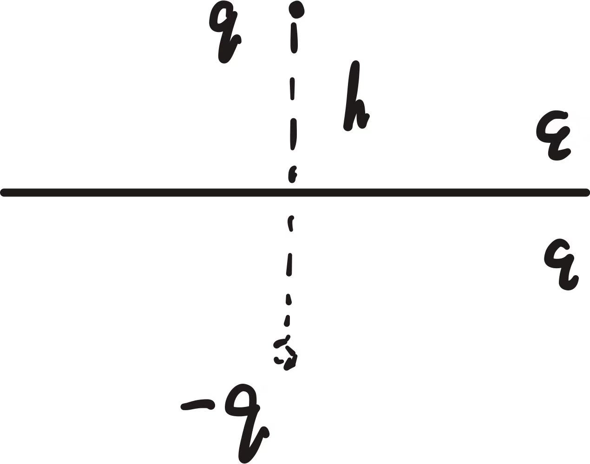

边界条件是平面上电位处处相等。

$\Rightarrow$ 镜像一个 $-q$ 等效原本板上感应电荷。

**变式：多个平面的镜像**

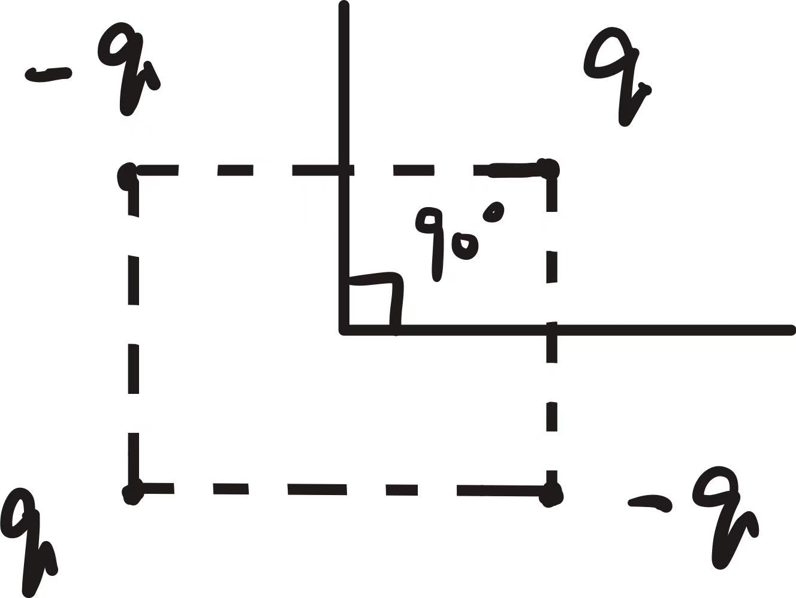

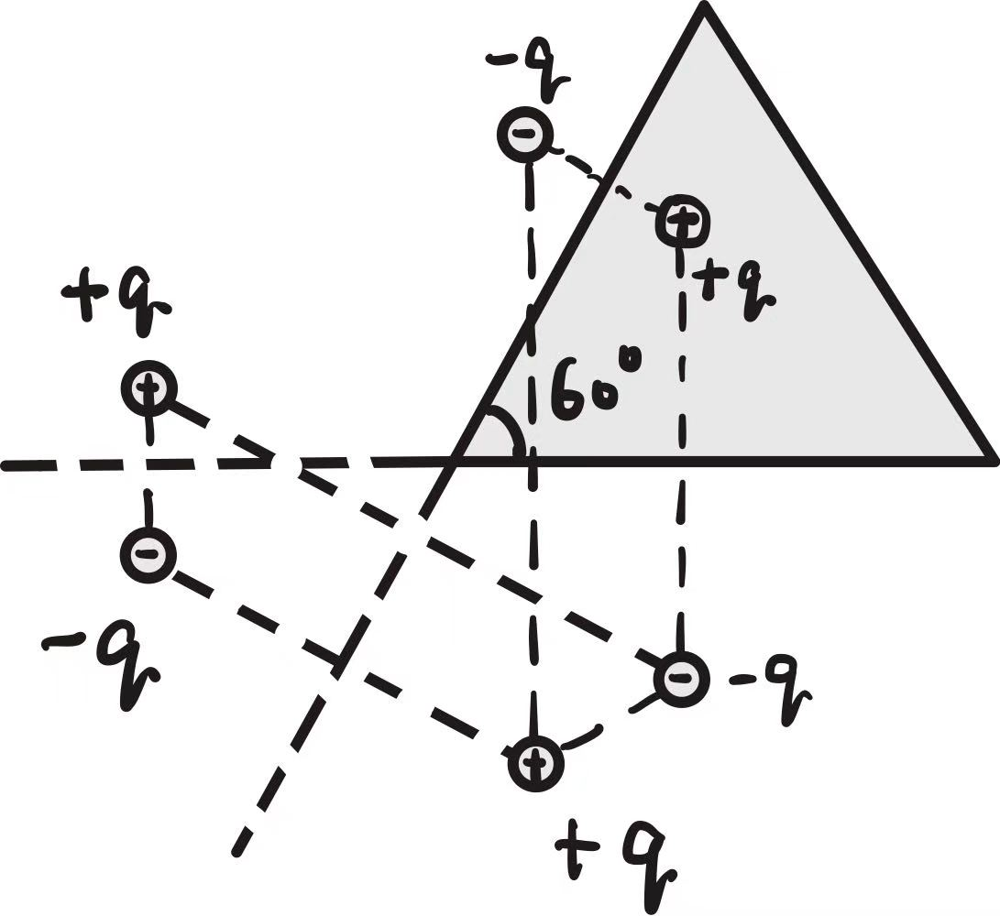

**结论**：夹角为 $\theta$ 且 $n\theta = \pi$ ($n \in \mathbb{Z}$) 时，需要引入 $(2n - 1)$ 个镜像电荷。

**2) 无限大介质分界面**

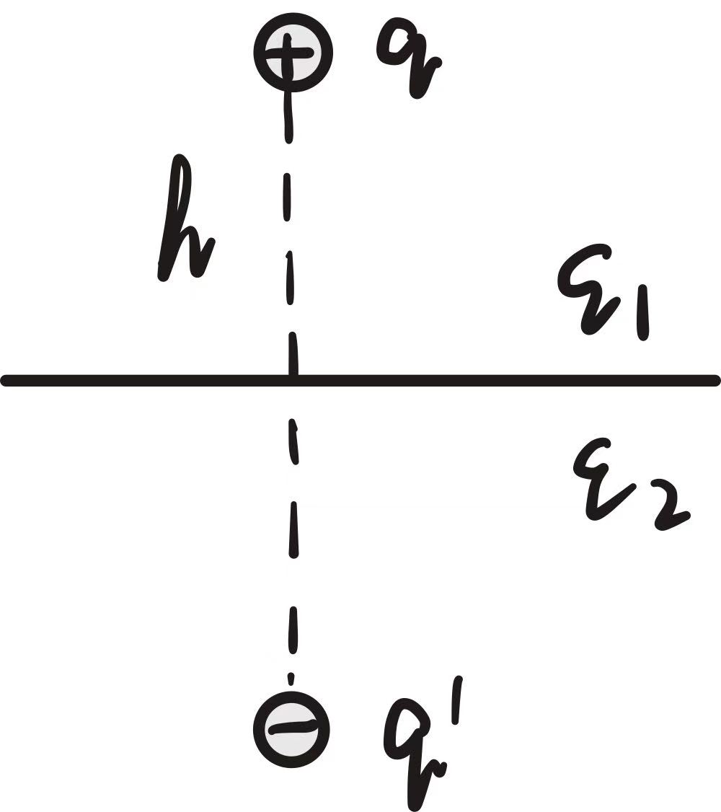

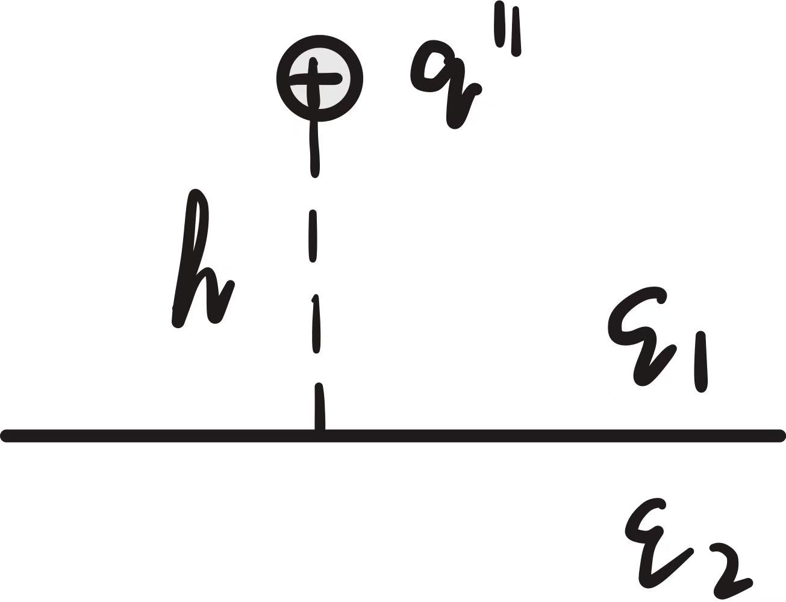

求解 $\varepsilon_1$ 场：
$$ q' = \frac{\varepsilon_1 - \varepsilon_2}{\varepsilon_1 + \varepsilon_2} q $$

求解 $\varepsilon_2$ 场：
$$ q'' = \frac{2\varepsilon_2}{\varepsilon_1 + \varepsilon_2} q $$
（代替了介质中极化电荷！）

**3) 悬浮导体球壳**

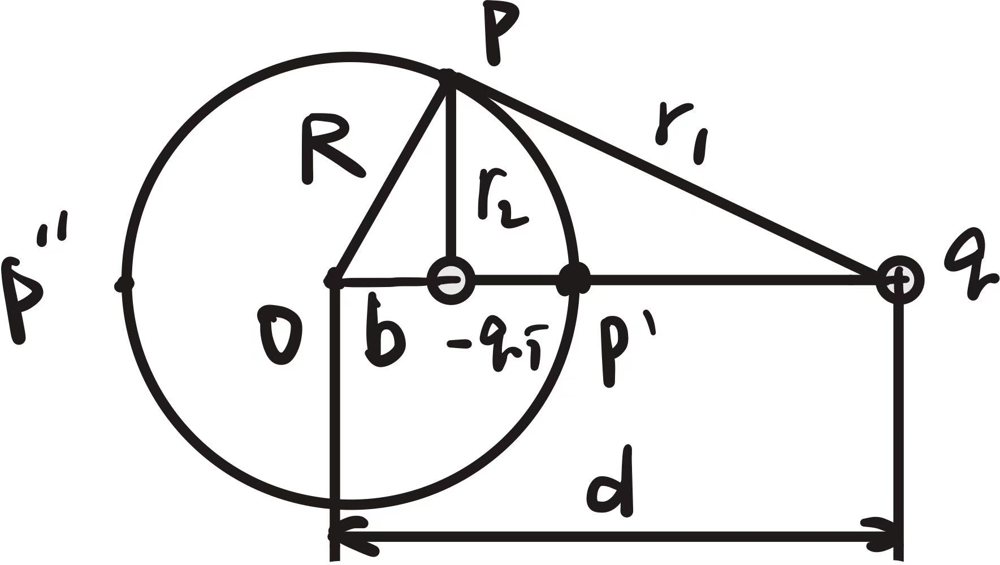

可以发现，要使等位面成立：
$$ \frac{q}{r_1} = \frac{q_i}{r_2} $$

代入 $P'$、$P''$ 点距离关系：
$$ \frac{q}{d - R} = \frac{q_i}{R - b} \quad , \quad \frac{q}{d + R} = \frac{q_i}{R + b} $$
$$ \frac{R - b}{d - R} = \frac{R + b}{d + R} $$

展开化简：
$$ bd + (d - b)R - R^2 = -bd + (d - b)R + R^2 $$
$$ 2R^2 = 2bd \quad \Rightarrow \quad b = \frac{R^2}{d} $$
则镜像电荷大小为：
$$ q_i = \frac{R}{d} q $$

☆ **当导体球壳本身带电时**：
*   在球心放置电荷 $q_c'$ 来等效。
*   若 $q$ 在壳内求壳内场，与前面完全对称；
*   若求壳外场，可以直接等效到球心（$q_{net}$ 视角）。

**变式：组合边界**

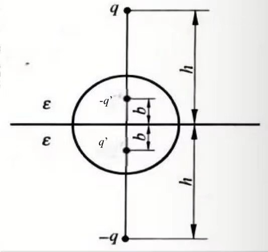

---

**1.10 电轴法**

**引入**：两根等量异号的平行长直线电荷的等位面是圆。

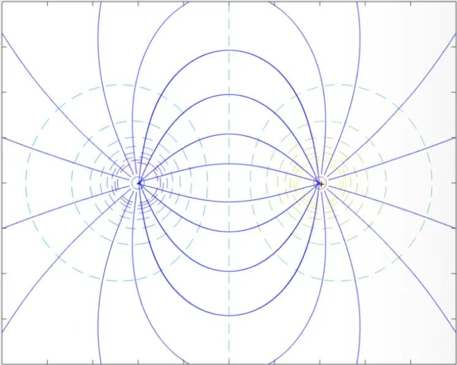

电位表达式：
$$ \varphi_p = \frac{\tau}{2\pi\varepsilon_0} \ln \frac{r_-}{r_+} $$
当 $\varphi_p = \text{定值}$ 时，说明 $\frac{r_-}{r_+}$ 是定值，等位面是一个阿氏圆！

**理论基础**

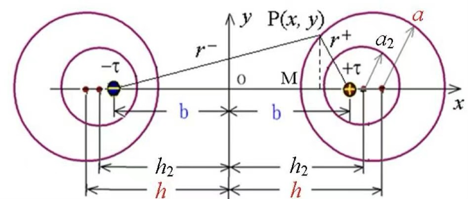

当 $x > 0$ 时，等位线方程：
$$ \left(x - \frac{k^2+1}{k^2-1}b\right)^2 + y^2 = \left(\frac{2bk}{k^2-1}\right)^2 $$

电轴间距为 $2b$，每个圆的参量关系有：
$$ a_i^2 + b^2 = h_i^2 $$
$$ h = \frac{k^2+1}{k^2-1}b \quad , \quad a = \left|\frac{2bk}{k^2-1}\right| $$

用置于电轴上的等效线电荷可以代替圆柱导体表面分布的电荷。
因为圆柱体表面的边界条件和这个等位圆一模一样！

**常见等效模型**

**1) 两半径相同的长直平行圆柱导体**

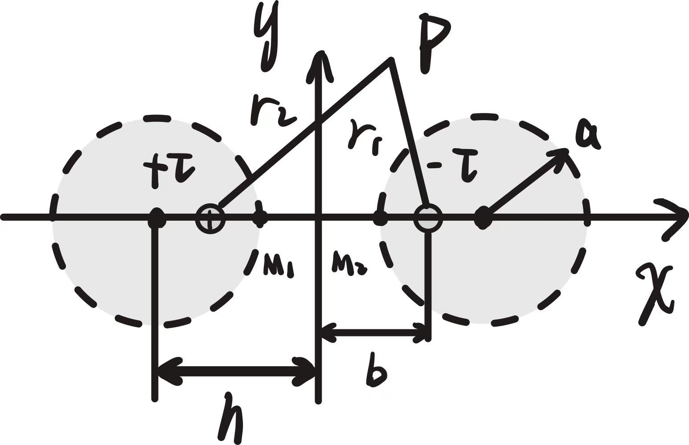

已知半径为 $a$，轴心距为 $2h$，平行柱间电压为 $U$。

*   **Step 1**：确定电轴位置：
    $$ b^2 = h^2 - a^2 $$
*   **Step 2**：用 $\tau$ 表示电位：
    $$ \varphi_p = \frac{\tau}{2\pi\varepsilon} \ln \frac{r_2}{r_1} $$
*   **Step 3**：用 $U$ 表示 $\tau$：
    取特殊点 $M_1$、$M_2$，满足 $\varphi_{M_2} = -\varphi_{M_1}$。
    $$ U = 2\varphi_{M_1} = \frac{\tau}{\pi\varepsilon} \ln \frac{b + h - a}{b - (h - a)} $$

**2) 两半径不相同的长直平行圆柱导体**

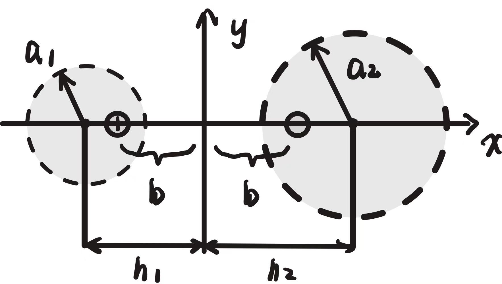

几何关系满足：
$$ \begin{cases} b^2 = h_1^2 - a_1^2 \\ b^2 = h_2^2 - a_2^2 \\ d = h_1 + h_2 \end{cases} $$

**3) 偏心电缆**

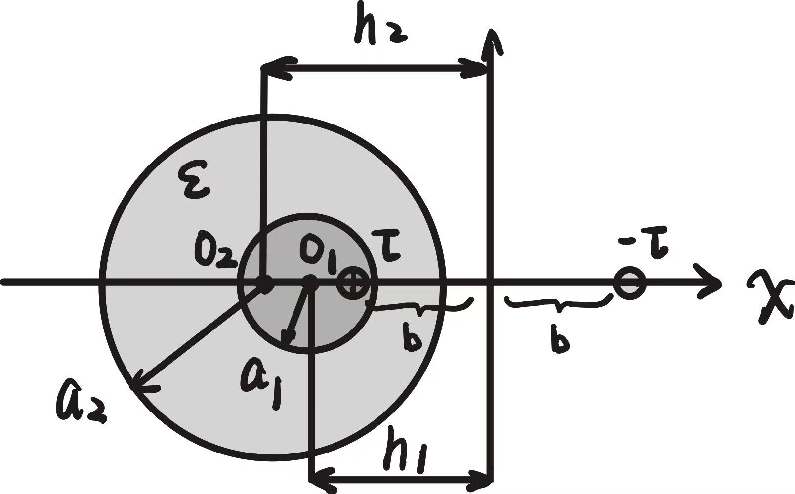

几何关系满足：
$$ \begin{cases} b^2 = h_1^2 - a_1^2 \\ b^2 = h_2^2 - a_2^2 \\ d = h_1 - h_2 \end{cases} $$

空间任一点电位：
$$ \varphi_p = \frac{\tau}{2\pi\varepsilon} \ln \frac{r_-}{r_+} $$
