---
title: 电磁场笔记
date: 2026-06-22 11:05:33
category: 电磁场
date created: 2026-03-21 16:30:35
---

## 电磁场

### Chapter 1 静止电荷的电场

#### 1.1 电场强度 E 与 Coulomb 定律

$\vec{E}$ 定义为位于该点静止的单位正电荷所受的电场力。

$$ \vec{E} = \frac{\vec{F}}{q} $$

自由空间中静电场的边值问题：

$$ \begin{cases} \nabla \cdot \vec{E}(\vec{r}) = \rho(\vec{r})/\varepsilon_0 \\ \nabla \times \vec{E}(\vec{r}) = 0 \\ E_t(\vec{r})|_{r \to \infty} = 0 \end{cases} $$

**真空介电常数** $\varepsilon_0 = \frac{10^{-9}}{36\pi} \; \text{F/m}$

**积分形式：**

$$ \begin{cases} \oiint_S \vec{E} \cdot d\vec{S} = \frac{1}{\varepsilon_0} q_{net} \\ \\ \oint_l \vec{E} \cdot d\vec{l} = 0 \end{cases} $$

**积分形式通解：**

$$ \vec{E}(\vec{r}) = \iiint_V \frac{\rho(\vec{r}')}{4\pi\varepsilon} \nabla'\frac{1}{R} dV' - \frac{1}{4\pi} \left\{ \oiint_S \vec{n} \cdot \vec{E}(\vec{r}') \nabla'\frac{1}{R} dS + \oiint_S [\vec{n} \times \vec{E}(\vec{r}')] \times \nabla'\frac{1}{R} dS \right\} $$

**解读：**

$\vec{r}'$：源点的矢径；

$\vec{r}$：场点的矢径（待求点）；

$\vec{R}$：场源间距，$R = |\vec{r} - \vec{r}'|$；

$\nabla'$：对源点求梯度；

$\nabla'\frac{1}{R} = \nabla'\frac{1}{|\vec{r}-\vec{r}'|} = -\nabla\frac{1}{R}$。

**扩充内容：** 已知 $\vec{E} = E_p(\vec{r})\vec{r}^\circ$，在导体面上 $\vec{n} \times \vec{E} = 0$，$\vec{n} \cdot \vec{E}$ 均匀分布。

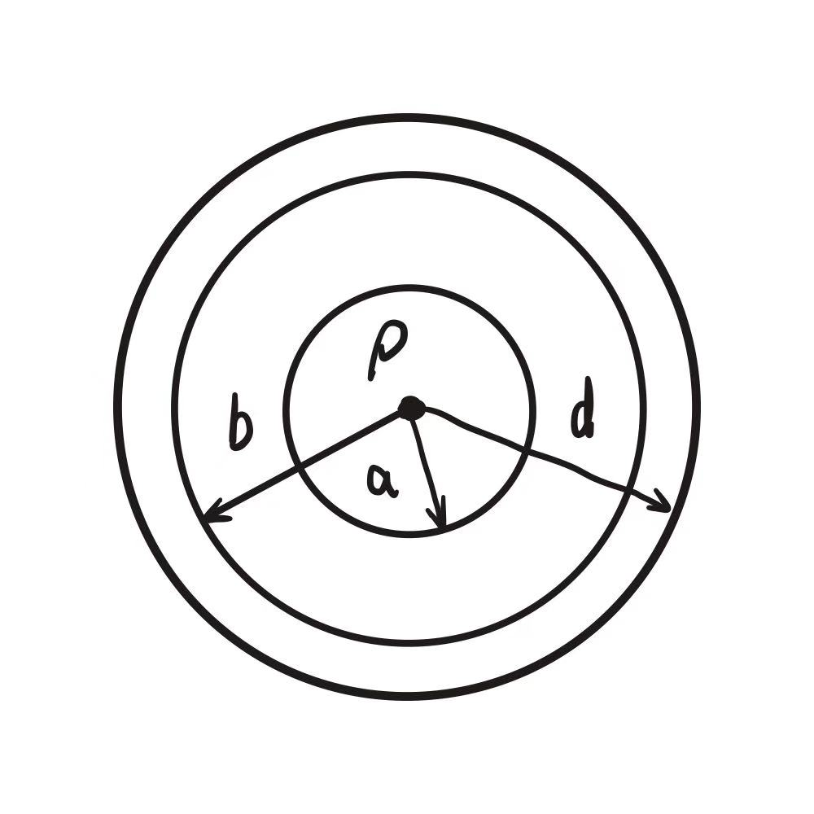

内部电场： 

$$\vec{E}_n(b) = \left( \vec{n} \cdot \vec{E}_p(b) \right) \vec{n} - \frac{1}{4\pi}\vec{n} \cdot \oiint_S E_n(\vec{r}') \frac{\vec{R}^\circ}{R^2} dS' \vec{n}$$

由于球的对称性，感应电荷贡献为 0，因此：

$$E_n(b) = \vec{n} \cdot \vec{E}_p(b) = \frac{q}{4\pi\varepsilon_0 b^2}$$

**结论：** 导体球壳不影响内部场！

$\Rightarrow$ **静电屏蔽**

---

**库仑定律：**

由边值问题的通解，自由空间静电场边值问题的解为：

$$ \vec{E}(\vec{r}) = \iiint_{V'} \frac{\rho(\vec{r}')}{4\pi\varepsilon_0 R^2} dV' \vec{R}^\circ $$

微元化，点电荷场强：

$$ \vec{E}(\vec{r}) = \frac{q}{4\pi\varepsilon_0 |\vec{r}-\vec{r}'|^2} \vec{e}_R $$

面电荷有：$\vec{E}(\vec{r}) = \frac{1}{4\pi\varepsilon_0} \iint_{S'} \frac{\rho_S(\vec{r}')dS'}{|\vec{r}-\vec{r}'|^2} \vec{e}_R$

线电荷有：$\vec{E}(\vec{r}) = \frac{1}{4\pi\varepsilon_0} \int_{l'} \frac{\tau(\vec{r}')dl'}{|\vec{r}-\vec{r}'|^2} \vec{e}_R$

**推论 - 常见电场** （此处 $\tau\Delta l \rightarrow q_{net}$）

带电直线中垂线：$E = \frac{\tau L}{4\pi\varepsilon_0 x (x^2 + L^2/4)^{1/2}}$

无限长直线 ($L \gg x$)：$E = \frac{\tau}{2pi\varepsilon_0 x}$

>[!IMPORTANT] **高斯视角：** $2\pi x \cdot \Delta l \cdot E = \tau\Delta l$

球、板、环 ($x \gg R$)：退化为点电荷。

---

#### 1.2 高斯通量定理

$$ \begin{cases} \oiint_S \vec{E} \cdot d\vec{S} = \frac{1}{\varepsilon_0} \iiint_V \rho dV = \frac{1}{\varepsilon_0} q_{net} \\ \oint_l \vec{E} \cdot d\vec{l} = 0 \end{cases} $$

全息思想：测量边界来求内部源。

平方反比的实质：三维空间球面面积的几何约束 ($4\pi R^2$)。

---

#### 1.3 电位

电场是无旋场，无旋意味着环量处处为 0。  
则 $U_{ab} = \int_a^b \vec{E} \cdot d\vec{l}$ 与积分路径无关。   
由位函数的定义，位函数由于泊松方程积分变量的原因必须指定参考点！

以无限远处为参考点时，一点的电位有：
$$ \varphi_a = \int_a^\infty \vec{E} \cdot d\vec{l} $$

根据 Coulomb 定律：
$$ d\varphi(\vec{r}) = \frac{\rho(\vec{r}')dV'}{4\pi\varepsilon_0 R} \quad \Rightarrow \quad \varphi(\vec{r}) = \iiint_V \frac{\rho(\vec{r}')}{4\pi\varepsilon_0 R} dV' $$

对于点电荷有：
$$ \varphi(\vec{r}) = \frac{q}{4\pi\varepsilon_0 R} $$

无限长线电荷的电位：
$$ E(x) = \frac{\tau}{2\pi\varepsilon_0 x} $$
$$ \varphi(x) = \int_x^a \frac{\tau}{2\pi\varepsilon_0 r} dr = \frac{\tau}{2\pi\varepsilon_0} (\ln a - \ln x) $$

---

#### 1.4 电偶极子

由一对等量异号电荷相距很近所构成的电荷源。

电偶极子的大小和方向可以用电偶极矩来表示：
$$ \vec{p} = q\vec{d} $$

电偶极子的电位近似表达式：

球坐标系中 $\varphi_m = \frac{q}{4\pi\varepsilon_0} \left(\frac{1}{r_1} - \frac{1}{r_2}\right)$

对于 $r \gg d$ 的远场区域：
$$ r_1 \approx r - \frac{d}{2}\cos\theta \, , \quad r_2 \approx r + \frac{d}{2}\cos\theta $$
则有：
$$ \varphi_m = \frac{dq\cos\theta}{4\pi\varepsilon_0 r^2} = \frac{\vec{p} \cdot \vec{e}_r}{4\pi\varepsilon_0 r^2} $$

由 $\varphi_m = \frac{qd\cos\theta}{4\pi\varepsilon_0 r^2}$ 和 $\vec{E} = -\nabla\varphi$，可得：
$$ \vec{E}_m = -\nabla\varphi_m = \frac{p}{4\pi\varepsilon_0 r^3} (2\cos\theta\vec{e}_r + \sin\theta\vec{e}_\theta) $$

这个例子是为了说明 $\varphi \to \vec{E}$ 的方便性。

---

#### 1.5 静电场中的导体和电介质

**导体：**

* **场内性质**：内部 $E = 0$，$\varphi$ 处处相等。
* **表面性质**：电场与表面总是垂直关系，大小由高斯定理可得 $E = \frac{\sigma}{\varepsilon_0}$。
  $\Rightarrow$ 电荷面密度 $\sigma$ 与凸出表面的曲率正相关。突出处电场大，凹陷处小。
* *注意*：交变电场中会感应出振荡电流。

**电介质：**

电介质不是导体，没有自由电荷，但分子有极性，且分子是被束缚的。

在外加电场中，电介质会发生极化：

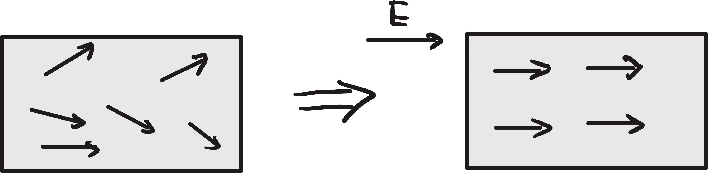

可以想象，在介质内部，由于分子紧密相邻，仍然保持电中性。但在边界上，会堆积多余的电荷，称为**束缚电荷**。

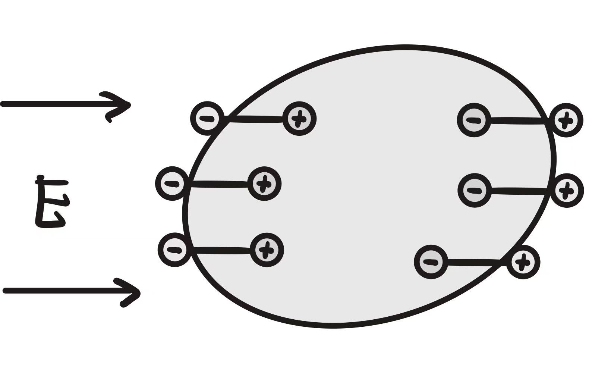

由介质受极化的程度，用**极化强度 $\vec{P}$** 表示：
$$ \vec{P} = \lim_{\Delta V \to 0} \frac{\sum \vec{p}}{\Delta V} $$
即为单位体积的电偶极矩。

实际上，各种电介质的 $\vec{P}$ 与 $\vec{E}$ 有关，对于各向同性的线性电介质：
$$ \vec{P} = \chi_e \varepsilon_0 \vec{E} $$
其中 $\chi_e$ 为介质的相对极化率。

---

#### 1.6 电介质中的电场与电位移

高斯定律中，$q_{net}$ 既考虑自由电荷又考虑束缚电荷：
$$ \oiint_S \vec{E} \cdot d\vec{S} = \frac{1}{\varepsilon_0} (\sum q + \sum q_p) $$

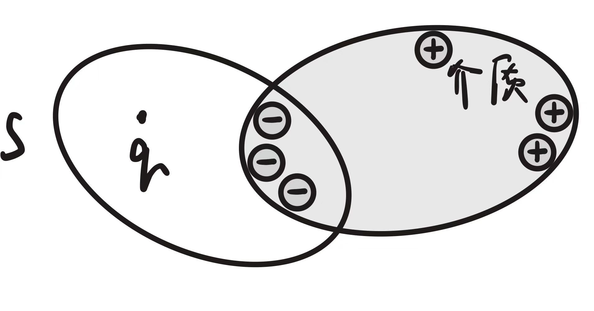

可以认为，高斯面 $S$ 内介质并非电中性，因为另一部分 $q_p$ 不在 $S$ 内。

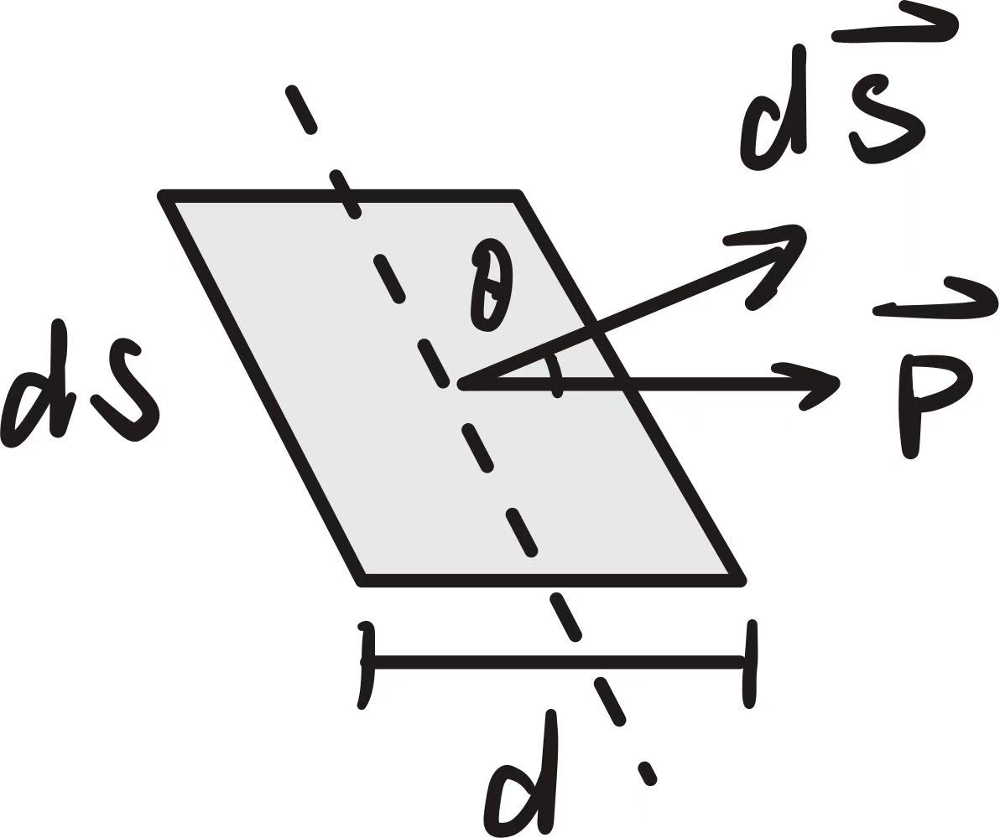

由于 $S$ 两侧的束缚电荷净值为 0，穿过 $S$ 的电荷为 $q_p$ 的负值。

则：
$$ \sum q_p = -\oiint_S \vec{P} \cdot d\vec{S} $$

代入高斯定律：
$$ \oiint_S (\varepsilon_0 \vec{E} + \vec{P}) \cdot d\vec{S} = \sum q $$

令 $\varepsilon_0 \vec{E} + \vec{P} \equiv \vec{D}$，则有：
$$ \oiint_S \vec{D} \cdot d\vec{S} = \sum q $$
称 $\vec{D}$ 为**电位移**。

$$ \vec{D} = \varepsilon_0 \vec{E} + \vec{P} = \varepsilon_0 \vec{E} + \chi_e \varepsilon_0 \vec{E} = (1 + \chi_e)\varepsilon_0 \vec{E} $$
令 $(1 + \chi_e)\varepsilon_0 = \varepsilon_r \varepsilon_0 = \varepsilon$。

则 $\vec{D} = \varepsilon \vec{E}$，$\varepsilon$ 称介电常数 (F/m)。

---

#### 1.7 分界面条件

**A. 切向边界条件：**

描述界面两侧场量平行于界面方向的连续性。

$$ \begin{cases} E_{1t} = E_{2t} & \text{连续} \\ H_{1t} - H_{2t} = J_S & \text{有电流则突变} \end{cases} $$

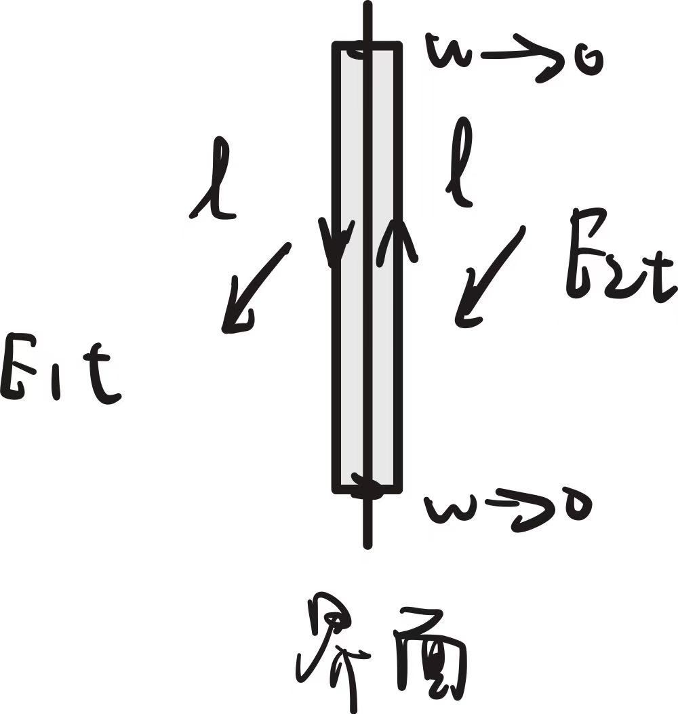

**Proof:** (见上图矩形环路)

$\oint_l \vec{E} \cdot d\vec{l} = -\frac{d\Phi}{dt}$ 。由于 $w \to 0$ ，面积 $\Phi=0$，所以 $E_{1t} = E_{2t}$ 。

$\oint_l \vec{H} \cdot d\vec{l} = I + \frac{d\Psi}{dt}$ ，因为 $S \to 0$ $\Psi=0$ ，$H_{1t} - H_{2t} = J_S$  (界面)。

**B. 法向边界条件：**

描述界面两侧场量垂直于界面方向的连续性。

$$ \begin{cases} B_{1n} = B_{2n} & \text{连续} \\ D_{1n} - D_{2n} = \rho_S & \text{有电荷则突变} \end{cases} $$

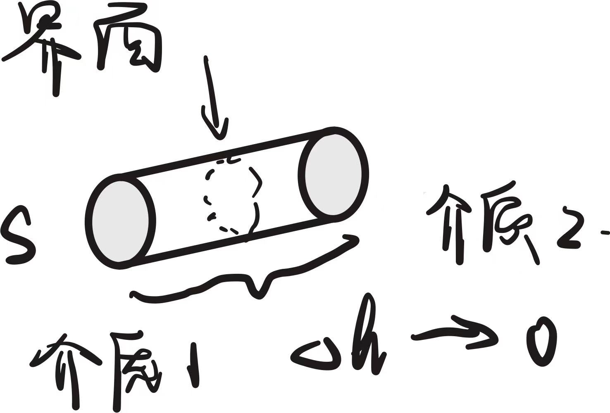

**Proof:** (见上图扁平圆柱体/高斯面)

$\oiint_S \vec{B} \cdot d\vec{S} = 0$  (无磁单极子) $\Rightarrow (B_{1n} - B_{2n})S = 0$ ($dh \to 0$ )。

$\oiint_S \vec{D} \cdot d\vec{S} = q_{in} \Rightarrow (D_{1n} - D_{2n})S = q_{in}$ 。

---

#### 1.8 静电场电位的边值问题

$$ \begin{cases} \nabla \cdot \vec{D} = \rho \\ \nabla \times \vec{E} = 0 \\ \vec{D} = \varepsilon \vec{E} \end{cases} \quad \Rightarrow \quad \nabla \cdot \vec{D} = \nabla \cdot (\varepsilon\vec{E}) = -\nabla \cdot (\varepsilon\nabla\varphi) = \rho $$

展开得 $-\nabla\varepsilon \cdot \nabla\varphi - \varepsilon\nabla^2\varphi = \rho$。

对于线性均匀介质，有 $\nabla\varepsilon = 0$，则：

$$ \nabla^2\varphi = -\frac{\rho}{\varepsilon} $$

**电位的分界面条件：**
$$ \begin{cases} D_{1n} - D_{2n} = \rho_s \\ E_{1t} - E_{2t} = 0 \end{cases} \quad \Rightarrow \quad \begin{cases} \varepsilon_2 \frac{\partial \varphi_2}{\partial n} - \varepsilon_1 \frac{\partial \varphi_1}{\partial n} = \rho_s \\ \varphi_1 = \varphi_2 \end{cases} $$

**电位的边界条件：**

**Dirichlet 条件：**
$$ \varphi|_{\Gamma} = C \quad (\text{常数时 } \varphi = C) $$

**Neumann 条件：**
法向条件表现为通量条件，有：
$$ \iint_S \vec{E} \cdot d\vec{S} = \frac{q}{\varepsilon} $$
当面电荷 $q$ 均匀时，$\frac{\partial \varphi}{\partial n} = -\frac{\rho_s}{\varepsilon}$。

* $\varphi$ 需要一个参考点，选一个 Dirichlet 条件来确定一个参考面；
* $U$ 未知的边界称为**悬浮电位边界**，电位未知，需要此通量约束 (Neumann)。

---

#### 1.9 镜像法

**核心思想**：空间等效，边界替代。

**理论基础：**
* 自由空间的问题显著比有限域易于求解。
* 唯一性定理决定了，只要控制方程和边界条件不变，场域是唯一确定的。
* 于是，可以通过把边界上的分散源等效为场域外点源；只要能保证边界条件不变，可以转化为自由空间求解。

**常见等效模型：**

**1) 电荷对大导体平面**

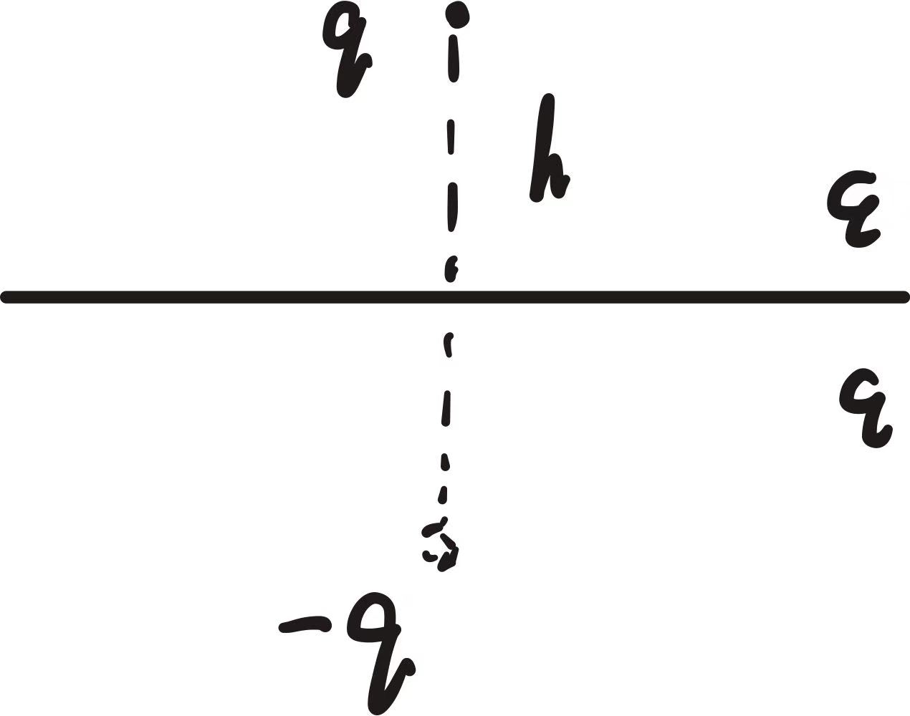

边界条件是平面上电位处处相等。

$\Rightarrow$ 镜像一个 $-q$ 等效原本板上感应电荷。

**变式：多个平面的镜像**

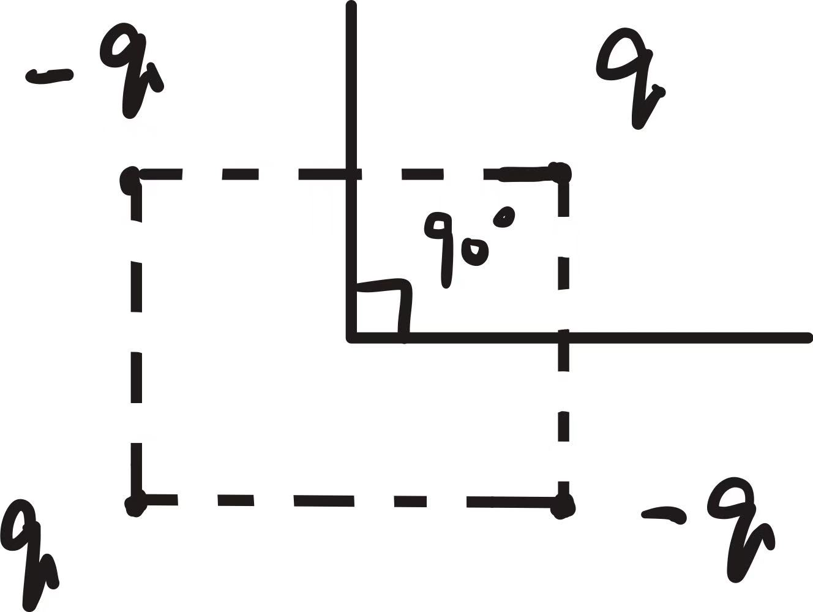

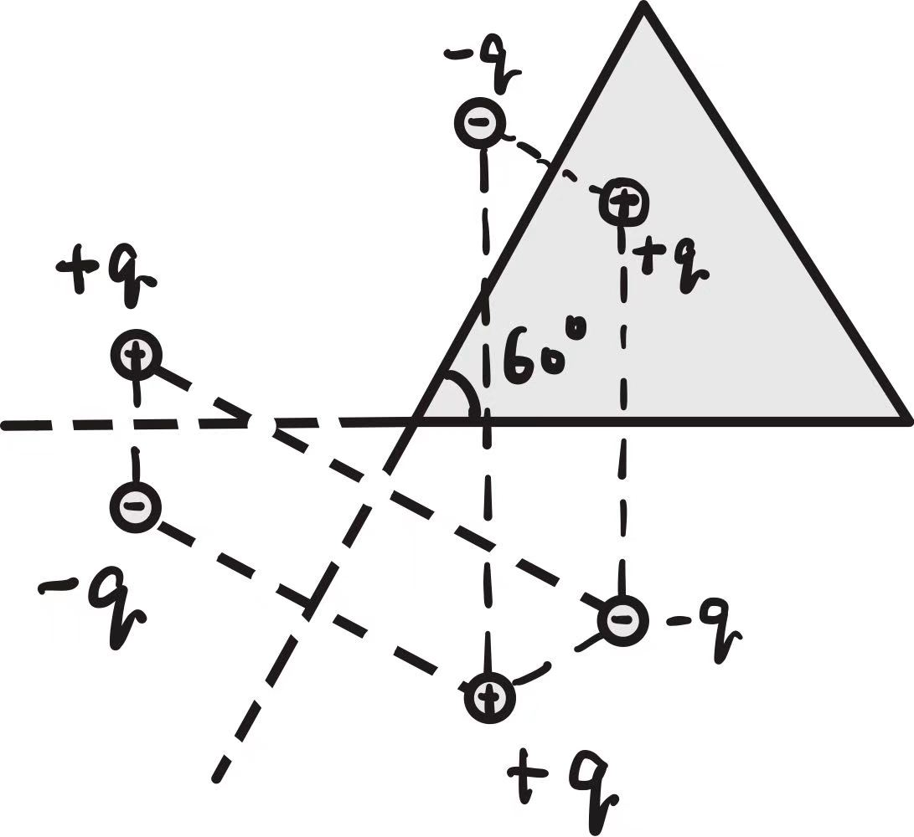

**结论**：夹角为 $\theta$ 且 $n\theta = \pi$ ($n \in \mathbb{Z}$) 时，需要引入 $(2n - 1)$ 个镜像电荷。

**2) 无限大介质分界面**

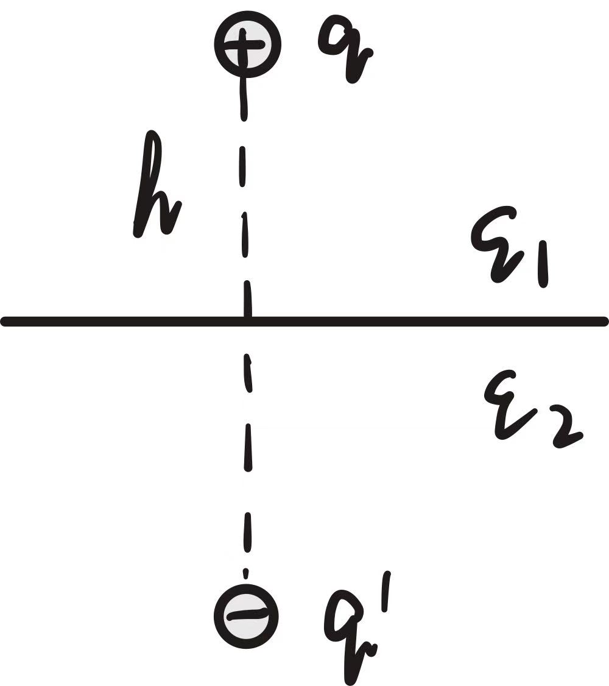

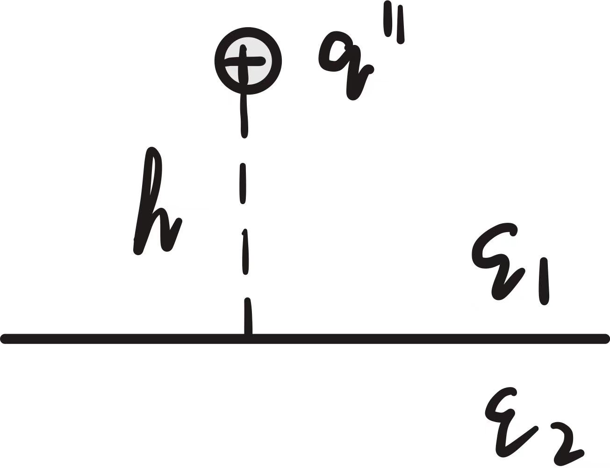

求解 $\varepsilon_1$ 场：
$$ q' = \frac{\varepsilon_1 - \varepsilon_2}{\varepsilon_1 + \varepsilon_2} q $$

求解 $\varepsilon_2$ 场：
$$ q'' = \frac{2\varepsilon_2}{\varepsilon_1 + \varepsilon_2} q $$
（代替了介质中极化电荷！）

**3) 悬浮导体球壳**

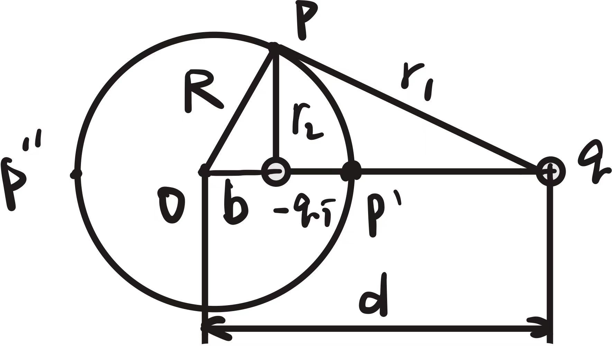

可以发现，要使等位面成立：
$$ \frac{q}{r_1} = \frac{q_i}{r_2} $$

代入 $P'$、 $P''$ 点距离关系：
$$ \frac{q}{d - R} = \frac{q_i}{R - b} \quad , \quad \frac{q}{d + R} = \frac{q_i}{R + b} $$
$$ \frac{R - b}{d - R} = \frac{R + b}{d + R} $$

展开化简：
$$ bd + (d - b)R - R^2 = -bd + (d - b)R + R^2 $$
$$ 2R^2 = 2bd \quad \Rightarrow \quad b = \frac{R^2}{d} $$
则镜像电荷大小为：
$$ q_i = -\frac{R}{d} q $$

☆ **当导体球壳本身带电时**：
* 在球心放置电荷 $q_c'$ 来等效。
* 若 $q$ 在壳内求壳内场，与前面完全对称；
* 若求壳外场，可以直接等效到球心（$q_{net}$ 视角）。

**变式：组合边界**

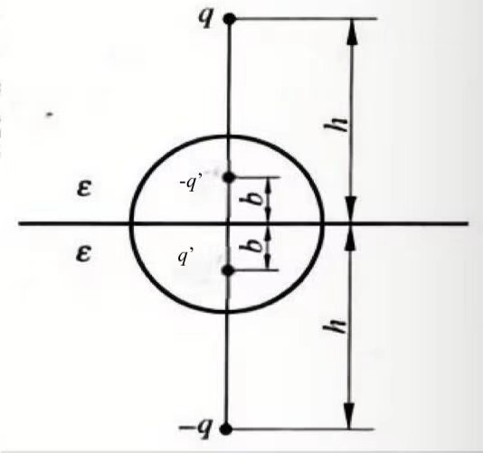

---

#### 1.10 电轴法

**引入**：两根等量异号的平行长直线电荷的等位面是圆。

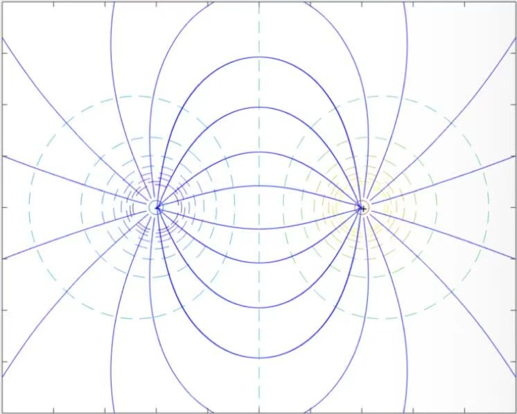

电位表达式：
$$ \varphi_p = \frac{\tau}{2\pi\varepsilon_0} \ln \frac{r_-}{r_+} $$
当 $\varphi_p = \text{定值}$ 时，说明 $\frac{r_-}{r_+}$ 是定值，等位面是一个阿氏圆！

**理论基础**

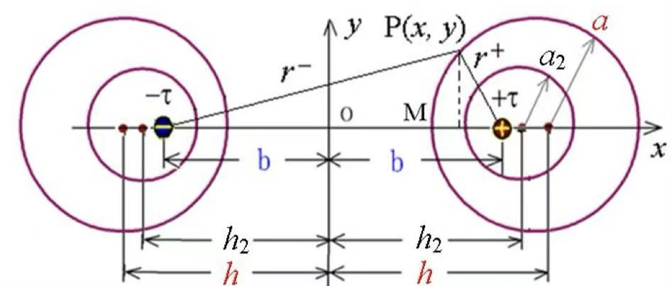

当 $x > 0$ 时，等位线方程：
$$ \left(x - \frac{k^2+1}{k^2-1}b\right)^2 + y^2 = \left(\frac{2bk}{k^2-1}\right)^2 $$

电轴间距为 $2b$，每个圆的参量关系有：
$$ a_i^2 + b^2 = h_i^2 $$
$$ h = \frac{k^2+1}{k^2-1}b \quad , \quad a = \left|\frac{2bk}{k^2-1}\right| $$

用置于电轴上的等效线电荷可以代替圆柱导体表面分布的电荷。  
因为圆柱体表面的边界条件和这个等位圆一模一样！

**常见等效模型**

**1) 两半径相同的长直平行圆柱导体**

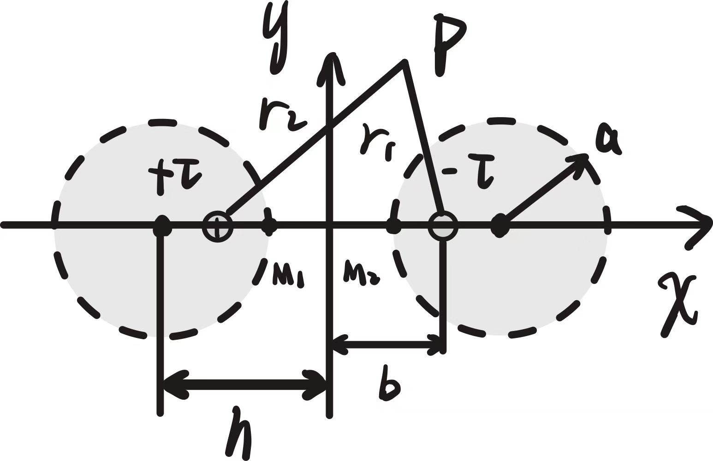

已知半径为 $a$，轴心距为 $2h$，平行柱间电压为 $U$。

* **Step 1**：确定电轴位置：
  $$ b^2 = h^2 - a^2 $$
* **Step 2**：用 $\tau$ 表示电位：
  $$ \varphi_p = \frac{\tau}{2\pi\varepsilon} \ln \frac{r_2}{r_1} $$
* **Step 3**：用 $U$ 表示 $\tau$：

  取特殊点 $M_1$、 $M_2$，满足 $\varphi_{M_2} = -\varphi_{M_1}$。
  $$ U = 2\varphi_{M_1} = \frac{\tau}{\pi\varepsilon} \ln \frac{b + h - a}{b - (h - a)} $$

**2) 两半径不相同的长直平行圆柱导体**

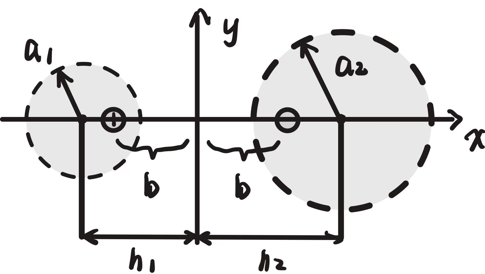

几何关系满足：
$$ \begin{cases} b^2 = h_1^2 - a_1^2 \\ b^2 = h_2^2 - a_2^2 \\ d = h_1 + h_2 \end{cases} $$

**3) 偏心电缆**

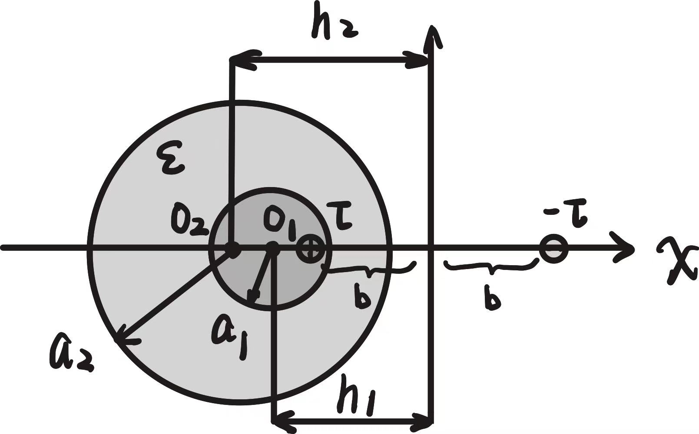

几何关系满足：
$$ \begin{cases} b^2 = h_1^2 - a_1^2 \\ b^2 = h_2^2 - a_2^2 \\ d = h_1 - h_2 \end{cases} $$

空间任一点电位：
$$ \varphi_p = \frac{\tau}{2\pi\varepsilon} \ln \frac{r_-}{r_+} $$

---

#### 1.11 电容和部分电容

电容的定义为：
$$ C = \frac{q}{U} $$
其单位有：法拉 ($\text{F}$)、皮法 ($\text{pF}$)、微法 ($\mu\text{F}$)。

**计算方法：**

1. **加电荷求电压法**：  
    设导体上带有电荷 $q$，用高斯定理求 $\vec{E}$，用线积分求 $U$，得 $C = \frac{q}{U}$。
2. **加电压求电荷法**：  
    设导体间电压为 $U$，用 Laplace 方程解出 $\varphi$，取梯度求 $\vec{E}$，由导体表面的 $\vec{D} = \rho_s \vec{n}$ 和积分求 $q$，从而求得 $C = \frac{q}{U}$。
3. **电场能量法**：  
    设 $U$，求出 $\varphi$ 和 $\vec{E}$，由整个空间的 $\vec{E}$ 的体积分求电场能量 $W_e$。根据 $W_e = \frac{1}{2} C U^2$ 求电容 $C$；或加电荷求能量 $W_e = \frac{1}{2} \frac{q^2}{C}$ 求 $C$。

##### 常见电容计算模型

1. **平行板电容**：

   设电量 $q$：
   $$ U = E d_1 + E d_2 = E (d_1 + d_2) $$
   $$ C = \frac{q}{U} = \frac{\varepsilon S}{d_1 + d_2} $$

2. **球形电容**：

   设电荷 $q$：
   $$ \vec{E} = \frac{q}{4\pi\varepsilon r^2} \vec{e}_r $$
   $$ U = \int_a^b E dr = \frac{q}{4\pi\varepsilon} \left( \frac{1}{a} - \frac{1}{b} \right) $$
   $$ C = \frac{q}{U} = \frac{4\pi\varepsilon a b}{b - a} $$
   当 $b \to \infty$ 时，孤立导体球电容：
   $$ C = 4\pi\varepsilon a $$
   此为孤立导体对无限远处电极的电容。

3. **同轴电缆（单位长电容）**：

   设线电荷密度 $\tau$：
   
   由高斯定理有 $\vec{E} = \frac{\tau}{2\pi\varepsilon r} \vec{e}_r$：
   $$ U = \int_a^b E dr = \frac{\tau}{2\pi\varepsilon} \ln\frac{b}{a} $$
   单位长度电容：
   $$ C_0 = \frac{\tau}{U} = \frac{2\pi\varepsilon}{\ln\frac{b}{a}} $$

4. **两平行长直导线间单位长电容**：

   设线电荷密度 $\pm \tau$，轴心距为 $2h$，半径为 $a$：  
   由电轴法，电轴位置为 $b = \sqrt{h^2 - a^2}$。  
   两导体间的电压为：
   $$ U = 2\varphi_{M_1} = \frac{\tau}{\pi\varepsilon} \ln\frac{b+h-a}{b-(h-a)} $$
   单位长度电容：
   $$ C_0 = \frac{\tau}{U} = \frac{\pi\varepsilon}{\ln\frac{h + \sqrt{h^2 - a^2}}{a}} $$

6. **偏心电缆（单位长电容）**：

   两圆柱半径为 $a_1$ 和 $a_2$，轴心距为 $d$：  
   根据几何关系：
   $$ \begin{cases} b^2 = h_1^2 - a_1^2 \\ b^2 = h_2^2 - a_2^2 \\ d = h_1 - h_2 \end{cases} $$
   两导体间电压：
   $$ U = \frac{\tau}{2\pi\varepsilon} \ln \left[ \frac{(b + h_1 - a_1)(b - h_2 + a_2)}{(b - h_1 + a_1)(b + h_2 - a_2)} \right] $$
   则单位长度电容：
   $$ C_0 = \frac{2\pi\varepsilon}{\ln \left[ \frac{(b + h_1 - a_1)(b - h_2 + a_2)}{(b - h_1 + a_1)(b + h_2 - a_2)} \right]} $$

**三端子电容网络**

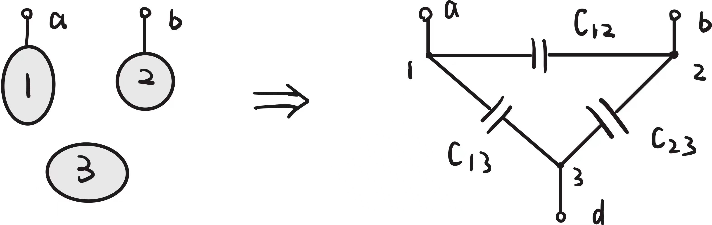

电容网络的每个电容称为**部分电容**。

**电荷独立系统条件**：工作中所有导体上电荷总和时时为零，即：
$$ \sum_{i=1}^n q_i = 0 $$

两电极电容量 $C_{ab}$ 等于部分电容 $C_{ab}$ 与另外两部分电容串联后再并联。故有：
$$ C_{ab} > C_{ab}' $$

部分电容的定义式：
$$ q_i = \sum_{j=1}^n C_{ij} U_{ij} $$
其中 $C_{ij}$ 为部分电容。

##### 部分电容的计算

* **设电荷求电压法**：
  * **Step 1**：选择一个参考电极 $0$。
  * **Step 2**：列方程：
    $$ [U_0] = [\alpha] [q] \quad \Rightarrow \quad U_i - U_0 = \sum_{j=1}^n \alpha_{ij} q_j $$
    其中 $\alpha$ 为电位系数。
  * **Step 3**：求解。为求电位系数 $\alpha_{jk}$，在电极 $k$ 上置电荷 $q_k$，参考电极 $0$ 上置 $-q_k$，其他电极不置电荷。通过求解各电极电位：
    $$ \alpha_{jk} = \frac{U_j - U_0}{q_k} $$

* **设电压求电荷法**：
  令$[\beta] = [\alpha]^{-1}$，则有：$$ [q] = [\beta] [U] $$
  类似地，设 $U_k \ne 0$ 且其他电位为 0，求得感应系数 $\beta_{jk}$：
  $$ \beta_{jk} = \frac{q_j}{U_k} $$

---

#### 1.12 静电场的能量

**能量表示形式 1：电荷与电位**

分析建立域 $V$ 内电荷分布 $\rho$ 的过程所做的功。

设某一时刻已移入 $V$ 内的电荷为总电荷的 $k$ 倍（$0 \le k \le 1$），则此时空间中各点电位为 $k \varphi$。

若再移入一小部分电荷，体微元内的电荷增量为 $dq = \rho dk dV$。
此微元电荷所做功的增量为：
$$ dW_e = k \varphi dq = k \varphi \rho dk dV $$
对整个空间和过程积分：
$$ W_e = \int_0^1 k dk \iiint_V \varphi \rho dV = \frac{1}{2} \iiint_V \varphi \rho dV $$

若还有面电荷分布，则：
$$ W_e = \frac{1}{2} \iiint_V \varphi \rho dV + \frac{1}{2} \iint_S \varphi \rho_s dS $$

若只包含带有面电荷的导体系统：
$$ W_e = \frac{1}{2} \sum_{i=1}^n \varphi_i \iint_{S_i} \rho_{si} dS = \frac{1}{2} \sum_{i=1}^n q_i \varphi_i $$

对于点电荷系统：
$$ W_e = \frac{1}{2} \sum_{i=1}^n q_i \varphi_i $$
其中 $\varphi_i$ 为除了 $q_i$ 之外所有其他电荷在 $q_i$ 处产生的总电位。

**能量表示形式 2：能量密度**

由电位表示的能量公式：
$$ W_e = \frac{1}{2} \iiint_V \varphi \rho dV + \frac{1}{2} \iint_S \varphi \rho_s dS $$

利用矢量恒等式：
$$ \nabla \cdot (\varphi \vec{D}) = \varphi \nabla \cdot \vec{D} + \vec{D} \cdot \nabla \varphi $$
由于 $\nabla \cdot \vec{D} = \rho$，$\vec{E} = -\nabla\varphi$，所以：
$$ \varphi \rho = \nabla \cdot (\varphi \vec{D}) + \vec{D} \cdot \vec{E} $$
代入并利用散度定理，有：
$$ W_e = \frac{1}{2} \iiint_V \vec{D} \cdot \vec{E} dV + \frac{1}{2} \iiint_V \nabla \cdot (\varphi \vec{D}) dV + \frac{1}{2} \iint_S \varphi \rho_s dS $$
$$ W_e = \frac{1}{2} \iiint_V \vec{D} \cdot \vec{E} dV - \frac{1}{2} \iint_S \varphi \vec{D} \cdot \vec{n} dS + \frac{1}{2} \iint_S \varphi \rho_s dS $$
由于在边界上 $\vec{D} \cdot \vec{n} = \rho_s$，后两项抵消。如果场延伸到无限远处，第二项积分在无限大球面上积分为 0。

故得到以电磁场量表示的能量公式：
$$ W_e = \frac{1}{2} \iiint_V \vec{D} \cdot \vec{E} dV = \iiint_V w_e dV $$

能量体密度：
$$ w_e = \frac{1}{2} \vec{D} \cdot \vec{E} = \frac{1}{2} \varepsilon E^2 = \frac{D^2}{2\varepsilon} $$
上式适用于各向同性介质，且适用于非均匀介质的情况。

**例题**：真空中半径为 $a$ 的球内均匀分布体密度电荷 $\rho$，求系统的能量。

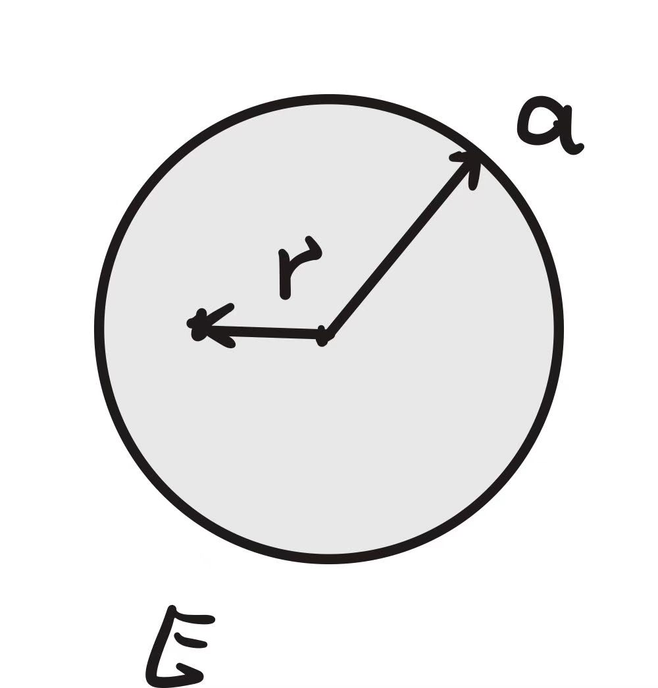

* **方法一：电荷与电位法**
  先求电势 $\varphi$。由高斯定理：
  当 $r < a$ 时，球内的净电荷为 $q_{net} = \frac{4}{3}\pi r^3 \rho$，电场强度为：
  $$ E_{in} = \frac{\rho r}{3\varepsilon_0} $$
  当 $r > a$ 时，球外的净电荷为 $q_{net} = \frac{4}{3}\pi a^3 \rho$，电场强度为：
  $$ E_{out} = \frac{\rho a^3}{3\varepsilon_0 r^2} $$
  各点电位：
  $$ \varphi_{out}(r) = \int_r^\infty E_{out} dr = \frac{\rho a^3}{3\varepsilon_0 r} $$
  $$ \varphi_{in}(r) = \varphi_{out}(a) + \int_r^a E_{in} dr = \frac{\rho a^2}{3\varepsilon_0} + \frac{\rho(a^2 - r^2)}{6\varepsilon_0} = \frac{\rho}{6\varepsilon_0} (3a^2 - r^2) $$
  由对称性化为一维场积分，有 $dV = 4\pi r^2 dr$：
  $$ W_e = \frac{1}{2} \int_0^a \rho \varphi_{in}(r) \cdot 4\pi r^2 dr = 2\pi\rho \int_0^a \frac{\rho}{6\varepsilon_0} (3a^2 - r^2) r^2 dr $$
  $$ W_e = \frac{\pi\rho^2}{3\varepsilon_0} \left[ 3a^2 \cdot \frac{a^3}{3} - \frac{a^5}{5} \right] = \frac{4\pi\rho^2 a^5}{15\varepsilon_0} $$

* **方法二：能量密度法**
  $$ W_e = \iiint_V \frac{1}{2}\varepsilon_0 E^2 dV = \int_0^a \frac{1}{2}\varepsilon_0 E_{in}^2 \cdot 4\pi r^2 dr + \int_a^\infty \frac{1}{2}\varepsilon_0 E_{out}^2 \cdot 4\pi r^2 dr $$
  $$ W_e = 2\pi\varepsilon_0 \int_0^a \left(\frac{\rho r}{3\varepsilon_0}\right)^2 r^2 dr + 2\pi\varepsilon_0 \int_a^\infty \left(\frac{\rho a^3}{3\varepsilon_0 r^2}\right)^2 r^2 dr $$
  $$ W_e = \frac{2\pi\rho^2}{9\varepsilon_0} \left[ \int_0^a r^4 dr + a^6 \int_a^\infty r^{-2} dr \right] $$
  $$ W_e = \frac{2\pi\rho^2}{9\varepsilon_0} \left[ \frac{a^5}{5} + a^5 \right] = \frac{4\pi\rho^2 a^5}{15\varepsilon_0} $$
  两方法所得结果一致。

---

#### 1.13 电场力

定义：
* 点电荷所受电场力：$\vec{F} = q \vec{E}$
* 分布电荷所受电场力：$\vec{F} = \iiint_V \vec{E} dq$

其中 $\vec{E}$ 是除了受力电荷本身之外，由其他电荷产生的背景场。

> [!IMPORTANT]
> 不能用电荷所在处的合场强计算电场力！

**例题**：设带有电荷 $Q$ 的平行板电容器，极板面积为 $S$，求极板受到的电场力。

* **错误做法**：
  合场强为 $E = \frac{D}{\varepsilon} = \frac{Q}{\varepsilon S}$，受力 $F = Q E = \frac{Q^2}{\varepsilon S}$。
* **正确做法**：
  考虑单个极板受力时应移除该极板自身电荷产生的场，背景场为另一极板所产生的场：
  $$ E_{bg} = \frac{1}{2} E = \frac{Q}{2\varepsilon S} $$
  极板所受电场力大小为：
  $$ F = Q E_{bg} = \frac{Q^2}{2\varepsilon S} $$
  方向为两极板相互吸引，使电容增大。  
  系统的静电能量为：
  $$ W_e = \frac{1}{2} \frac{Q^2}{C} $$
  自然界倾向于降低系统能量。

##### 求电场力的虚位移法

1. **电荷不变系统（孤立系统，即 $q = \text{const}$）**：

   若某导体在电场力 $\vec{F}$ 作用下发生位移 $d\vec{g}$，系统电荷不变。由能量守恒定律，系统能量的变化量等于电场力所作功的相反数：
   $$ -dW_e = \vec{F} \cdot d\vec{g} $$
   因此：
   $$ \vec{F} = -\frac{\partial W_e} {\partial g} \big|_{q = \text{const}} $$

2. **有外接电源系统（电压恒定系统，即 $U = \text{const}$）**：

   若某导体在电场力 $\vec{F}$ 作用下发生虚位移 $d\vec{g}$，电场作功与电场能量的增量微元必然由外部电源提供。由能量守恒：
   $$ dW_{source} = dW_e + \vec{F} \cdot d\vec{g} $$
   外源电压恒定为 $\varphi_k$，提供电荷作功为：
   $$ dW_{source} = \sum \varphi_k dq_k $$
   根据 $W_e = \frac{1}{2} \sum q_k \varphi_k$，由于 $\varphi_k$ 恒定，有：
   $$ dW_e = \frac{1}{2} \sum \varphi_k dq_k = \frac{1}{2} dW_{source} \quad \Rightarrow \quad dW_{source} = 2 dW_e $$
   代入能量守恒方程，得：
   $$ 2 dW_e = dW_e + \vec{F} \cdot d\vec{g} \quad \Rightarrow \quad \vec{F} \cdot d\vec{g} = dW_e $$
   所以：
   $$ \vec{F} = \frac{\partial W_e} {\partial g} \big|_{U = \text{const}} $$

>[!IMPORTANT]
>  对电容器，自然界倾向于是总能量最低：
>* 电压不变时：$W_e = \frac{1}{2} C U^2$，电场力使 $C$ 增加；
>* 电荷不变时：$W_e = \frac{Q^2}{2C}$，电场力使 $C$ 增加。

**例题**：平行板电容器中有两种介质（$\varepsilon_1 > \varepsilon_2$），宽度分别为 $b_1$ 和 $b_2$，极板间距为 $d$，介质交界面面积为 $S$，极板加电压 $U$。问：哪种介质会把另一介质推出，并计算这个推力。

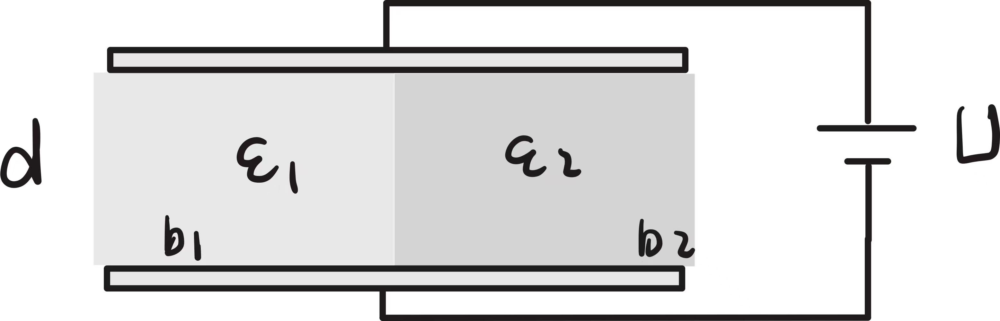

* **分析**：
  受电场力方向一定是使电容增大的方向。**要使总电容更大**，由于 $\varepsilon_1 > \varepsilon_2$，应是介质 1 推进并把介质 2 推出。
* **计算**：
  用虚位移法求推力大小。设介质 1 推进了距离 $x$，则其宽度变为 $b_1 + x$，介质 2 宽度变为 $b_2 - x$。
  
  总电容为：
  $$ C = \frac{\varepsilon_1 (b_1 + x) l}{d} + \frac{\varepsilon_2 (b_2 - x) l}{d} $$
  总能量为：
  $$ W_e = \frac{1}{2} C U^2 = \frac{U^2 l}{2d} \left[ \varepsilon_1 (b_1 + x) + \varepsilon_2 (b_2 - x) \right] $$
  由于电压 $U$ 恒定，推力大小为：
  $$ F_x = \frac{\partial W_e}{\partial x} \Big|_{U = \text{const}} = \frac{U^2 l}{2d} (\varepsilon_1 - \varepsilon_2) $$
  其中 $l$ 为极板沿另一个方向的长度。

---

### Chapter 2 导体中的恒定电流场

#### 2.1 电流密度

电流强度的定义：单位时间通过某一截面积的净电荷量。
$$ I = \frac{dq}{dt} = \iint_S \vec{J} \cdot d\vec{S} $$
只有对一个面才能定义电流，电流是有向面积分。  
电流密度的定义为：
$$ \vec{J} = \lim_{\Delta S \to 0} \frac{\Delta I}{\Delta S} \vec{n} $$
电流密度是矢量，单位是 $\text{A/m}^2$。  
电流是电流密度的通量：
$$ I = \iint_S \vec{J} \cdot d\vec{S} $$

欧姆定律的微分形式（电流密度与电场强度成正比）：
$$ \vec{J} = \sigma \vec{E} $$
其中 $\sigma$ 为电导率。

由电荷守恒定律得到**恒定电流连续性定理**：  
对于任意闭合面 $S$，流出闭合面的电流等于内部电荷的减少率：
$$ \oint_S \vec{J} \cdot d\vec{S} = -\frac{dq_{in}}{dt} $$
对于恒定电流场，电荷分布不随时间改变，即 $\frac{dq_{in}}{dt} = 0$，所以：
$$ \oint_S \vec{J} \cdot d\vec{S} = 0 \quad \Rightarrow \quad \nabla \cdot \vec{J} = 0 $$

---

#### 2.2 恒定电流场的基本方程

$$ \begin{array}{c|c}
\text{微分形式} & \text{积分形式} \\
\hline
\nabla \times \vec{E} = 0 & \oint_l \vec{E} \cdot d\vec{l} = 0 \\
\nabla \cdot \vec{J} = 0 & \oint_S \vec{J} \cdot d\vec{S} = 0
\end{array} $$

联系方程为：$\vec{J} = \sigma \vec{E}$

**电位的引入**：

由于 $\nabla \times \vec{E} = 0$，可以引入标量位 $\varphi$，使 $\vec{E} = -\nabla\varphi$。

代入连续性方程有：
$$ \nabla \cdot (\sigma \vec{E}) = -\nabla \cdot (\sigma \nabla\varphi) = 0 $$
对于线性均匀导体，有 $\sigma = \text{const}$，则：
$$ \nabla^2 \varphi = 0 $$
即电位在导体内部满足拉普拉斯方程。

> [!NOTE]
> **恒定电流场与静电场的区别**：
> * 恒定电流场在导体内部电场不为零，且电位满足拉普拉斯方程 $\nabla^2 \varphi = 0$。
> * 静电场在导体内部电场为零，电位处处相等；其拉普拉斯方程 $\nabla^2 \varphi = 0$ 主要在介质中讨论。

##### 恒定电流场的分界面条件

* **法向边界条件**：
  由 $\nabla \cdot \vec{J} = 0$，穿过界面的电流连续：
  $$ J_{1n} = J_{2n} \quad \Rightarrow \quad \sigma_1 E_{1n} = \sigma_2 E_{2n} $$
  即：
  $$ \sigma_1 \frac{\partial \varphi_1}{\partial n} = \sigma_2 \frac{\partial \varphi_2}{\partial n} $$

* **切向边界条件**：
  由 $\nabla \times \vec{E} = 0$，界面两侧电场切向分量连续：
  $$ E_{1t} = E_{2t} \quad \Rightarrow \quad \frac{J_{1t}}{\sigma_1} = \frac{J_{2t}}{\sigma_2} $$
  电位在分界面上也是连续的：
  $$ \varphi_1 = \varphi_2 $$

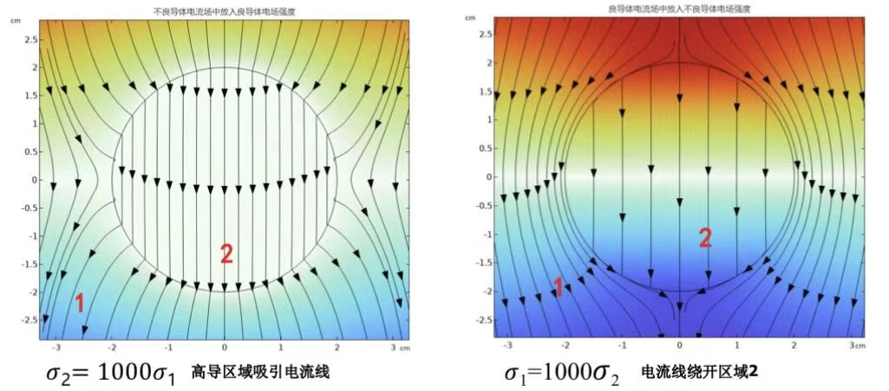

**折射定律：**  
由 $J_{1n} = J_{2n}$ 及 $\frac{J_{1t}}{\sigma_1} = \frac{J_{2t}}{\sigma_2}$，可得：
$$ \frac{\tan\theta_1}{\tan\theta_2} = \frac{J_{1t} / J_{1n}}{J_{2t} / J_{2n}} = \frac{\sigma_1}{\sigma_2} $$
其中 $\theta_1, \theta_2$ 为电流线与法线的夹角。

**静电边界异性**（介质极化与电导率失配产生的自由电荷）：  
如果分界面两侧导体的介电常数与电导率不匹配，分界面上会积累自由面电荷：
$$ \rho_s = D_{2n} - D_{1n} = \varepsilon_2 E_{2n} - \varepsilon_1 E_{1n} = \left( \frac{\varepsilon_2}{\sigma_2} - \frac{\varepsilon_1}{\sigma_1} \right) J_n $$

---

#### 2.3 恒定电流场的边界条件

1. **与理想电介质的分界面（绝缘边界 $S_2$）**：  
   电流无法流入介质中，因此：
   $$ J_n = 0 \quad \Rightarrow \quad \sigma \frac{\partial \varphi}{\partial n} = 0 \quad \Rightarrow \quad \frac{\partial \varphi}{\partial n} = 0 $$
   此为齐次 Neumann 条件。
2. **流入/流出端电极边界 $S_1$**：  
   通常电极由高导电性金属制成（$\sigma \to \infty$），其表面为等位面：
   $$ \varphi = C_i $$
   若已知总输入电流为 $I_s$：
   $$ -\iint_{S_1} \sigma \frac{\partial \varphi}{\partial n} dS = I_s $$

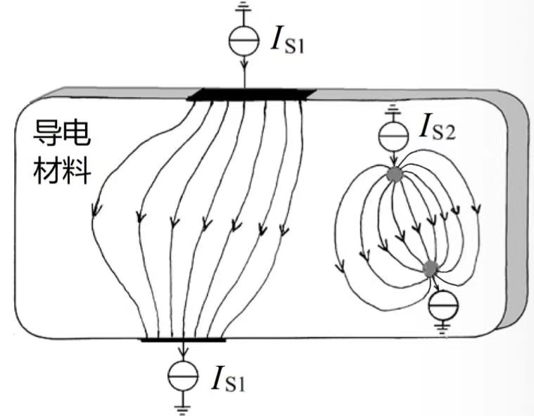

**边界值问题列写：**
* 控制方程：$\nabla^2 \varphi = 0$
* 边界条件：
  $$ \begin{cases} \varphi = C_i & \text{在等位电极面 } S_1 \\ \frac{\partial \varphi}{\partial n} = 0 & \text{在绝缘边界 } S_2 \end{cases} $$

**列写步骤：**
1. 确定未知量 $\varphi(\vec{r})$，并用其表示 $\vec{E} = -\nabla\varphi$ 和 $\vec{J} = -\sigma\nabla\varphi$。
2. 确定边界条件类型：
   * Dirichlet 条件：给定边界电位 $\varphi = C_i$。
   * Neumann 条件：给定边界电流强度 $-\iint_S \sigma \frac{\partial \varphi}{\partial n} dS = I$。
   > [!NOTE]
   > 由于电位需要参考点，电学系统边界上必须至少包含一个 Dirichlet 边界。

**空气侧的边界条件：**  
对于导体与空气的界面，因为空气电导率 $\sigma_0 \approx 0$，所以法向电流 $J_n = 0$。

但空气的介电常数不为零，电场切向分量连续，这意味着导体表面不再是等位面，电流线沿着表面流动。
$$ J_{1n} = 0 \quad \Rightarrow \quad E_{1n} = 0 $$
$$ E_{1t} = E_{2t} \ne 0 $$

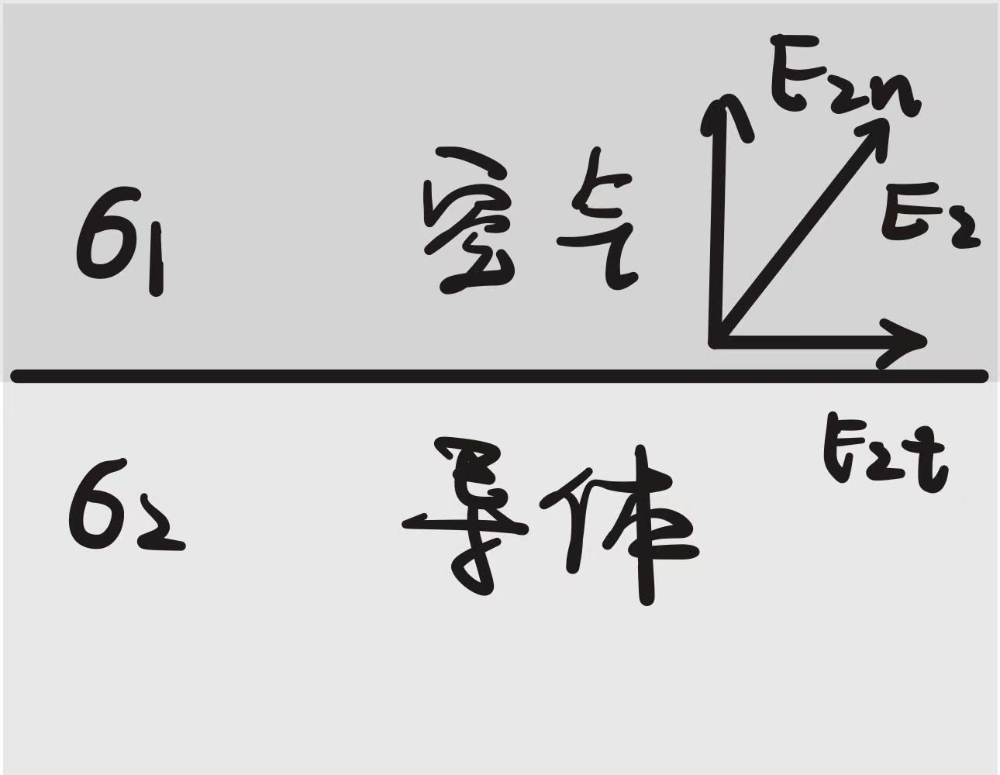

> [!IMPORTANT]
> 恒流场中，导体表面不再是等位面：
> 
> 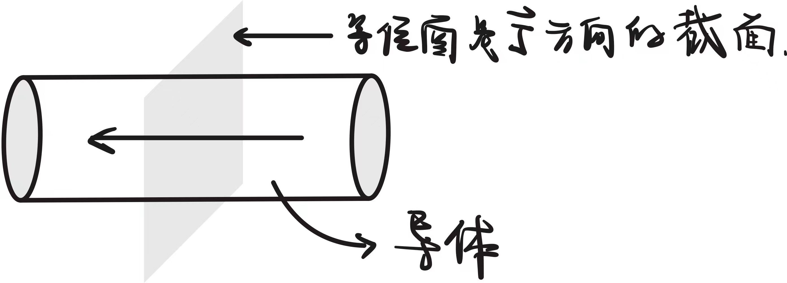

---

#### 2.4 恒定电流场的静电比拟法

恒定电流场（电源外部）与无源静电场的方程具有高度的数学一致性：

$$ \begin{array}{c|c}
\text{恒定电流场 (无源导体区)} & \text{静电场 (无源介质区)} \\
\hline
\nabla \cdot \vec{J} = 0 & \nabla \cdot \vec{D} = 0 \\
\nabla \times \vec{E} = 0 & \nabla \times \vec{E} = 0 \\
\vec{J} = \sigma \vec{E} & \vec{D} = \varepsilon \vec{E} \\
\vec{E} = -\nabla\varphi & \vec{E} = -\nabla\varphi \\
\nabla^2 \varphi = 0 & \nabla^2 \varphi = 0 \\
J_{1n} = J_{2n} & D_{1n} = D_{2n} \\
E_{1t} = E_{2t} & E_{1t} = E_{2t}
\end{array} $$

**比拟相同的条件：**
1. 两种电场的电极形状、尺寸和空间位置完全相同。
2. 对应电极上的电压相同。
3. 空间各区域的介电常数与电导率对应成比例：
   $$ \frac{\sigma_1}{\sigma_2} = \frac{\varepsilon_1}{\varepsilon_2} $$

通过静电比拟法，可以用较易测量的恒定电流场去模拟和测量难以直接测量的静电场。

##### 电流场的镜像法

在计算恒定电流场的镜像电荷时，将电介质的电导率对应为静电场中的介电常数。

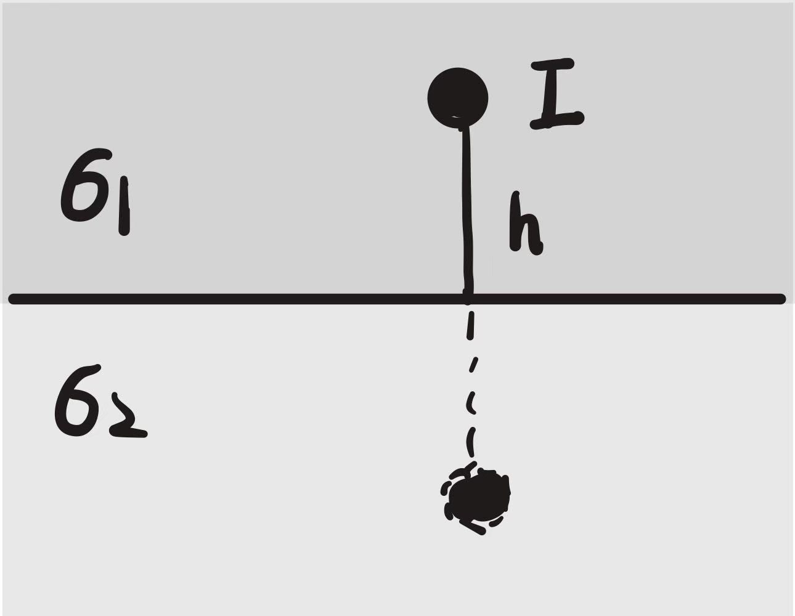

在电导率为 $\sigma_1$ 的区域，镜像电流源为：
$$ I' = \frac{\sigma_1 - \sigma_2}{\sigma_1 + \sigma_2} I $$
在电导率为 $\sigma_2$ 的区域，透射后的等效电流源为：
$$ I'' = \frac{2\sigma_2}{\sigma_1 + \sigma_2} I $$
当 $\sigma_2 = 0$（空气界面）时，$I' = I$，界面上没有法向电流流出。

> [!NOTE]
> 物理世界中没有 $\varepsilon = 0$ 的材料，所以比拟看起来有些反常识，比如静电场中好像没有见过$\vec{E}$在界面上只有切向分量。
>   
> 常见的静电场在导体表面$\vec{E}$垂直于界面，对应的是 $\varepsilon = \infty$ 的情况。  
> 
> 通过比拟，对应的是电流场中 $\sigma_2 = \infty，\sigma_2$ 有限，此时 $\sigma_1$ 相对 $\sigma_2$ 相当于绝缘的，但由于其并非实际上完全绝缘让有电流通过，那么这部分电流将会垂直表面。  
> 
> **这就是后面接地电阻电流场分布的原因。**

---

#### 2.5 电导与接地电阻

**电导的定义：**  

在导电媒质中置有两电极，若两电极间加上电压 $U$，流过电极的电流为 $I$，则电极间介质的电导为：
$$ G = \frac{I}{U} $$
电阻为：
$$ R = \frac{1}{G} = \frac{U}{I} $$

**计算方法：**
1. **设电流求电压法**：  
   设电流 $I$，求得 $\vec{J}$，由 $\vec{E} = \frac{\vec{J}}{\sigma}$ 求电场，积分求得 $U = \int \vec{E} \cdot d\vec{l}$。
2. **设电压求电流法**：  
   设电位差 $U$，求出 $\varphi$，得到 $\vec{E} = -\nabla\varphi$，求得 $\vec{J} = \sigma \vec{E}$，最后积分得到 $I = \iint_S \vec{J} \cdot d\vec{S}$。
3. **功耗法**：
   $$ P = I^2 R = \iiint_V \sigma E^2 dV $$
4. **静电比拟法**：  
   利用电导与电容的比拟关系 $\frac{G}{C} = \frac{\sigma}{\varepsilon}$。若已知电容 $C$，可直接求出电导：
   $$ G = \frac{\sigma}{\varepsilon} C $$

**例题**：求图中电极A、B间的电导，片厚度为$h$。

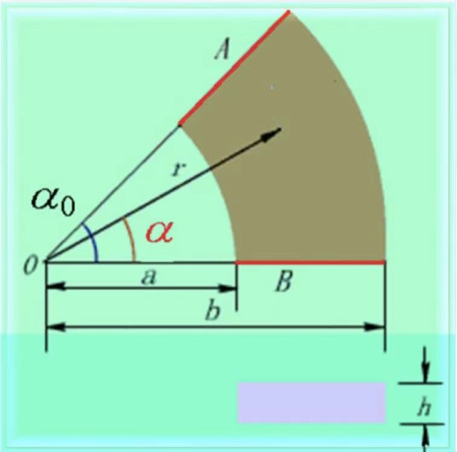

**解**：
使用设电压求电流法。  
控制方程：
$$\begin{cases}
\nabla^2 \varphi(\alpha) = \frac{1}{r^2} \frac{\partial^2 \varphi (\alpha)}{\partial \alpha^2} \\
\\
\varphi (\alpha) \big|_{\alpha = 0} = 0 \\
\\
\varphi (\alpha) \big|_{\alpha = \alpha_0} = U
\end{cases}$$
通解：$\varphi = C_1 \alpha + C_2$  

代入边界条件：$C_1 = \frac{U}{\alpha_0}，C_2 = 0$

则：$\varphi = \frac{U}{\alpha_0} \alpha，\mathbf{E} = -\nabla \varphi = -\frac{U}{r\alpha_0} \mathbf{e_\alpha}$  

##### 接地电阻

为了满足系统安全运行和避雷的要求，需要限制接地极的接地电阻。通常，**接地电阻越小越好**。

接地极的主要作用是，在强大的雷电流或故障电流泄入大地时，限制接地电极的电位抬高，防止产生过高的接触电压和跨步电压。

**1. 深埋球形电极接地电阻**：

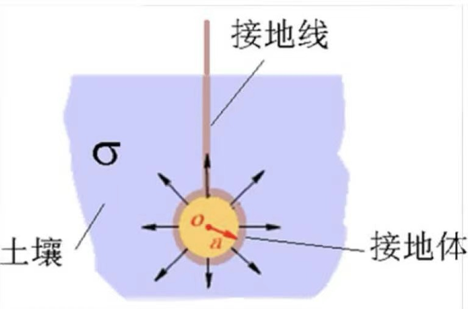

* **方法一：设电流求电压法**
  设流入大地的电流为 $I$，大地电导率为 $\sigma$。由于球电极深埋在地下，电流向四周均匀扩散：
  $$ \vec{J} = \frac{I}{4\pi r^2} \vec{e}_r \quad (r \ge a) $$
  电场强度：
  $$ \vec{E} = \frac{\vec{J}}{\sigma} = \frac{I}{4\pi\sigma r^2} \vec{e}_r $$
  球电极相对于无限远处的电位（即球电极的电压）：
  $$ U = \int_a^\infty E dr = \frac{I}{4\pi\sigma a} $$
  接地电阻：
  $$ R = \frac{U}{I} = \frac{1}{4\pi\sigma a} $$

* **方法二：静电比拟法**
  孤立导体球的静电容为 $C = 4\pi\varepsilon a$。
  利用比拟关系 $R = \frac{\varepsilon}{\sigma C}$，可直接求得：
  $$ R = \frac{\varepsilon}{\sigma (4\pi\varepsilon a)} = \frac{1}{4\pi\sigma a} $$

> [!NOTE]
> 由于土壤电阻率 $
ho = \frac{1}{\sigma}$ 远远大于金属电极的电阻率，更换更贵重金属电极材料对降低接地电阻几乎没有帮助。
>
> **如何减小接地电阻**：
> 1. 增大接地电极的表面积。
> 2. 降低土壤电阻率。

**2. 半球形平地面埋设电极接地电阻**：

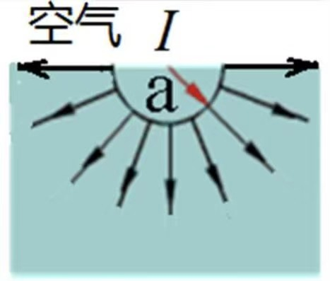

半球电极埋设在地面，由于空气不导电，电流只能向地下半空间扩散。其电流分布相当于深埋球电极的一半：
$$ I = J \cdot 2\pi r^2 \quad \Rightarrow \quad J = \frac{I}{2\pi r^2} $$
因此，其电导为球电极的一半，接地电阻为深埋球电极的两倍：
$$ R = \frac{1}{2\pi\sigma a} $$

**3. 非深埋球形电极的接地电阻（镜像法）**：

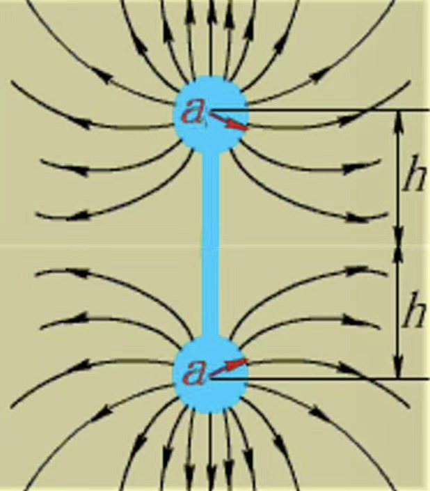

球心距离地面深度为 $h$（且 $h > a$）。利用地面镜像：
$$ U \approx \frac{I}{4\pi\sigma} \left( \frac{1}{a} + \frac{1}{2h - a} \right) $$
接地电阻：
$$ R \approx \frac{1}{4\pi\sigma a} + \frac{1}{4\pi\sigma (2h)} $$
由于地面的边界约束，接地电阻变大了。

##### 跨步电压与接触电压

当故障电流 $I$ 流入半球形接地极泄入大地时，会在地表面产生电位分布。

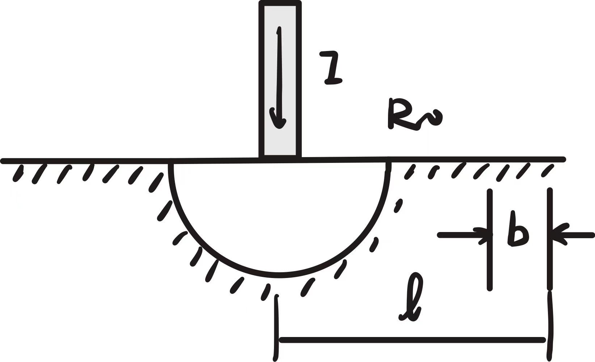

1. **跨步电压 $U_s$**：
   人站在距离接地极中心 $r$ 处，双脚间跨步距离为 $b$（通常取 $b = 0.8\text{ m}$）。双脚间的电压差为：
   $$ \varphi(r) = \frac{I}{2\pi\sigma r} $$
   $$ U_s = \varphi(r) - \varphi(r+b) = \frac{I}{2\pi\sigma} \left( \frac{1}{r} - \frac{1}{r+b} \right) $$
   当人靠近接地极（$r$ 较小）时，跨步电压最大，非常危险。

2. **接触电压 $U_t$**：
   设备外壳接地，人站在距离球心 $l$ 处，手接触外壳。人手脚之间的电压差为：
   $$ U_t = \varphi(a) - \varphi(l) = \frac{I}{2\pi\sigma} \left( \frac{1}{a} - \frac{1}{l} \right) $$

##### 焦耳定律

电路中电阻的功率损耗：
$$ P = U I = I^2 R $$
导电媒质中任意点的损耗功率体密度：
$$ w_d = \vec{E} \cdot \vec{J} = \sigma E^2 \quad (\text{W/m}^3) $$
此为焦耳定律的微分形式。
整个导体的总损耗功率为：
$$ P = \iiint_V \vec{E} \cdot \vec{J} dV $$
代入 $\vec{E} = -\nabla\varphi$：
$$ P = -\iiint_V \nabla\varphi \cdot \vec{J} dV $$
利用恒等式 $\nabla \cdot (\varphi \vec{J}) = \varphi \nabla \cdot \vec{J} + \vec{J} \cdot \nabla\varphi$，由于恒定电流场中 $\nabla \cdot \vec{J} = 0$：
$$ P = -\iiint_V \nabla \cdot (\varphi \vec{J}) dV $$
由高斯散度定理，转换为闭合面积分：
$$ P = -\oint_S \varphi \vec{J} \cdot d\vec{S} $$

**例题**：证明对于一段导线，两端加上电压 $U$，形成电流 $I$，用焦耳热公式证明 $P = U I$。

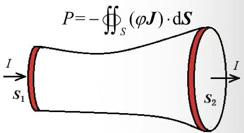

**证明**：
对导体整个表面 $S$ 积分。表面可分为侧面和两端面：
1. 在导体侧面，因为是绝缘的，电流法向分量 $\vec{J} \cdot \vec{n} = 0$，积分为 0。
2. 只有两端电极面 $S_1$ 和 $S_2$ 存在电流流入和流出，且其上电位分别为 $\varphi_1$ 和 $\varphi_2$：
   $$ P = -\iint_{S_1} \varphi_1 \vec{J} \cdot \vec{n}_1 dS_1 - \iint_{S_2} \varphi_2 \vec{J} \cdot \vec{n}_2 dS_2 $$
   设电流流入端面 1（$\vec{J}$ 与法向 $\vec{n}_1$ 相反），流出端面 2（$\vec{J}$ 与法向 $\vec{n}_2$ 相同）：
   $$ \iint_{S_1} \vec{J} \cdot \vec{n}_1 dS_1 = -I , \quad \iint_{S_2} \vec{J} \cdot \vec{n}_2 dS_2 = I $$
   $$ P = - \varphi_1 (-I) - \varphi_2 (I) = (\varphi_1 - \varphi_2) I = U I $$
   得证。

---

##### 恒定电流场与静电场的耦合问题（“有损耗的介质”）

对于实际介质，它既有电导率 $\sigma$ 又有介电常数 $\varepsilon$。这种非理想介质在恒定电压下既有传导电流，又有电偶极矩极化，是典型的耦合场问题。

对于分层不均匀介质，可以等效为电阻 $R$ 与电容 $C$ 并联再串联的电路：
* 电导特性决定电阻 $R$；
* 极化特性决定电容 $C$。

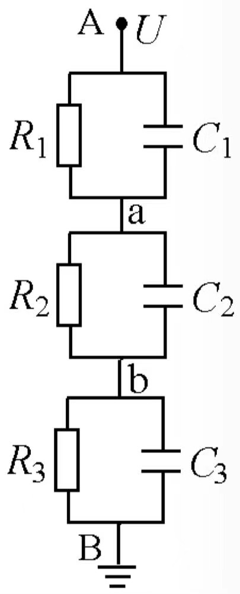

**分析方法**：  

从电位控制方程出发：
1. **已知电流 $I$ 路径**：  
   由面积求出 $\vec{J}$ $\to$ 由 $\vec{J} = \sigma \vec{E}$ 求出 $\vec{E}$ $\to$ 由 $\vec{D} = \varepsilon \vec{E}$ 求出 $\vec{D}$ $\to$ 用高斯定理求界面自由电荷。
2. **已知电压 $U$ 路径**：  
   先假设总电流 $I$ $\to$ 得到 $\vec{J}$ $\to$ 得到 $\vec{E}$ $\to$ 沿路径积分求出 $U$ $\to$ 确定 $I$ 与 $U$ 的关系 $\to$ 进而求出各场量。

> [!TIP]
> **电路视角**：
> 
> 在恒定直流下，电容 $C$ 相当于开路，各处的电压只由电阻 $R$ 决定；电容只影响暂态过程中的电荷积累。
> 
> 只有电容（理想介质）时，交界面上没有自由电荷积累；有电阻时，由于漏电流的存在，交界面上会积累电荷。

交界面积累电荷的求解：
$$ U_1 = I R_1 , \quad U_2 = I R_2 $$
$$ q_{s} = D_{2n} - D_{1n} = \left( \frac{\varepsilon_2}{\sigma_2} - \frac{\varepsilon_1}{\sigma_1} \right) J_n $$
若要交界面无电荷积累，需满足：
$$ \frac{\varepsilon_1}{\sigma_1} = \frac{\varepsilon_2}{\sigma_2} \quad \Rightarrow \quad \tau_1 = \tau_2 $$
其中 $\tau = \frac{\varepsilon}{\sigma}$ 称为电介质的弛豫时间。

**例题**：同轴电缆由两层非理想电介质填充，分别为 $(\sigma_1, \varepsilon_1)$ 和 $(\sigma_2, \varepsilon_2)$，已知内外导体间的单位长度漏电流为 $I_0$。求：电缆内的场强分布以及各界面上的自由电荷密度。

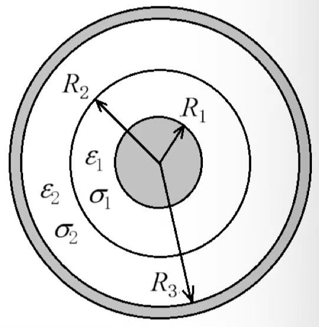

**解**：
已知单位长度漏电流为 $I_0$，由对称性，电流只能沿径向流动：
$$ J_1 = J_2 = \frac{I_0}{2\pi r} $$
两层介质中的电场强度分别为：
$$ E_1 = \frac{J_1}{\sigma_1} = \frac{I_0}{2\pi\sigma_1 r} \quad (a < r < r_0) $$
$$ E_2 = \frac{J_2}{\sigma_2} = \frac{I_0}{2\pi\sigma_2 r} \quad (r_0 < r < b) $$
分界面上的自由电荷由高斯定理决定：
$$ \rho_{s1} = D_{1n} \big|_{r=a} = \varepsilon_1 E_1(a) = \frac{\varepsilon_1 I_0}{2\pi\sigma_1 a} $$
在介质交界面 $r=r_0$ 处：
$$ \rho_{s2} = D_{2n} - D_{1n} \big|_{r=r_0} = \varepsilon_2 E_2(r_0) - \varepsilon_1 E_1(r_0) = \frac{I_0}{2\pi r_0} \left( \frac{\varepsilon_2}{\sigma_2} - \frac{\varepsilon_1}{\sigma_1} \right) $$
在外部导体表面 $r=b$ 处：
$$ \rho_{s3} = -D_{2n} \big|_{r=b} = -\frac{\varepsilon_2 I_0}{2\pi\sigma_2 b} $$

---

### Chapter 3 恒定磁场

#### 3.1 磁感应强度 B 的定义及其在自由空间的解

恒定磁场的源是恒定电流（电流密度 $\vec{J}$），它是矢量源。

空间某点磁感应强度 $\vec{B}$ 的大小定义为在该点的单位电流元 $I d\vec{l}$ 感受到的磁场力：
$$ d\vec{F} = I d\vec{l} \times \vec{B} $$

其方向与所受最大力的方向垂直，遵循右手螺旋关系。

$\vec{B}$ 的量纲为：$\text{Wb/m}^2$ 或特斯拉 ($\text{T}$)。

自由空间中产生恒定磁场的边值问题：
$$ \begin{cases} \nabla \times \vec{B} = \mu_0 \vec{J} \\ \nabla \cdot \vec{B} = 0 \\ \vec{B} \big|_{r \to \infty} = 0 \end{cases} $$
其中真空磁导率为 $\mu_0 = 4\pi \times 10^{-7}\text{ H/m}$。

由上述微分方程在自由空间中的积分通解为：
$$ \vec{B}(\vec{r}) = \frac{\mu_0}{4\pi} \iiint_V \frac{\vec{J}(\vec{r}') \times \vec{R}^\circ}{R^2} dV' $$

其中 $\vec{R} = \vec{r} - \vec{r}'$ 是从源点到场点的距离矢量。
此为**毕奥-萨伐尔定律**。

对于线电流 $I$，磁感应强度公式为：
$$ \vec{B}(\vec{r}) = \frac{\mu_0 I}{4\pi} \oint_l \frac{d\vec{l}' \times \vec{R}^\circ}{R^2} $$

洛伦兹力公式：电流元 $I d\vec{l}$ 受力：
$$ d\vec{F} = I d\vec{l} \times \vec{B} $$

---

#### 3.2 自由空间中磁场一般方程的积分形式

**磁通量**：

  $$ \Phi = \iint_S \vec{B} \cdot d\vec{S} \quad (\text{Wb}) $$
  由于 $\nabla \cdot \vec{B} = 0$，应用散度定理，通过任意闭合曲面的总磁通量必为零：
  $$ \oint_S \vec{B} \cdot d\vec{S} = 0 $$
  
  此为**磁通连续性定理**，表明磁场是无散场，不存在“磁单极子”，磁感应线总是闭合的。

**安培环路定理**：

  由斯托克斯公式和 $\nabla \times \vec{B} = \mu_0 \vec{J}$：
  $$ \oint_l \vec{B} \cdot d\vec{l} = \iint_S (\nabla \times \vec{B}) \cdot d\vec{S} = \mu_0 \iint_S \vec{J} \cdot d\vec{S} = \mu_0 I_{net} $$
  条件是恒定电流满足连续性（$\nabla \cdot \vec{J} = 0$）。

安培环路定理表明：磁感应强度 $\vec{B}$ 沿任意闭合路径的线积分，等于该闭合路径所包围并交链的穿过表面的总电流与真空磁导率的乘积。  
环路方向与穿过的电流方向成右手螺旋关系时电流取正号，反之取负号。

磁力线方程：
$$ \vec{B} \times d\vec{l} = 0 $$
磁力线必为闭合曲线，且必定与产生它的电流回路呈交链关系。

**典型应用例题：**

1. **无限长直圆柱导线产生的磁场**：  
   导线半径为 $R$，通有总电流 $I$ 且均匀分布。

   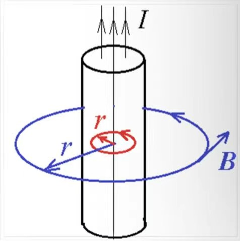

   * **导线内部（$r < R$）**：
     选半径为 $r$ 的圆形环路：
     $$ B \cdot 2\pi r = \mu_0 I_{in} = \mu_0 I \frac{\pi r^2}{\pi R^2} \quad \Rightarrow \quad B = \frac{\mu_0 I r}{2\pi R^2} $$
   * **导线外部（$r > R$）**：
     选半径为 $r$ 的圆形环路：
     $$ B \cdot 2\pi r = \mu_0 I \quad \Rightarrow \quad B = \frac{\mu_0 I}{2\pi r} $$

2. **无限长螺线管线圈产生的磁场**：  
   单位长度匝数为 $n$，通有电流 $I$。

   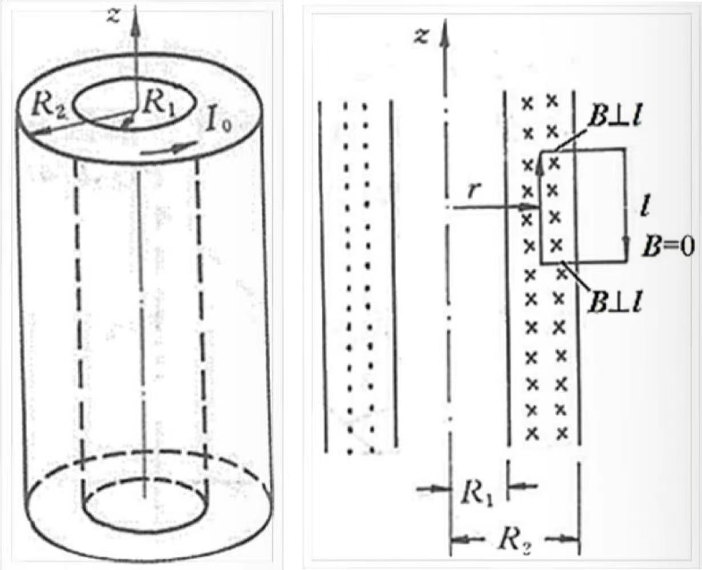

   * **管外磁场（$r > R$）**：
     通过对称性分析，管外磁场为 0，即 $B_{out} = 0$。
   * **管内磁场（$r < R$）**：
     利用矩形环路，其中一条边在管内，另一条在管外，长度为 $l$：
     $$ B_{in} \cdot l = \mu_0 N I = \mu_0 (n l) I \quad \Rightarrow \quad B_{in} = \mu_0 n I $$

3. **无限大载流平板产生的磁场**：  
   单位长度的表面电流密度为 $K$。
   选取对称的矩形环路跨越薄板，长度为 $l$：
   $$ B \cdot l + B \cdot l = \mu_0 K l \quad \Rightarrow \quad B = \frac{1}{2} \mu_0 K $$

---

#### 3.3 磁偶极子

小圆环电流可以看作是一个磁偶极子。

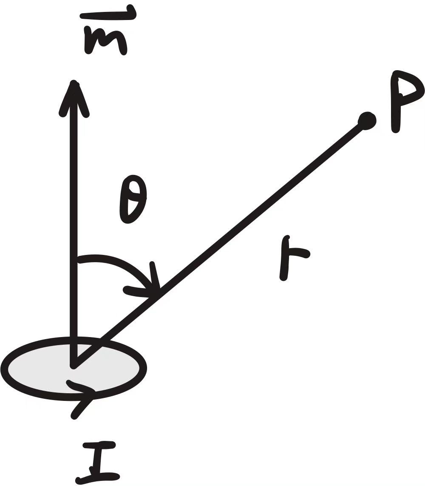

定义其磁偶极矩为：
$$ \vec{m} = I \vec{S} = I S \vec{n} $$
其中 $S$ 为圆环面积，$\vec{n}$ 的方向由环流方向按右手螺旋定则确定。

在远场区域（$r \gg R$），磁偶极子产生的磁感应强度为：
$$ \vec{B} = \frac{\mu_0 m}{4\pi r^3} (2\cos\theta \vec{e}_r + \sin\theta \vec{e}_\theta) $$

这与电偶极子在外场中的场分布规律完全一致。因此，天线理论中可以用这两种偶极子分别等效电和磁的辐射源。

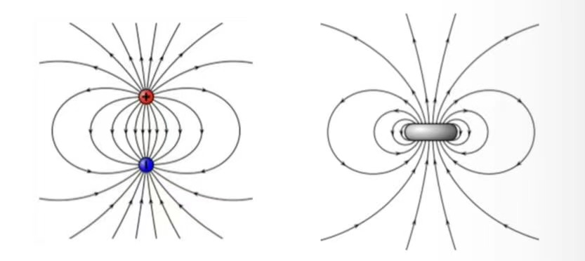

把磁偶极子置于均匀外磁场 $\vec{B}$ 中，它所受的合力为零，但会受到一个使其旋转的磁力矩作用，直到其磁偶极矩的方向与外磁场方向一致时为止。

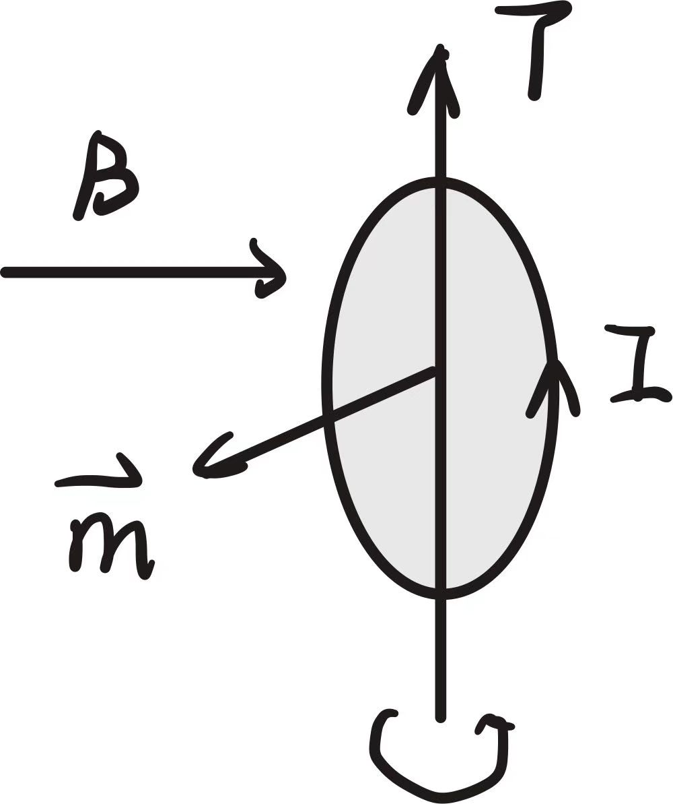

$$ \vec{T} = \vec{m} \times \vec{B} $$

> [!CAUTION]
> 实际上磁偶极子没有“偶”的现象存在，即没有磁单极子，因此磁单极子都用**电流环**来表示。

---

#### 3.4 磁介质的磁化与磁场强度 H 的定义

磁介质在外界磁场中会被磁化。介质内部的分子的电子轨道运动和自旋等效为无数的微小分子环流（磁偶极子 $\vec{m}$）。

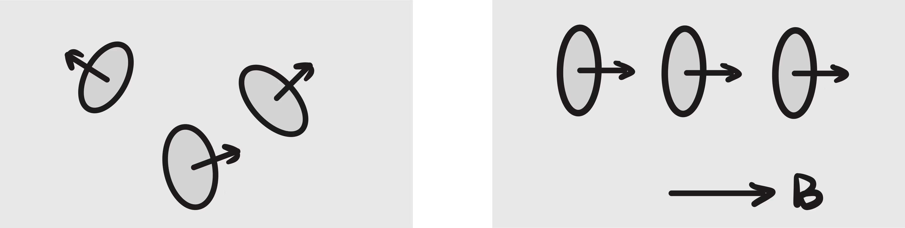

单位体积内磁偶极矩的矢量和定义为**磁化强度 $\vec{M}$**：
$$ \vec{M} = \lim_{\Delta V \to 0} \frac{\sum \vec{m}}{\Delta V} $$
$\vec{M}$ 的单位是 $\text{A/m}$。

在各向同性线性介质中，磁化强度与磁场强度成正比：
$$ \vec{M} = \chi_m \vec{H} $$
其中 $\chi_m$ 为介质的磁化率。

**等效磁化电流：**

介质的磁化效应可以用宏观的等效磁化电流来代替：
* 体磁化电流密度：
  $$ \vec{J}_m = \nabla \times \vec{M} $$
* 表面磁化电流密度：
  $$ \vec{J}_{ms} = \vec{M} \times \vec{n} $$

基于用磁化电流替代介质的方法，磁感应强度 $\vec{B}$ 的安培环路定理变为：
$$ \nabla \times \vec{B} = \mu_0 (\vec{J} + \vec{J}_m) = \mu_0 (\vec{J} + \nabla \times \vec{M}) $$
$$ \nabla \times \left( \frac{\vec{B}}{\mu_0} - \vec{M} \right) = \vec{J} $$

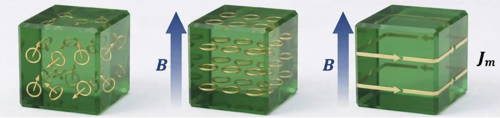

定义**磁场强度 $\vec{H}$** 为：
$$ \vec{H} = \frac{\vec{B}}{\mu_0} - \vec{M} $$
则磁场强度的安培环路定理化为：
$$ \nabla \times \vec{H} = \vec{J} \quad \Rightarrow \quad \oint_l \vec{H} \cdot d\vec{l} = I_{net} $$
其中 $I_{net}$ 仅为传导电流。

在各向同性线性磁介质中：
$$ \vec{B} = \mu_0 (\vec{H} + \vec{M}) = \mu_0 (1 + \chi_m) \vec{H} = \mu_0 \mu_r \vec{H} = \mu \vec{H} $$
其中 $\mu_r = 1 + \chi_m$ 为相对磁导率，$\mu = \mu_0 \mu_r$ 为介质磁导率（$\text{H/m}$）。

---

#### 3.5 基本方程与分界面条件

$$ \begin{cases} \nabla \times \vec{H} = \vec{J} \\ \nabla \cdot \vec{B} = 0 \\ \vec{B} = \mu \vec{H} \end{cases} $$

**分界面条件：**

* **法向分量条件**：
  由 $\nabla \cdot \vec{B} = 0$，穿过交界面的磁感应强度法向分量连续：
  $$ B_{1n} = B_{2n} \quad \Rightarrow \quad \mu_1 H_{1n} = \mu_2 H_{2n} $$

  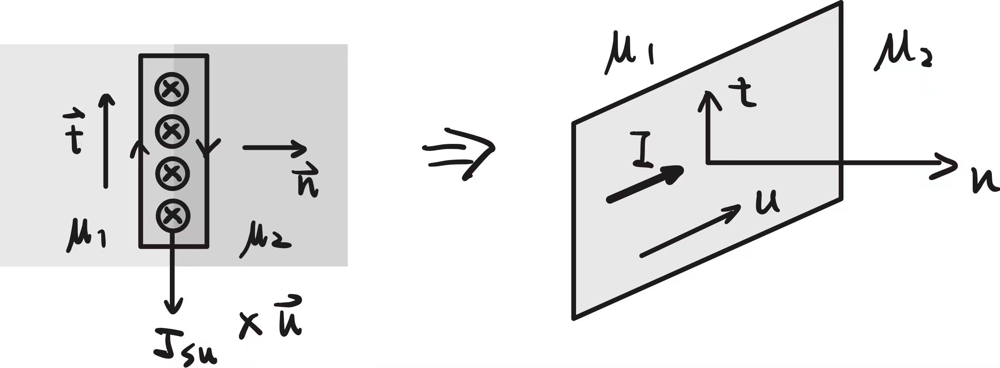

* **切向分量条件**：
  由 $\nabla \times \vec{H} = \vec{J}$，若界面上存在传导面电流密度 $\vec{J}_s$，则磁场强度切向分量突变：
  $$ \vec{n} \times (\vec{H}_1 - \vec{H}_2) = \vec{J}_s \quad \Rightarrow \quad H_{1t} - H_{2t} = J_{s} $$
  若界面无传导面电流，则切向分量连续：
  $$ H_{1t} = H_{2t} $$

**折射定律**：
在无面电流的界面上，由 $B_{1n} = B_{2n}$ 及 $H_{1t} = H_{2t}$，可得：
$$ \frac{\tan\theta_1}{\tan\theta_2} = \frac{H_{1t} / H_{1n}}{H_{2t} / H_{2n}} = \frac{\mu_1}{\mu_2} $$

对于铁磁材料（$\mu \to \infty$）与空气的交界面，若铁磁侧的磁感应强度不与界面平行，则在空气侧，磁感应线将几乎垂直于界面射出。

**磁场边值问题控制方程**：
$$ \begin{cases} \nabla \times \vec{H}_k = \vec{J}_k \\ \nabla \cdot \vec{B} = 0 \\ \vec{B}_k = \mu_k \vec{H}_k \end{cases} \quad \in V_k $$
在分界面上代入分界面条件。

---

#### 3.6 磁矢量位 A

由于 $\nabla \cdot \vec{B} = 0$，且梯度的旋度恒为零，我们可以将 $\vec{B}$ 表示为另一个矢量函数的旋度：
$$ \vec{B} = \nabla \times \vec{A} $$
其中 $\vec{A}$ 称为磁矢量位。

为了使 $\vec{A}$ 唯一确定，由亥姆霍兹定理，需指定其散度。我们采用库仑规范：
$$ \nabla \cdot \vec{A} = 0 $$

代入 $\nabla \times \vec{B} = \mu \vec{J}$ 中，有：
$$ \nabla \times (\nabla \times \vec{A}) = \nabla(\nabla \cdot \vec{A}) - \nabla^2 \vec{A} = \mu \vec{J} $$
由于 $\nabla \cdot \vec{A} = 0$，所以磁矢量位满足的控制方程为：
$$ \nabla^2 \vec{A} = -\mu \vec{J} $$
此为矢量泊松方程。在直角坐标系下可展开为三个标量泊松方程：
$$ \nabla^2 A_x = -\mu J_x, \quad \nabla^2 A_y = -\mu J_y, \quad \nabla^2 A_z = -\mu J_z $$

在自由空间中，矢量泊松方程的积分解为：
$$ \vec{A}(\vec{r}) = \frac{\mu}{4\pi} \iiint_V \frac{\vec{J}(\vec{r}')}{R} dV' $$
对于线电流回路，有：
$$ \vec{A}(\vec{r}) = \frac{\mu I}{4\pi} \oint_l \frac{d\vec{l}'}{R} $$
磁矢量位 $\vec{A}$ 的方向与产生它的源电流 $\vec{J}$ 同向。

**直观物理图景**：  

可以把电流 $\vec{J}$ 比作水泵，$\vec{A}$ 是水泵排出的水流方向，而 $\vec{B} = \nabla \times \vec{A}$ 是水流剪切运动所引发的局部旋涡。

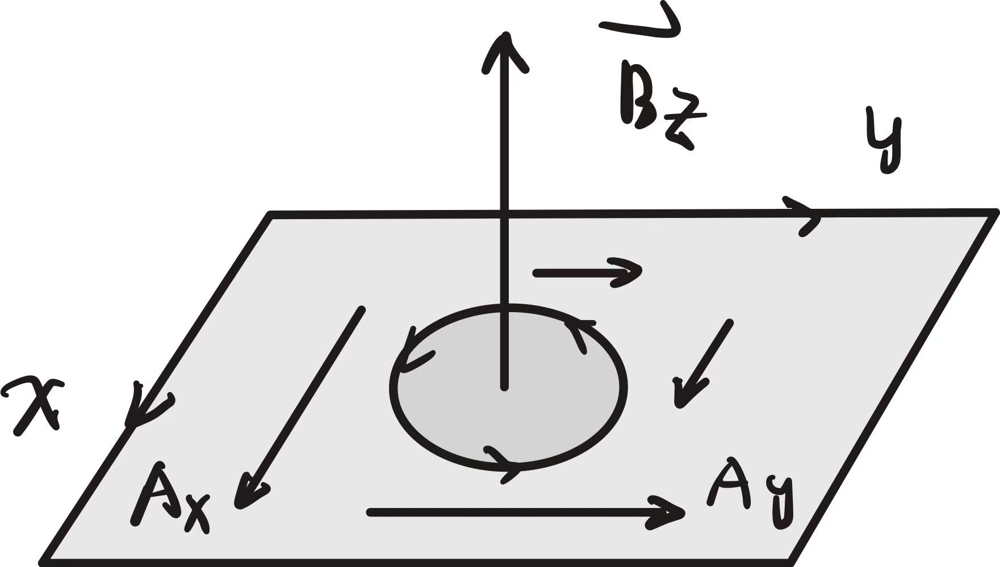

**利用 $\vec{A}$ 求磁通量**：
$$ \Phi = \iint_S \vec{B} \cdot d\vec{S} = \iint_S (\nabla \times \vec{A}) \cdot d\vec{S} = \oint_l \vec{A} \cdot d\vec{l} $$
即沿回路边界的磁矢量位线积分等于通过该回路所围面积的磁通量。

**例题**：求长为 $L$ 的长直载流导线在线圈中心平面上产生的磁矢量位 $\vec{A}$。

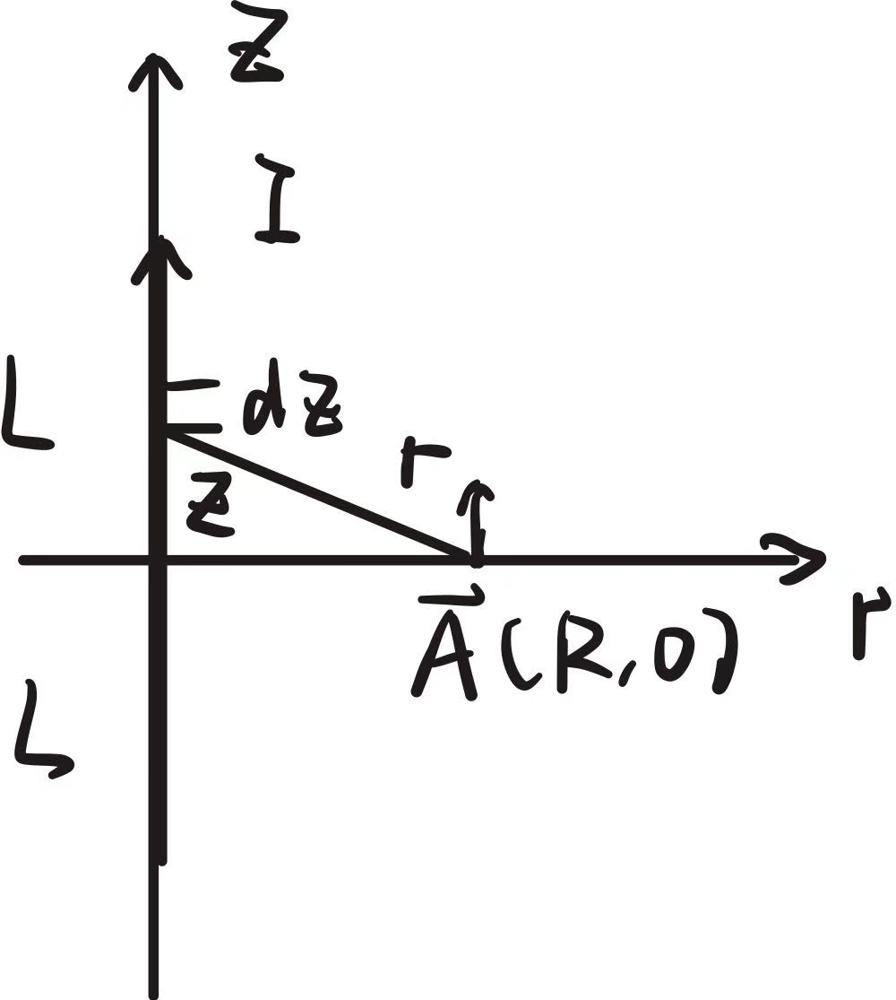

**解**：
设电流沿 $z$ 轴正方向，大小为 $I$. 由对称性，磁矢量位只有 $z$ 分量：
$$ A_z = \frac{\mu_0 I}{4\pi} \int_{-L/2}^{L/2} \frac{dz'}{\sqrt{r^2 + z'^2}} = \frac{\mu_0 I}{4\pi} \ln \left[ \frac{\sqrt{r^2 + L^2/4} + L/2}{\sqrt{r^2 + L^2/4} - L/2} \right] $$
当 $L \gg r$ 时，如果将导线视为无限长：  

在无限长直导线情况下，不能将无限远处取为电位或矢量位参考点，否则积分会发散。我们需要选取距导线距离为 $r_0$ 的位置作为参考点（其上 $A_z = 0$）：
$$ A_z(r) = \frac{\mu_0 I}{2\pi} \ln\frac{r_0}{r} $$

##### 磁矢量位 A 的边值问题分界面条件
由于 $\vec{B}$ 在界面法向连续（$B_{1n} = B_{2n}$），且库仑规范下 $\vec{A}$ 的法向和切向分量均连续：
$$ \vec{A}_1 = \vec{A}_2 $$
由于一阶导数在界面上有突变，根据磁场强度切向条件 $\vec{n} \times (\vec{H}_1 - \vec{H}_2) = \vec{J}_s$：
$$ \frac{1}{\mu_1} (\nabla \times \vec{A}_1) \times \vec{n} - \frac{1}{\mu_2} (\nabla \times \vec{A}_2) \times \vec{n} = \vec{J}_s $$

在二维平行平面场中，设电流只有 $z$ 向分量 $\vec{J} = J_z(x,y)\vec{e}_z$，则磁矢量位也只有 $z$ 向分量：
$$ \vec{A} = A_z(x,y) \vec{e}_z $$
此时：
$$ \vec{B} = \nabla \times (A_z \vec{e}_z) = \frac{\partial A_z}{\partial y} \vec{e}_x - \frac{\partial A_z}{\partial x} \vec{e}_y $$
在无传导面电流的交界面上，边界条件简化为：
$$ A_{z1} = A_{z2} $$
$$ \frac{1}{\mu_1} \frac{\partial A_{z1}}{\partial n} = \frac{1}{\mu_2} \frac{\partial A_{z2}}{\partial n} $$

---

#### 3.7 磁场镜像法

磁场镜像法与静电场和电流场存在相似的对偶关系：

在求区域 1 的磁场时，引入位于区域 2 的镜像电流：
$$ I' = \frac{\mu_1 - \mu_2}{\mu_1 + \mu_2} I $$
在求区域 2 的磁场时，引入位于区域 1 的透射等效电流：
$$ I'' = \frac{2\mu_2}{\mu_1 + \mu_2} I $$

**对比关系**：
* 静电场：$q' = \frac{\varepsilon_1 - \varepsilon_2}{\varepsilon_1 + \varepsilon_2} q$
* 电流场：$I' = \frac{\sigma_1 - \sigma_2}{\sigma_1 + \sigma_2} I$
* 磁场：$I' = \frac{\mu_1 - \mu_2}{\mu_1 + \mu_2} I$ （注意，当 $\mu_2 > \mu_1$ 时，镜像电流与原电流方向相反）。

##### 理想铁磁材料界面情况分析
设区域 1 为空气（$\mu_1 = \mu_0$），区域 2 为高导磁铁磁材料（$\mu_2 \to \infty$）。
* 镜像电流为：
  $$ I' = \lim_{\mu_2 \to \infty} \frac{\mu_0 - \mu_2}{\mu_0 + \mu_2} I = -I $$
  即镜像电流与原电流大小相等，方向相反。

* 此时在空气侧（区域 1），交界面相当于一个磁力线切向连续（即磁场线垂直射入铁磁面）的等效面。
* 在铁磁物质内部（区域 2），磁场强度 $H_{in} \to 0$，但磁感应强度 $\vec{B}$ 并不为零。由于铁磁材料磁导率无限大，磁通在铁磁介质中被放大为原来的两倍并沿着材料内部流动。
* 若长直电流 $I$ 位于铁磁材料内部，对空气侧产生的增强系数为 2。

---

#### 3.8 电感

##### 自感的定义
线圈的自感 $L$ 定义为线圈自身的磁链 $\Psi$ 与线圈中流过的电流 $I$ 的比值：
$$ L = \frac{\Psi}{I} $$
其单位是亨利 ($\text{H}$)。自感值总是为正。

**磁链的定义**：
通过某截面的磁通量为 $\Phi = \iint \vec{B} \cdot d\vec{S}$。若该磁通量与 $N$ 匝线圈交链，则总磁链为：
$$ \Psi = N \Phi = \sum_{i=1}^N \Phi_i $$
对于分布电流，磁链为：
$$ \Psi = \iiint_V \vec{A} \cdot \vec{J} dV $$

##### 自感可分为内自感和外自感
$$ L = L_i + L_o $$
* **内自感 $L_i$**：由穿过导体内部的磁通与部分电流交链所产生的自感。
* **外自感 $L_o$**：由导体外部的磁通与全部电流交链所产生的自感。
> [!NOTE]
> 由于高频下存在趋肤效应，导体内部磁场会减小，因此交流下的内自感会比直流自感略小。

##### 自感的计算方法
1. **加电流求磁链法**：设电流 $I$ $\to$ 由安培环路定理求 $\vec{B}$ $\to$ 积分求总磁链 $\Psi$ $\to$ 计算 $L = \frac{\Psi}{I}$。
2. **加电流求磁能法**：设电流 $I$ $\to$ 计算磁场总能量 $W_m = \iiint_V \frac{1}{2} \vec{B} \cdot \vec{H} dV$ $\to$ 由 $W_m = \frac{1}{2} L I^2$ 解出 $L$。

**例题**：计算同轴电缆单位长度的自感。内外导体半径分别为芯线半径 $R_1$，外壳内径 $R_2$ 和外径 $R_3$。

**解**：
设电缆通有电流 $I$。
1. **芯线内部的自感（内自感 $L_i$）**：
   在 $0 < r < R_1$ 区域，由安培环路定理：
   $$ H = \frac{I r}{2\pi R_1^2} \quad \Rightarrow \quad B = \frac{\mu I r}{2\pi R_1^2} $$
   对于半径为 $r$ 处的薄层 $dr$，其交链的电流比例为 $\left(\frac{r}{R_1}\right)^2$（因为电流在横截面均匀分布），对应的单位长度磁链微元为：
   $$ d\Psi_i = B dr \cdot \left(\frac{r}{R_1}\right)^2 = \frac{\mu I r^3}{2\pi R_1^4} dr $$
   积分求得单位长度内自感对应的磁链：
   $$ \Psi_i = \int_0^{R_1} \frac{\mu I r^3}{2\pi R_1^4} dr = \frac{\mu I}{8\pi} $$
   故芯线的单位长度内自感为：
   $$ L_i = \frac{\Psi_i}{I} = \frac{\mu}{8\pi} $$

   > [!TIP]
   > 导体圆柱芯线的内自感与芯线半径 $R_1$ 无关！

3. **内外导体之间区域（外自感 $L_o$）**：
   在 $R_1 < r < R_2$ 区域，磁场全部与总电流 $I$ 交链：
   $$ H = \frac{I}{2\pi r} \quad \Rightarrow \quad B = \frac{\mu_0 I}{2\pi r} $$
   单位长度的外磁链为：
   $$ \Psi_o = \int_{R_1}^{R_2} B dr = \frac{\mu_0 I}{2\pi} \ln\frac{R_2}{R_1} $$
   对应的外自感为：
   $$ L_o = \frac{\mu_0}{2\pi} \ln\frac{R_2}{R_1} $$

4. **外导体壳内部的自感**：
   在 $R_2 < r < R_3$ 区域，外导体内电流反向流动，其自感计算类似。忽略外壳厚度（$R_3 \approx R_2$）时，该部分能量极小可忽略。
   总自感单位长度值为：
   $$ L_0 = L_i + L_o = \frac{\mu}{8\pi} + \frac{\mu_0}{2\pi} \ln\frac{R_2}{R_1} $$

##### 平行长直双线单位长自感的近似计算
两平行导线半径为 $R$，轴心距为 $D$，通有等量异号电流 $pm I$。

单位长度的外自感 $L_o$：
* **方法一：设电流求磁通法**
  在两导线之间（距一根导线中心为 $x$ 处），两电流在该点产生的磁场同向叠加：
  $$ H = \frac{I}{2\pi x} + \frac{I}{2\pi(D-x)} \quad \Rightarrow \quad B = \frac{\mu_0 I}{2\pi} \left[ \frac{1}{x} + \frac{1}{D-x} \right] $$
  穿过两导线间的总磁通量（积分范围从 $R$ 到 $D-R$）：
  $$ \Phi_o = \int_R^{D-R} B dx = \frac{\mu_0 I}{\pi} \ln\frac{D-R}{R} $$
  外自感为：
  $$ L_o = \frac{\mu_0}{\pi} \ln\frac{D-R}{R} \approx \frac{\mu_0}{\pi} \ln\frac{D}{R} \quad (D \gg R) $$
  加上两导线的内自感：
  $$ L = L_o + 2 L_i = \frac{\mu_0}{\pi} \ln\frac{D}{R} + \frac{\mu}{4\pi} $$

**互感的定义**：
线圈 1 对线圈 2 的互感定义为，线圈 1 通入电流 $I_1$ 时，在线圈 2 中所产生的互感磁链 $\Psi_{21}$ 与 $I_1$ 的比值：
$$ M_{21} = \frac{\Psi_{21}}{I_1} $$
若不考虑磁饱和（线性介质），有互易性定理：
$$ M_{12} = M_{21} = M $$

##### 互感的计算通式（纽曼公式）
$$ M = \frac{\mu}{4\pi} \oint_{l_1} \oint_{l_2} \frac{d\vec{l}_1 \cdot d\vec{l}_2}{R} $$

**例题**：交流电流互感器。设一次导线中通有高频交变电流 $I$，计算二次线圈中的互感磁链。

在一次侧偏心时，对总互感影响并不大。

---

#### 3.9 磁场的能量

1. **单个线圈**：
   $$ W_m = \frac{1}{2} L I^2 = \frac{1}{2} \Psi I $$
2. **两个线圈**：
   $$ W_m = \frac{1}{2} L_1 I_1^2 + \frac{1}{2} L_2 I_2^2 \pm M I_1 I_2 $$
3. **$N$ 个线圈系统**：
   $$ W_m = \frac{1}{2} \sum_{i=1}^N \sum_{j=1}^N M_{ij} I_i I_j $$
   其中当 $i=j$ 时，$M_{ii} = L_i$。
4. **用磁场量表示的能量体密度**：
   $$ W_m = \iiint_V w_m dV $$
   $$ w_m = \frac{1}{2} \vec{B} \cdot \vec{H} = \frac{1}{2} \mu H^2 = \frac{B^2}{2\mu} $$
   该公式同样适用于非均匀各向同性介质。
5. **用磁矢量位表示的能量**：
   $$ W_m = \frac{1}{2} \iiint_V \vec{A} \cdot \vec{J} dV $$
   因为电流只在导体中流动，此积分只需在载流导体体积内进行。

---

#### 3.10 磁场力

1. **安培力法**：
   $$ \vec{F} = \oint_l I d\vec{l} \times \vec{B}_{bg} $$
   其中 $\vec{B}_{bg}$ 是排除自身电流贡献后的背景磁感应强度。

**例题**：求输电平行板之间单位面积受到的电磁力。

两极板间磁场为 $H = \frac{I}{b}$，磁场大小向外发散。
另一极板受到的电磁力大小为：
$$ F = \frac{1}{2} \mu_0 K^2 S = \frac{\mu_0 I^2 S}{2 b^2} $$
方向为相互排斥，使得回路面积扩大，从而增大系统自感。

2. **虚位移法计算磁场力**：

* **电流恒定系统（外接恒流源，即 $I = \text{const}$）**：  
  在虚位移 $d\vec{g}$ 过程中，电源输入电能：
  $$ dW_{source} = \sum e_k I_k dt = \sum I_k d\Psi_k $$
  由于 $W_m = \frac{1}{2} \sum I_k \Psi_k$ 且电流恒定：
  $$ dW_{source} = 2 dW_m $$
  由能量守恒，电源输入的能量等于磁场能的增加量与机械功之和：
  $$ dW_{source} = dW_m + \vec{F} \cdot d\vec{g} \quad \Rightarrow \quad \vec{F} \cdot d\vec{g} = dW_m $$
  所以：
  $$ \vec{F} = \nabla W_m \big|_{I = \text{const}} $$

* **磁通量恒定系统（孤立无源系统，即 $\Psi = \text{const}$）**：  
  由能量守恒：
  $$ -dW_m = \vec{F} \cdot d\vec{g} $$
  所以：
  $$ \vec{F} = -\nabla W_m \big|_{\Psi = \text{const}} $$

无论是恒流还是恒磁通系统，受力方向总是倾向于使自感 $L$ 增大。两回路的相互作用力为：
$$ \vec{F} = I_1 I_2 \nabla M $$
同名端流入的两个电流，相互作用力使其互感 $M$ 增大（相互吸引）。

**例题**：求电磁铁对衔铁的吸引力。铁芯截面积为 $S$，线圈匝数为 $N$，通有电流 $I$，空气隙宽度为 $l$。

**解**：
机械加工近似认为铁磁材料磁导率无限大（其内 $H_{Fe} \approx 0$）。

由安培环路定理，磁场主要分布在两个空气隙中：
$$ H_0 \cdot 2l = N I \quad \Rightarrow \quad H_0 = \frac{N I}{2l} $$
磁感应强度为 $B = \mu_0 H_0 = \frac{\mu_0 N I}{2l}$。
磁场总能量（仅计空气隙中的能量）：
$$ W_m = 2 \cdot \left( \frac{1}{2} \mu_0 H_0^2 \cdot S l \right) = \frac{\mu_0 N^2 I^2 S}{4l} $$
利用虚位移法，在电流 $I$ 恒定的情况下，衔铁受到的电磁力为：
$$ F = \frac{\partial W_m}{\partial l} \Big|_{I = \text{const}} = -\frac{\mu_0 N^2 I^2 S}{4 l^2} = -\frac{B^2 S}{2\mu_0} $$
负号表示受力方向为使气隙 $l$ 减小的方向（即吸引力）。

对于界面上只有垂直或切向磁场的情形，单位面积的电磁吸引力大小等于磁能体密度：
$$ f_s = w_m = \frac{B^2}{2\mu_0} $$

---

### Chapter 4 时变电磁场与准静态场

#### 4.1 电磁感应定律

麦克斯韦方程组中法拉第电磁感应定律的微分形式为：
$$ \nabla \times \vec{E} = -\frac{\partial \vec{B}}{\partial t} $$
对应的积分形式为：
$$ \oint_l \vec{E} \cdot d\vec{l} = -\iint_S \frac{\partial \vec{B}}{\partial t} \cdot d\vec{S} = -\frac{d\Phi}{dt} $$

时变磁场产生的感应电场（涡旋电场）$\vec{E}_i$ 是无散的：
$$ \nabla \cdot \vec{E}_i = 0 $$
它没有起点和终点，电力线呈闭合状。

---

#### 4.2 全电流定律

变化的电场会产生磁场。为了使安培环路定理在时变条件下依然满足电荷守恒，麦克斯韦引入了位移电流的概念。

电荷守恒定律的微分形式为：
$$ \nabla \cdot \vec{J} = -\frac{\partial \rho}{\partial t} $$
由于 $\nabla \cdot \vec{D} = \rho$，所以有：
$$ \nabla \cdot \vec{J} + \frac{\partial}{\partial t} (\nabla \cdot \vec{D}) = \nabla \cdot \left( \vec{J} + \frac{\partial \vec{D}}{\partial t} \right) = 0 $$
令 $\vec{J}_d = \frac{\partial \vec{D}}{\partial t}$ 为**位移电流密度**。
全电流密度 $\vec{J} + \vec{J}_d$ 是无散的。全电流定律的微分形式为：
$$ \nabla \times \vec{H} = \vec{J} + \frac{\partial \vec{D}}{\partial t} $$
积分形式为：
$$ \oint_l \vec{H} \cdot d\vec{l} = \iint_S \left( \vec{J} + \frac{\partial \vec{D}}{\partial t} \right) \cdot d\vec{S} = I + I_d $$

**例题**：证明电容器充放电时，极板间的位移电流等于导线中的传导电流。

**证明**：
围绕极板做一闭合面包络极板：
由电荷守恒，流入闭合面的传导电流等于极板电荷增加率：
$$ I = -\oint_S \vec{J} \cdot d\vec{S} = \frac{dq}{dt} $$
极板间的位移电流为：
$$ I_d = \iint_S \vec{J}_d \cdot d\vec{S} = \iint_S \frac{\partial \vec{D}}{\partial t} \cdot d\vec{S} $$
由于面电极表面 $D_n = \rho_s = \frac{q}{S}$，所以有：
$$ I_d = \frac{d}{dt} \iint_S D_n dS = \frac{d}{dt} (D_n S) = \frac{dq}{dt} = I $$
即位移电流等于传导电流。

---

#### 4.3 时变电磁场的基本方程和边值问题

**麦克斯韦方程组（Maxwell's Equations）**：

$$ \begin{array}{c|c|c}
\text{微分形式} & \text{积分形式} & \text{物理定律说明} \\
\hline
\nabla \times \vec{H} = \vec{J} + \frac{\partial \vec{D}}{\partial t} & \oint_l \vec{H} \cdot d\vec{l} = \iint_S \left( \vec{J} + \frac{\partial \vec{D}}{\partial t} \right) \cdot d\vec{S} & \text{安培-麦克斯韦定律} \\
\nabla \times \vec{E} = -\frac{\partial \vec{B}}{\partial t} & \oint_l \vec{E} \cdot d\vec{l} = -\iint_S \frac{\partial \vec{B}}{\partial t} \cdot d\vec{S} & \text{法拉第电磁感应定律} \\
\nabla \cdot \vec{B} = 0 & \oint_S \vec{B} \cdot d\vec{S} = 0 & \text{磁通连续性原理} \\
\nabla \cdot \vec{D} = \rho & \oint_S \vec{D} \cdot d\vec{S} = q & \text{高斯定律}
\end{array} $$

联系方程：
$$ \vec{D} = \varepsilon \vec{E}, \quad \vec{B} = \mu \vec{H}, \quad \vec{J} = \sigma \vec{E} $$
电荷守恒方程：
$$ \nabla \cdot \vec{J} = -\frac{\partial \rho}{\partial t} $$

**理想导体（$\sigma \to \infty$）在时变场下的性质**：
* 内部电场必为零（$\vec{E} = 0$）。
* 由电荷守恒，内部无电荷分布（$\rho = 0$），电荷只能分布在导体表面。
* 磁感应强度随时间的变化率为零（$\frac{\partial \vec{B}}{\partial t} = 0$）。若初始磁场为零，则内部磁场始终为零（$\vec{B} = 0$）。
* 时变场在理想导体表面的边界条件为：
  $$ \begin{cases} B_{n} = 0 \\ E_{t} = 0 \\ H_{t1} - H_{t2} = K \quad \Rightarrow \quad H_t = K \\ D_{n} = \rho_s \end{cases} $$
  理想导体表面会产生感应面电流 $\vec{K}$ 和面电荷 $\rho_s$，使得内部电磁场为零，外部磁场在切向被强化。

---

#### 4.4 应用电磁感应定律的计算问题

1. **已知磁场计算感应电场**：
   时变磁场产生的感应电场 $\vec{E}_i$ 满足：
   $$ \nabla \times \vec{E}_i = -\frac{\partial \vec{B}}{\partial t}, \quad \nabla \cdot \vec{E}_i = 0 $$
   计算类似于通过电流密度求磁场的过程。

**例题**：一无限长直空心密绕螺线管线圈，半径为 $R$，通有交变电流 $i(t) = I_m \sin\omega t$。求管内和管外的感应电场。

**解**：
管内磁场均匀，为 $B(t) = \mu_0 n i(t) = \mu_0 n I_m \sin\omega t$。管外磁场为 0。
* **管内（$r < R$）**：
  选取半径为 $r$ 的圆形回路：
  $$ E_i \cdot 2\pi r = -\frac{d}{dt} (B \cdot \pi r^2) = -\mu_0 n I_m \omega \cos\omega t \cdot \pi r^2 $$
  $$ \vec{E}_i = -\frac{1}{2} \mu_0 n I_m \omega r \cos\omega t \vec{e}_\theta $$
* **管外（$r > R$）**：
  选取半径为 $r$ 的圆形回路，其内包围的总磁通为整个管截面：
  $$ E_i \cdot 2\pi r = -\frac{d}{dt} (B \cdot \pi R^2) = -\mu_0 n I_m \omega \cos\omega t \cdot \pi R^2 $$
  $$ \vec{E}_i = -\frac{\mu_0 n I_m \omega R^2}{2r} \cos\omega t \vec{e}_\theta $$

2. **已知磁场计算回路的感应电动势**：
  当回路面积和磁场同时发生变化时，总电动势为：
  $$ e = -\frac{d\Phi}{dt} = -\frac{d}{dt} \iint_S \vec{B} \cdot d\vec{S} $$
  根据微积分求导法则，该式可以分解为：
  $$ e = -\iint_S \frac{\partial \vec{B}}{\partial t} \cdot d\vec{S} + \oint_l (\vec{v} \times \vec{B}) \cdot d\vec{l} = e_{transformer} + e_{motional} $$
  电动势由**感生电动势**和**动生电动势**两部分叠加而成。

---

#### 4.5 时变电场中的电压特性和计算

在时变电磁场中，合成电场为静态电场与感应电场之和：
$$ \vec{E} = \vec{E}_c + \vec{E}_i $$
由于感应电场具有旋度（$\nabla \times \vec{E}_i \ne 0$），电场沿路径的线积分不再与路径无关：
$$ U_{ab} = \int_a^b \vec{E} \cdot d\vec{l} $$
此时电压的大小依赖于积分路径。因此，在时变场中定义电压时，必须指定积分路径。

**电压表的测量原理：**

在时变场中，电压表的读数由电压表回路中的总电动势决定：
$$ U_{read} = \int_c^d \vec{E}_{c} \cdot d\vec{l} + e_{ind} $$
其中 $e_{ind} = -\frac{d\Phi}{dt}$ 是电压表引线与被测对象围成的闭合回路中的感应电动势。即使测量相同的两点 $c$ 和 $d$，如果引线摆放的位置不同，所围面积不同，电压表的读数也会不同。

---

#### 4.6 非理想介质与导体中的弛豫与积累过程

**1. 弛豫过程（Relaxation Process）**：

电准静态场下，忽略感应电场（$\vec{E} \approx \vec{E}_c$）。
设在一均匀非理想介质（$\sigma, \varepsilon$）中某区域注入了初始体电荷密度 $\rho_0$，求电荷随时间的衰减过程。
由电荷守恒方程和高斯定理：
$$ \nabla \cdot \vec{J} = -\frac{\partial \rho}{\partial t} \quad \Rightarrow \quad \nabla \cdot (\sigma \vec{E}) = -\frac{\partial \rho}{\partial t} $$
由于 $\nabla \cdot \vec{E} = \frac{\rho}{\varepsilon}$，所以：
$$ \frac{\sigma}{\varepsilon} \rho = -\frac{\partial \rho}{\partial t} $$
解此微分方程得：
$$ \rho(t) = \rho_0 e^{-t/\tau} $$
其中时间常数 $\tau = \frac{\varepsilon}{\sigma}$ 称为**介质的电弛豫时间**。

**2. 积累过程**：

双层非理想介质平行板电容器接电压 $U$，分析交界面上的自由电荷积累过程。

利用全电流连续性方程，有：
$$ d_1 E_1 + d_2 E_2 = U $$
$$ \sigma_1 E_1 + \varepsilon_1 \frac{\partial E_1}{\partial t} = \sigma_2 E_2 + \varepsilon_2 \frac{\partial E_2}{\partial t} $$
这可以整理为一个一阶常微分方程，其响应时间常数为：
$$ \tau = \frac{\varepsilon_1 d_2 + \varepsilon_2 d_1}{\sigma_1 d_2 + \sigma_2 d_1} $$
交界面上面电荷密度的积累过程为：
$$ \rho_s(t) = \rho_{s0} e^{-t/\tau} + \rho_{s\infty} (1 - e^{-t/\tau}) $$

* **初始瞬态（$t = 0^+$）**：
  电荷来不及积累，交界面电荷为 0。电场分布完全由介电常数决定：
  $$ \varepsilon_1 E_1(0^+) = \varepsilon_2 E_2(0^+) $$
* **稳态（$t \to \infty$）**：
  位移电流消失，只有传导电流。电场分布完全由电导率决定：
  $$ \sigma_1 E_1(\infty) = \sigma_2 E_2(\infty) $$

---

#### 4.7 时变电磁场中的涡流问题

当大块金属导体处于时变磁场中时，由于电磁感应，在导体内会产生闭合的感应电流，这种电流称为**涡流（Eddy Current）**。
涡流问题一般作为磁准静态场处理，其对应的物理过程是磁场在导体内部的**磁扩散过程**。

**例题**：一半径为 $a$、厚度为 $d$ 的薄壁导电圆筒，电导率为 $\sigma$。在 $t=0$ 时，外部磁场从 0 跳变到 $H_0$（沿轴向）。求 $t>0$ 时圆筒内的磁场 $H_{in}(t)$ 以及涡流的变化过程。

**解**：
设筒内磁场为 $H_{in}(t)$。
围绕圆筒截面应用安培环路定理：
$$ (H_{in} - H_0) l = J_s \cdot l \cdot d \quad \Rightarrow \quad H_{in} - H_0 = J_s d $$
由法拉第电磁感应定律，在圆筒回路内：
$$ E \cdot 2\pi a = -\mu_0 \frac{dH_{in}}{dt} \pi a^2 \quad \Rightarrow \quad E = -\frac{1}{2} \mu_0 a \frac{dH_{in}}{dt} $$
由欧姆定律 $J = \sigma E$，所以 $J_s = \sigma E$。
代入上述方程，得：
$$ H_{in} - H_0 = -\frac{1}{2} \mu_0 \sigma a d \frac{dH_{in}}{dt} $$
整理得微分方程：
$$ \tau_m \frac{dH_{in}}{dt} + H_{in} = H_0 $$
其中磁扩散时间常数 $\tau_m = \frac{1}{2} \mu_0 \sigma a d$。

解方程得筒内磁场响应为：
$$ H_{in}(t) = H_0 (1 - e^{-t/\tau_m}) $$
涡流密度变化过程：
$$ J_s(t) = \frac{H_{in}(t) - H_0}{d} = -\frac{H_0}{d} e^{-t/\tau_m} $$

---

#### 4.8 涡流分布计算

在磁准静态场中，控制方程为：
$$ \begin{cases} \nabla \times \vec{H} = \vec{J} \\ \nabla \times \vec{E} = -\frac{\partial \vec{B}}{\partial t} \\ \vec{B} = \mu \vec{H} \\ \vec{J} = \sigma \vec{E} \end{cases} $$
对第一个方程求旋度并化简，可得导体中磁场满足的**扩散方程**：
$$ \nabla^2 \vec{H} = \mu \sigma \frac{\partial \vec{H}}{\partial t} $$
同理，电场 $\vec{E}$ 和电流密度 $\vec{J}$ 也满足相同的扩散方程。

在正弦稳态下，时间偏导 $\frac{\partial}{\partial t} \to j\omega$：
$$ \nabla^2 \vec{H} = j\omega \mu \sigma \vec{H} $$

**一维半无界模型中的趋肤效应（Skin Effect）**：

设导体填充在 $x > 0$ 的半空间，外部（$x=0$ 处）磁场为 $H_0 \cos\omega t \vec{e}_z$。

一维稳态扩散方程为：
$$ \frac{d^2 H_z}{dx^2} - j\omega\mu\sigma H_z = 0 $$
其特征根为 $\lambda = \pm (1+j) \sqrt{\frac{\omega\mu\sigma}{2}}$。
由于当 $x \to \infty$ 时，磁场趋于 0，保留衰减项：
$$ H_z(x) = H_0 e^{-(1+j)x/\delta} = H_0 e^{-x/\delta} e^{-j x/\delta} $$
定义**趋肤深度（透入深度）$\delta$** 为：
$$ \delta = \sqrt{\frac{2}{\omega\mu\sigma}} $$
* 当深度 $x = \delta$ 时，电磁场振幅衰减为表面值的 $1/e$（约 $36.8\%$）。
* 电导率 $\sigma$ 和磁导率 $\mu$ 越大的材料，其趋肤深度 $\delta$ 越小（例如铁的趋肤深度远小于铜）。

**例题**：一厚度为 $a$ 的无限大金属平板，两侧磁场为 $H_0 \vec{e}_z$。求平板内的涡流分布。

**解**：
设平板中心线为 $x=0$，平板边界为 $x = \pm a/2$。
一维扩散方程：
$$ \frac{d^2 H_z}{dx^2} - k^2 H_z = 0 \quad (k = \frac{1+j}{\delta}) $$
通解为：
$$ H_z(x) = C_1 \cosh kx + C_2 \sinh kx $$
边界条件为 $H_z(\pm a/2) = H_0$。由对称性，$C_2 = 0$：
$$ H_z(x) = H_0 \frac{\cosh kx}{\cosh(ka/2)} $$
对应的涡流密度为：
$$ J_y(x) = -\frac{\partial H_z}{\partial x} = -k H_0 \frac{\sinh kx}{\cosh(ka/2)} $$
频率越高，去磁作用越强，电流越集中在表面。

**导线集肤效应对交流电阻的影响**：  
当导线通有高频交流电时，内部会感应出涡流，使电流向导线表面集中。

* 高频交流下，导线的有效导电面积减小为表面的一薄层：
  $$ S_{eff} \approx 2\pi a \delta $$
  单位长度交流电阻为：
  $$ R_{ac} = \frac{1}{2\pi a \delta \sigma} $$
* 单位长度直流电阻为：
  $$ R_{dc} = \frac{1}{\pi a^2 \sigma} $$
* 交流电阻与直流电阻之比为：
  $$ \frac{R_{ac}}{R_{dc}} \approx \frac{a}{2\delta} $$

##### 邻近效应（Proximity Effect）

当相邻两个平行导体中通有高频电流时，除了自身的集肤效应外，它们彼此产生的磁场也会在对方内部感应出涡流，使导线截面上的电流分布进一步发生畸变，这种现象称为**邻近效应**。

* **两导线通以反向电流**：电流在导线内侧表面集中，导致内侧阻抗增加。
* **两导线通以同向电流**：电流在导线外侧表面集中。
邻近效应同样会使导线的交流电阻显著增大。

---

#### 4.9 传导电磁干扰的耦合方式与抑制

**电磁干扰（EMI）的耦合方式**：
1. **低频情况**：主要以**传导耦合**为主（通过导线、公共阻抗进行传导）。
2. **高频情况**：主要以**辐射耦合**为主（通过电磁波在空间传播）。

##### 传导耦合的途径与抑制

1. **容性耦合（电场耦合）**：
   通过设备或导线之间的电容效应实现的干扰耦合。

   

   * **特点**：属于电压型耦合，干扰电压通常较高，但电流不一定大。
   * **抑制方法**：使用**静电屏蔽**。在干扰源和被干扰物之间放置接地的导体。

2. **感性耦合（磁场耦合）**：
   通过互感在回路之间建立的干扰耦合。

   

   * **抑制方法**：
     * **电（流）屏蔽**：放置高电导率金属板。时变干扰磁场在其中产生强大的涡流，涡流产生的磁场与干扰磁场方向相反（去磁作用），从而实现屏蔽。
     * **磁屏蔽**：使用高磁导率材料包裹，将干扰磁力线限制在屏蔽体内部。
     * **双绞线**：

       

       将被干扰的一对线进行换位绞合，使各绞合环路中产生的感应磁场或感应电压相互抵消。
     * **同轴电缆**：

       

       同轴电缆对外不会产生骚扰场，同样几乎不会受外部磁场的影响。由互易性 $M_{12} = M_{21}$，既然对外不产生磁场（即 $M_{12} = 0$），则外部对其也没有感应影响。
